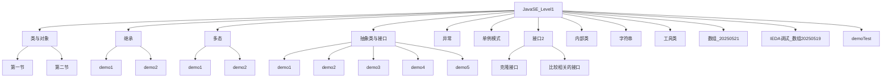
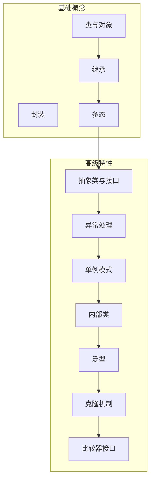
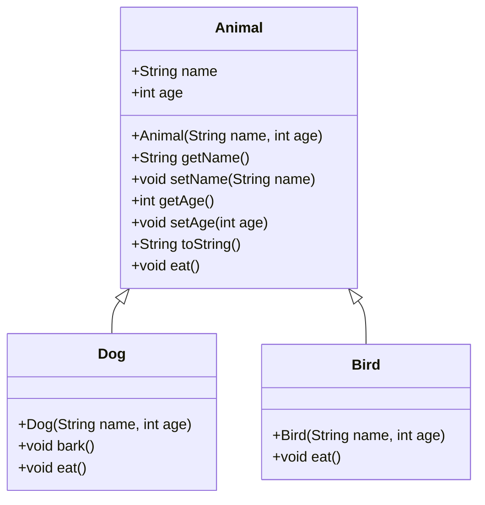
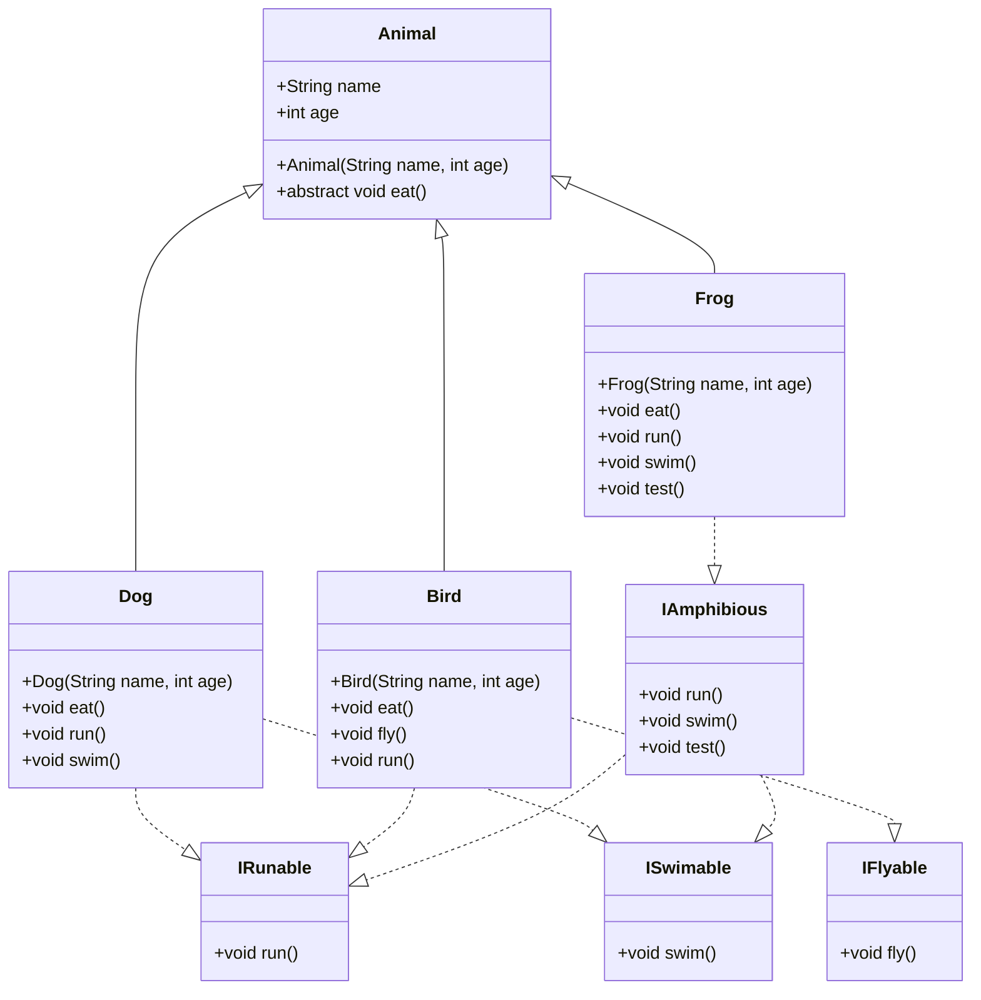
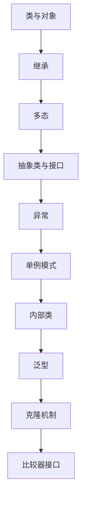

# Java基础

<cite>
**本文档中引用的文件**   
- [Animal.java](file://JavaSE_Level1\src\多态\demo1\Animal.java)
- [Dog.java](file://JavaSE_Level1\src\多态\demo1\Dog.java)
- [Bird.java](file://JavaSE_Level1\src\多态\demo1\Bird.java)
- [Test.java](file://JavaSE_Level1\src\多态\demo1\Test.java)
- [Animal.java](file://JavaSE_Level1\src\抽象类与接口\demo5\Animal.java)
- [Dog.java](file://JavaSE_Level1\src\抽象类与接口\demo5\Dog.java)
- [Bird.java](file://JavaSE_Level1\src\抽象类与接口\demo5\Bird.java)
- [Frog.java](file://JavaSE_Level1\src\抽象类与接口\demo5\Frog.java)
- [IFlyable.java](file://JavaSE_Level1\src\抽象类与接口\demo5\IFlyable.java)
- [IRunable.java](file://JavaSE_Level1\src\抽象类与接口\demo5\IRunable.java)
- [ISwimable.java](file://JavaSE_Level1\src\抽象类与接口\demo5\ISwimable.java)
- [IAmphibious.java](file://JavaSE_Level1\src\抽象类与接口\demo5\IAmphibious.java)
- [Singleton.java](file://JavaSE_Level1\src\单例模式\Singleton.java)
- [Singleton2.java](file://JavaSE_Level1\src\单例模式\Singleton2.java)
- [UserNameException.java](file://JavaSE_Level1\src\异常\UserNameException.java)
- [PasswordException.java](file://JavaSE_Level1\src\异常\PasswordException.java)
- [Login.java](file://JavaSE_Level1\src\异常\Login.java)
- [Money.java](file://JavaSE_Level1\src\接口2\克隆接口\Money.java)
- [Person.java](file://JavaSE_Level1\src\接口2\克隆接口\Person.java)
- [AgeComparator.java](file://JavaSE_Level1\src\接口2\比较相关的接口\AgeComparator.java)
- [NameComparator.java](file://JavaSE_Level1\src\接口2\比较相关的接口\NameComparator.java)
- [Student.java](file://JavaSE_Level1\src\接口2\比较相关的接口\Student.java)
</cite>

## 目录
1. [引言](#引言)
2. [项目结构](#项目结构)
3. [核心组件](#核心组件)
4. [架构概述](#架构概述)
5. [详细组件分析](#详细组件分析)
6. [依赖分析](#依赖分析)
7. [性能考虑](#性能考虑)
8. [故障排除指南](#故障排除指南)
9. [结论](#结论)
10. [附录](#附录)

## 引言
本文档旨在全面介绍JavaSE_Level1项目中的Java基础概念，重点讲解面向对象编程的三大特性：封装、继承和多态。通过具体的代码示例，如Animal-Dog-Bird继承体系和Shape几何图形多态示例，深入剖析这些概念在实际代码中的体现。同时，文档还将探讨抽象类与接口的区别及应用场景，分析异常处理机制的设计，介绍单例模式的实现方式，并涵盖内部类、泛型、克隆机制和比较器接口的使用方法。

## 项目结构
JavaSE_Level1项目是Java基础学习的核心模块，包含了多个子目录，每个子目录对应一个特定的主题。项目结构清晰，便于学习者逐步掌握Java编程的核心概念。



**图示来源**
- [JavaSE_Level1\src](file://JavaSE_Level1\src)

**本节来源**
- [JavaSE_Level1\src](file://JavaSE_Level1\src)

## 核心组件
本项目的核心组件包括面向对象编程的三大特性（封装、继承、多态）、抽象类与接口、异常处理、单例模式、内部类、泛型、克隆机制和比较器接口。这些组件共同构成了Java基础编程的核心知识体系。

**本节来源**
- [Animal.java](file://JavaSE_Level1\src\多态\demo1\Animal.java)
- [Dog.java](file://JavaSE_Level1\src\多态\demo1\Dog.java)
- [Bird.java](file://JavaSE_Level1\src\多态\demo1\Bird.java)
- [Test.java](file://JavaSE_Level1\src\多态\demo1\Test.java)

## 架构概述
JavaSE_Level1项目的架构设计遵循了模块化和分层的原则，每个主题都有独立的目录，便于学习和维护。项目通过具体的代码示例，逐步引导学习者掌握Java编程的核心概念。



**图示来源**
- [JavaSE_Level1\src](file://JavaSE_Level1\src)

## 详细组件分析

### 面向对象三大特性分析

#### 封装
封装是面向对象编程的基础，通过将数据和操作数据的方法绑定在一起，隐藏对象的内部实现细节，只暴露必要的接口。在`Animal`类中，`name`和`age`字段被声明为`private`，并通过`getter`和`setter`方法提供访问。

```java
public class Animal {
    private String name;
    private int age;

    public String getName() {
        return name;
    }

    public void setName(String name) {
        this.name = name;
    }

    public int getAge() {
        return age;
    }

    public void setAge(int age) {
        this.age = age;
    }
}
```

**本节来源**
- [Animal.java](file://JavaSE_Level1\src\多态\demo1\Animal.java)

#### 继承
继承允许一个类继承另一个类的属性和方法，实现代码的重用。在`Dog`类中，通过`extends Animal`关键字继承了`Animal`类的属性和方法，并添加了`bark()`方法。

```java
public class Dog extends Animal {
    public Dog(String name, int age) {
        super(name, age);
    }

    void bark(){
        System.out.println(name+"正在汪汪叫");
    }
}
```

**本节来源**
- [Dog.java](file://JavaSE_Level1\src\多态\demo1\Dog.java)

#### 多态
多态允许不同类的对象对同一消息做出不同的响应。在`Test`类中，`fuc`方法接受`Animal`类型的参数，但可以传入`Dog`或`Bird`对象，调用各自的`eat`方法。

```java
public class Test {
    public static void fuc(Animal animal) {
        animal.eat();
    }

    public static void main(String[] args) {
        Dog dog2 = new Dog("哈士奇", 12);
        Bird bird = new Bird("啾啾", 3);
        fuc(dog2);
        fuc(bird);
    }
}
```



**图示来源**
- [Animal.java](file://JavaSE_Level1\src\多态\demo1\Animal.java)
- [Dog.java](file://JavaSE_Level1\src\多态\demo1\Dog.java)
- [Bird.java](file://JavaSE_Level1\src\多态\demo1\Bird.java)

**本节来源**
- [Test.java](file://JavaSE_Level1\src\多态\demo1\Test.java)

### 抽象类与接口分析

#### 抽象类
抽象类是不能被实例化的类，通常包含一个或多个抽象方法。在`Animal`类中，`eat`方法被声明为抽象方法，子类必须实现该方法。

```java
public abstract class Animal {
    public String name;
    public int age;

    public Animal(String name, int age) {
        this.name = name;
        this.age = age;
    }
    public abstract void eat();
}
```

#### 接口
接口是一种完全抽象的类，只能包含抽象方法和常量。在`IFlyable`、`IRunable`和`ISwimable`接口中，分别定义了`fly`、`run`和`swim`方法。

```java
public interface IFlyable {
    public void fly();
}

public interface IRunable {
    public void run();
}

public interface ISwimable {
    public void swim();
}
```

#### 接口实现
类可以通过`implements`关键字实现一个或多个接口。在`Dog`类中，实现了`IRunable`和`ISwimable`接口。

```java
public class Dog extends Animal implements IRunable, ISwimable {
    public Dog(String name, int age) {
        super(name, age);
    }

    @Override
    public void eat() {
        System.out.println(this.name + "吃狗粮...");
    }

    @Override
    public void run() {
        System.out.println(this.name+"正在用四条狗腿跑步");
    }

    @Override
    public void swim() {
        System.out.println(this.name+"正在用四条狗腿狗刨");
    }
}
```



**图示来源**
- [Animal.java](file://JavaSE_Level1\src\抽象类与接口\demo5\Animal.java)
- [Dog.java](file://JavaSE_Level1\src\抽象类与接口\demo5\Dog.java)
- [Bird.java](file://JavaSE_Level1\src\抽象类与接口\demo5\Bird.java)
- [Frog.java](file://JavaSE_Level1\src\抽象类与接口\demo5\Frog.java)
- [IFlyable.java](file://JavaSE_Level1\src\抽象类与接口\demo5\IFlyable.java)
- [IRunable.java](file://JavaSE_Level1\src\抽象类与接口\demo5\IRunable.java)
- [ISwimable.java](file://JavaSE_Level1\src\抽象类与接口\demo5\ISwimable.java)
- [IAmphibious.java](file://JavaSE_Level1\src\抽象类与接口\demo5\IAmphibious.java)

**本节来源**
- [Animal.java](file://JavaSE_Level1\src\抽象类与接口\demo5\Animal.java)
- [Dog.java](file://JavaSE_Level1\src\抽象类与接口\demo5\Dog.java)
- [Bird.java](file://JavaSE_Level1\src\抽象类与接口\demo5\Bird.java)
- [Frog.java](file://JavaSE_Level1\src\抽象类与接口\demo5\Frog.java)

### 异常处理机制分析
异常处理机制用于处理程序运行时的错误。在`UserNameException`和`PasswordException`类中，自定义了异常类，并在`Login`类中使用`try-catch`语句处理异常。

```java
public class UserNameException extends Exception {
    public UserNameException(String message) {
        super(message);
    }
}

public class PasswordException extends Exception {
    public PasswordException(String message) {
        super(message);
    }
}

public class Login {
    public void login(String username, String password) throws UserNameException, PasswordException {
        if (username == null || username.length() < 6) {
            throw new UserNameException("用户名长度不能小于6位");
        }
        if (password == null || password.length() < 8) {
            throw new PasswordException("密码长度不能小于8位");
        }
        System.out.println("登录成功");
    }
}
```

**本节来源**
- [UserNameException.java](file://JavaSE_Level1\src\异常\UserNameException.java)
- [PasswordException.java](file://JavaSE_Level1\src\异常\PasswordException.java)
- [Login.java](file://JavaSE_Level1\src\异常\Login.java)

### 单例模式分析
单例模式确保一个类只有一个实例，并提供一个全局访问点。在`Singleton`和`Singleton2`类中，分别实现了懒汉式和饿汉式单例模式。

```java
public class Singleton {
    private static Singleton instance;

    private Singleton() {}

    public static Singleton getInstance() {
        if (instance == null) {
            instance = new Singleton();
        }
        return instance;
    }
}

public class Singleton2 {
    private static final Singleton2 instance = new Singleton2();

    private Singleton2() {}

    public static Singleton2 getInstance() {
        return instance;
    }
}
```

**本节来源**
- [Singleton.java](file://JavaSE_Level1\src\单例模式\Singleton.java)
- [Singleton2.java](file://JavaSE_Level1\src\单例模式\Singleton2.java)

### 克隆机制分析
克隆机制允许创建对象的副本。在`Money`和`Person`类中，实现了`Cloneable`接口，并重写了`clone`方法。

```java
public class Money implements Cloneable {
    private double amount;

    public Money(double amount) {
        this.amount = amount;
    }

    @Override
    protected Object clone() throws CloneNotSupportedException {
        return super.clone();
    }
}

public class Person implements Cloneable {
    private String name;
    private Money money;

    public Person(String name, Money money) {
        this.name = name;
        this.money = money;
    }

    @Override
    protected Object clone() throws CloneNotSupportedException {
        Person cloned = (Person) super.clone();
        cloned.money = (Money) money.clone();
        return cloned;
    }
}
```

**本节来源**
- [Money.java](file://JavaSE_Level1\src\接口2\克隆接口\Money.java)
- [Person.java](file://JavaSE_Level1\src\接口2\克隆接口\Person.java)

### 比较器接口分析
比较器接口用于定义对象的比较规则。在`AgeComparator`和`NameComparator`类中，实现了`Comparator`接口，并重写了`compare`方法。

```java
public class Student {
    private String name;
    private int age;

    public Student(String name, int age) {
        this.name = name;
        this.age = age;
    }

    public String getName() {
        return name;
    }

    public int getAge() {
        return age;
    }
}

public class AgeComparator implements Comparator<Student> {
    @Override
    public int compare(Student s1, Student s2) {
        return Integer.compare(s1.getAge(), s2.getAge());
    }
}

public class NameComparator implements Comparator<Student> {
    @Override
    public int compare(Student s1, Student s2) {
        return s1.getName().compareTo(s2.getName());
    }
}
```

**本节来源**
- [Student.java](file://JavaSE_Level1\src\接口2\比较相关的接口\Student.java)
- [AgeComparator.java](file://JavaSE_Level1\src\接口2\比较相关的接口\AgeComparator.java)
- [NameComparator.java](file://JavaSE_Level1\src\接口2\比较相关的接口\NameComparator.java)

## 依赖分析
JavaSE_Level1项目中的各个模块之间依赖关系清晰，每个模块独立完成特定的功能，便于学习和维护。



**图示来源**
- [JavaSE_Level1\src](file://JavaSE_Level1\src)

**本节来源**
- [JavaSE_Level1\src](file://JavaSE_Level1\src)

## 性能考虑
在Java基础编程中，性能考虑主要集中在对象的创建和销毁、内存的使用和垃圾回收等方面。通过合理的设计模式和数据结构，可以有效提高程序的性能。

## 故障排除指南
在学习Java基础编程时，常见的问题包括语法错误、逻辑错误和运行时错误。通过仔细阅读错误信息和调试代码，可以快速定位和解决问题。

**本节来源**
- [Test.java](file://JavaSE_Level1\src\多态\demo1\Test.java)
- [Login.java](file://JavaSE_Level1\src\异常\Login.java)

## 结论
JavaSE_Level1项目通过丰富的代码示例，全面介绍了Java基础编程的核心概念。通过学习这些示例，可以深入理解面向对象编程的三大特性、抽象类与接口、异常处理、单例模式、内部类、泛型、克隆机制和比较器接口，为后续的Java学习打下坚实的基础。

## 附录
本文档中引用的所有文件列表：
- [Animal.java](file://JavaSE_Level1\src\多态\demo1\Animal.java)
- [Dog.java](file://JavaSE_Level1\src\多态\demo1\Dog.java)
- [Bird.java](file://JavaSE_Level1\src\多态\demo1\Bird.java)
- [Test.java](file://JavaSE_Level1\src\多态\demo1\Test.java)
- [Animal.java](file://JavaSE_Level1\src\抽象类与接口\demo5\Animal.java)
- [Dog.java](file://JavaSE_Level1\src\抽象类与接口\demo5\Dog.java)
- [Bird.java](file://JavaSE_Level1\src\抽象类与接口\demo5\Bird.java)
- [Frog.java](file://JavaSE_Level1\src\抽象类与接口\demo5\Frog.java)
- [IFlyable.java](file://JavaSE_Level1\src\抽象类与接口\demo5\IFlyable.java)
- [IRunable.java](file://JavaSE_Level1\src\抽象类与接口\demo5\IRunable.java)
- [ISwimable.java](file://JavaSE_Level1\src\抽象类与接口\demo5\ISwimable.java)
- [IAmphibious.java](file://JavaSE_Level1\src\抽象类与接口\demo5\IAmphibious.java)
- [Singleton.java](file://JavaSE_Level1\src\单例模式\Singleton.java)
- [Singleton2.java](file://JavaSE_Level1\src\单例模式\Singleton2.java)
- [UserNameException.java](file://JavaSE_Level1\src\异常\UserNameException.java)
- [PasswordException.java](file://JavaSE_Level1\src\异常\PasswordException.java)
- [Login.java](file://JavaSE_Level1\src\异常\Login.java)
- [Money.java](file://JavaSE_Level1\src\接口2\克隆接口\Money.java)
- [Person.java](file://JavaSE_Level1\src\接口2\克隆接口\Person.java)
- [AgeComparator.java](file://JavaSE_Level1\src\接口2\比较相关的接口\AgeComparator.java)
- [NameComparator.java](file://JavaSE_Level1\src\接口2\比较相关的接口\NameComparator.java)
- [Student.java](file://JavaSE_Level1\src\接口2\比较相关的接口\Student.java)