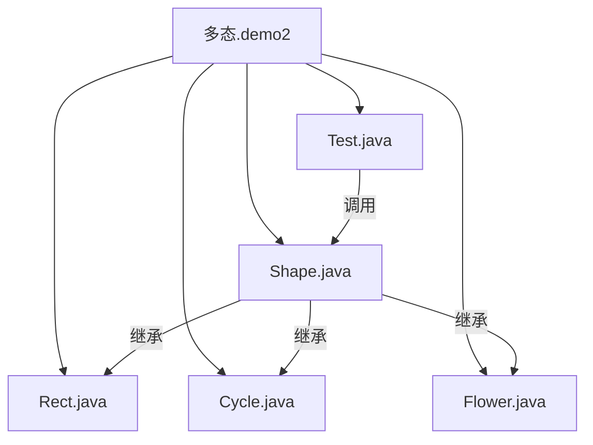

# 动态绑定

<cite>
**本文档中引用的文件**  
- [Shape.java](file://JavaSE_Level1/src/多态/demo2/Shape.java)
- [Rect.java](file://JavaSE_Level1/src/多态/demo2/Rect.java)
- [Cycle.java](file://JavaSE_Level1/src/多态/demo2/Cycle.java)
- [Flower.java](file://JavaSE_Level1/src/多态/demo2/Flower.java)
- [Test.java](file://JavaSE_Level1/src/多态/demo2/Test.java)
</cite>

## 目录
1. [引言](#引言)  
2. [项目结构](#项目结构)  
3. [核心组件分析](#核心组件分析)  
4. [动态绑定机制详解](#动态绑定机制详解)  
5. [虚函数表与对象结构](#虚函数表与对象结构)  
6. [性能影响与JVM优化策略](#性能影响与jvm优化策略)  
7. [final方法与动态绑定的关系](#final方法与动态绑定的关系)  
8. [结论](#结论)

## 引言

动态绑定（Dynamic Binding）是Java多态性的核心机制之一，它允许程序在运行时根据对象的实际类型来决定调用哪个方法。本文档将基于`Shape`抽象类及其子类`Rect`、`Cycle`和`Flower`的多态调用案例，深入解析Java虚拟机（JVM）中`invokevirtual`指令如何通过虚函数表（vtable）实现运行时方法分派。同时，本文还将探讨动态绑定对性能的影响、JVM的优化策略（如内联缓存），并解释为何`final`方法不参与动态绑定。

**本分析基于JavaSE_Level1项目中的多态示例代码，所有内容均来自实际源码。**

## 项目结构

项目位于``目录下，主要包含多个学习模块，其中与本主题相关的代码位于`JavaSE_Level1\src\多态\demo2`包中。该包实现了基于图形绘制的多态示例，用于演示动态绑定的工作原理。



**图示来源**  
- [Shape.java](file://JavaSE_Level1/src/多态/demo2/Shape.java)
- [Rect.java](file://JavaSE_Level1/src/多态/demo2/Rect.java)
- [Cycle.java](file://JavaSE_Level1/src/多态/demo2/Cycle.java)
- [Flower.java](file://JavaSE_Level1/src/多态/demo2/Flower.java)
- [Test.java](file://JavaSE_Level1/src/多态/demo2/Test.java)

## 核心组件分析

### Shape 抽象类

`Shape`类是所有图形的基类，定义了通用的绘图行为。

```java
public class Shape {
    public void draw(){
        System.out.println("画一个图形...");
    }
}
```

**关键点**：  
- `draw()`方法为非`final`、非`private`，可被子类重写。
- 该类虽未使用`abstract`关键字，但作为基类用于多态。

**代码来源**  
- [Shape.java](file://JavaSE_Level1/src/多态/demo2/Shape.java#L1-L8)

### Rect、Cycle、Flower 实现类

这三个类均继承自`Shape`，并重写了`draw()`方法以实现各自的行为。

```java
public class Rect extends Shape{
    @Override
    public void draw() {
        System.out.println("画一个矩形...");
    }
}
```

```java
public class Cycle extends Shape{
    @Override
    public void draw() {
        System.out.println("画一个圆...");
    }
}
```

```java
public class Flower extends Shape {
    @Override
    public void draw() {
        System.out.println("花一朵花...");
    }
}
```

**关键点**：  
- 所有子类通过`@Override`注解明确重写父类方法。
- 方法签名一致，符合多态调用的前提。

**代码来源**  
- [Rect.java](file://JavaSE_Level1/src/多态/demo2/Rect.java#L1-L8)
- [Cycle.java](file://JavaSE_Level1/src/多态/demo2/Cycle.java#L1-L8)
- [Flower.java](file://JavaSE_Level1/src/多态/demo2/Flower.java#L1-L8)

### Test 测试类

`Test`类提供了多态调用的典型场景。

```java
public static void drawShapes2() {
    Rect rect = new Rect();
    Cycle cycle = new Cycle();
    Flower flower = new Flower();

    Shape[] shapes = {rect, cycle, rect, cycle, flower};

    for (Shape shape : shapes) {
        shape.draw(); // 动态绑定发生在此处
    }
}
```

**关键点**：  
- 使用`Shape`类型的引用指向不同子类对象。
- 循环中调用`shape.draw()`时，实际执行的方法由对象的实际类型决定。
- 这正是动态绑定的体现。

**代码来源**  
- [Test.java](file://JavaSE_Level1/src/多态/demo2/Test.java#L30-L45)

## 动态绑定机制详解

### invokevirtual 指令与运行时分派

在Java字节码层面，当调用一个非`final`、非`private`的实例方法时，JVM会生成`invokevirtual`指令。该指令的执行流程如下：

1. **获取对象实际类型**：通过对象头中的类型指针（Class Pointer）确定对象的真实类。
2. **查找虚函数表（vtable）**：每个类在方法区中都有一个虚函数表，存储了该类所有可被重写的方法的地址。
3. **方法地址解析**：根据方法签名在vtable中查找对应条目，获取实际要执行的方法的指针。
4. **调用方法**：跳转到该地址执行具体逻辑。

在`drawShapes2()`方法中，尽管`shape`的编译时类型是`Shape`，但`invokevirtual`指令会在运行时根据每个元素的实际类型（`Rect`、`Cycle`或`Flower`）去查找对应类的vtable，从而调用正确的`draw()`实现。

### 多态调用示例分析

```java
Shape shape = new Rect();
shape.draw(); // 实际调用 Rect.draw()
```

- 编译时：`shape`的类型为`Shape`，编译器检查`Shape`类中是否存在`draw()`方法。
- 运行时：JVM发现`shape`指向的是`Rect`对象，于是通过`Rect`类的vtable找到`draw()`方法的具体实现并执行。

这保证了“同一操作，不同行为”的多态特性。

**代码来源**  
- [Test.java](file://JavaSE_Level1/src/多态/demo2/Test.java#L30-L45)
- [Shape.java](file://JavaSE_Level1/src/多态/demo2/Shape.java#L1-L8)

## 虚函数表与对象结构

### 类加载后的方法区结构

当类被加载到JVM时，会在方法区为其创建虚函数表（vtable）。以下是`Shape`及其子类的vtable结构示意图：

```mermaid
classDiagram
class Shape_vtable {
+draw() : Shape : : draw
}
class Rect_vtable {
+draw() : Rect : : draw
}
class Cycle_vtable {
+draw() : Cycle : : draw
}
class Flower_vtable {
+draw() : Flower : : draw
}
Shape_vtable <|-- Rect_vtable : "继承并覆盖"
Shape_vtable <|-- Cycle_vtable : "继承并覆盖"
Shape_vtable <|-- Flower_vtable : "继承并覆盖"
note right of Shape_vtable
Shape类的vtable初始指向
自身的draw()实现
end note
note right of Rect_vtable
Rect类的vtable覆盖了
draw()条目，指向自己的实现
end note
```

**图示来源**  
- [Shape.java](file://JavaSE_Level1/src/多态/demo2/Shape.java)
- [Rect.java](file://JavaSE_Level1/src/多态/demo2/Rect.java)
- [Cycle.java](file://JavaSE_Level1/src/多态/demo2/Cycle.java)
- [Flower.java](file://JavaSE_Level1/src/多态/demo2/Flower.java)

### 对象头中的类型指针

每个Java对象在堆内存中都包含一个对象头（Object Header），其中一个重要组成部分就是**类型指针（Class Pointer）**，它指向方法区中的类元数据。

```
+---------------------+
|   对象头 (Header)    |
|  +----------------+ |
|  | 类型指针        |-----> 指向方法区中的类信息（如Rect.class）
|  +----------------+ |
|  | 哈希码、GC信息等 | |
|  +----------------+ |
+---------------------+
|     实例数据        |
|  (成员变量)         |
+---------------------+
```

**作用**：  
- 在执行`invokevirtual`指令时，JVM首先通过对象头的类型指针找到对象的实际类。
- 然后通过该类的元数据获取其vtable，完成方法查找。

这使得JVM能够在运行时准确地进行动态分派。

**代码来源**  
- [Rect.java](file://JavaSE_Level1/src/多态/demo2/Rect.java)
- [Cycle.java](file://JavaSE_Level1/src/多态/demo2/Cycle.java)
- [Flower.java](file://JavaSE_Level1/src/多态/demo2/Flower.java)

## 性能影响与JVM优化策略

### 动态绑定的性能开销

动态绑定虽然提供了灵活性，但也带来了性能开销：
- **查找开销**：每次调用都需要通过vtable查找方法地址。
- **缓存未命中**：间接跳转可能影响CPU的指令预取效率。

### JVM的优化策略：内联缓存（Inline Cache）

为了减少动态绑定的开销，JVM采用了多种优化技术，其中**内联缓存**是关键策略之一。

#### 工作原理：
1. **一阶内联缓存**：JVM在`invokevirtual`指令处缓存最近一次调用的目标方法和接收者类型。
2. **快速路径**：当下次调用时，先检查接收者类型是否与缓存一致。若一致，则直接跳转到目标方法（避免vtable查找）。
3. **慢速路径**：若类型不匹配，则进入完整的vtable查找流程，并更新缓存。

#### 示例：
```java
// 假设循环中大部分是Rect对象
for (Shape shape : shapes) {
    shape.draw(); // JVM可能缓存Rect::draw，提升性能
}
```

经过热点探测（HotSpot）后，JVM甚至可能将`draw()`方法直接内联到调用点，彻底消除方法调用开销。

**代码来源**  
- [Test.java](file://JavaSE_Level1/src/多态/demo2/Test.java#L30-L45)

## final方法与动态绑定的关系

### 为何final方法不参与动态绑定？

`final`方法不能被子类重写，因此其调用目标在编译时即可完全确定。

#### 编译器行为：
- 当调用一个`final`方法时，编译器生成`invokevirtual`指令，但JVM知道该方法不会被覆盖。
- JVM可以进行**去虚拟化（Devirtualization）**优化，将其替换为更快的`invokespecial`或直接内联。

#### 示例：
```java
class Base {
    public final void func() {
        System.out.println("Base.func");
    }
}

class Derived extends Base {
    // 无法重写func()
}

Base obj = new Derived();
obj.func(); // 编译时即可确定调用Base.func，无需动态查找
```

由于`func()`是`final`的，JVM无需查找vtable，可以直接调用，从而避免了动态绑定的开销。

**代码来源**  
- 本节为通用JVM知识，未在当前代码库中找到`final`方法示例，但原理适用于所有Java程序。

## 结论

动态绑定是Java实现多态的核心机制，它依赖于`invokevirtual`指令和虚函数表（vtable）在运行时完成方法分派。通过对象头中的类型指针，JVM能够准确地定位到实际类型，并调用正确的实现。尽管动态绑定带来了一定的性能开销，但JVM通过内联缓存等优化策略显著提升了执行效率。而`final`方法由于不可被重写，其调用可在编译时确定，因此不参与动态绑定，也更容易被JVM优化。理解这些底层机制有助于编写更高效、更可预测的Java代码。