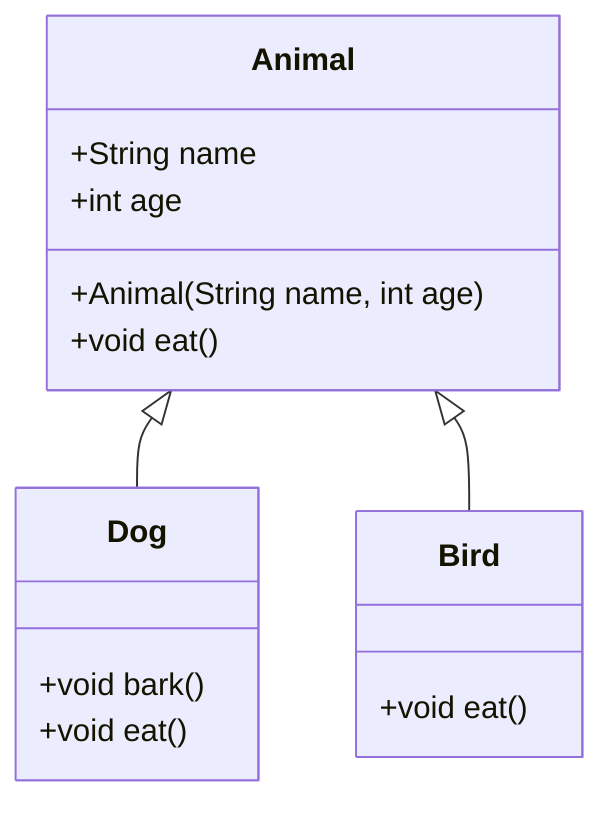
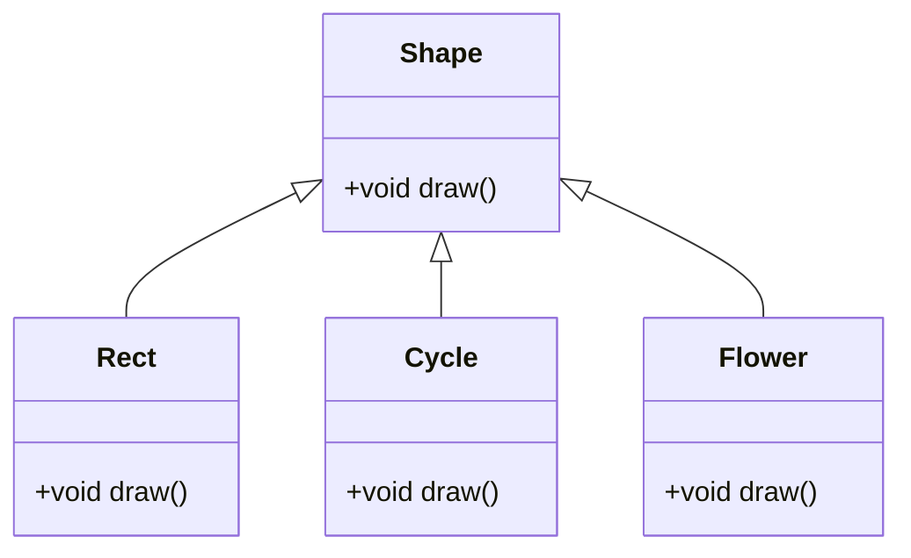
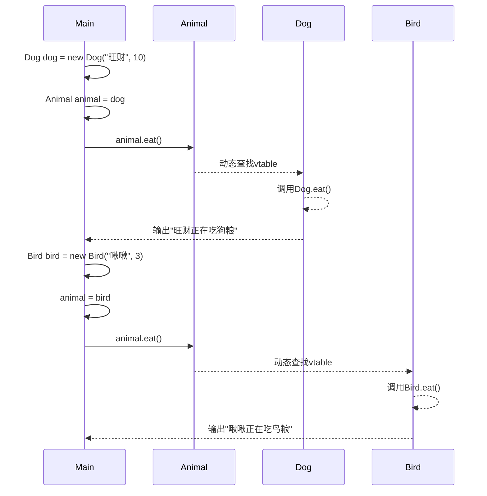
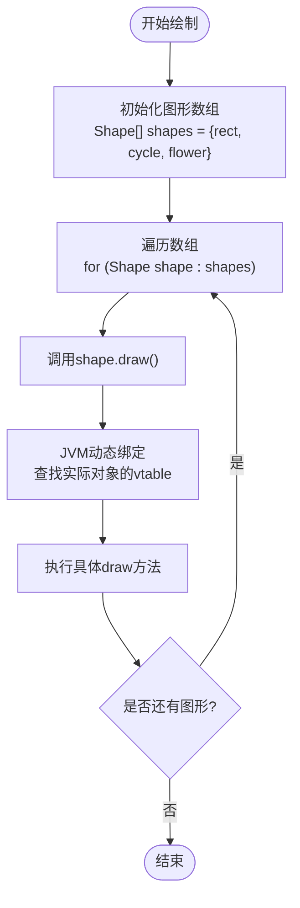
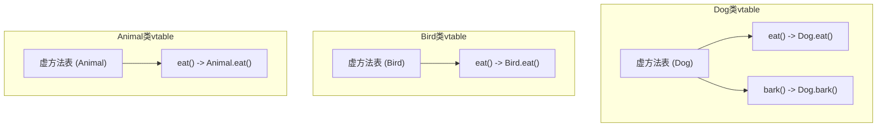

# 多态

<cite>
**本文档引用的文件**  
- [Animal.java](file://JavaSE_Level1/src/多态/demo1/Animal.java)
- [Dog.java](file://JavaSE_Level1/src/多态/demo1/Dog.java)
- [Bird.java](file://JavaSE_Level1/src/多态/demo1/Bird.java)
- [Test.java](file://JavaSE_Level1/src/多态/demo1/Test.java)
- [Shape.java](file://JavaSE_Level1/src/多态/demo2/Shape.java)
- [Rect.java](file://JavaSE_Level1/src/多态/demo2/Rect.java)
- [Cycle.java](file://JavaSE_Level1/src/多态/demo2/Cycle.java)
- [Flower.java](file://JavaSE_Level1/src/多态/demo2/Flower.java)
- [Test.java](file://JavaSE_Level1/src/多态/demo2/Test.java)
</cite>

## 目录
1. [引言](#引言)
2. [项目结构](#项目结构)
3. [核心组件分析](#核心组件分析)
4. [多态实现原理](#多态实现原理)
5. [运行时多态：方法重写与动态绑定](#运行时多态方法重写与动态绑定)
6. [编译时多态：方法重载](#编译时多态方法重载)
7. [向上转型与多态传递方式](#向上转型与多态传递方式)
8. [接口与多态结合：Shape几何图形体系](#接口与多态结合shape几何图形体系)
9. [字节码与方法表（vtable）机制解析](#字节码与方法表vtable机制解析)
10. [Java与C++多态机制对比](#java与c多态机制对比)
11. [性能影响分析](#性能影响分析)
12. [最佳实践建议](#最佳实践建议)
13. [结论](#结论)

## 引言
多态是面向对象编程的三大核心特性之一（封装、继承、多态），它允许不同类的对象对同一消息做出不同的响应。本文档系统阐述Java中多态的实现原理与应用，涵盖编译时多态（重载）和运行时多态（重写+向上转型）。通过`Animal`抽象基类与`Dog`、`Bird`具体子类的案例，展示动态绑定机制；利用`Shape`几何图形体系（`Rect`、`Cycle`）说明接口与多态的结合使用。同时提供字节码层面的解析、方法表（vtable）示意图，并对比C++多态的差异，最后包含性能影响分析和最佳实践建议。

## 项目结构
本项目位于``目录下，多态相关代码主要集中在`JavaSE_Level1\src\多态`目录中，分为`demo1`和`demo2`两个示例模块：

- **demo1**: 实现基于`Animal`基类的动物体系，展示继承与方法重写。
- **demo2**: 实现基于`Shape`基类的图形绘制体系，展示多态在集合与循环中的应用。

此外，`抽象类与接口`目录下也存在相似结构的代码，用于对比学习。

**Section sources**
- [Animal.java](file://JavaSE_Level1/src/多态/demo1/Animal.java)
- [Shape.java](file://JavaSE_Level1/src/多态/demo2/Shape.java)

## 核心组件分析
本节分析多态实现中的核心类及其关系。

### Animal动物体系类图


**Diagram sources**
- [Animal.java](file://JavaSE_Level1/src/多态/demo1/Animal.java#L1-L38)
- [Dog.java](file://JavaSE_Level1/src/多态/demo1/Dog.java#L1-L14)
- [Bird.java](file://JavaSE_Level1/src/多态/demo1/Bird.java#L1-L11)

### Shape图形体系类图


**Diagram sources**
- [Shape.java](file://JavaSE_Level1/src/多态/demo2/Shape.java#L1-L7)
- [Rect.java](file://JavaSE_Level1/src/多态/demo2/Rect.java#L1-L7)
- [Cycle.java](file://JavaSE_Level1/src/多态/demo2/Cycle.java#L1-L7)
- [Flower.java](file://JavaSE_Level1/src/多态/demo2/Flower.java#L1-L7)

## 多态实现原理
Java中的多态依赖于继承、方法重写（Override）和向上转型（Upcasting）。其核心机制是**动态绑定**（Dynamic Binding），即在运行时根据对象的实际类型决定调用哪个方法，而非引用变量的声明类型。

多态的实现分为两种：
1. **编译时多态**：通过方法重载（Overload）实现，编译器根据参数类型和数量选择具体方法。
2. **运行时多态**：通过方法重写（Override）和父类引用指向子类对象实现，JVM在运行时通过虚方法表（vtable）查找实际调用的方法。

## 运行时多态：方法重写与动态绑定
运行时多态是Java多态的核心，依赖于方法重写和动态绑定机制。

### Animal体系中的方法重写
在`Animal`类中定义了`eat()`方法，`Dog`和`Bird`类通过`@Override`注解重写该方法，提供各自的具体实现。

```java
// Animal.java
void eat() {
    System.out.println(name + "正在吃饭");
}

// Dog.java
@Override
void eat(){
    System.out.println(name+"正在吃狗粮");
}

// Bird.java
void eat(){
    System.out.println(name+"正在吃鸟粮");
}
```

当通过`Animal`类型的引用调用`eat()`方法时，JVM会根据引用实际指向的对象类型（`Dog`或`Bird`）动态调用相应的方法。

### 动态绑定调用流程


**Diagram sources**
- [Animal.java](file://JavaSE_Level1/src/多态/demo1/Animal.java#L35)
- [Dog.java](file://JavaSE_Level1/src/多态/demo1/Dog.java#L11)
- [Bird.java](file://JavaSE_Level1/src/多态/demo1/Bird.java#L8)
- [Test.java](file://JavaSE_Level1/src/多态/demo1/Test.java#L15-L28)

**Section sources**
- [Animal.java](file://JavaSE_Level1/src/多态/demo1/Animal.java)
- [Dog.java](file://JavaSE_Level1/src/多态/demo1/Dog.java)
- [Bird.java](file://JavaSE_Level1/src/多态/demo1/Bird.java)

## 编译时多态：方法重载
编译时多态通过方法重载实现，即在同一个类中定义多个同名但参数列表不同的方法。编译器在编译阶段根据调用时的参数类型和数量决定调用哪个方法。

虽然在提供的代码中未直接展示方法重载，但`Test`类中的`fuc`和`fuc2`方法展示了多态的使用，而非重载。方法重载的典型示例如下：

```java
public class Calculator {
    public int add(int a, int b) {
        return a + b;
    }
    
    public double add(double a, double b) {
        return a + b;
    }
}
```

编译器会根据传入参数的类型选择调用`int`版本或`double`版本的`add`方法。

## 向上转型与多态传递方式
向上转型是将子类对象赋值给父类引用的过程，是实现多态的前提。

### 三种多态传递方式
在`Test.java`中展示了多态的三种典型应用场景：

1. **直接赋值**：将子类对象直接赋给父类引用。
2. **参数传递**：将子类对象作为参数传递给接受父类类型的方法。
3. **返回值传递**：方法返回父类类型，但实际返回子类对象。

```java
// 1. 直接赋值
Animal animal = new Dog("niu", 20);
animal.eat(); // 调用Dog的eat方法

// 2. 参数传递
public static void fuc(Animal animal) {
    animal.eat();
}
fuc(new Dog("哈士奇", 12)); // 传递Dog对象
fuc(new Bird("啾啾", 3));   // 传递Bird对象

// 3. 返回值传递
public static Animal fuc2(int a){
    if(a==1){
        return new Dog("旺财",10);
    } else {
        return new Bird("啾啾",3);
    }
}
```

**Section sources**
- [Test.java](file://JavaSE_Level1/src/多态/demo1/Test.java#L5-L29)

## 接口与多态结合：Shape几何图形体系
`Shape`体系展示了多态在图形绘制中的应用，通过统一接口实现不同图形的绘制。

### 非多态方式 vs 多态方式
在`Test.java`中，`drawShapes1()`方法使用`if-else`判断图形类型，属于非多态的硬编码方式，扩展性差。

```java
// 非多态方式
if (shape.equals("cycle")) {
    cycle.draw();
} else if (shape.equals("rect")) {
    rect.draw();
}
```

而`drawShapes2()`方法使用多态，将不同图形对象存入`Shape`数组，通过统一的`draw()`方法调用，实现“一个接口，多种实现”。

```java
// 多态方式
Shape[] shapes = {rect, cycle, rect, cycle, flower};
for (Shape shape : shapes) {
    shape.draw(); // 动态绑定到实际对象的draw方法
}
```

这种方式具有良好的扩展性，新增图形只需继承`Shape`并重写`draw()`方法，无需修改现有代码。

### 多态绘制流程


**Diagram sources**
- [Shape.java](file://JavaSE_Level1/src/多态/demo2/Shape.java#L5)
- [Rect.java](file://JavaSE_Level1/src/多态/demo2/Rect.java#L4)
- [Cycle.java](file://JavaSE_Level1/src/多态/demo2/Cycle.java#L4)
- [Flower.java](file://JavaSE_Level1/src/多态/demo2/Flower.java#L4)
- [Test.java](file://JavaSE_Level1/src/多态/demo2/Test.java#L35-L45)

**Section sources**
- [Shape.java](file://JavaSE_Level1/src/多态/demo2/Shape.java)
- [Test.java](file://JavaSE_Level1/src/多态/demo2/Test.java)

## 字节码与方法表（vtable）机制解析
Java多态的底层实现依赖于JVM的动态方法分派机制，每个类在加载时会创建一个**虚方法表**（Virtual Method Table, vtable），存储该类所有可被重写的方法的地址。

### vtable结构示意图


当调用`animal.eat()`时，JVM会：
1. 获取`animal`引用指向的对象的实际类型。
2. 查找该类型对应的vtable。
3. 在vtable中找到`eat()`方法的入口地址。
4. 调用该地址对应的方法。

### 字节码层面的invokevirtual指令
在编译后的字节码中，对虚方法的调用使用`invokevirtual`指令。该指令会在运行时执行上述动态查找过程，确保调用的是实际对象的方法。

**Section sources**
- [Animal.java](file://JavaSE_Level1/src/多态/demo1/Animal.java)
- [Dog.java](file://JavaSE_Level1/src/多态/demo1/Dog.java)

## Java与C++多态机制对比
| 特性 | Java | C++ |
|------|------|-----|
| **实现方式** | 基于vtable的动态绑定 | 基于vtable的虚函数 |
| **默认行为** | 所有非静态方法默认为虚方法（可被重写） | 方法默认为非虚，需显式使用`virtual`关键字 |
| **性能开销** | 每次虚方法调用都有vtable查找开销 | 类似，但可通过内联优化 |
| **内存布局** | 对象头包含类元数据指针，指向vtable | 对象包含指向vtable的指针（vptr） |
| **多继承** | 不支持类的多继承，但支持接口多实现 | 支持类的多继承 |
| **析构函数** | 无显式析构，依赖GC | 需显式定义虚析构函数防止内存泄漏 |

Java的多态机制更简单、安全，但性能略低于C++；C++提供更精细的控制，但复杂度更高。

## 性能影响分析
多态带来的主要性能影响是**动态绑定开销**：
- **时间开销**：每次虚方法调用需通过vtable查找实际方法地址，比直接调用慢。
- **空间开销**：每个类需维护vtable，每个对象可能包含指向vtable的指针。
- **JIT优化**：现代JVM的JIT编译器可通过**内联缓存**（Inline Caching）优化频繁调用的虚方法，显著降低开销。

在大多数应用场景中，多态带来的代码灵活性和可维护性收益远大于其性能开销。

## 最佳实践建议
1. **优先使用接口而非抽象类**：接口更灵活，支持多实现。
2. **避免过度使用继承**：优先考虑组合（Composition over Inheritance）。
3. **明确重写意图**：使用`@Override`注解确保正确重写父类方法。
4. **谨慎设计继承体系**：避免过深的继承层次，保持类的单一职责。
5. **利用多态提高扩展性**：在框架和库设计中广泛使用多态，便于扩展。
6. **性能敏感场景**：在极端性能要求的场景，可考虑避免虚方法调用，或依赖JVM优化。

## 结论
Java的多态机制通过继承、方法重写和动态绑定实现，是构建灵活、可扩展系统的核心。`Animal`和`Shape`案例清晰展示了运行时多态的工作原理。尽管存在轻微的性能开销，但其带来的代码复用性和可维护性优势使其成为面向对象设计的基石。理解vtable机制有助于深入掌握JVM的工作原理，并在实际开发中做出更优的设计决策。