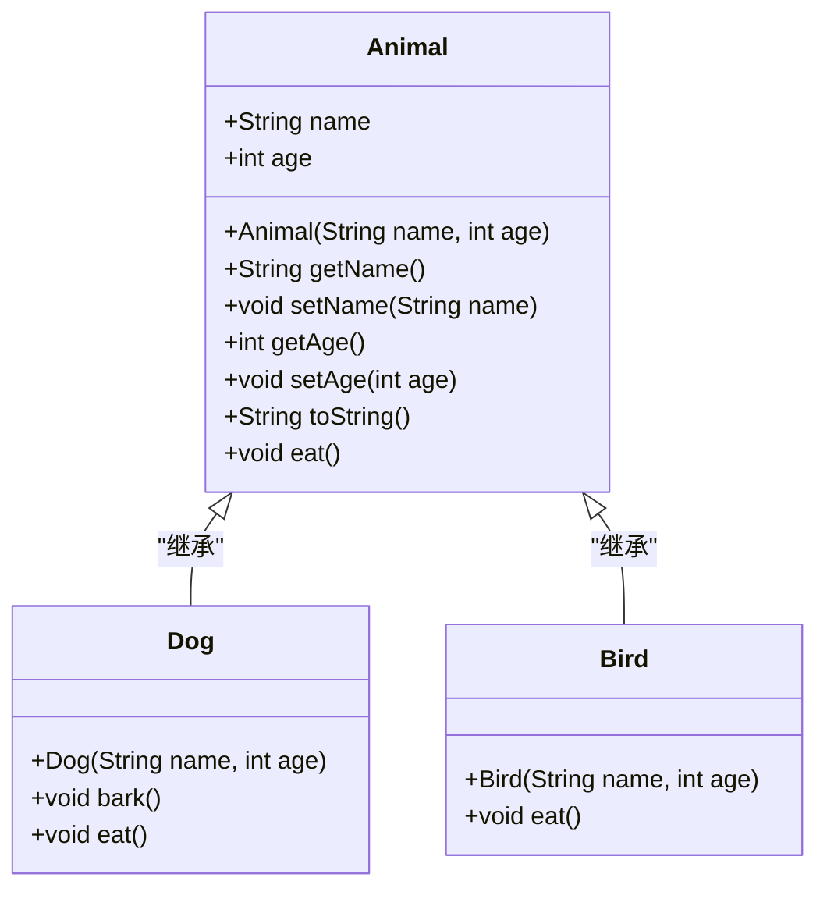
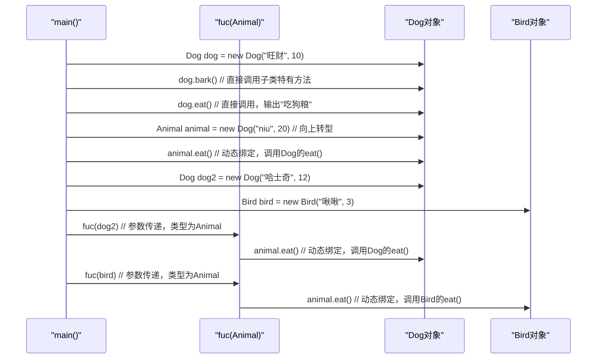

# 方法重写

<cite>
**本文档中引用的文件**  
- [Animal.java](file://JavaSE_Level1/src/多态/demo1/Animal.java)
- [Dog.java](file://JavaSE_Level1/src/多态/demo1/Dog.java)
- [Bird.java](file://JavaSE_Level1/src/多态/demo1/Bird.java)
- [Test.java](file://JavaSE_Level1/src/多态/demo1/Test.java)
</cite>

## 目录
1. [引言](#引言)
2. [核心类结构分析](#核心类结构分析)
3. [方法重写机制详解](#方法重写机制详解)
4. [重写条件与规则](#重写条件与规则)
5. [运行时动态绑定与多态调用](#运行时动态绑定与多态调用)
6. [super关键字的使用](#super关键字的使用)
7. [总结](#总结)

## 引言

在Java面向对象编程中，**方法重写**（Method Overriding）是实现多态性的核心机制之一。它允许子类提供一个与父类中某个方法具有相同签名的方法，从而在运行时根据对象的实际类型来决定调用哪个方法。本文将深入分析`Animal`、`Dog`和`Bird`类的继承关系，详细阐述方法重写的实现原理、必要条件以及在多态性中的应用。

**Section sources**
- [Animal.java](file://JavaSE_Level1/src/多态/demo1/Animal.java)
- [Dog.java](file://JavaSE_Level1/src/多态/demo1/Dog.java)
- [Bird.java](file://JavaSE_Level1/src/多态/demo1/Bird.java)
- [Test.java](file://JavaSE_Level1/src/多态/demo1/Test.java)

## 核心类结构分析

本节分析`Animal`（父类）、`Dog`和`Bird`（子类）之间的继承关系和核心方法。

### 类图



**Diagram sources**
- [Animal.java](file://JavaSE_Level1/src/多态/demo1/Animal.java#L1-L39)
- [Dog.java](file://JavaSE_Level1/src/多态/demo1/Dog.java#L1-L15)
- [Bird.java](file://JavaSE_Level1/src/多态/demo1/Bird.java#L1-L12)

### 父类 Animal

`Animal`类是所有动物的基类，定义了动物的通用属性和行为。

**关键属性**:
- `name`: 动物的名称（包访问权限）
- `age`: 动物的年龄（包访问权限）

**关键方法**:
- `Animal(String name, int age)`: 构造函数，用于初始化名称和年龄。
- `eat()`: 一个非私有的实例方法，输出“`name`正在吃饭”。该方法被设计为可被子类重写。
- `toString()`: 重写了`Object`类的`toString()`方法，用于返回对象的字符串表示。

**Section sources**
- [Animal.java](file://JavaSE_Level1/src/多态/demo1/Animal.java#L1-L39)

### 子类 Dog

`Dog`类继承自`Animal`，代表一种具体的动物——狗。

**关键特性**:
- 继承了`name`和`age`属性。
- 定义了特有的`bark()`方法，用于模拟狗叫。
- **重写**了父类的`eat()`方法，使其输出“`name`正在吃狗粮”。

**Section sources**
- [Dog.java](file://JavaSE_Level1/src/多态/demo1/Dog.java#L1-L15)

### 子类 Bird

`Bird`类同样继承自`Animal`，代表一种具体的动物——鸟。

**关键特性**:
- 继承了`name`和`age`属性。
- **重写**了父类的`eat()`方法，使其输出“`name`正在吃鸟粮”。

**Section sources**
- [Bird.java](file://JavaSE_Level1/src/多态/demo1/Bird.java#L1-L12)

## 方法重写机制详解

方法重写是指在子类中定义一个与父类中某个非私有方法具有**完全相同的方法签名**（方法名、参数列表）的方法。当通过父类引用调用该方法时，JVM会根据引用所指向的实际对象类型，动态地调用子类中重写后的方法，而不是父类中的方法。这个过程称为**动态绑定**或**运行时多态**。

### @Override 注解的使用

`@Override`注解是一个编译时检查工具，它明确地告诉编译器：“我打算重写父类中的一个方法”。如果子类中的方法签名与父类中的任何方法都不匹配，编译器将报错。

在`Dog.java`中：
```java
@Override
void eat(){
    System.out.println(name+"正在吃狗粮");
}
```
这里的`@Override`注解确保了`Dog`类的`eat()`方法确实是在重写`Animal`类的`eat()`方法。如果`Animal`类中没有`eat()`方法，或者方法签名不一致（例如参数不同），代码将无法通过编译。

**注意**：在`Bird.java`中，虽然`eat()`方法没有使用`@Override`注解，但它依然构成了方法重写。`@Override`是可选的，但强烈推荐使用，因为它能有效防止因拼写错误或签名不一致导致的意外错误。

**Section sources**
- [Dog.java](file://JavaSE_Level1/src/多态/demo1/Dog.java#L10-L14)
- [Bird.java](file://JavaSE_Level1/src/多态/demo1/Bird.java#L8-L10)

## 重写条件与规则

要成功实现方法重写，必须满足以下条件：

1.  **方法签名必须相同**：子类方法的方法名和参数列表（包括参数的类型、数量和顺序）必须与父类方法完全一致。
    *   **验证**：`Animal`、`Dog`和`Bird`中的`eat()`方法签名均为`void eat()`，满足条件。

2.  **访问权限不能更严格**：子类重写方法的访问修饰符的权限不能低于父类方法的权限。
    *   **验证**：`Animal`类的`eat()`方法是包访问权限（默认），`Dog`和`Bird`类的`eat()`方法也是包访问权限，权限相同，满足条件。子类可以将访问权限改为`public`，但不能改为`private`或`protected`（如果父类是`public`，子类不能改为`protected`或`private`）。

3.  **返回类型必须兼容**：对于基本类型，返回类型必须完全相同。对于引用类型，子类方法的返回类型可以是父类方法返回类型的子类型（协变返回类型）。
    *   **验证**：`eat()`方法的返回类型为`void`，满足条件。

4.  **异常类型不能更宽泛**：子类重写方法抛出的异常类型不能比父类方法抛出的异常类型更宽泛（即不能抛出父类方法异常的父类）。
    *   **验证**：`eat()`方法均未声明抛出任何异常，满足条件。

**Section sources**
- [Animal.java](file://JavaSE_Level1/src/多态/demo1/Animal.java#L37)
- [Dog.java](file://JavaSE_Level1/src/多态/demo1/Dog.java#L10)
- [Bird.java](file://JavaSE_Level1/src/多态/demo1/Bird.java#L8)

## 运行时动态绑定与多态调用

多态性通过**向上转型**（Upcasting）和**动态绑定**来实现。`Test.java`中的`main`方法展示了三种典型的多态应用场景。

### 多态调用链示例



**Diagram sources**
- [Test.java](file://JavaSE_Level1/src/多态/demo1/Test.java#L15-L30)

### 三种多态应用场景分析

1.  **直接赋值（向上转型）**:
    ```java
    Animal animal = new Dog("niu", 20);
    animal.eat(); // 输出: niu正在吃狗粮
    ```
    这里，`Dog`对象被赋值给`Animal`类型的引用`animal`。虽然引用类型是`Animal`，但实际对象是`Dog`。因此，调用`eat()`时，JVM会动态绑定到`Dog`类的`eat()`方法。

2.  **参数传递**:
    ```java
    public static void fuc(Animal animal) {
        animal.eat();
    }
    // ...
    fuc(dog2); // dog2是Dog类型
    fuc(bird); // bird是Bird类型
    ```
    `fuc`方法接受一个`Animal`类型的参数。当传入`Dog`或`Bird`对象时，它们会自动向上转型为`Animal`。在方法内部调用`animal.eat()`时，JVM会根据传入的实际对象类型（`Dog`或`Bird`）来决定执行哪个`eat()`方法。

3.  **返回值传递**:
    ```java
    public static Animal fuc2(int a){
        if(a==1){
            return new Dog("旺财",10); // 返回Dog对象，但类型是Animal
        }
        else {
            return new Bird("啾啾",3); // 返回Bird对象，但类型是Animal
        }
    }
    ```
    该方法的返回类型是`Animal`，但可以返回`Dog`或`Bird`的实例。返回的对象同样发生了向上转型，其多态行为在后续调用中体现。

**Section sources**
- [Test.java](file://JavaSE_Level1/src/多态/demo1/Test.java#L15-L30)

## super关键字的使用

`super`关键字用于在子类中访问父类的成员（属性和方法）。

### 在构造函数中的使用

在`Dog`和`Bird`的构造函数中：
```java
public Dog(String name, int age) {
    super(name, age); // 调用父类Animal的构造函数
}
```
`super(name, age)`显式地调用了父类`Animal`的构造函数，以初始化从父类继承来的`name`和`age`属性。这是子类构造函数中的常见做法。

### 在实例方法中的使用

虽然在当前示例中未体现，但`super`也可以在实例方法中调用被重写的父类方法。例如，如果`Dog`的`eat()`方法想在吃狗粮之前先执行父类的吃饭逻辑，可以这样写：
```java
@Override
void eat(){
    super.eat(); // 先执行父类的"正在吃饭"
    System.out.println(name+"正在吃狗粮"); // 再执行自己的逻辑
}
```

**Section sources**
- [Dog.java](file://JavaSE_Level1/src/多态/demo1/Dog.java#L3)
- [Bird.java](file://JavaSE_Level1/src/多态/demo1/Bird.java#L4)

## 总结

本文通过`Animal`、`Dog`和`Bird`的实例，深入剖析了Java中的方法重写机制。我们了解到：

*   **方法重写**是实现运行时多态的基础，它允许子类为继承的方法提供特定的实现。
*   使用`@Override`注解是良好的编程实践，可以避免重写错误。
*   重写必须满足**方法签名相同、访问权限不更严格、异常不更宽泛**等规则。
*   **向上转型**和**动态绑定**共同作用，使得程序可以在运行时根据对象的实际类型调用正确的方法，极大地提高了代码的灵活性和可扩展性。
*   `super`关键字是连接子类与父类的桥梁，用于调用父类的构造函数或被重写的方法。

掌握方法重写是理解Java面向对象编程精髓的关键一步。

**Section sources**
- [Animal.java](file://JavaSE_Level1/src/多态/demo1/Animal.java)
- [Dog.java](file://JavaSE_Level1/src/多态/demo1/Dog.java)
- [Bird.java](file://JavaSE_Level1/src/多态/demo1/Bird.java)
- [Test.java](file://JavaSE_Level1/src/多态/demo1/Test.java)