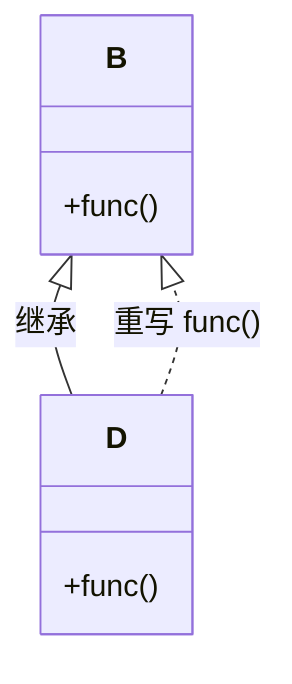

# 方法重载

<cite>
**本文档中引用的文件**  
- [Test.java](file://JavaSE_Level1/src/多态/demo3/Test.java)
</cite>

## 目录
1. [方法重载机制详解](#方法重载机制详解)  
2. [参数列表差异的判定规则](#参数列表差异的判定规则)  
3. [编译时静态绑定原理](#编译时静态绑定原理)  
4. [demo3中Test.java示例分析](#demo3中testjava示例分析)  
5. [重载与返回类型无关的特性](#重载与返回类型无关的特性)  
6. [自动类型转换对重载解析的影响](#自动类型转换对重载解析的影响)  
7. [字节码层面的调用指令分析](#字节码层面的调用指令分析)  
8. [重载与重写的本质区别](#重载与重写的本质区别)

## 方法重载机制详解

方法重载（Overloading）是Java中实现多态的一种形式，它允许在同一个类中定义多个同名方法，只要它们的参数列表不同即可。方法重载发生在编译期，是一种静态多态性。JVM在编译时根据方法调用时传入的实际参数类型、数量和顺序来决定调用哪一个具体的方法。

重载的核心在于**方法签名（Method Signature）** 的差异。方法签名由方法名和参数列表构成，不包括返回类型、访问修饰符或异常声明。因此，仅通过改变返回类型无法实现方法重载。

### 重载的基本条件
- 方法名必须相同  
- 参数列表必须不同（类型、数量或顺序）  
- 可以有不同的返回类型、访问修饰符和异常声明  
- 必须在同一个类中，或在子类中重载父类的方法（非覆盖）

## 参数列表差异的判定规则

Java通过以下三个维度来判断两个方法是否构成重载：

### 1. 参数数量不同
```java
public void print(int a) { }
public void print(int a, int b) { }
```
参数个数不同，构成重载。

### 2. 参数类型不同
```java
public void print(int a) { }
public void print(String a) { }
```
参数类型不同，构成重载。

### 3. 参数顺序不同
```java
public void print(int a, String b) { }
public void print(String a, int b) { }
```
参数顺序不同，构成重载。

**注意**：如果仅返回类型不同，则不构成重载，编译器会报错。

## 编译时静态绑定原理

方法重载的解析发生在**编译阶段**，称为静态绑定（Static Binding）或早期绑定。编译器在编译代码时，根据方法调用处的参数类型和数量，查找最匹配的重载方法，并将其方法引用写入字节码中。

由于绑定发生在编译期，因此重载方法的选择不依赖于运行时对象的实际类型，而只取决于引用类型和传入参数的编译时类型。

例如：
```java
void test(Object o) { System.out.println("Object"); }
void test(String s) { System.out.println("String"); }

test(null); // 输出 "String"，因为String比Object更具体
```

## demo3中Test.java示例分析

尽管`demo3/Test.java`文件的主要目的是演示构造函数中调用虚方法的“陷阱”，但它也间接展示了方法绑定机制，特别是重写（Override）而非重载（Overload）的行为。

```java
package 多态.demo3;

class B {
    public B() {
        func(); // 构造函数中调用func()
    }

    public void func() {
        System.out.println("B.fuc()...");
    }
}

class D extends B {
    private int num = 1;

    @Override
    public void func() {
        System.out.println("D.func()" + num);
    }
}

public class Test {
    public static void main(String[] args) {
        D d = new D(); // 先调用父类B的构造函数
    }
}
```

### 执行流程分析
1. 创建`D`对象时，先调用父类`B`的构造函数  
2. `B`的构造函数中调用`func()`方法  
3. 由于`D`类重写了`func()`，且此时对象类型为`D`，因此实际执行的是`D.func()`  
4. 此时`D`的成员变量`num`尚未初始化（仍为0），但输出时显示为0（Java默认初始化）

**输出结果**：
```
D.func()0
```

此示例并未展示方法重载，而是展示了**方法重写**和**动态绑定**的特性。它说明了在构造函数中调用可被重写的方法是危险的，因为子类的成员可能尚未初始化。

## 重载与返回类型无关的特性

Java明确规定：**仅返回类型不同的方法不能构成重载**。例如以下代码将导致编译错误：

```java
public int getValue() { return 1; }
public String getValue() { return "hello"; } // 编译错误！
```

编译器会报错：“方法已经定义”。这是因为方法签名不包含返回类型，JVM无法仅凭返回类型区分两个同名方法。

### 为什么返回类型不参与重载？
- 编译器无法仅从调用语句推断应调用哪个方法  
- 例如：`getValue();` 如果不接收返回值，编译器无法判断应调用哪个版本  
- 这会导致歧义，破坏语言的确定性

## 自动类型转换对重载解析的影响

当调用重载方法时，如果传入的参数类型与所有方法都不完全匹配，Java会按照一定的优先级进行自动类型转换来寻找最匹配的方法。匹配优先级如下：

1. **精确匹配**（Exact Match）  
2. **自动装箱/拆箱**（Autoboxing/Unboxing）  
3. **向上转型**（Widening Conversion）  
4. **可变参数**（Varargs）

### 示例
```java
public void print(int x) { System.out.println("int"); }
public void print(long x) { System.out.println("long"); }
public void print(float x) { System.out.println("float"); }
public void print(double x) { System.out.println("double"); }

print(100);     // 调用 int 版本（精确匹配）
print(100L);    // 调用 long 版本
print(100.0f);  // 调用 float 版本
print(100.0);   // 调用 double 版本
```

### 特殊情况：null值的重载解析
```java
public void print(String s) { }
public void print(Object o) { }

print(null); // 调用 String 版本，因为String更具体
```

## 字节码层面的调用指令分析

在Java字节码中，方法调用使用不同的指令来区分调用类型：

| 指令 | 用途 |
|------|------|
| `invokestatic` | 调用静态方法 |
| `invokevirtual` | 调用实例方法（虚方法，支持重写） |
| `invokeinterface` | 调用接口方法 |
| `invokespecial` | 调用私有方法、构造函数、父类方法 |

### 重载方法的字节码表现
重载方法在编译后，编译器会根据参数类型选择对应的方法引用，并生成`invokevirtual`或`invokestatic`指令。例如：

```java
print(10);      // 编译为 invokevirtual #method_ref_to_print_int
print("abc");   // 编译为 invokevirtual #method_ref_to_print_String
```

每个方法调用在字节码中都有一个唯一的方法引用常量，指向常量池中的方法符号。由于重载发生在编译期，因此字节码中直接指定了具体调用的方法，无需运行时查找。

## 重载与重写的本质区别

| 特性 | 方法重载（Overloading） | 方法重写（Overriding） |
|------|------------------------|------------------------|
| **发生位置** | 同一个类中 | 子类与父类之间 |
| **方法名** | 相同 | 相同 |
| **参数列表** | 必须不同 | 必须相同 |
| **返回类型** | 可以不同 | 必须相同或为协变返回类型 |
| **访问修饰符** | 可以不同 | 不能更严格（如private不能重写public） |
| **绑定时机** | 编译时静态绑定 | 运行时动态绑定 |
| **实现机制** | 通过方法签名区分 | 通过虚方法表（vtable）实现 |
| **关键字** | 无 | `@Override`（可选但推荐） |
| **多态类型** | 静态多态（编译时多态） | 动态多态（运行时多态） |

### 核心区别总结
- **重载是编译期行为**：编译器根据参数选择方法，字节码中直接写明调用哪个方法  
- **重写是运行期行为**：JVM根据对象的实际类型动态查找方法，通过`invokevirtual`指令实现  



**图示来源**  
- [Test.java](file://JavaSE_Level1/src/多态/demo3/Test.java#L2-L33)

**本节来源**  
- [Test.java](file://JavaSE_Level1/src/多态/demo3/Test.java#L2-L33)