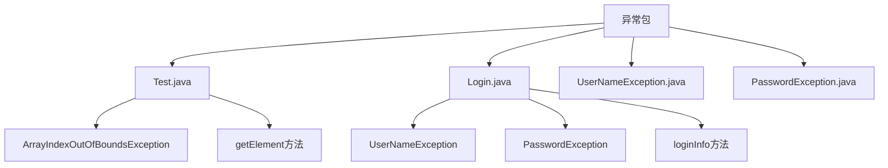
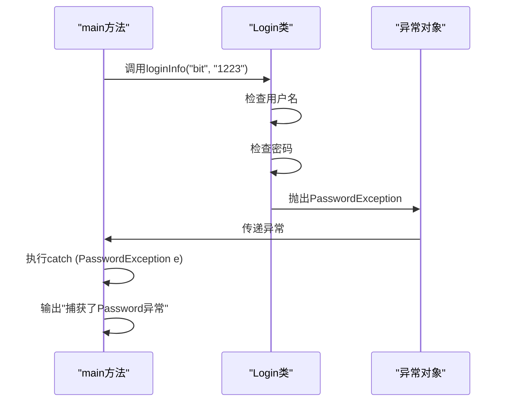
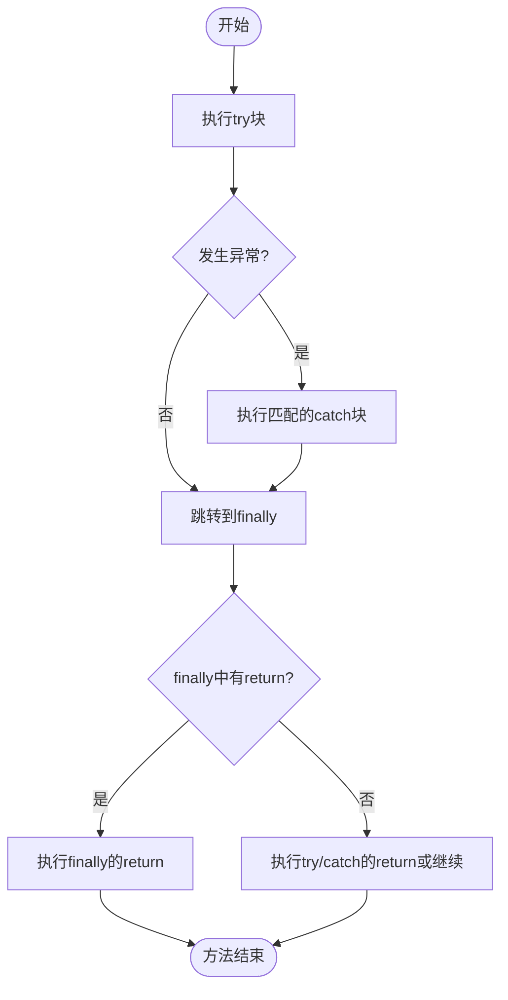

# try-catch-finally机制

<cite>
**本文档引用的文件**   
- [Test.java](file://JavaSE_Level1/src/异常/Test.java)
- [Login.java](file://JavaSE_Level1/src/异常/Login.java)
- [UserNameException.java](file://JavaSE_Level1/src/异常/UserNameException.java)
- [PasswordException.java](file://JavaSE_Level1/src/异常/PasswordException.java)
</cite>

## 目录
1. [引言](#引言)
2. [项目结构](#项目结构)
3. [核心组件](#核心组件)
4. [架构概述](#架构概述)
5. [详细组件分析](#详细组件分析)
6. [依赖分析](#依赖分析)
7. [性能考虑](#性能考虑)
8. [故障排除指南](#故障排除指南)
9. [结论](#结论)

## 引言
本文档深入解析Java中`try-catch-finally`语句块的工作机制，重点分析异常捕获流程、多`catch`块的匹配顺序、`finally`块的执行时机（包括`return`和异常情况下的行为）。通过分析`Test.java`和`Login.java`中的测试用例，展示异常被捕获后的程序控制流，解释资源清理逻辑的重要性，并探讨异常吞并与异常覆盖的风险。尽管本项目中未实际使用`finally`块，但文档将基于标准Java语义对其进行完整说明。

## 项目结构
项目`Java_learning`包含多个模块，其中与异常处理直接相关的代码位于`JavaSE_Level1/src/异常`包下。该目录包含`Test.java`、`Login.java`、`UserNameException.java`和`PasswordException.java`四个核心文件，构成了本次分析的基础。



**图示来源**
- [Test.java](file://JavaSE_Level1/src/异常/Test.java)
- [Login.java](file://JavaSE_Level1/src/异常/Login.java)

## 核心组件
本项目的核心异常处理组件包括：
- **Test.java**：演示了基本的`try-catch`异常捕获，通过数组越界操作触发`ArrayIndexOutOfBoundsException`。
- **Login.java**：展示了多`catch`块的使用，用于处理自定义的`UserNameException`和`PasswordException`。
- **自定义异常类**：`UserNameException`和`PasswordException`继承自`Exception`，用于表示特定的业务逻辑错误。

**组件来源**
- [Test.java](file://JavaSE_Level1/src/异常/Test.java#L1-L30)
- [Login.java](file://JavaSE_Level1/src/异常/Login.java#L1-L32)

## 架构概述
系统的异常处理架构基于Java标准的异常处理机制，采用分层的异常捕获策略。业务逻辑层（如`Login`类）抛出特定异常，调用层（如`main`方法）通过`try-catch`语句捕获并处理这些异常。



**图示来源**
- [Login.java](file://JavaSE_Level1/src/异常/Login.java#L20-L32)

## 详细组件分析

### 异常捕获流程分析
`Test.java`文件中的`main`方法演示了最基本的异常捕获流程。当程序试图访问数组的第7个元素（索引为6）时，由于数组只有5个元素，JVM会抛出`ArrayIndexOutOfBoundsException`。`try`块内的代码一旦发生异常，其后的代码将不再执行，控制权立即转移给匹配的`catch`块。

```java
try {
    int[] array = {1, 2, 3, 4, 5};
    array[6] = 100; // 此行抛出异常
    System.out.println("这行不会被执行"); // 异常后代码被跳过
} catch (ArrayIndexOutOfBoundsException e) {
    System.out.println("捕获了数组下标越界异常");
    e.printStackTrace();
}
```

**组件来源**
- [Test.java](file://JavaSE_Level1/src/异常/Test.java#L5-L12)

### 多catch块匹配顺序
`Login.java`文件展示了多`catch`块的使用。当`loginInfo`方法检测到用户名或密码错误时，会分别抛出`UserNameException`或`PasswordException`。`try`语句后的`catch`块按顺序匹配异常类型。

```java
try {
    login.loginInfo("bit", "1223");
} catch (UserNameException e) {
    System.out.println("捕获了User异常");
} catch (PasswordException e) {
    System.out.println("捕获了Password异常");
}
```

**匹配规则**：
1. 异常按`catch`块的声明顺序进行匹配。
2. 一旦找到匹配的`catch`块，后续的`catch`块将被忽略。
3. 如果异常类型是某个`catch`参数的子类，则该`catch`块可以捕获该异常。
4. 应将更具体的异常类型放在前面，更通用的放在后面，以避免“遮蔽”问题。

**组件来源**
- [Login.java](file://JavaSE_Level1/src/异常/Login.java#L23-L29)

### finally块执行时机（理论说明）
尽管本项目代码中未使用`finally`块，但根据Java语言规范，`finally`块是`try-catch`语句的重要组成部分，用于确保某些代码无论是否发生异常都会执行，常用于资源清理（如关闭文件、数据库连接等）。

**执行规则**：
- `finally`块在`try`块或`catch`块执行完毕后立即执行。
- 即使`try`或`catch`块中有`return`语句，`finally`块也会在方法返回前执行。
- 如果`finally`块中也有`return`语句，它将覆盖`try`或`catch`块中的`return`值，这是一种危险的“异常覆盖”行为。



**图示来源**
- [Login.java](file://JavaSE_Level1/src/异常/Login.java)
- [Test.java](file://JavaSE_Level1/src/异常/Test.java)

## 依赖分析
异常处理组件之间的依赖关系清晰。`Login`类依赖于两个自定义异常类`UserNameException`和`PasswordException`。`main`方法作为调用者，依赖于`Login`类及其抛出的异常类型。

```mermaid
classDiagram
class Login {
+String username
+String password
+loginInfo(String, String) void
}
class UserNameException {
}
class PasswordException {
}
Login --> UserNameException : "抛出"
Login --> PasswordException : "抛出"
Login : "main" ..> Login : "创建实例"
Login : "main" ..> UserNameException : "捕获"
Login : "main" ..> PasswordException : "捕获"
```

**图示来源**
- [Login.java](file://JavaSE_Level1/src/异常/Login.java#L1-L32)
- [UserNameException.java](file://JavaSE_Level1/src/异常/UserNameException.java#L1-L4)
- [PasswordException.java](file://JavaSE_Level1/src/异常/PasswordException.java#L1-L4)

## 性能考虑
异常处理机制本身有性能开销。抛出和捕获异常比正常的条件判断和流程控制要慢得多，因为需要生成堆栈跟踪信息。因此，异常不应作为常规的程序控制流手段。

**最佳实践**：
- 使用异常处理**异常**情况，而非预期的逻辑分支。
- 避免在循环中频繁抛出和捕获异常。
- 对于可预见的错误（如用户输入验证），优先使用`if-else`等条件判断。

## 故障排除指南
### 常见问题1：异常未被捕获
如果抛出的异常没有被任何`catch`块捕获，程序将终止并打印堆栈跟踪。确保`catch`块的异常类型与抛出的异常类型匹配，或使用父类异常（如`Exception`）进行捕获。

### 常见问题2：多catch块顺序错误
将通用的异常类型（如`Exception`）放在具体的异常类型（如`ArrayIndexOutOfBoundsException`）之前，会导致具体的`catch`块永远无法到达。应始终将更具体的异常放在前面。

### 常见问题3：finally块中的return语句
`finally`块中的`return`会覆盖`try`或`catch`块中的`return`，导致难以追踪的逻辑错误。应避免在`finally`块中使用`return`、`break`或`continue`。

**组件来源**
- [Test.java](file://JavaSE_Level1/src/异常/Test.java#L5-L12)
- [Login.java](file://JavaSE_Level1/src/异常/Login.java#L23-L29)

## 结论
`try-catch-finally`是Java中处理运行时错误的核心机制。`try`块定义了可能出错的代码区域，`catch`块按顺序匹配并处理特定类型的异常，而`finally`块则确保关键的清理代码得以执行。本项目通过`Test.java`和`Login.java`展示了基本的`try-catch`用法和多`catch`块的匹配逻辑。虽然缺少`finally`块的实际示例，但其在资源管理和异常安全中的重要性不容忽视。开发者应合理使用异常处理，避免性能损耗和逻辑陷阱。