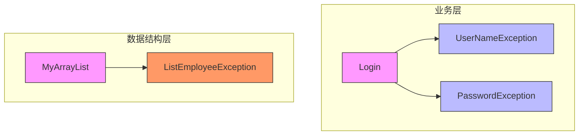
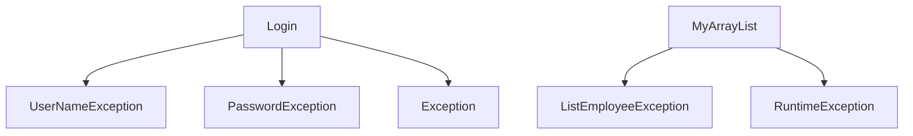

# 异常分类

<cite>
**本文档中引用的文件**   
- [UserNameException.java](file://JavaSE_Level1\src\异常\UserNameException.java)
- [PasswordException.java](file://JavaSE_Level1\src\异常\PasswordException.java)
- [Login.java](file://JavaSE_Level1\src\异常\Login.java)
- [Test.java](file://JavaSE_Level1\src\异常\Test.java)
- [ListEmployeeException.java](file://JavaDataStructure_Level2\src\List\ListEmployeeException.java)
- [MyArrayList.java](file://JavaDataStructure_Level2\src\List\MyArrayList.java)
</cite>

## 目录
1. [引言](#引言)
2. [项目结构](#项目结构)
3. [核心组件](#核心组件)
4. [架构概述](#架构概述)
5. [详细组件分析](#详细组件分析)
6. [依赖分析](#依赖分析)
7. [性能考虑](#性能考虑)
8. [故障排除指南](#故障排除指南)
9. [结论](#结论)

## 引言
本文档旨在深入解析Java中的异常分类体系，重点讲解检查异常（Checked Exception）与非检查异常（Unchecked Exception）的区别、应用场景及其对API设计的影响。通过分析`UserNameException`和`PasswordException`两个自定义检查异常类，以及`ListEmployeeException`这一运行时异常的实际使用案例，全面阐述Java异常处理机制的设计原则与实践方法。文档结合具体代码示例，帮助开发者理解如何合理选择和设计异常类型，以构建健壮且易于维护的软件系统。

## 项目结构
本项目包含多个模块，主要分为数据结构实现（JavaDataStructure_Level2）和基础语法练习（JavaSE_Level1）。与异常处理直接相关的代码位于`JavaSE_Level1\src\异常`目录下，包括自定义异常类和业务逻辑类。此外，在`JavaDataStructure_Level2\src\List`包中也存在运行时异常的使用实例。

```mermaid
graph TD
subgraph "异常处理模块"
A["异常/UserNameException.java"]
B["异常/PasswordException.java"]
C["异常/Login.java"]
D["异常/Test.java"]
end
subgraph "数据结构模块"
E["List/ListEmployeeException.java"]
F["List/MyArrayList.java"]
end
C --> A : "抛出"
C --> B : "抛出"
F --> E : "抛出"
```

**图示来源**
- [UserNameException.java](file://JavaSE_Level1\src\异常\UserNameException.java#L1-L5)
- [PasswordException.java](file://JavaSE_Level1\src\异常\PasswordException.java#L1-L5)
- [Login.java](file://JavaSE_Level1\src\异常\Login.java#L1-L32)
- [ListEmployeeException.java](file://JavaDataStructure_Level2\src\List\ListEmployeeException.java#L1-L20)
- [MyArrayList.java](file://JavaDataStructure_Level2\src\List\MyArrayList.java#L1-L131)

## 核心组件
本项目的核心异常处理组件包括两类：用于业务验证的检查异常（`UserNameException`, `PasswordException`）和用于数据结构操作的非检查异常（`ListEmployeeException`）。前者强制调用者在编译期处理错误，适用于可恢复的业务场景；后者则用于表示程序逻辑错误或非法状态，由JVM自动传播，无需显式声明。

**组件来源**
- [UserNameException.java](file://JavaSE_Level1\src\异常\UserNameException.java#L1-L5)
- [PasswordException.java](file://JavaSE_Level1\src\异常\PasswordException.java#L1-L5)
- [ListEmployeeException.java](file://JavaDataStructure_Level2\src\List\ListEmployeeException.java#L1-L20)

## 架构概述
系统的异常处理架构分为两个层次：上层业务逻辑采用检查异常进行精确的错误分类与强制处理，确保调用方必须应对特定的业务失败情况；底层数据结构则采用运行时异常来处理非法参数或内部状态错误，简化API接口并提高代码简洁性。



**图示来源**
- [Login.java](file://JavaSE_Level1\src\异常\Login.java#L1-L32)
- [MyArrayList.java](file://JavaDataStructure_Level2\src\List\MyArrayList.java#L1-L131)

## 详细组件分析

### 检查异常分析
`UserNameException`和`PasswordException`是典型的检查异常，它们直接继承自`Exception`类，而非`RuntimeException`。这种设计强制调用`loginInfo`方法的代码必须使用try-catch块或在方法签名中声明`throws`，从而确保开发者不会忽略这些重要的业务错误。

#### 自定义检查异常类
```java
public class UserNameException extends Exception {
}
```
此类没有添加任何额外字段或方法，仅作为类型标识存在，用于在登录失败时区分用户名错误和密码错误。

```java
public class PasswordException extends Exception {
}
```
同上，简洁明了地表达了密码验证失败这一特定异常情况。

#### 业务逻辑中的异常抛出
在`Login`类的`loginInfo`方法中，当用户名或密码不匹配时，会分别抛出对应的异常：
```java
public void loginInfo(String username, String password) throws UserNameException, PasswordException {
    if (!this.username.equals(username)) {
        throw new UserNameException();
    }
    if (!this.password.equals(password)) {
        throw new PasswordException();
    }
    System.out.println("登录成功！");
}
```
该方法通过`throws`关键字声明了可能抛出的异常类型，编译器会强制调用者处理这些异常。

#### 异常处理示例
```java
public static void main(String[] args) {
    Login login = new Login();
    try {
        login.loginInfo("bit", "1223");
    } catch (UserNameException e) {
        System.out.println("捕获了User异常");
    } catch (PasswordException e) {
        System.out.println("捕获了Password异常");
    }
}
```
主方法中使用了多catch块来分别处理不同类型的异常，体现了检查异常在错误分类上的优势。

**图示来源**
- [UserNameException.java](file://JavaSE_Level1\src\异常\UserNameException.java#L1-L5)
- [PasswordException.java](file://JavaSE_Level1\src\异常\PasswordException.java#L1-L5)
- [Login.java](file://JavaSE_Level1\src\异常\Login.java#L1-L32)

**组件来源**
- [UserNameException.java](file://JavaSE_Level1\src\异常\UserNameException.java#L1-L5)
- [PasswordException.java](file://JavaSE_Level1\src\异常\PasswordException.java#L1-L5)
- [Login.java](file://JavaSE_Level1\src\异常\Login.java#L1-L32)

### 非检查异常分析
`ListEmployeeException`是运行时异常的一个实例，它继承自`RuntimeException`，用于在数据结构操作中报告错误，如访问空列表或删除不存在的元素。

#### 自定义运行时异常类
```java
public class ListEmployeeException extends RuntimeException {
    public ListEmployeeException() {
        super();
    }

    public ListEmployeeException(String message) {
        super(message);
    }

    public ListEmployeeException(String message, Throwable cause) {
        super(message, cause);
    }

    public ListEmployeeException(Throwable cause) {
        super(cause);
    }
}
```
此类提供了完整的构造函数重载，支持传递消息、原因等信息，增强了调试能力。

#### 数据结构中的异常使用
在`MyArrayList`类中，`get`方法在列表为空时抛出`ListEmployeeException`：
```java
@Override
public int get(int pos) {
    if(isEmpty()){
        throw new ListEmployeeException("获取元素为空");
    }
    checkPos(pos);
    return elem[pos];
}
```
同时，`checkPos`方法在位置非法时直接抛出`RuntimeException`：
```java
private void checkPos(int pos) {
    if (pos < 0 || pos > usedSize) {
        throw new RuntimeException("pos位置不合法:" + pos);
    }
}
```
这表明对于参数验证错误，开发者选择了最简化的运行时异常处理方式。

**图示来源**
- [ListEmployeeException.java](file://JavaDataStructure_Level2\src\List\ListEmployeeException.java#L1-L20)
- [MyArrayList.java](file://JavaDataStructure_Level2\src\List\MyArrayList.java#L1-L131)

**组件来源**
- [ListEmployeeException.java](file://JavaDataStructure_Level2\src\List\ListEmployeeException.java#L1-L20)
- [MyArrayList.java](file://JavaDataStructure_Level2\src\List\MyArrayList.java#L1-L131)

## 依赖分析
异常类与其使用方之间存在明确的依赖关系。`Login`类依赖于`UserNameException`和`PasswordException`，而`MyArrayList`类依赖于`ListEmployeeException`。这些依赖均为编译期依赖，对于检查异常而言尤为关键，因为它们直接影响方法签名和调用约定。



**图示来源**
- [Login.java](file://JavaSE_Level1\src\异常\Login.java#L1-L32)
- [UserNameException.java](file://JavaSE_Level1\src\异常\UserNameException.java#L1-L5)
- [PasswordException.java](file://JavaSE_Level1\src\异常\PasswordException.java#L1-L5)
- [MyArrayList.java](file://JavaDataStructure_Level2\src\List\MyArrayList.java#L1-L131)
- [ListEmployeeException.java](file://JavaDataStructure_Level2\src\List\ListEmployeeException.java#L1-L20)

## 性能考虑
从性能角度看，异常仅在错误发生时创建和抛出，正常执行路径不受影响。检查异常与非检查异常在运行时性能上没有区别，差异仅存在于编译期检查。因此，选择异常类型应基于设计意图而非性能考量。过度使用异常进行流程控制（如用`ArrayIndexOutOfBoundsException`代替边界检查）会导致性能下降，应避免。

## 故障排除指南
### 常见异常问题
1. **未处理的检查异常**：编译失败，提示“Unhandled exception”。解决方法：添加try-catch块或在方法上声明throws。
2. **运行时异常频繁抛出**：可能表示程序存在逻辑错误。应通过单元测试提前发现并修复。
3. **异常信息不明确**：建议在抛出异常时提供详细的错误消息，便于调试。

### 调试技巧
- 使用`printStackTrace()`查看完整的调用栈。
- 在IDE中设置异常断点，当特定异常被抛出时自动暂停执行。
- 对于`NullPointerException`等常见运行时异常，检查所有引用变量是否已正确初始化。

**组件来源**
- [Test.java](file://JavaSE_Level1\src\异常\Test.java#L1-L30)
- [MyArrayList.java](file://JavaDataStructure_Level2\src\List\MyArrayList.java#L1-L131)

## 结论
Java的异常体系通过检查异常和非检查异常的划分，为开发者提供了灵活的错误处理机制。`UserNameException`和`PasswordException`作为检查异常的范例，强制调用者正视并处理业务层面的可预见错误，提高了程序的健壮性。而`ListEmployeeException`和直接抛出的`RuntimeException`则体现了运行时异常在简化API、处理编程错误方面的优势。合理的异常设计应遵循：可恢复的、业务相关的错误使用检查异常；程序逻辑错误、非法状态使用运行时异常。这种分层策略有助于构建清晰、可靠且易于维护的Java应用程序。