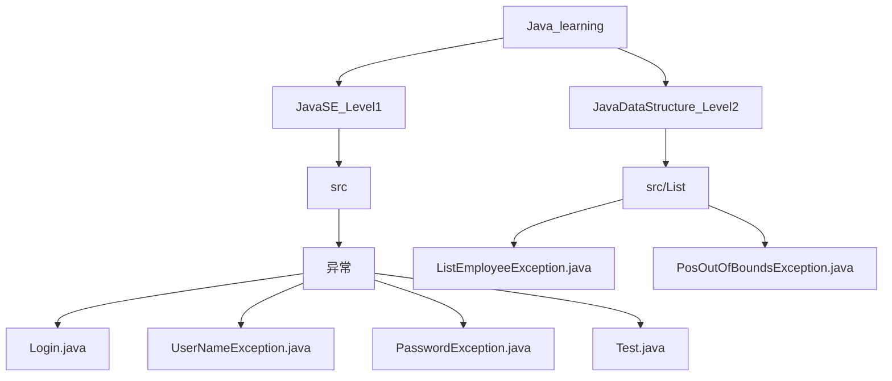
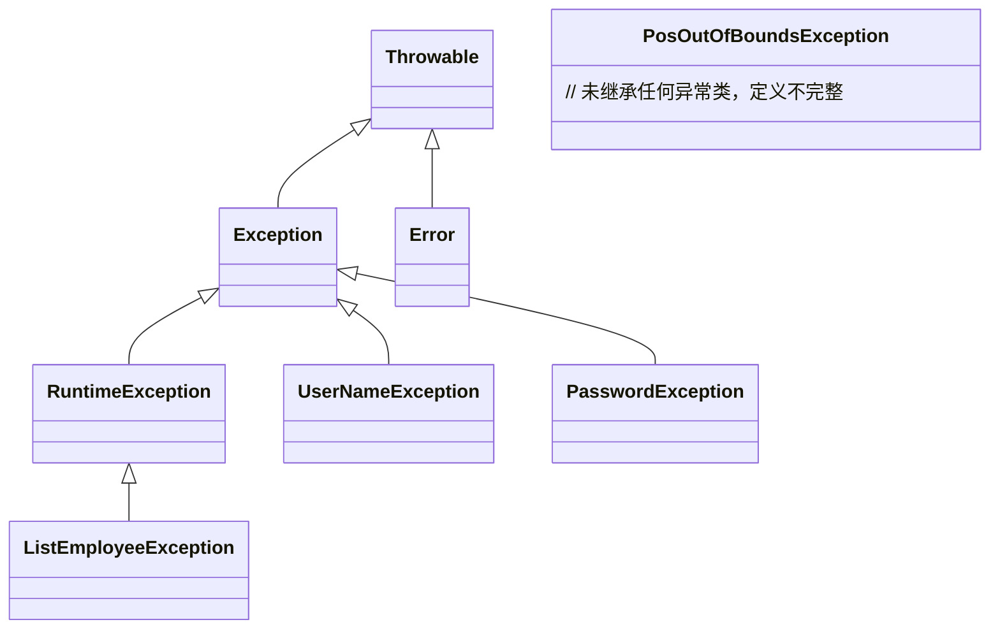
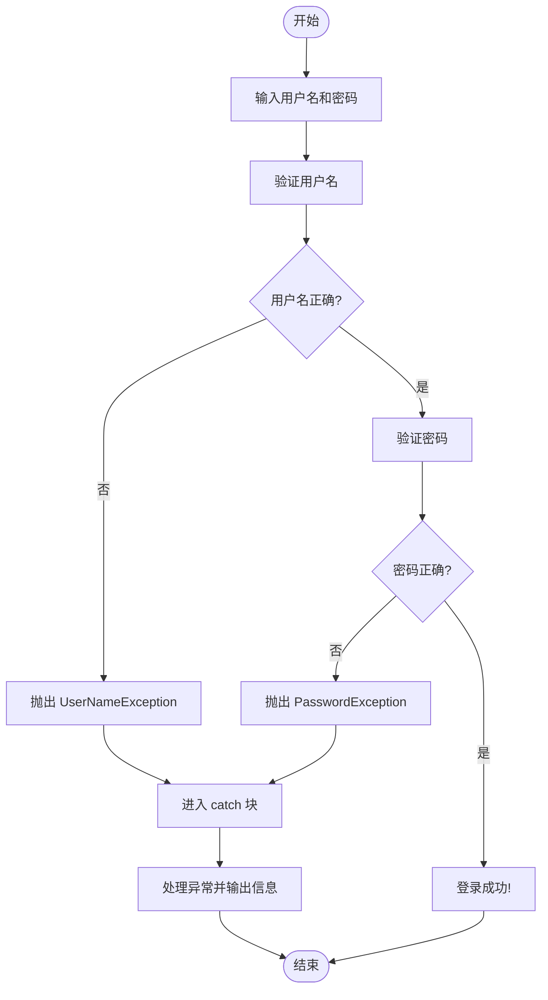
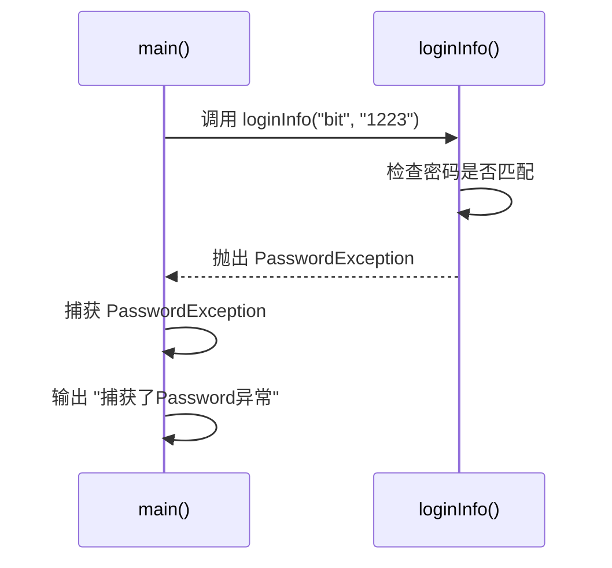
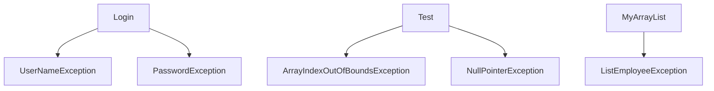

# 异常处理

<cite>
**本文档中引用的文件**   
- [Login.java](file://JavaSE_Level1/src/异常/Login.java)
- [UserNameException.java](file://JavaSE_Level1/src/异常/UserNameException.java)
- [PasswordException.java](file://JavaSE_Level1/src/异常/PasswordException.java)
- [Test.java](file://JavaSE_Level1/src/异常/Test.java)
- [ListEmployeeException.java](file://JavaDataStructure_Level2/src/List/ListEmployeeException.java)
- [PosOutOfBoundsException.java](file://JavaDataStructure_Level2/src/List/PosOutOfBoundsException.java)
</cite>

## 目录
1. [简介](#简介)
2. [项目结构](#项目结构)
3. [核心组件](#核心组件)
4. [架构概述](#架构概述)
5. [详细组件分析](#详细组件分析)
6. [依赖分析](#依赖分析)
7. [性能考虑](#性能考虑)
8. [故障排除指南](#故障排除指南)
9. [结论](#结论)

## 简介
本文档详细讲解Java中的异常处理机制，涵盖`try-catch-finally`语句块的使用、异常传播机制、异常分类（检查异常 vs 非检查异常），并通过一个登录系统示例展示如何创建和抛出自定义异常（如`UserNameException`和`PasswordException`）。同时，分析异常处理的最佳实践，包括异常链、资源管理（`try-with-resources`）、堆栈跟踪分析，并讨论异常对程序健壮性的影响。所有内容均基于实际代码库中的实现进行说明。

## 项目结构
本项目位于``目录下，主要包含多个Java学习模块。与异常处理直接相关的代码位于`JavaSE_Level1/src/异常`目录中，包括`Login.java`、`UserNameException.java`、`PasswordException.java`和`Test.java`四个文件。此外，在`JavaDataStructure_Level2/src/List`目录中也存在一些自定义异常类，用于数据结构操作中的错误处理。



**图示来源**
- [Login.java](file://JavaSE_Level1/src/异常/Login.java)
- [Test.java](file://JavaSE_Level1/src/异常/Test.java)
- [ListEmployeeException.java](file://JavaDataStructure_Level2/src/List/ListEmployeeException.java)

## 核心组件
本节分析与异常处理相关的核心Java类及其功能。

### Login类
`Login`类模拟了一个简单的用户登录系统，通过比较输入的用户名和密码与预设值来判断是否登录成功。若不匹配，则抛出相应的自定义异常。

### 自定义异常类
- `UserNameException`：当用户名错误时抛出。
- `PasswordException`：当密码错误时抛出。
- `ListEmployeeException`：在列表操作中用于表示员工相关的运行时异常。
- `PosOutOfBoundsException`：表示位置越界，但当前实现不完整。

**组件来源**
- [Login.java](file://JavaSE_Level1/src/异常/Login.java#L1-L32)
- [UserNameException.java](file://JavaSE_Level1/src/异常/UserNameException.java#L1-L5)
- [PasswordException.java](file://JavaSE_Level1/src/异常/PasswordException.java#L1-L5)

## 架构概述
Java的异常处理机制基于`Throwable`类，其子类包括`Error`和`Exception`。`Exception`又分为检查异常（checked exceptions）和非检查异常（unchecked exceptions，即`RuntimeException`及其子类）。

在本项目中，`UserNameException`和`PasswordException`继承自`Exception`，属于检查异常，必须在方法签名中声明或捕获。而`ListEmployeeException`继承自`RuntimeException`，属于非检查异常，可不强制处理。



**图示来源**
- [UserNameException.java](file://JavaSE_Level1/src/异常/UserNameException.java#L1-L5)
- [PasswordException.java](file://JavaSE_Level1/src/异常/PasswordException.java#L1-L5)
- [ListEmployeeException.java](file://JavaDataStructure_Level2/src/List/ListEmployeeException.java#L1-L20)
- [PosOutOfBoundsException.java](file://JavaDataStructure_Level2/src/List/PosOutOfBoundsException.java#L1-L7)

## 详细组件分析

### Login系统中的异常处理流程
该系统通过`loginInfo`方法验证用户凭据。如果用户名或密码错误，将分别抛出`UserNameException`或`PasswordException`。调用方必须使用`try-catch`块来处理这些异常。

#### 异常处理流程图


**图示来源**
- [Login.java](file://JavaSE_Level1/src/异常/Login.java#L9-L14)

### 自定义异常的创建与抛出
Java允许开发者通过继承`Exception`或`RuntimeException`来创建自定义异常。

#### UserNameException 和 PasswordException
这两个类非常简单，仅继承了`Exception`类，没有添加额外字段或方法。这表明它们仅用于标识特定类型的错误条件。

```java
public class UserNameException extends Exception {}
public class PasswordException extends Exception {}
```

**代码来源**
- [UserNameException.java](file://JavaSE_Level1/src/异常/UserNameException.java#L1-L5)
- [PasswordException.java](file://JavaSE_Level1/src/异常/PasswordException.java#L1-L5)

#### ListEmployeeException
此异常继承自`RuntimeException`，并提供了多个构造函数，支持传递消息、原因等，增强了异常信息的丰富性。

```java
public class ListEmployeeException extends RuntimeException {
    public ListEmployeeException() { super(); }
    public ListEmployeeException(String message) { super(message); }
    public ListEmployeeException(String message, Throwable cause) { super(message, cause); }
    public ListEmployeeException(Throwable cause) { super(cause); }
}
```

**代码来源**
- [ListEmployeeException.java](file://JavaDataStructure_Level2/src/List/ListEmployeeException.java#L1-L20)

### try-catch-finally 语句块的使用
`try-catch`用于捕获和处理异常，`finally`块则无论是否发生异常都会执行，常用于资源清理。

#### 示例：数组越界异常处理
在`Test.java`中演示了如何捕获`ArrayIndexOutOfBoundsException`：

```java
try {
    int[] array = {1, 2, 3, 4, 5};
    array[6] = 100;
} catch (ArrayIndexOutOfBoundsException e) {
    System.out.println("捕获了数组下标越界异常");
    e.printStackTrace();
}
```

此代码尝试访问索引6，超出数组范围，触发异常并被`catch`块捕获，同时打印堆栈跟踪。

**代码来源**
- [Test.java](file://JavaSE_Level1/src/异常/Test.java#L5-L8)

### 异常传播机制
当一个方法抛出异常而未被捕获时，该异常会向调用栈的上层传播，直到被某个`catch`块处理或导致程序终止。

在`Login.main`方法中，调用`loginInfo`时可能发生异常，但由于外层有`try-catch`，因此异常被拦截并处理，程序继续运行。



**图示来源**
- [Login.java](file://JavaSE_Level1/src/异常/Login.java#L23-L29)

## 依赖分析
通过分析代码依赖关系，可以看出异常类被其他业务类所依赖，体现了“抛出-捕获”模式。



**图示来源**
- [Login.java](file://JavaSE_Level1/src/异常/Login.java)
- [Test.java](file://JavaSE_Level1/src/异常/Test.java)
- [MyArrayList.java](file://JavaDataStructure_Level2/src/List/MyArrayList.java)

## 性能考虑
异常处理本身有一定开销，尤其是在频繁抛出和捕获异常的情况下。堆栈跟踪的生成会消耗CPU和内存资源。因此，异常应仅用于异常情况，而不应用于控制正常程序流程。

例如，在`getElement`方法中，使用异常来处理边界检查是合理的，但如果在循环中频繁触发，则应考虑提前验证输入以避免性能下降。

```java
public static int getElement(int[] array, int index) {
    if (null == array) {
        throw new NullPointerException("传递的数组为null");
    }
    if (index < 0 || index >= array.length) {
        throw new ArrayIndexOutOfBoundsException("传递的数组下标越界");
    }
    return array[index];
}
```

**代码来源**
- [Test.java](file://JavaSE_Level1/src/异常/Test.java#L15-L18)

## 故障排除指南
### 常见异常类型及解决方法
| 异常类型 | 原因 | 解决方案 |
|--------|------|---------|
| `UserNameException` | 用户名不匹配 | 检查输入用户名是否正确 |
| `PasswordException` | 密码不匹配 | 检查输入密码是否正确 |
| `ArrayIndexOutOfBoundsException` | 数组索引越界 | 确保索引在有效范围内 |
| `NullPointerException` | 访问空对象成员 | 在访问前检查对象是否为null |

### 堆栈跟踪分析
当异常发生时，调用`e.printStackTrace()`可以输出完整的调用栈，帮助定位问题源头。例如：
```
java.lang.ArrayIndexOutOfBoundsException: 传递的数组下标越界
    at 异常.Test.getElement(Test.java:18)
    at 异常.Test.main1(Test.java:25)
    at 异常.Test.main(Test.java:5)
```
该信息表明异常起源于`Test.java`第18行，在`getElement`方法中抛出。

**代码来源**
- [Test.java](file://JavaSE_Level1/src/异常/Test.java#L8)

## 结论
Java的异常处理机制是保障程序健壮性和可维护性的关键。通过合理使用`try-catch-finally`、定义清晰的自定义异常、遵循异常分类原则（检查异常 vs 非检查异常），可以有效管理程序中的错误状态。在本项目中，`Login`系统展示了如何通过自定义异常实现清晰的错误反馈，而`ListEmployeeException`则体现了运行时异常的灵活用法。最佳实践建议避免滥用异常作为控制流，并确保关键资源在`finally`块或`try-with-resources`中得到妥善管理。