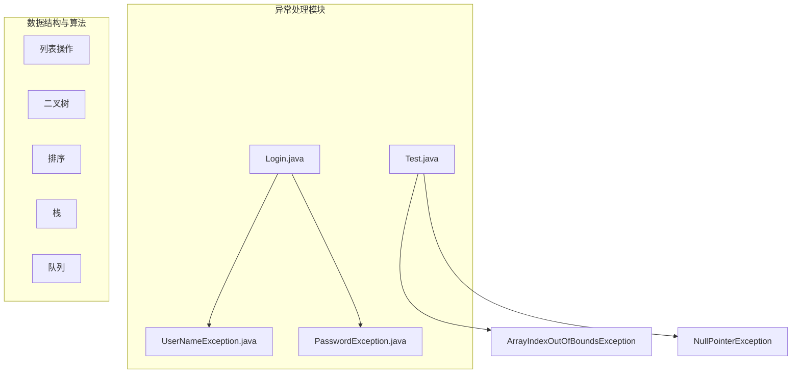
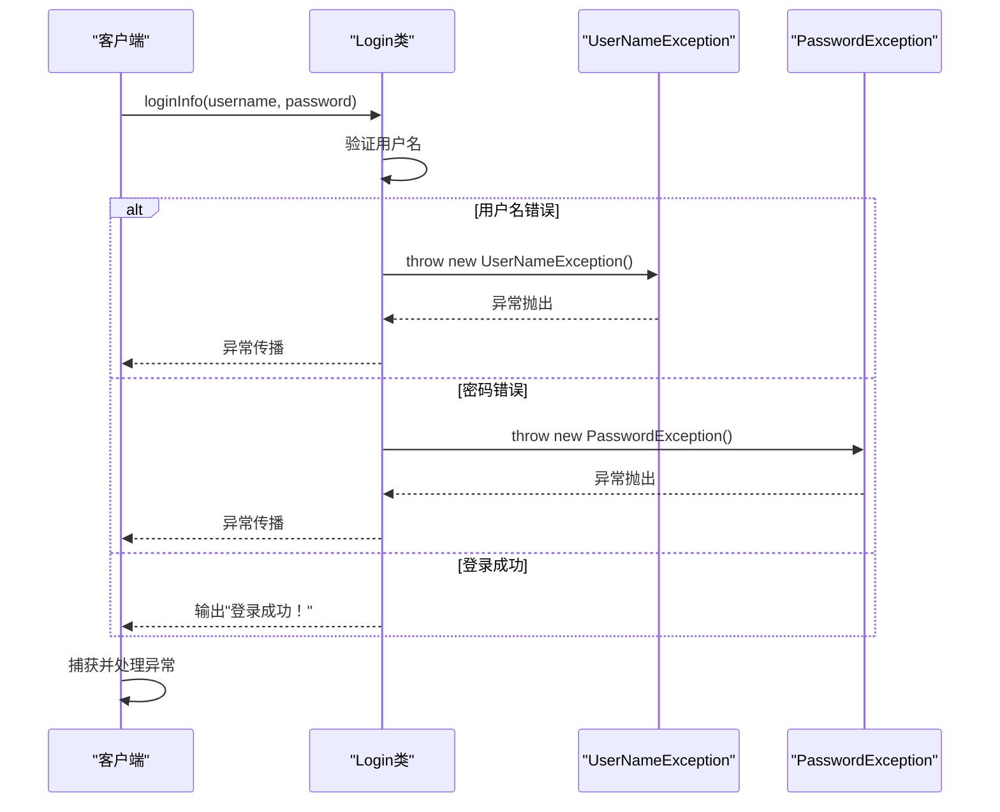

# 异常处理最佳实践

<cite>
**本文档引用的文件**   
- [Login.java](file://JavaSE_Level1/src/异常/Login.java)
- [UserNameException.java](file://JavaSE_Level1/src/异常/UserNameException.java)
- [PasswordException.java](file://JavaSE_Level1/src/异常/PasswordException.java)
- [Test.java](file://JavaSE_Level1/src/异常/Test.java)
- [ListEmployeeException.java](file://JavaDataStructure_Level2/src/List/ListEmployeeException.java)
</cite>

## 目录
1. [简介](#简介)
2. [项目结构](#项目结构)
3. [核心组件分析](#核心组件分析)
4. [异常处理最佳实践原则](#异常处理最佳实践原则)
5. [登录系统中的异常传播路径分析](#登录系统中的异常传播路径分析)
6. [异常链与构造函数使用](#异常链与构造函数使用)
7. [避免空catch块](#避免空catch块)
8. [合理选择异常类型](#合理选择异常类型)
9. [保持异常信息清晰可读](#保持异常信息清晰可读)
10. [try-with-resources在现代Java中的优势](#try-with-resources在现代java中的优势)
11. [资源管理改进建议](#资源管理改进建议)
12. [结论](#结论)

## 简介
本文档旨在总结Java异常处理的最佳实践，结合项目中实际存在的代码示例，深入探讨如何在多层调用中优雅地处理和转换异常。通过分析`Login`系统的异常机制，展示自定义异常的设计与使用，并讨论现代Java中`try-with-resources`语句的重要性。尽管当前项目未广泛采用该特性，但我们将指出潜在的可改进资源管理场景。

## 项目结构
本项目包含多个模块，涵盖数据结构、算法、面向对象编程基础及异常处理等内容。异常处理相关代码主要集中在`JavaSE_Level1/src/异常`目录下，包括登录验证逻辑和基本异常测试用例。



**图示来源**
- [Login.java](file://JavaSE_Level1/src/异常/Login.java)
- [Test.java](file://JavaSE_Level1/src/异常/Test.java)

## 核心组件分析
项目中的异常处理核心组件包括：
- `Login`类：实现用户登录逻辑，抛出特定业务异常。
- `UserNameException`和`PasswordException`：自定义检查型异常，用于标识认证失败原因。
- `Test`类：演示常见运行时异常的捕获与处理。

这些组件共同构成了一个简单的异常处理模型，展示了从异常抛出到捕获的完整流程。

**本节来源**
- [Login.java](file://JavaSE_Level1/src/异常/Login.java#L1-L32)
- [Test.java](file://JavaSE_Level1/src/异常/Test.java#L1-L30)

## 异常处理最佳实践原则
良好的异常处理应遵循以下原则：
- **使用异常链传递根本原因**：利用`initCause()`或带`Throwable`参数的构造函数保留原始异常信息。
- **避免空catch块**：必须对捕获的异常进行适当处理或记录。
- **合理选择异常类型**：根据是否需要强制处理选择检查型（checked）或非检查型（unchecked）异常。
- **保持异常信息清晰可读**：提供有意义的错误消息，便于调试和维护。

## 登录系统中的异常传播路径分析
在`Login`系统中，异常传播路径如下：



**图示来源**
- [Login.java](file://JavaSE_Level1/src/异常/Login.java#L10-L22)

**本节来源**
- [Login.java](file://JavaSE_Level1/src/异常/Login.java#L1-L32)

## 异常链与构造函数使用
异常链允许将一个异常包装为另一个异常，同时保留原始异常信息。Java提供了两种方式：
1. 使用`initCause()`方法
2. 使用带`Throwable cause`参数的构造函数

在本项目中，`ListEmployeeException`类完整实现了四种构造函数，支持异常链传递：

```java
public class ListEmployeeException extends RuntimeException {
    public ListEmployeeException() {
        super();
    }

    public ListEmployeeException(String message) {
        super(message);
    }

    public ListEmployeeException(String message, Throwable cause) {
        super(message, cause);
    }

    public ListEmployeeException(Throwable cause) {
        super(cause);
    }
}
```

这种设计使得上层调用者可以追溯异常的根本原因，提升调试效率。

**本节来源**
- [ListEmployeeException.java](file://JavaDataStructure_Level2/src/List/ListEmployeeException.java#L1-L18)

## 避免空catch块
空catch块会掩盖问题，导致难以发现和修复错误。正确的做法是至少记录日志或重新抛出异常。

在`Test.java`中，虽然没有空catch块，但其处理方式仍可优化：

```java
try {
    array[6] = 100;
} catch (ArrayIndexOutOfBoundsException e) {
    System.out.println("捕获了数组下标越界异常");
    e.printStackTrace(); // 建议使用日志框架替代
}
```

建议使用日志框架（如Log4j、SLF4J）替代`System.out.println`和`printStackTrace()`，以便更好地控制输出格式和目标。

**本节来源**
- [Test.java](file://JavaSE_Level1/src/异常/Test.java#L5-L9)

## 合理选择异常类型
Java异常分为两类：
- **检查型异常（Checked Exception）**：必须显式处理，如`IOException`、`SQLException`。
- **非检查型异常（Unchecked Exception）**：继承自`RuntimeException`，可选择性处理。

在本项目中：
- `UserNameException`和`PasswordException`继承自`Exception`，属于检查型异常，强制调用者处理。
- `ListEmployeeException`继承自`RuntimeException`，属于非检查型异常，适用于编程错误或不可恢复状态。

对于业务逻辑错误（如登录失败），使用检查型异常有助于确保调用方正确处理各种失败情况。

**本节来源**
- [UserNameException.java](file://JavaSE_Level1/src/异常/UserNameException.java)
- [PasswordException.java](file://JavaSE_Level1/src/异常/PasswordException.java)
- [ListEmployeeException.java](file://JavaDataStructure_Level2/src/List/ListEmployeeException.java)

## 保持异常信息清晰可读
清晰的异常信息能显著提高调试效率。应在抛出异常时提供具体上下文信息。

当前项目中的自定义异常未提供详细消息，建议改进：

```java
// 改进前
throw new UserNameException();

// 改进后
throw new UserNameException("用户名不匹配: 输入=" + username + ", 期望=" + this.username);
```

同时，在`getElement`方法中已正确使用带消息的异常构造函数：

```java
throw new NullPointerException("传递的数组为null");
throw new ArrayIndexOutOfBoundsException("传递的数组下标越界");
```

这种做法值得推广至所有异常抛出处。

**本节来源**
- [Test.java](file://JavaSE_Level1/src/异常/Test.java#L12-L15)

## try-with-resources在现代Java中的优势
`try-with-resources`是Java 7引入的特性，用于自动管理实现了`AutoCloseable`接口的资源（如文件流、数据库连接等）。其优势包括：
- **自动资源释放**：无论是否发生异常，资源都会被正确关闭。
- **代码简洁**：无需显式编写`finally`块来关闭资源。
- **防止资源泄漏**：有效避免因忘记关闭资源导致的内存或句柄泄漏。

语法示例：
```java
try (FileInputStream fis = new FileInputStream("file.txt")) {
    // 使用资源
} catch (IOException e) {
    // 处理异常
} // fis在此自动关闭
```

## 资源管理改进建议
尽管当前项目未涉及文件或网络资源操作，但在`JavaSE_Level1/src/`目录下存在`allbooks.txt`和`borrowedbook.txt`等文本文件，暗示可能存在文件读写需求。

建议在后续开发中：
1. 若需读取配置或数据文件，应使用`try-with-resources`管理`FileReader`、`BufferedReader`等资源。
2. 示例场景：读取`allbooks.txt`文件内容时：

```java
try (BufferedReader reader = new BufferedReader(new FileReader("allbooks.txt"))) {
    String line;
    while ((line = reader.readLine()) != null) {
        // 处理每一行
    }
} catch (IOException e) {
    logger.error("读取书籍文件失败", e);
}
```

3. 考虑使用NIO.2的`Files`工具类简化文件操作：

```java
List<String> lines = Files.readAllLines(Paths.get("allbooks.txt"), StandardCharsets.UTF_8);
```

这些改进将提升代码的健壮性和可维护性。

**本节来源**
- [allbooks.txt](file://JavaSE_Level1/src/allbooks.txt)
- [borrowedbook.txt](file://JavaSE_Level1/src/borrowedbook.txt)

## 结论
本文档系统总结了Java异常处理的最佳实践，并结合项目实际代码进行了分析。关键要点包括：
- 正确使用异常链传递根本原因。
- 避免空catch块，确保异常得到妥善处理。
- 根据语义选择合适的异常类型（检查型 vs 非检查型）。
- 提供清晰、具体的异常信息以辅助调试。
- 在涉及资源管理的场景中优先使用`try-with-resources`语句。

虽然当前项目尚未涉及复杂的资源管理，但已具备良好的异常处理基础。未来在扩展功能（如持久化存储）时，应积极应用`try-with-resources`等现代Java特性，以构建更加健壮的应用程序。