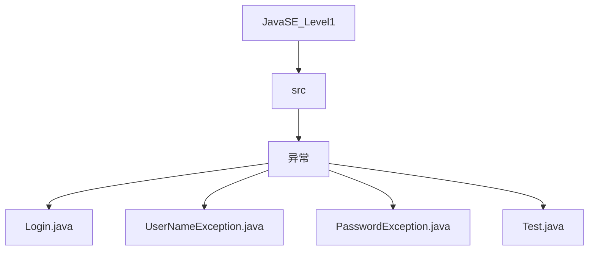
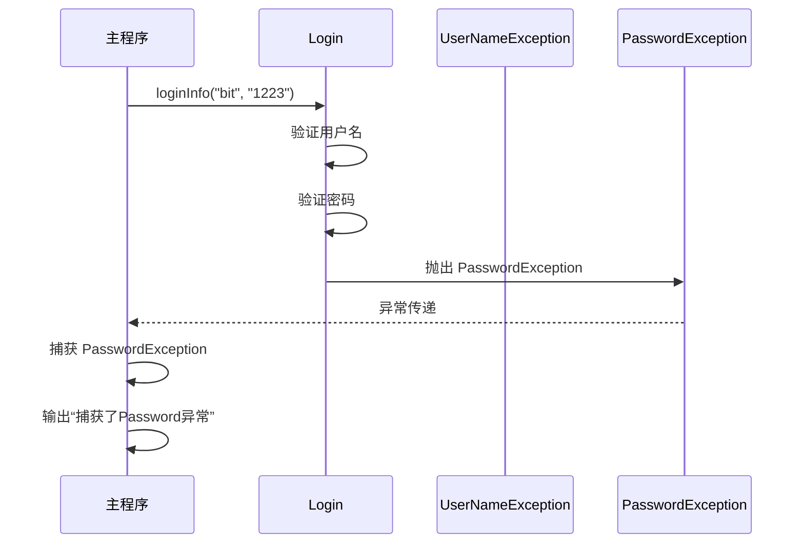
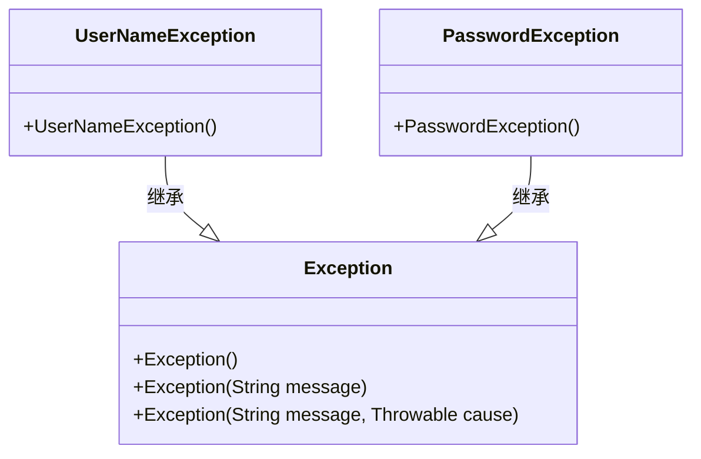
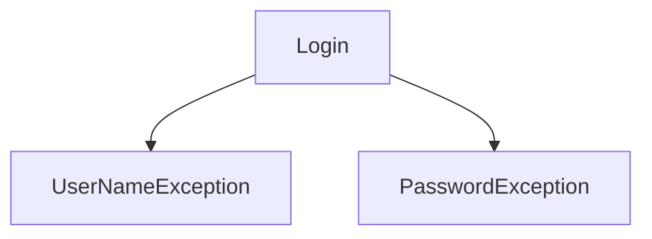

# 自定义异常

<cite>
**本文档引用的文件**   
- [Login.java](file://JavaSE_Level1/src/异常/Login.java#L1-L32)
- [UserNameException.java](file://JavaSE_Level1/src/异常/UserNameException.java#L1-L5)
- [PasswordException.java](file://JavaSE_Level1/src/异常/PasswordException.java#L1-L5)
- [Test.java](file://JavaSE_Level1/src/异常/Test.java#L1-L30)
</cite>

## 目录
1. [引言](#引言)
2. [项目结构](#项目结构)
3. [核心组件](#核心组件)
4. [架构概览](#架构概览)
5. [详细组件分析](#详细组件分析)
6. [依赖分析](#依赖分析)
7. [性能考虑](#性能考虑)
8. [故障排除指南](#故障排除指南)
9. [结论](#结论)

## 引言
本文档旨在深入分析基于 `Login.java` 文件中登录逻辑所实现的自定义异常机制。我们将详细探讨 `UserNameException` 和 `PasswordException` 的设计动机、构造方式、命名规范以及如何在业务逻辑中正确抛出和处理这些异常。此外，还将讨论异常消息的国际化策略与日志记录实践，以提升系统的可维护性和用户体验。

## 项目结构
该项目位于 `` 路径下，主要包含两个模块：`JavaSE_Level1` 和 `JavaDataStructure_Level2`。其中，与本主题相关的代码位于 `JavaSE_Level1\src\异常` 目录中，包括 `Login.java`、`UserNameException.java`、`PasswordException.java` 和 `Test.java` 四个核心文件。



**图示来源**
- [Login.java](file://JavaSE_Level1/src/异常/Login.java#L1-L32)
- [UserNameException.java](file://JavaSE_Level1/src/异常/UserNameException.java#L1-L5)
- [PasswordException.java](file://JavaSE_Level1/src/异常/PasswordException.java#L1-L5)

**本节来源**
- [Login.java](file://JavaSE_Level1/src/异常/Login.java#L1-L32)
- [UserNameException.java](file://JavaSE_Level1/src/异常/UserNameException.java#L1-L5)

## 核心组件
本节将重点分析 `Login` 类及其关联的两个自定义异常类：`UserNameException` 和 `PasswordException`。这些类共同构成了一个简单的用户登录验证系统，并通过异常机制来处理认证失败的情况。

**本节来源**
- [Login.java](file://JavaSE_Level1/src/异常/Login.java#L1-L32)
- [UserNameException.java](file://JavaSE_Level1/src/异常/UserNameException.java#L1-L5)
- [PasswordException.java](file://JavaSE_Level1/src/异常/PasswordException.java#L1-L5)

## 架构概览
整个登录验证流程由 `Login` 类驱动，其 `loginInfo` 方法负责验证用户名和密码。当验证失败时，会分别抛出 `UserNameException` 或 `PasswordException`。调用方通过 `try-catch` 块捕获并处理这些异常。



**图示来源**
- [Login.java](file://JavaSE_Level1/src/异常/Login.java#L1-L32)

## 详细组件分析

### 自定义异常类设计分析

#### 对象导向组件分析
`UserNameException` 和 `PasswordException` 均继承自 `Exception` 类，属于受检异常（checked exception），必须在方法签名中声明或捕获。



**图示来源**
- [UserNameException.java](file://JavaSE_Level1/src/异常/UserNameException.java#L1-L5)
- [PasswordException.java](file://JavaSE_Level1/src/异常/PasswordException.java#L1-L5)

**本节来源**
- [UserNameException.java](file://JavaSE_Level1/src/异常/UserNameException.java#L1-L5)
- [PasswordException.java](file://JavaSE_Level1/src/异常/PasswordException.java#L1-L5)

#### 构造函数与错误信息传递
当前实现中，`UserNameException` 和 `PasswordException` 仅提供了无参构造函数，未传递具体的错误信息。最佳实践应提供带 `String message` 参数的构造函数，以便传递上下文信息。

```java
public class UserNameException extends Exception {
    public UserNameException() {
        super();
    }

    public UserNameException(String message) {
        super(message);
    }
}
```

这样可以在抛出异常时提供更详细的提示，例如：
```java
throw new UserNameException("用户名不匹配，期望: bit，实际: " + username);
```

#### 异常类命名规范
命名清晰且语义明确是良好设计的关键。`UserNameException` 和 `PasswordException` 的命名符合“问题类型 + Exception”模式，具有良好的可读性和一致性，便于开发者理解其用途。

#### 上下文信息传递
虽然当前代码未实现，但可通过构造函数参数或自定义字段向异常传递上下文信息，如无效的用户名、密码尝试次数、时间戳等，有助于调试和日志分析。

### 业务逻辑中的异常抛出方式
在 `Login.loginInfo` 方法中，使用 `throw new` 语法正确地抛出了自定义异常：

```java
if (!this.username.equals(username)) {
    throw new UserNameException();
}
```

这是标准的异常抛出方式，确保了控制流的中断，并将错误状态传递给调用栈上层。

**本节来源**
- [Login.java](file://JavaSE_Level1/src/异常/Login.java#L1-L32)

### 异常消息的国际化与日志记录策略

#### 国际化策略
当前代码中的异常消息（如“捕获了Password异常”）是硬编码的中文字符串，不利于国际化。理想做法是使用资源文件（如 `messages_zh_CN.properties` 和 `messages_en_US.properties`）管理多语言消息，并通过 `ResourceBundle` 动态加载。

例如：
```properties
# messages_zh_CN.properties
exception.password.invalid=密码无效
```

```java
String msg = ResourceBundle.getBundle("messages").getString("exception.password.invalid");
throw new PasswordException(msg);
```

#### 日志记录策略
目前使用 `System.out.println` 打印异常信息，这在生产环境中是不推荐的。应采用专业的日志框架（如 Log4j、SLF4J）进行结构化日志记录，便于集中管理和分析。

```java
catch (PasswordException e) {
    logger.error("用户登录失败，密码错误", e);
}
```

同时，`e.printStackTrace()` 应避免直接输出到控制台，而应由日志框架统一处理堆栈信息。

**本节来源**
- [Login.java](file://JavaSE_Level1/src/异常/Login.java#L26-L29)
- [Test.java](file://JavaSE_Level1/src/异常/Test.java#L9)

## 依赖分析
`Login` 类依赖于 `UserNameException` 和 `PasswordException` 两个自定义异常类。这种依赖关系体现了职责分离原则：业务逻辑与错误类型定义解耦。



**图示来源**
- [Login.java](file://JavaSE_Level1/src/异常/Login.java#L1-L32)

**本节来源**
- [Login.java](file://JavaSE_Level1/src/异常/Login.java#L1-L32)

## 性能考虑
自定义异常的创建和抛出涉及栈追踪的生成，有一定性能开销。但在登录等低频操作中影响微乎其微。建议仅在真正错误条件下抛出异常，避免用异常控制正常流程。

## 故障排除指南
常见问题及解决方案：
- **问题**：`ClassNotFoundException` 提示找不到自定义异常类  
  **解决**：检查包名是否一致，编译路径是否正确。
- **问题**：异常未被捕获导致程序崩溃  
  **解决**：确保调用 `loginInfo` 的方法使用 `try-catch` 或在方法签名中声明 `throws`。
- **问题**：异常信息不明确  
  **解决**：为异常类添加带消息参数的构造函数，并传入具体上下文。

**本节来源**
- [Login.java](file://JavaSE_Level1/src/异常/Login.java#L1-L32)
- [Test.java](file://JavaSE_Level1/src/异常/Test.java#L1-L30)

## 结论
通过对 `Login.java` 及其相关异常类的分析，我们了解了如何设计和实现有意义的自定义异常。尽管当前实现较为基础，但已具备清晰的结构和良好的命名规范。未来可通过增强构造函数、引入国际化支持和专业日志框架，进一步提升系统的健壮性与可维护性。异常处理不仅是错误管理机制，更是系统设计的重要组成部分。