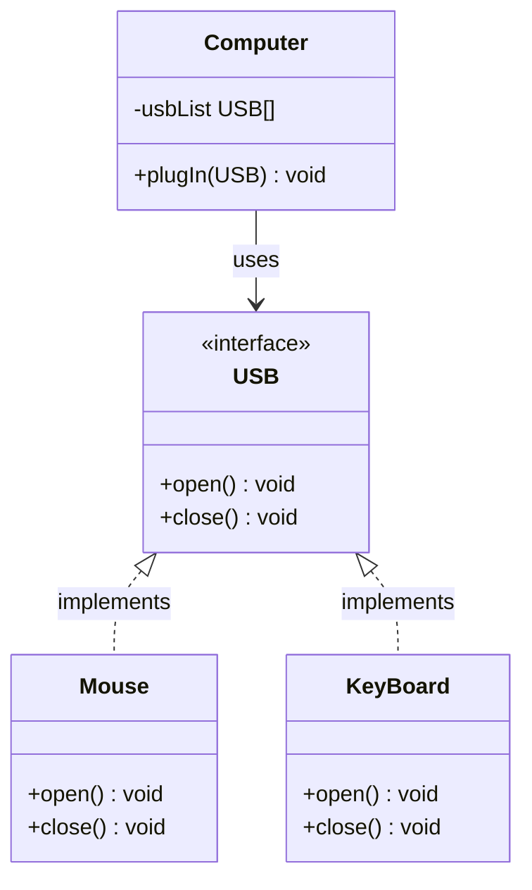
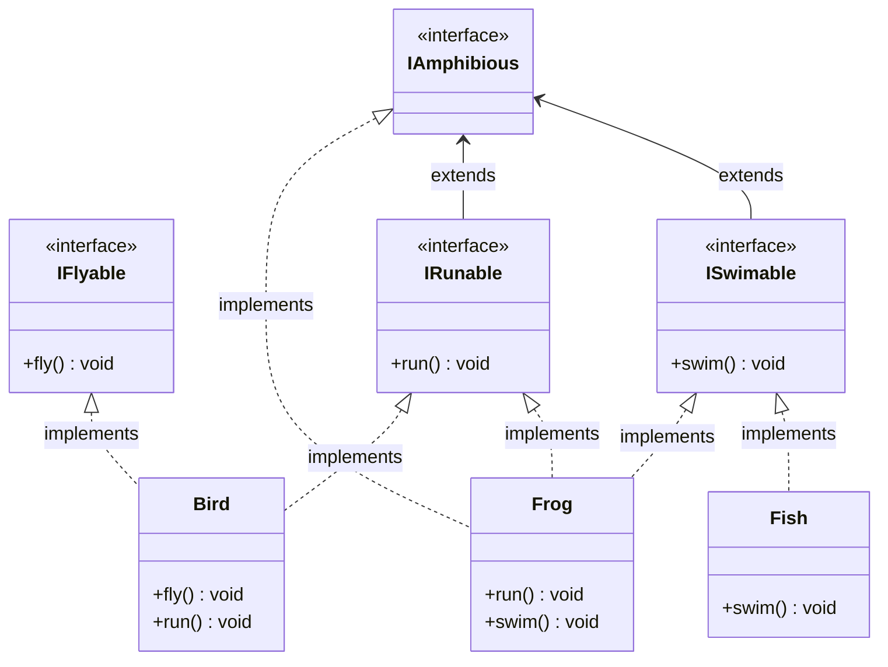

# 抽象类与接口

<cite>
**本文档引用的文件**   
- [Shape.java](file://JavaSE_Level1\src\抽象类与接口\demo1\Shape.java)
- [Rect.java](file://JavaSE_Level1\src\抽象类与接口\demo1\Rect.java)
- [Cycle.java](file://JavaSE_Level1\src\抽象类与接口\demo1\Cycle.java)
- [Flower.java](file://JavaSE_Level1\src\抽象类与接口\demo1\Flower.java)
- [Test.java](file://JavaSE_Level1\src\抽象类与接口\demo1\Test.java)
- [Shape.java](file://JavaSE_Level1\src\抽象类与接口\demo2\Shape.java)
- [Rect.java](file://JavaSE_Level1\src\抽象类与接口\demo2\Rect.java)
- [Cycle.java](file://JavaSE_Level1\src\抽象类与接口\demo2\Cycle.java)
- [Test.java](file://JavaSE_Level1\src\抽象类与接口\demo2\Test.java)
- [IShape.java](file://JavaSE_Level1\src\抽象类与接口\demo3\IShape.java)
- [Rect.java](file://JavaSE_Level1\src\抽象类与接口\demo3\Rect.java)
- [Cycle.java](file://JavaSE_Level1\src\抽象类与接口\demo3\Cycle.java)
- [Test.java](file://JavaSE_Level1\src\抽象类与接口\demo3\Test.java)
- [USB.java](file://JavaSE_Level1\src\抽象类与接口\demo4\USB.java)
- [Mouse.java](file://JavaSE_Level1\src\抽象类与接口\demo4\Mouse.java)
- [KeyBoard.java](file://JavaSE_Level1\src\抽象类与接口\demo4\KeyBoard.java)
- [Computer.java](file://JavaSE_Level1\src\抽象类与接口\demo4\Computer.java)
- [Test.java](file://JavaSE_Level1\src\抽象类与接口\demo4\Test.java)
- [IFlyable.java](file://JavaSE_Level1\src\抽象类与接口\demo5\IFlyable.java)
- [IRunable.java](file://JavaSE_Level1\src\抽象类与接口\demo5\IRunable.java)
- [ISwimable.java](file://JavaSE_Level1\src\抽象类与接口\demo5\ISwimable.java)
- [IAmphibious.java](file://JavaSE_Level1\src\抽象类与接口\demo5\IAmphibious.java)
- [Animal.java](file://JavaSE_Level1\src\抽象类与接口\demo5\Animal.java)
- [Bird.java](file://JavaSE_Level1\src\抽象类与接口\demo5\Bird.java)
- [Dog.java](file://JavaSE_Level1\src\抽象类与接口\demo5\Dog.java)
- [Fish.java](file://JavaSE_Level1\src\抽象类与接口\demo5\Fish.java)
- [Frog.java](file://JavaSE_Level1\src\抽象类与接口\demo5\Frog.java)
- [Test.java](file://JavaSE_Level1\src\抽象类与接口\demo5\Test.java)
</cite>

## 目录
1. [引言](#引言)
2. [项目结构](#项目结构)
3. [抽象类的设计与实现](#抽象类的设计与实现)
4. [接口的设计与实现](#接口的设计与实现)
5. [抽象类与接口的对比分析](#抽象类与接口的对比分析)
6. [接口多实现示例：USB设备](#接口多实现示例usb设备)
7. [接口组合示例：动物行为](#接口组合示例动物行为)
8. [UML类图与设计模式](#uml类图与设计模式)
9. [Java 8接口默认方法的影响](#java-8接口默认方法的影响)
10. [结论](#结论)

## 引言
本文档旨在全面对比Java中抽象类（abstract class）与接口（interface）的设计理念与技术差异。通过分析`Shape`抽象类与`IShape`接口的实现，说明在不同设计场景下的选择依据。文档将结合USB设备（鼠标、键盘）示例展示接口的多实现特性，并通过动物行为接口（飞行、奔跑、游泳）展示接口组合的灵活性。同时，本文还将探讨Java 8引入接口默认方法后对设计模式的影响。

## 项目结构
本项目位于`JavaSE_Level1\src\抽象类与接口`目录下，包含多个演示子目录（demo1至demo6），每个子目录展示抽象类与接口的不同应用场景。核心示例分布在demo1（普通类继承）、demo2（抽象类）、demo3（接口）、demo4（USB设备接口）和demo5（动物行为接口）中。

```mermaid
graph TD
A[抽象类与接口] --> B[demo1: 普通图形类]
A --> C[demo2: 抽象图形类]
A --> D[demo3: 图形接口]
A --> E[demo4: USB设备接口]
A --> F[demo5: 动物行为接口]
B --> B1[Shape]
B --> B2[Rect]
B --> B3[Cycle]
B --> B4[Flower]
C --> C1[Shape(抽象)]
C --> C2[Rect]
C --> C3[Cycle]
D --> D1[IShape(接口)]
D --> D2[Rect]
D --> D3[Cycle]
E --> E1[USB(接口)]
E --> E2[Mouse]
E --> E3[KeyBoard]
E --> E4[Computer]
F --> F1[IFlyable]
F --> F2[IRunable]
F --> F3[ISwimable]
F --> F4[IAmphibious]
F --> F5[Bird]
F --> F6[Frog]
```

**图示来源**
- [项目结构](file://JavaSE_Level1\src\抽象类与接口)

## 抽象类的设计与实现

### demo1：普通类继承
在`demo1`中，`Shape`类是一个普通类，包含一个`draw()`方法。`Rect`、`Cycle`和`Flower`类通过继承`Shape`并重写`draw()`方法来实现多态。

```java
// Shape.java
public class Shape {
    public void draw(){
        System.out.println("画一个图形...");
    }
}
```

```java
// Rect.java
public class Rect extends Shape {
    @Override
    public void draw() {
        System.out.println("画一个矩形...");
    }
}
```

此设计允许子类复用父类代码，但缺乏强制约束，子类可以选择不重写`draw()`方法。

### demo2：抽象类实现
在`demo2`中，`Shape`被定义为抽象类，其`draw()`方法为抽象方法，强制子类必须实现。

```java
// Shape.java
public abstract class Shape {
    public abstract void draw(); // 抽象方法
}
```

```java
// Rect.java
public class Rect extends Shape{
    @Override
    public void draw() {
        System.out.println("画一个矩形...");
    }
}
```

抽象类不能被实例化，只能作为基类被继承。测试代码通过多态调用不同子类的`draw()`方法：

```java
// Test.java
public static void drawMap(Shape shape){
    shape.draw();
}
public static void main(String[] args) {
    drawMap(new Rect());
    drawMap(new Cycle());
}
```

**中文**
- **抽象类特点**：可以包含抽象方法和具体方法，可以有成员变量，支持构造函数，单继承。
- **适用场景**：当多个类有共同的代码需要复用，且存在必须实现的核心方法时。

**节来源**
- [Shape.java](file://JavaSE_Level1\src\抽象类与接口\demo2\Shape.java#L1-L11)
- [Rect.java](file://JavaSE_Level1\src\抽象类与接口\demo2\Rect.java#L1-L25)
- [Cycle.java](file://JavaSE_Level1\src\抽象类与接口\demo2\Cycle.java#L1-L13)
- [Test.java](file://JavaSE_Level1\src\抽象类与接口\demo2\Test.java#L1-L14)

## 接口的设计与实现

### demo3：图形接口实现
在`demo3`中，`IShape`是一个接口，定义了`draw()`方法。`Rect`和`Cycle`类通过`implements`关键字实现该接口。

```java
// IShape.java
public interface IShape {
    int a = 10; // 默认 public static final
    void draw(); // 默认 public abstract
}
```

```java
// Rect.java
public class Rect implements IShape{
    @Override
    public void draw() {
        System.out.println("画一个矩形...");
    }
}
```

接口的实现展示了多态性：

```java
// Test.java
public static void drawMap(IShape iShape){
    iShape.draw();
}
public static void main(String[] args) {
    drawMap(new Cycle());
    drawMap(new Rect());
}
```

**中文**
- **接口特点**：只能包含抽象方法（Java 8前）、常量，不能有构造函数，支持多实现。
- **适用场景**：定义行为契约，实现类可以来自不同继承体系。

**节来源**
- [IShape.java](file://JavaSE_Level1\src\抽象类与接口\demo3\IShape.java#L1-L11)
- [Rect.java](file://JavaSE_Level1\src\抽象类与接口\demo3\Rect.java#L1-L9)
- [Cycle.java](file://JavaSE_Level1\src\抽象类与接口\demo3\Cycle.java#L1-L10)
- [Test.java](file://JavaSE_Level1\src\抽象类与接口\demo3\Test.java#L1-L15)

## 抽象类与接口的对比分析

| 特性 | 抽象类 | 接口 |
|------|--------|------|
| 方法类型 | 可以有抽象方法和具体方法 | Java 8前只能有抽象方法，之后可有默认方法 |
| 成员变量 | 可以有任意类型的成员变量 | 只能有`public static final`常量 |
| 构造函数 | 可以有构造函数 | 不能有构造函数 |
| 继承/实现 | 单继承 | 多实现 |
| 访问修饰符 | 可以使用`public`、`protected`、`private` | 方法默认`public`，变量默认`public static final` |
| 设计目的 | 代码复用与强制实现结合 | 定义行为契约，实现解耦 |

**设计选择依据**：
- 使用**抽象类**当需要共享代码、状态或构造逻辑时。
- 使用**接口**当需要定义跨类型的行为契约或实现多重继承时。

## 接口多实现示例：USB设备

### demo4：USB接口与设备实现
`USB`接口定义了`open()`和`close()`两个方法，`Mouse`和`KeyBoard`类分别实现该接口。

```java
// USB.java
public interface USB {
    void open();
    void close();
}
```

```java
// Mouse.java
public class Mouse implements USB {
    @Override
    public void open() {
        System.out.println("鼠标开启");
    }
    @Override
    public void close() {
        System.out.println("鼠标关闭");
    }
}
```

```java
// KeyBoard.java
public class KeyBoard implements USB {
    @Override
    public void open() {
        System.out.println("键盘开启");
    }
    @Override
    public void close() {
        System.out.println("键盘关闭");
    }
}
```

`Computer`类通过组合方式使用USB设备，体现了依赖倒置原则：

```java
// Computer.java
public class Computer {
    public void plugIn(USB usb) {
        usb.open();
        // 使用设备
        usb.close();
    }
}
```

此设计允许`Computer`无需修改即可支持任何符合`USB`接口的新设备。



**图示来源**
- [USB.java](file://JavaSE_Level1\src\抽象类与接口\demo4\USB.java)
- [Mouse.java](file://JavaSE_Level1\src\抽象类与接口\demo4\Mouse.java)
- [KeyBoard.java](file://JavaSE_Level1\src\抽象类与接口\demo4\KeyBoard.java)
- [Computer.java](file://JavaSE_Level1\src\抽象类与接口\demo4\Computer.java)

**节来源**
- [USB.java](file://JavaSE_Level1\src\抽象类与接口\demo4\USB.java#L1-L6)
- [Mouse.java](file://JavaSE_Level1\src\抽象类与接口\demo4\Mouse.java#L1-L14)
- [KeyBoard.java](file://JavaSE_Level1\src\抽象类与接口\demo4\KeyBoard.java#L1-L14)
- [Computer.java](file://JavaSE_Level1\src\抽象类与接口\demo4\Computer.java#L1-L15)
- [Test.java](file://JavaSE_Level1\src\抽象类与接口\demo4\Test.java)

## 接口组合示例：动物行为

### demo5：多行为接口组合
`demo5`展示了通过接口组合实现复杂行为。`IFlyable`、`IRunable`、`ISwimable`分别定义飞行、奔跑、游泳行为。

```java
// IFlyable.java
public interface IFlyable {
    void fly();
}

// IRunable.java
public interface IRunable {
    void run();
}

// ISwimable.java
public interface ISwimable {
    void swim();
}
```

`Bird`类实现`IFlyable`和`IRunable`，`Fish`类实现`ISwimable`，`Frog`类实现`IRunable`和`ISwimable`，甚至可以定义`IAmphibious`接口继承多个行为接口。

```java
// Bird.java
public class Bird implements IFlyable, IRunable {
    @Override
    public void fly() { System.out.println("鸟儿飞翔"); }
    @Override
    public void run() { System.out.println("鸟儿奔跑"); }
}
```

这种设计避免了继承层次的爆炸，提高了代码的灵活性和可维护性。



**图示来源**
- [IFlyable.java](file://JavaSE_Level1\src\抽象类与接口\demo5\IFlyable.java)
- [IRunable.java](file://JavaSE_Level1\src\抽象类与接口\demo5\IRunable.java)
- [ISwimable.java](file://JavaSE_Level1\src\抽象类与接口\demo5\ISwimable.java)
- [IAmphibious.java](file://JavaSE_Level1\src\抽象类与接口\demo5\IAmphibious.java)
- [Bird.java](file://JavaSE_Level1\src\抽象类与接口\demo5\Bird.java)
- [Frog.java](file://JavaSE_Level1\src\抽象类与接口\demo5\Frog.java)

**节来源**
- [IFlyable.java](file://JavaSE_Level1\src\抽象类与接口\demo5\IFlyable.java#L1-L4)
- [IRunable.java](file://JavaSE_Level1\src\抽象类与接口\demo5\IRunable.java#L1-L4)
- [ISwimable.java](file://JavaSE_Level1\src\抽象类与接口\demo5\ISwimable.java#L1-L4)
- [IAmphibious.java](file://JavaSE_Level1\src\抽象类与接口\demo5\IAmphibious.java#L1-L4)
- [Bird.java](file://JavaSE_Level1\src\抽象类与接口\demo5\Bird.java#L1-L10)
- [Frog.java](file://JavaSE_Level1\src\抽象类与接口\demo5\Frog.java#L1-L12)

## UML类图与设计模式

### 策略模式应用
在`demo4`的USB设备示例中，`Computer`类使用了策略模式。`USB`接口作为策略接口，`Mouse`和`KeyBoard`是具体策略。`Computer`在运行时动态选择策略，体现了开闭原则。

```mermaid
classDiagram
class Computer {
+plugIn(USB) void
}
class USB {
<<interface>>
+open() void
+close() void
}
class ConcreteStrategyA {
+open() void
+close() void
}
class ConcreteStrategyB {
+open() void
+close() void
}
Computer --> USB : 依赖
USB <|.. ConcreteStrategyA : 实现
USB <|.. ConcreteStrategyB : 实现
note right of Computer
策略模式：Computer通过USB接口
使用不同设备，无需修改自身代码
end note
```

**图示来源**
- [Computer.java](file://JavaSE_Level1\src\抽象类与接口\demo4\Computer.java)
- [USB.java](file://JavaSE_Level1\src\抽象类与接口\demo4\USB.java)

## Java 8接口默认方法的影响

Java 8引入了接口默认方法（default method），允许在接口中提供方法的默认实现，解决了接口演化的问题。

```java
public interface USB {
    void open();
    void close();
    default void plugAndPlay() {
        System.out.println("即插即用功能");
    }
}
```

这一特性模糊了抽象类与接口的界限，使接口也能提供代码复用。但设计原则不变：抽象类用于“是什么”（is-a）关系，接口用于“能做什么”（can-do）关系。

**影响**：
- 接口可以逐步添加新方法而不破坏现有实现。
- 减少了为提供默认实现而创建抽象基类的需求。
- 促进了函数式编程接口（如`java.util.function`包）的发展。

## 结论
抽象类与接口是Java实现多态和代码复用的核心机制。抽象类适用于有共同状态和行为的类层次，而接口适用于定义跨类型的行为契约。通过USB设备和动物行为的示例，我们看到接口在实现多继承和组合方面的优势。Java 8的默认方法增强了接口的能力，但设计决策仍需基于语义关系。合理选择抽象类或接口，能显著提升代码的可维护性和扩展性。