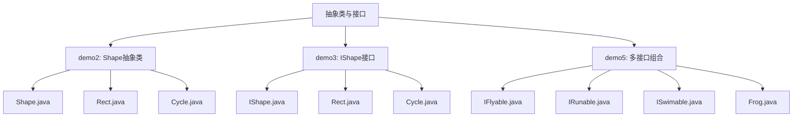
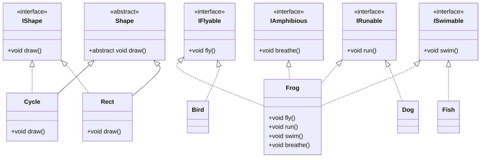
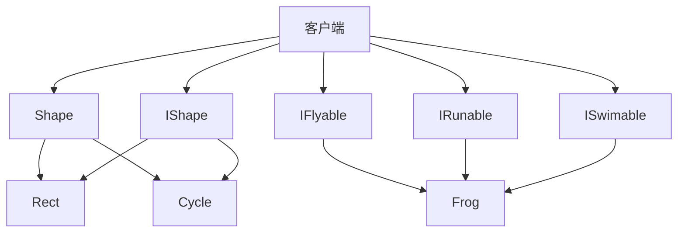

# 抽象类与接口对比分析

<cite>
**本文档引用文件**  
- [Shape.java](file://JavaSE_Level1/src/抽象类与接口/demo2/Shape.java)
- [Rect.java](file://JavaSE_Level1/src/抽象类与接口/demo2/Rect.java)
- [Cycle.java](file://JavaSE_Level1/src/抽象类与接口/demo2/Cycle.java)
- [Test.java](file://JavaSE_Level1/src/抽象类与接口/demo2/Test.java)
- [IShape.java](file://JavaSE_Level1/src/抽象类与接口/demo3/IShape.java)
- [Rect.java](file://JavaSE_Level1/src/抽象类与接口/demo3/Rect.java)
- [Cycle.java](file://JavaSE_Level1/src/抽象类与接口/demo3/Cycle.java)
- [Test.java](file://JavaSE_Level1/src/抽象类与接口/demo3/Test.java)
- [IFlyable.java](file://JavaSE_Level1/src/抽象类与接口/demo5/IFlyable.java)
- [IRunable.java](file://JavaSE_Level1/src/抽象类与接口/demo5/IRunable.java)
- [ISwimable.java](file://JavaSE_Level1/src/抽象类与接口/demo5/ISwimable.java)
- [IAmphibious.java](file://JavaSE_Level1/src/抽象类与接口/demo5/IAmphibious.java)
- [Frog.java](file://JavaSE_Level1/src/抽象类与接口/demo5/Frog.java)
</cite>

## 目录
1. [引言](#引言)
2. [项目结构](#项目结构)
3. [核心组件](#核心组件)
4. [架构概览](#架构概览)
5. [详细组件分析](#详细组件分析)
6. [依赖分析](#依赖分析)
7. [性能考量](#性能考量)
8. [故障排除指南](#故障排除指南)
9. [结论](#结论)

## 引言
本文档旨在全面对比Java中抽象类与接口的技术特性与适用场景。通过分析`Shape`抽象类与`IShape`接口的等效实现，深入探讨单继承与多实现的语法限制、is-a与can-do的语义差异、以及代码复用方式的设计选择。同时，结合Java 8引入的接口默认方法和静态方法特性，重新评估两者之间的边界，并为开发者提供实际项目中的决策指导。

## 项目结构
本项目位于``目录下，核心分析内容集中在`JavaSE_Level1/src/抽象类与接口`路径中。该目录包含多个演示案例（demo1至demo6），分别展示了抽象类与接口的不同使用模式。



**图示来源**
- [Shape.java](file://JavaSE_Level1/src/抽象类与接口/demo2/Shape.java)
- [IShape.java](file://JavaSE_Level1/src/抽象类与接口/demo3/IShape.java)
- [Frog.java](file://JavaSE_Level1/src/抽象类与接口/demo5/Frog.java)

**本节来源**
- [抽象类与接口](file://JavaSE_Level1/src/抽象类与接口)

## 核心组件
本项目的核心组件包括：
- **Shape抽象类**：定义图形绘制的抽象行为，体现“is-a”关系。
- **IShape接口**：定义可绘制对象的能力契约，体现“can-do”关系。
- **IFlyable、IRunable、ISwimable接口**：展示功能接口的组合使用，支持多重能力建模。

这些组件通过具体的`Rect`、`Cycle`和`Frog`类实现，展示了面向对象设计中继承与实现的不同路径。

**本节来源**
- [Shape.java](file://JavaSE_Level1/src/抽象类与接口/demo2/Shape.java#L2-L9)
- [IShape.java](file://JavaSE_Level1/src/抽象类与接口/demo3/IShape.java#L2-L9)
- [IFlyable.java](file://JavaSE_Level1/src/抽象类与接口/demo5/IFlyable.java#L2-L4)

## 架构概览
系统采用典型的面向对象分层架构，顶层为抽象基类或接口，底层为具体实现类。客户端通过统一的方法（如`drawMap`）进行多态调用，实现行为的解耦。



**图示来源**
- [Shape.java](file://JavaSE_Level1/src/抽象类与接口/demo2/Shape.java)
- [IShape.java](file://JavaSE_Level1/src/抽象类与接口/demo3/IShape.java)
- [IFlyable.java](file://JavaSE_Level1/src/抽象类与接口/demo5/IFlyable.java)
- [IRunable.java](file://JavaSE_Level1/src/抽象类与接口/demo5/IRunable.java)
- [ISwimable.java](file://JavaSE_Level1/src/抽象类与接口/demo5/ISwimable.java)
- [IAmphibious.java](file://JavaSE_Level1/src/抽象类与接口/demo5/IAmphibious.java)
- [Frog.java](file://JavaSE_Level1/src/抽象类与接口/demo5/Frog.java)

## 详细组件分析

### 抽象类实现分析
`Shape`抽象类作为图形的基类，强制子类实现`draw()`方法。抽象类支持部分实现和状态共享，适用于具有共同属性和行为的类族。

```java
public abstract class Shape {
    public abstract void draw();
}
```

`Rect`和`Cycle`类通过继承`Shape`，实现各自的绘制逻辑，体现“is-a”语义。

```java
public class Rect extends Shape {
    @Override
    public void draw() {
        System.out.println("画一个矩形...");
    }
}
```

客户端通过多态调用`drawMap(Shape shape)`，实现运行时绑定。

**本节来源**
- [Shape.java](file://JavaSE_Level1/src/抽象类与接口/demo2/Shape.java#L2-L9)
- [Rect.java](file://JavaSE_Level1/src/抽象类与接口/demo2/Rect.java#L2-L7)
- [Cycle.java](file://JavaSE_Level1/src/抽象类与接口/demo2/Cycle.java#L2-L8)
- [Test.java](file://JavaSE_Level1/src/抽象类与接口/demo2/Test.java#L6-L13)

### 接口实现分析
`IShape`接口定义了“可绘制”的能力契约，不包含状态，仅声明行为。接口支持多实现，适用于跨类别的能力复用。

```java
public interface IShape {
    void draw();
}
```

`Rect`和`Cycle`类通过实现`IShape`接口，获得绘制能力，体现“can-do”语义。

```java
public class Rect implements IShape {
    @Override
    public void draw() {
        System.out.println("画一个矩形...");
    }
}
```

客户端通过`drawMap(IShape iShape)`统一处理所有可绘制对象，支持接口数组的批量操作。

**本节来源**
- [IShape.java](file://JavaSE_Level1/src/抽象类与接口/demo3/IShape.java#L2-L9)
- [Rect.java](file://JavaSE_Level1/src/抽象类与接口/demo3/Rect.java#L2-L7)
- [Cycle.java](file://JavaSE_Level1/src/抽象类与接口/demo3/Cycle.java#L2-L8)
- [Test.java](file://JavaSE_Level1/src/抽象类与接口/demo3/Test.java#L5-L14)

### 多接口组合分析
`Frog`类同时实现`IFlyable`、`IRunable`、`ISwimable`和`IAmphibious`接口，展示一个对象可以具备多种独立能力。这种组合方式灵活且松耦合，是接口优于单继承抽象类的关键优势。

```java
public class Frog implements IFlyable, IRunable, ISwimable, IAmphibious {
    @Override
    public void fly() { System.out.println("青蛙跳跃飞行"); }
    @Override
    public void run() { System.out.println("青蛙跳跃前进"); }
    @Override
    public void swim() { System.out.println("青蛙游泳"); }
    @Override
    public void breathe() { System.out.println("青蛙用皮肤呼吸"); }
}
```

此设计模式支持高度灵活的对象能力建模，避免了深层继承带来的僵化问题。

**本节来源**
- [IFlyable.java](file://JavaSE_Level1/src/抽象类与接口/demo5/IFlyable.java#L2-L4)
- [IRunable.java](file://JavaSE_Level1/src/抽象类与接口/demo5/IRunable.java#L2-L4)
- [ISwimable.java](file://JavaSE_Level1/src/抽象类与接口/demo5/ISwimable.java#L2-L4)
- [IAmphibious.java](file://JavaSE_Level1/src/抽象类与接口/demo5/IAmphibious.java#L2-L4)
- [Frog.java](file://JavaSE_Level1/src/抽象类与接口/demo5/Frog.java#L2-L15)

## 依赖分析
项目中各组件依赖关系清晰，抽象类与接口均作为顶层契约，具体实现类依赖于它们。客户端代码依赖于抽象而非具体实现，符合依赖倒置原则。



**图示来源**
- [Shape.java](file://JavaSE_Level1/src/抽象类与接口/demo2/Shape.java)
- [IShape.java](file://JavaSE_Level1/src/抽象类与接口/demo3/IShape.java)
- [Frog.java](file://JavaSE_Level1/src/抽象类与接口/demo5/Frog.java)

**本节来源**
- [Test.java](file://JavaSE_Level1/src/抽象类与接口/demo2/Test.java)
- [Test.java](file://JavaSE_Level1/src/抽象类与接口/demo3/Test.java)

## 性能考量
- **抽象类**：由于支持字段和具体方法，可能引入额外的状态开销，但方法调用为标准的虚方法调用。
- **接口**：纯接口调用在JVM中经过优化，性能接近直接调用。Java 8后的默认方法不会引入显著性能损耗。
- **多态调用**：无论是抽象类还是接口，多态调用的性能差异在现代JVM中已微乎其微。

总体而言，选择应基于设计语义而非性能考量。

## 故障排除指南
- **抽象类无法实例化**：确保不直接`new Shape()`，而应实例化具体子类。
- **接口实现遗漏方法**：编译器会强制检查，确保所有抽象方法被实现。
- **多继承冲突**：接口中默认方法冲突时，需在实现类中显式重写以解决歧义。
- **包路径错误**：确保所有类位于正确的包路径下，避免`NoClassDefFoundError`。

**本节来源**
- [Shape.java](file://JavaSE_Level1/src/抽象类与接口/demo2/Shape.java#L2)
- [Test.java](file://JavaSE_Level1/src/抽象类与接口/demo2/Test.java#L8)

## 结论
抽象类与接口各有适用场景：
- 使用**抽象类**当需要共享代码、定义模板方法或表示“is-a”关系时。
- 使用**接口**当需要支持多实现、定义能力契约或实现“can-do”语义时。
- Java 8后，接口可通过默认方法提供部分实现，模糊了与抽象类的界限，但抽象类仍支持状态和构造器。

最终决策应基于设计意图：若强调“是什么”，选抽象类；若强调“能做什么”，选接口。在复杂系统中，两者常结合使用，发挥各自优势。