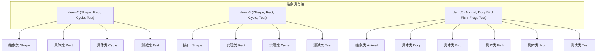
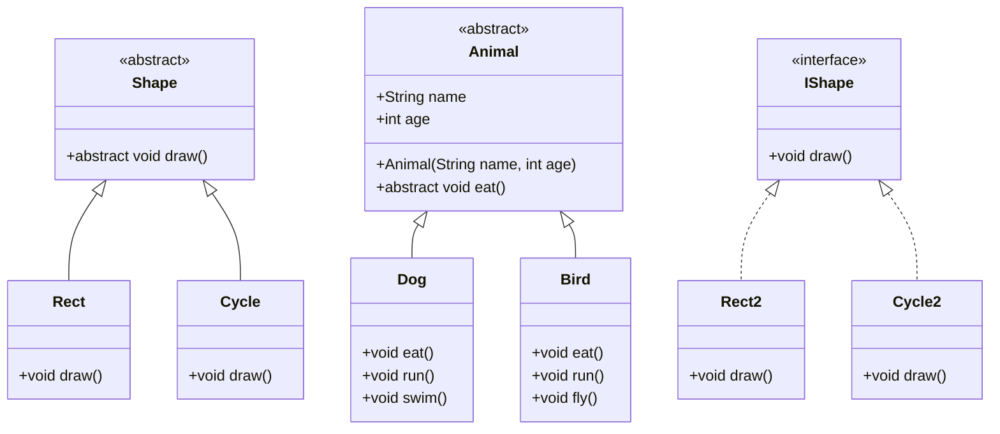
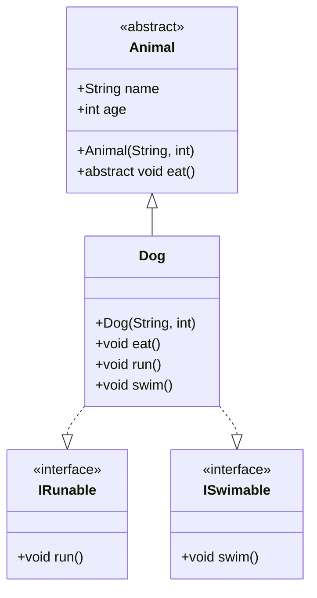
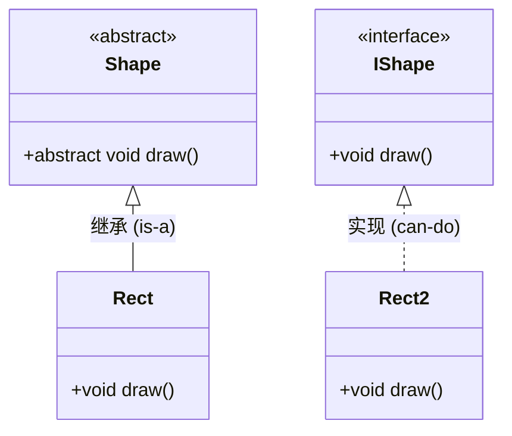
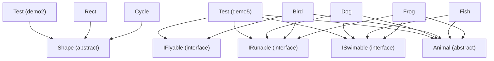

# 抽象类设计与实现

<cite>
**本文档引用文件**  
- [Shape.java](file://JavaSE_Level1/src/抽象类与接口/demo2/Shape.java)
- [Rect.java](file://JavaSE_Level1/src/抽象类与接口/demo2/Rect.java)
- [Cycle.java](file://JavaSE_Level1/src/抽象类与接口/demo2/Cycle.java)
- [Test.java](file://JavaSE_Level1/src/抽象类与接口/demo2/Test.java)
- [Animal.java](file://JavaSE_Level1/src/抽象类与接口/demo5/Animal.java)
- [Dog.java](file://JavaSE_Level1/src/抽象类与接口/demo5/Dog.java)
- [Test.java](file://JavaSE_Level1/src/抽象类与接口/demo5/Test.java)
- [IShape.java](file://JavaSE_Level1/src/抽象类与接口/demo3/IShape.java)
- [Test.java](file://JavaSE_Level1/src/抽象类与接口/demo3/Test.java)
</cite>

## 目录
1. [引言](#引言)
2. [项目结构](#项目结构)
3. [核心组件](#核心组件)
4. [架构概述](#架构概述)
5. [详细组件分析](#详细组件分析)
6. [依赖分析](#依赖分析)
7. [性能考量](#性能考量)
8. [故障排除指南](#故障排除指南)
9. [结论](#结论)

## 引言
本文档深入探讨Java中抽象类的设计理念与实现机制，重点分析`Shape`抽象类如何通过抽象方法（如`draw()`）强制子类实现。通过`Rect`和`Cycle`类的继承示例，展示抽象类在共享代码和定义模板方法方面的优势。同时，结合`Animal`类体系，解析抽象类的构造函数调用顺序、字段继承规则以及`final`方法的使用场景。最后，通过UML类图说明is-a关系的建模方式，并对比接口在相同场景下的实现差异。

## 项目结构
项目`Java_learning`包含多个模块，其中与抽象类相关的代码主要位于`JavaSE_Level1/src/抽象类与接口/`目录下。该目录包含多个示例（demo1至demo6），分别演示了多态、抽象类、接口等核心概念。本分析重点关注`demo2`中的`Shape`抽象类及其子类`Rect`和`Cycle`，以及`demo5`中更复杂的`Animal`抽象类体系。



**图示来源**
- [Shape.java](file://JavaSE_Level1/src/抽象类与接口/demo2/Shape.java)
- [Rect.java](file://JavaSE_Level1/src/抽象类与接口/demo2/Rect.java)
- [Cycle.java](file://JavaSE_Level1/src/抽象类与接口/demo2/Cycle.java)
- [Animal.java](file://JavaSE_Level1/src/抽象类与接口/demo5/Animal.java)

**本节来源**
- [项目结构](file://README.md)

## 核心组件
本项目的核心组件是`Shape`抽象类和`Animal`抽象类，它们定义了图形和动物的通用行为模板。`Shape`类通过`draw()`抽象方法强制所有子类实现绘图逻辑，而`Animal`类则通过`eat()`抽象方法和`name`、`age`字段为所有动物子类提供基础属性和行为契约。

**本节来源**
- [Shape.java](file://JavaSE_Level1/src/抽象类与接口/demo2/Shape.java#L1-L9)
- [Animal.java](file://JavaSE_Level1/src/抽象类与接口/demo5/Animal.java#L1-L13)

## 架构概述
系统架构基于面向对象的继承和多态原则。`Shape`和`Animal`作为抽象基类，定义了子类必须遵循的接口（抽象方法）和可共享的属性（字段）。具体子类如`Rect`、`Cycle`、`Dog`、`Bird`等通过继承基类并实现抽象方法来提供具体功能。测试类`Test`则通过多态性，以统一的方式处理不同类型的对象，体现了“一个接口，多种实现”的设计思想。



**图示来源**
- [Shape.java](file://JavaSE_Level1/src/抽象类与接口/demo2/Shape.java)
- [Rect.java](file://JavaSE_Level1/src/抽象类与接口/demo2/Rect.java)
- [Cycle.java](file://JavaSE_Level1/src/抽象类与接口/demo2/Cycle.java)
- [Animal.java](file://JavaSE_Level1/src/抽象类与接口/demo5/Animal.java)
- [Dog.java](file://JavaSE_Level1/src/抽象类与接口/demo5/Dog.java)
- [Bird.java](file://JavaSE_Level1/src/抽象类与接口/demo5/Bird.java)
- [IShape.java](file://JavaSE_Level1/src/抽象类与接口/demo3/IShape.java)

## 详细组件分析

### Shape抽象类分析
`Shape`抽象类位于`demo2`包中，是图形绘制功能的基类。其核心设计在于使用`abstract`关键字声明`draw()`方法，这使得`Shape`类本身无法被实例化，强制所有继承它的子类必须提供`draw()`方法的具体实现。

#### 抽象方法的强制实现
```java
public abstract class Shape {
    public abstract void draw(); // 抽象方法
}
```
此设计确保了所有`Shape`的子类（如`Rect`和`Cycle`）都必须重写`draw()`方法。这提供了一种契约，保证了所有图形对象都具备绘图能力。

#### 继承与多态的实现
`Rect`和`Cycle`类通过`extends Shape`继承`Shape`类，并使用`@Override`注解实现`draw()`方法。

```java
public class Rect extends Shape{
    @Override
    public void draw() {
        System.out.println("画一个矩形...");
    }
}
```
```java
public class Cycle extends Shape{
    @Override
    public void draw() {
        System.out.println("画一个圆圈...");
    }
}
```

#### 多态的应用
测试类`Test`中的`drawMap`方法展示了多态的强大之处。该方法接受一个`Shape`类型的参数，却可以处理任何`Shape`的子类实例。

```java
public static void drawMap(Shape shape){
    shape.draw(); // 运行时决定调用哪个子类的draw方法
}
public static void main(String[] args) {
    drawMap(new Rect()); // 输出: 画一个矩形...
    drawMap(new Cycle()); // 输出: 画一个圆圈...
}
```
这种设计使得代码具有高度的可扩展性，新增图形类（如`Triangle`）时，无需修改`drawMap`方法。

```mermaid
sequenceDiagram
participant Client as "客户端 (main)"
participant DrawMap as "drawMap(Shape)"
participant Rect as "Rect"
participant Cycle as "Cycle"
Client->>DrawMap : drawMap(new Rect())
DrawMap->>Rect : shape.draw()
Rect-->>DrawMap : "画一个矩形..."
DrawMap-->>Client : 返回
Client->>DrawMap : drawMap(new Cycle())
DrawMap->>Cycle : shape.draw()
Cycle-->>DrawMap : "画一个圆圈..."
DrawMap-->>Client : 返回
```

**图示来源**
- [Shape.java](file://JavaSE_Level1/src/抽象类与接口/demo2/Shape.java#L1-L9)
- [Rect.java](file://JavaSE_Level1/src/抽象类与接口/demo2/Rect.java#L1-L7)
- [Cycle.java](file://JavaSE_Level1/src/抽象类与接口/demo2/Cycle.java#L1-L11)
- [Test.java](file://JavaSE_Level1/src/抽象类与接口/demo2/Test.java#L1-L13)

**本节来源**
- [Shape.java](file://JavaSE_Level1/src/抽象类与接口/demo2/Shape.java#L1-L9)
- [Rect.java](file://JavaSE_Level1/src/抽象类与接口/demo2/Rect.java#L1-L7)
- [Cycle.java](file://JavaSE_Level1/src/抽象类与接口/demo2/Cycle.java#L1-L11)
- [Test.java](file://JavaSE_Level1/src/抽象类与接口/demo2/Test.java#L1-L13)

### Animal抽象类分析
`Animal`抽象类位于`demo5`包中，比`Shape`类更复杂，它不仅定义了抽象方法，还包含了具体字段和构造函数，更好地展示了抽象类的完整特性。

#### 字段继承与构造函数调用
`Animal`类定义了`name`和`age`两个公共字段，并提供了一个构造函数来初始化它们。

```java
public abstract class Animal {
    public String name;
    public int age;

    public Animal(String name, int age) {
        this.name = name;
        this.age = age;
    }
    public abstract void eat();
}
```
子类`Dog`在自己的构造函数中通过`super(name, age)`显式调用父类构造函数，从而完成对继承字段的初始化。

```java
public class Dog extends Animal implements IRunable,ISwimable {
    public Dog(String name, int age) {
        super(name, age); // 调用父类Animal的构造函数
    }
    ...
}
```
**构造函数调用顺序**：当创建`Dog`对象时，首先执行`Animal`的构造函数，然后执行`Dog`的构造函数。这保证了父类的状态在子类使用前已被正确初始化。

#### 共享代码与模板方法
`Animal`类为所有子类提供了`name`和`age`字段，避免了在每个子类中重复定义。这体现了抽象类在共享代码方面的优势。虽然本例中未使用，但抽象类还可以定义`final`方法来防止子类重写，从而创建不可变的模板方法。

#### 多重继承的替代
`Dog`类同时继承了`Animal`抽象类并实现了`IRunable`和`ISwimable`接口。这展示了Java中通过“单继承+多接口”实现多重行为继承的模式。



**图示来源**
- [Animal.java](file://JavaSE_Level1/src/抽象类与接口/demo5/Animal.java#L1-L13)
- [Dog.java](file://JavaSE_Level1/src/抽象类与接口/demo5/Dog.java#L1-L22)
- [Test.java](file://JavaSE_Level1/src/抽象类与接口/demo5/Test.java#L1-L39)

**本节来源**
- [Animal.java](file://JavaSE_Level1/src/抽象类与接口/demo5/Animal.java#L1-L13)
- [Dog.java](file://JavaSE_Level1/src/抽象类与接口/demo5/Dog.java#L1-L22)
- [Test.java](file://JavaSE_Level1/src/抽象类与接口/demo5/Test.java#L1-L39)

### 抽象类与接口对比分析
通过`demo2`的`Shape`抽象类和`demo3`的`IShape`接口，我们可以清晰地看到两者在相同场景下的实现差异。

#### 设计理念差异
*   **抽象类 (`Shape`)**：代表“是什么”(is-a)关系。`Rect`是一个`Shape`。它更适合于有共同属性和代码的类族。
*   **接口 (`IShape`)**：代表“能做什么”(can-do)能力。`Rect`能被绘制。它更适合于定义跨不同类型对象的通用行为。

#### 代码实现差异
| 特性 | 抽象类 (Shape) | 接口 (IShape) |
| :--- | :--- | :--- |
| **定义关键字** | `abstract class` | `interface` |
| **成员变量** | 可以有任意访问级别的字段 | 只能有`public static final`常量 |
| **方法** | 可以有抽象方法和具体方法 | Java 8前只能有抽象方法；Java 8+可有`default`方法 |
| **构造函数** | 可以有构造函数 | 不能有构造函数 |
| **继承** | 单继承 (`extends`) | 多继承 (`implements`) |

#### 使用场景选择
*   **优先使用接口**：当需要定义对象的行为能力，且不关心状态或共享代码时。例如，`IShape`、`Comparable`。
*   **使用抽象类**：当多个类有紧密的“is-a”关系，并且需要共享代码或状态时。例如，`Animal`类族。



**图示来源**
- [Shape.java](file://JavaSE_Level1/src/抽象类与接口/demo2/Shape.java)
- [Rect.java](file://JavaSE_Level1/src/抽象类与接口/demo2/Rect.java)
- [IShape.java](file://JavaSE_Level1/src/抽象类与接口/demo3/IShape.java)
- [Rect.java](file://JavaSE_Level1/src/抽象类与接口/demo3/Rect.java)

**本节来源**
- [Shape.java](file://JavaSE_Level1/src/抽象类与接口/demo2/Shape.java)
- [IShape.java](file://JavaSE_Level1/src/抽象类与接口/demo3/IShape.java)
- [Test.java](file://JavaSE_Level1/src/抽象类与接口/demo2/Test.java)
- [Test.java](file://JavaSE_Level1/src/抽象类与接口/demo3/Test.java)

## 依赖分析
项目中的依赖关系清晰地体现了面向对象的设计原则。`demo2`中的`Test`类依赖于`Shape`抽象类，而`Rect`和`Cycle`类则依赖于`Shape`类。`demo5`中的`Test`类依赖于`Animal`抽象类和多个接口（`IRunable`, `IFlyable`, `ISwimable`），而`Dog`、`Bird`等具体类则依赖于这些接口和`Animal`类。



**图示来源**
- [Test.java](file://JavaSE_Level1/src/抽象类与接口/demo2/Test.java)
- [Shape.java](file://JavaSE_Level1/src/抽象类与接口/demo2/Shape.java)
- [Test.java](file://JavaSE_Level1/src/抽象类与接口/demo5/Test.java)
- [Animal.java](file://JavaSE_Level1/src/抽象类与接口/demo5/Animal.java)
- [Dog.java](file://JavaSE_Level1/src/抽象类与接口/demo5/Dog.java)

**本节来源**
- [Test.java](file://JavaSE_Level1/src/抽象类与接口/demo2/Test.java)
- [Test.java](file://JavaSE_Level1/src/抽象类与接口/demo5/Test.java)

## 性能考量
抽象类和接口的使用对性能的影响极小。方法调用的开销主要在于动态分派（dynamic dispatch），即在运行时确定调用哪个具体实现。无论是通过抽象类还是接口，这种开销是相似的。现代JVM的优化（如内联缓存）已经极大地减少了这种开销。因此，选择抽象类还是接口应基于设计需求，而非性能考虑。

## 故障排除指南
*   **错误：无法实例化抽象类**  
    **现象**：尝试执行 `new Shape()` 时报错。  
    **原因**：抽象类不能被直接实例化。  
    **解决方案**：必须创建一个继承该抽象类并实现所有抽象方法的具体子类，然后实例化该子类。

*   **错误：子类未实现抽象方法**  
    **现象**：具体子类（如`Rect`）未实现`draw()`方法，编译报错。  
    **原因**：继承抽象类的具体类必须实现其所有抽象方法。  
    **解决方案**：在子类中添加`@Override`注解并实现缺失的抽象方法。

*   **错误：构造函数调用顺序错误**  
    **现象**：在子类构造函数中，`super()`调用不是第一行。  
    **原因**：Java规定，如果子类构造函数需要调用父类构造函数，`super()`必须是第一条语句。  
    **解决方案**：确保`super(...)`调用位于子类构造函数的第一行。

**本节来源**
- [Shape.java](file://JavaSE_Level1/src/抽象类与接口/demo2/Shape.java#L1-L9)
- [Test.java](file://JavaSE_Level1/src/抽象类与接口/demo2/Test.java#L6)

## 结论
抽象类是Java中实现代码复用和定义模板的强大工具。通过`Shape`和`Animal`的示例，我们看到抽象类不仅能强制子类实现特定方法，还能共享字段和代码，定义类族的共同特征。构造函数的调用顺序确保了父类状态的正确初始化。与接口相比，抽象类更适合于有紧密“is-a”关系的类族，而接口则更适合于定义跨类型的通用能力。在实际开发中，应根据具体的设计需求，灵活选择使用抽象类或接口，或两者结合使用，以构建出清晰、可维护的面向对象系统。