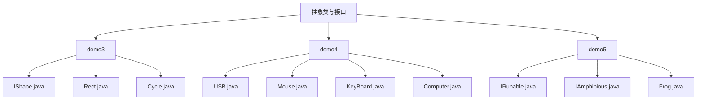
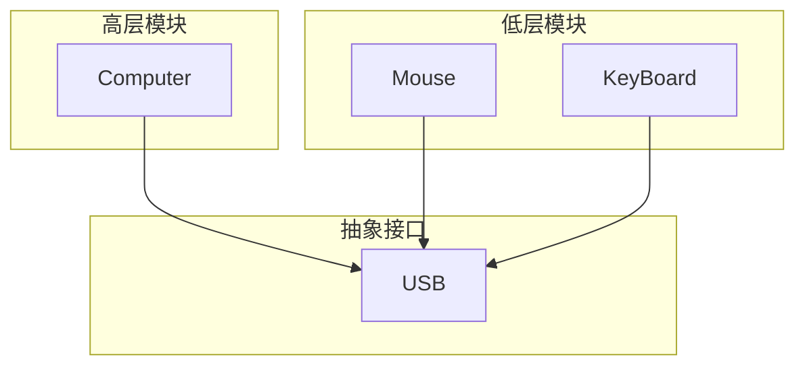
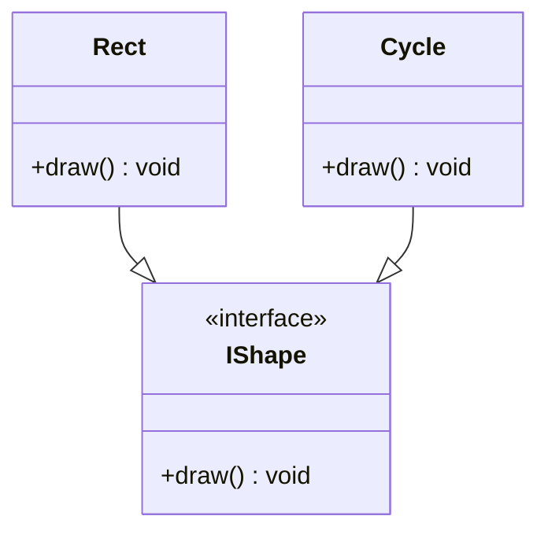
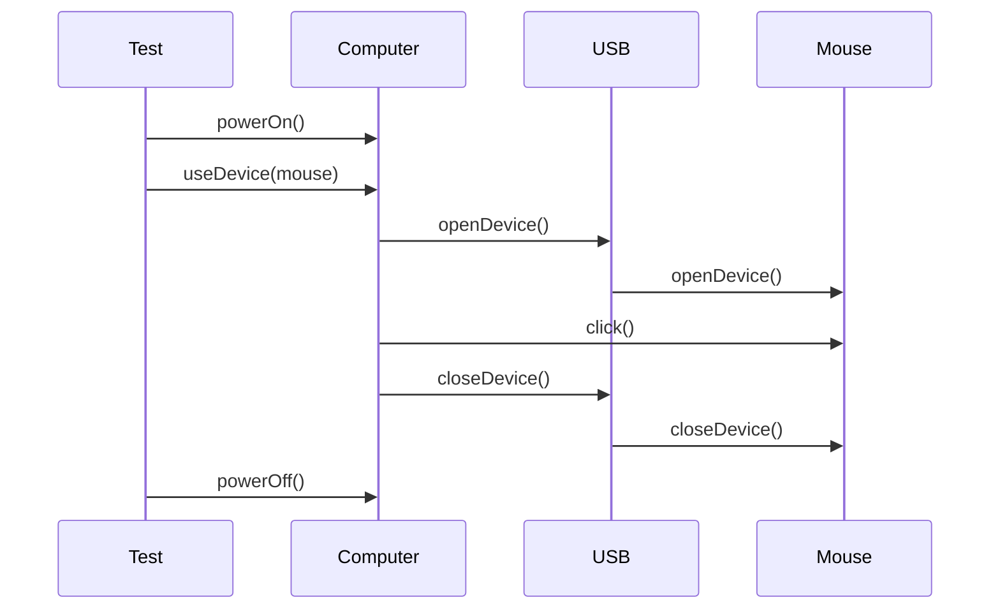
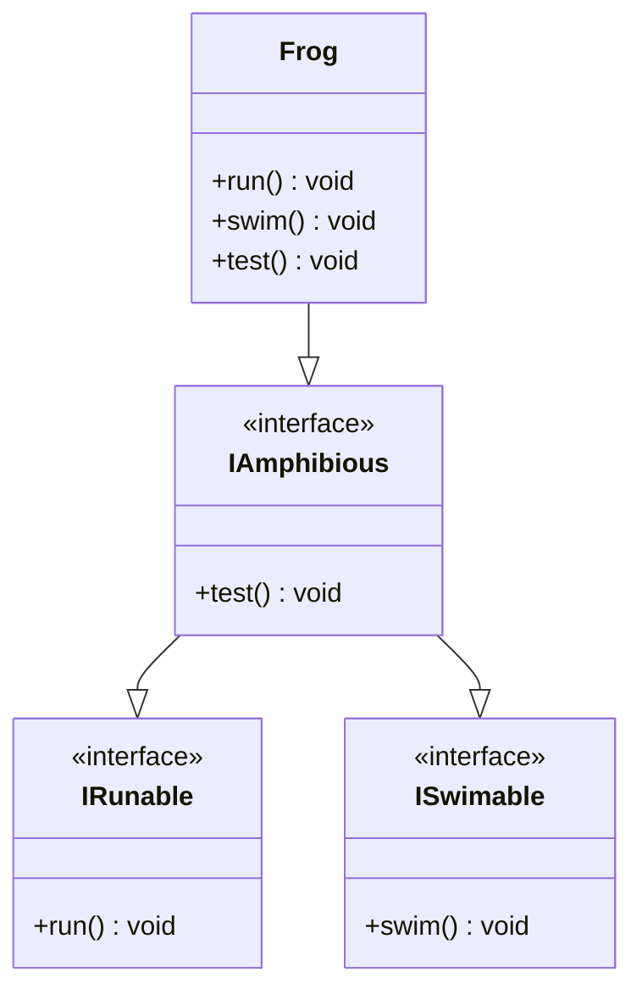
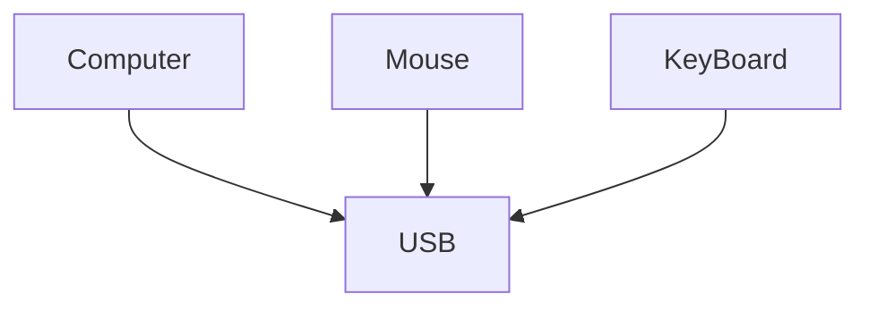

# 接口契约与多实现

<cite>
**本文档引用的文件**  
- [IShape.java](file://JavaSE_Level1/src/抽象类与接口/demo3/IShape.java)
- [Rect.java](file://JavaSE_Level1/src/抽象类与接口/demo3/Rect.java)
- [Cycle.java](file://JavaSE_Level1/src/抽象类与接口/demo3/Cycle.java)
- [Test.java](file://JavaSE_Level1/src/抽象类与接口/demo3/Test.java)
- [USB.java](file://JavaSE_Level1/src/抽象类与接口/demo4/USB.java)
- [Mouse.java](file://JavaSE_Level1/src/抽象类与接口/demo4/Mouse.java)
- [KeyBoard.java](file://JavaSE_Level1/src/抽象类与接口/demo4/KeyBoard.java)
- [Computer.java](file://JavaSE_Level1/src/抽象类与接口/demo4/Computer.java)
- [IRunable.java](file://JavaSE_Level1/src/抽象类与接口/demo5/IRunable.java)
- [IAmphibious.java](file://JavaSE_Level1/src/抽象类与接口/demo5/IAmphibious.java)
- [Frog.java](file://JavaSE_Level1/src/抽象类与接口/demo5/Frog.java)
- [Test.java](file://JavaSE_Level1/src/抽象类与接口/demo5/Test.java)
</cite>

## 目录
1. [引言](#引言)
2. [项目结构](#项目结构)
3. [核心组件](#核心组件)
4. [架构概述](#架构概述)
5. [详细组件分析](#详细组件分析)
6. [依赖分析](#依赖分析)
7. [性能考虑](#性能考虑)
8. [故障排除指南](#故障排除指南)
9. [结论](#结论)

## 引言
本文档系统阐述了Java中接口作为行为契约的设计思想，通过`IShape`和`USB`等接口实例，深入分析接口的定义、实现、多态调用及在解耦模块依赖中的核心作用。重点说明一个类如何实现多个接口以体现组合的灵活性，并解析接口中方法的隐式修饰规则和实现类的约束机制。

## 项目结构
项目`Java_learning`包含多个模块，其中与接口设计相关的代码主要位于`JavaSE_Level1/src/抽象类与接口/`目录下。该目录通过`demo3`、`demo4`和`demo5`三个子模块，分别演示了接口的基础用法、多态应用以及多接口实现。



**图示来源**
- [IShape.java](file://JavaSE_Level1/src/抽象类与接口/demo3/IShape.java)
- [USB.java](file://JavaSE_Level1/src/抽象类与接口/demo4/USB.java)
- [IAmphibious.java](file://JavaSE_Level1/src/抽象类与接口/demo5/IAmphibious.java)

## 核心组件
本项目的核心组件围绕接口的定义与实现展开。`IShape`接口定义了图形绘制的统一契约，`USB`接口定义了设备连接与断开的规范，而`IRunable`和`IAmphibious`则展示了行为接口的继承与组合。`Rect`、`Cycle`、`Mouse`、`KeyBoard`和`Frog`等类通过实现这些接口，提供了具体的行为。

**组件来源**
- [IShape.java](file://JavaSE_Level1/src/抽象类与接口/demo3/IShape.java#L1-L10)
- [USB.java](file://JavaSE_Level1/src/抽象类与接口/demo4/USB.java#L1-L6)
- [IRunable.java](file://JavaSE_Level1/src/抽象类与接口/demo5/IRunable.java#L1-L5)

## 架构概述
系统的架构体现了基于接口的松耦合设计。高层模块（如`Computer`）不直接依赖于低层模块（如`Mouse`或`KeyBoard`）的具体实现，而是依赖于它们共同实现的抽象接口（`USB`）。这种设计使得系统具有高度的可扩展性和可维护性。



**图示来源**
- [Computer.java](file://JavaSE_Level1/src/抽象类与接口/demo4/Computer.java#L1-L22)
- [USB.java](file://JavaSE_Level1/src/抽象类与接口/demo4/USB.java#L1-L6)
- [Mouse.java](file://JavaSE_Level1/src/抽象类与接口/demo4/Mouse.java#L1-L17)
- [KeyBoard.java](file://JavaSE_Level1/src/抽象类与接口/demo4/KeyBoard.java#L1-L17)

## 详细组件分析

### IShape接口与多态实现
`IShape`接口定义了所有可绘制图形必须实现的`draw()`方法，体现了接口作为统一行为规范的契约思想。

```java
public interface IShape {
    void draw(); // 默认为 public abstract
}
```

`Rect`和`Cycle`类分别实现了`IShape`接口，提供了各自具体的`draw()`方法。

```java
public class Rect implements IShape{
    @Override
    public void draw() {
        System.out.println("画一个矩形...");
    }
}
```

```java
public class Cycle implements IShape{
    @Override
    public void draw() {
        System.out.println("画一个圆圈...");
    }
}
```

这种设计允许程序在运行时根据对象的实际类型调用相应的方法，即多态性。例如，一个`IShape`类型的引用可以指向`Rect`或`Cycle`的实例，并调用其`draw()`方法。



**图示来源**
- [IShape.java](file://JavaSE_Level1/src/抽象类与接口/demo3/IShape.java#L1-L10)
- [Rect.java](file://JavaSE_Level1/src/抽象类与接口/demo3/Rect.java#L1-L8)
- [Cycle.java](file://JavaSE_Level1/src/抽象类与接口/demo3/Cycle.java#L1-L9)

**组件来源**
- [IShape.java](file://JavaSE_Level1/src/抽象类与接口/demo3/IShape.java#L1-L10)
- [Rect.java](file://JavaSE_Level1/src/抽象类与接口/demo3/Rect.java#L1-L8)
- [Cycle.java](file://JavaSE_Level1/src/抽象类与接口/demo3/Cycle.java#L1-L9)

### USB接口与设备管理
`USB`接口定义了外设必须提供的`openDevice()`和`closeDevice()`方法。

```java
public interface USB {
    void openDevice();
    void closeDevice();
}
```

`Mouse`和`KeyBoard`类都实现了`USB`接口，从而可以被`Computer`类统一管理。

```java
public class Mouse implements USB{
    @Override
    public void openDevice() {
        System.out.println("打开鼠标");
    }
    @Override
    public void closeDevice() {
        System.out.println("关闭鼠标");
    }
    public void click(){
        System.out.println("点击鼠标");
    }
}
```

`Computer`类的`useDevice(USB usb)`方法接收任何实现了`USB`接口的对象，实现了对不同外设的统一操作。



**图示来源**
- [USB.java](file://JavaSE_Level1/src/抽象类与接口/demo4/USB.java#L1-L6)
- [Mouse.java](file://JavaSE_Level1/src/抽象类与接口/demo4/Mouse.java#L1-L17)
- [Computer.java](file://JavaSE_Level1/src/抽象类与接口/demo4/Computer.java#L1-L22)
- [Test.java](file://JavaSE_Level1/src/抽象类与接口/demo4/Test.java#L1-L12)

**组件来源**
- [USB.java](file://JavaSE_Level1/src/抽象类与接口/demo4/USB.java#L1-L6)
- [Mouse.java](file://JavaSE_Level1/src/抽象类与接口/demo4/Mouse.java#L1-L17)
- [Computer.java](file://JavaSE_Level1/src/抽象类与接口/demo4/Computer.java#L1-L22)

### 多接口实现与组合灵活性
一个类可以实现多个接口，从而具备多种行为能力。`Frog`类通过实现`IAmphibious`接口（该接口继承了`IRunable`和`ISwimable`），同时具备了奔跑和游泳的能力。

```java
public interface IAmphibious extends IRunable, ISwimable{
    void test();
}
```

```java
public class Frog extends Animal implements IAmphibious{
    @Override
    public void run() { /* 实现奔跑 */ }
    @Override
    public void swim() { /* 实现游泳 */ }
    @Override
    public void test() { }
}
```

这体现了“has-a”关系的组合灵活性，即一个对象可以“拥有”多种行为，而不是被单一的继承关系所限制。



**图示来源**
- [IRunable.java](file://JavaSE_Level1/src/抽象类与接口/demo5/IRunable.java#L1-L5)
- [ISwimable.java](file://JavaSE_Level1/src/抽象类与接口/demo5/ISwimable.java#L1-L5)
- [IAmphibious.java](file://JavaSE_Level1/src/抽象类与接口/demo5/IAmphibious.java#L1-L4)
- [Frog.java](file://JavaSE_Level1/src/抽象类与接口/demo5/Frog.java#L1-L27)

**组件来源**
- [IAmphibious.java](file://JavaSE_Level1/src/抽象类与接口/demo5/IAmphibious.java#L1-L4)
- [Frog.java](file://JavaSE_Level1/src/抽象类与接口/demo5/Frog.java#L1-L27)

## 依赖分析
项目中的依赖关系清晰地展示了接口如何解耦模块。`Computer`模块依赖于`USB`接口，而`Mouse`和`KeyBoard`模块也依赖于`USB`接口。`Computer`与`Mouse`/`KeyBoard`之间没有直接依赖，它们通过`USB`接口进行交互。



**图示来源**
- [Computer.java](file://JavaSE_Level1/src/抽象类与接口/demo4/Computer.java#L1-L22)
- [Mouse.java](file://JavaSE_Level1/src/抽象类与接口/demo4/Mouse.java#L1-L17)
- [KeyBoard.java](file://JavaSE_Level1/src/抽象类与接口/demo4/KeyBoard.java#L1-L17)
- [USB.java](file://JavaSE_Level1/src/抽象类与接口/demo4/USB.java#L1-L6)

**依赖来源**
- [Computer.java](file://JavaSE_Level1/src/抽象类与接口/demo4/Computer.java#L1-L22)
- [USB.java](file://JavaSE_Level1/src/抽象类与接口/demo4/USB.java#L1-L6)

## 性能考虑
接口本身不会带来显著的性能开销。多态调用通过动态分派实现，其性能与普通方法调用相当。接口的主要优势在于设计层面，它提升了代码的可维护性和可扩展性，间接有助于长期的性能优化。

## 故障排除指南
*   **编译错误：未实现抽象方法**：确保实现类重写了接口中的所有抽象方法。
*   **ClassCastException**：在使用`instanceof`检查后进行类型转换时，确保逻辑正确。
*   **空指针异常**：在调用接口方法前，确保接口引用不为`null`。

**故障排除来源**
- [Computer.java](file://JavaSE_Level1/src/抽象类与接口/demo4/Computer.java#L15-L20) (instanceof 使用示例)
- [Frog.java](file://JavaSE_Level1/src/抽象类与接口/demo5/Frog.java#L1-L27) (实现多个方法)

## 结论
接口是Java中实现契约式设计的核心机制。通过`IShape`和`USB`等示例，我们看到接口如何定义统一的行为规范，强制实现类提供具体实现。一个类实现多个接口的能力，极大地增强了代码的灵活性和可复用性。`Computer`类通过依赖`USB`接口而非具体设备，完美地诠释了“依赖倒置原则”，实现了模块间的松耦合。这种基于接口的设计模式是构建健壮、可扩展软件系统的基础。