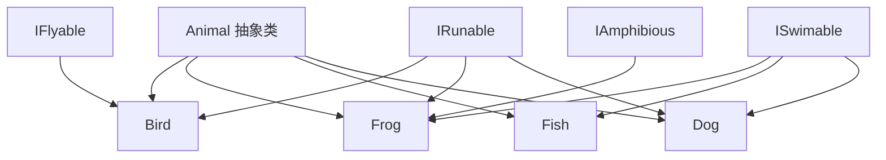
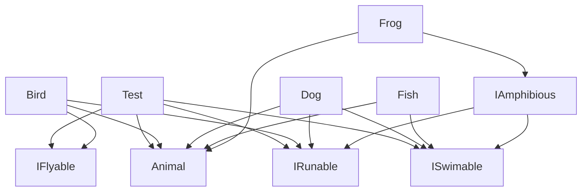

# 接口组合与行为建模

<cite>
**本文档引用文件**  
- [IFlyable.java](file://JavaSE_Level1/src/抽象类与接口/demo5/IFlyable.java)
- [IRunable.java](file://JavaSE_Level1/src/抽象类与接口/demo5/IRunable.java)
- [ISwimable.java](file://JavaSE_Level1/src/抽象类与接口/demo5/ISwimable.java)
- [IAmphibious.java](file://JavaSE_Level1/src/抽象类与接口/demo5/IAmphibious.java)
- [Animal.java](file://JavaSE_Level1/src/抽象类与接口/demo5/Animal.java)
- [Bird.java](file://JavaSE_Level1/src/抽象类与接口/demo5/Bird.java)
- [Frog.java](file://JavaSE_Level1/src/抽象类与接口/demo5/Frog.java)
- [Fish.java](file://JavaSE_Level1/src/抽象类与接口/demo5/Fish.java)
- [Dog.java](file://JavaSE_Level1/src/抽象类与接口/demo5/Dog.java)
- [Test.java](file://JavaSE_Level1/src/抽象类与接口/demo5/Test.java)
</cite>

## 目录
1. [引言](#引言)
2. [项目结构](#项目结构)
3. [核心组件](#核心组件)
4. [架构概览](#架构概览)
5. [详细组件分析](#详细组件分析)
6. [依赖关系分析](#依赖关系分析)
7. [性能考量](#性能考量)
8. [故障排查指南](#故障排查指南)
9. [结论](#结论)

## 引言
本文档旨在深入探讨接口在复杂行为建模中的优势，通过分析动物行为接口（如飞行、奔跑、游泳）的设计与实现，展示细粒度接口如何支持多重行为的灵活装配。我们将以`Bird`实现`IFlyable`和`IRunable`、`Frog`实现`IRunable`和`ISwimable`等组合方式为例，说明接口相较于抽象类在构建可复用组件体系中的优越性。同时，结合Java 8默认方法特性，讨论接口演化对现有实现类的影响。

## 项目结构
本项目位于``目录下，重点分析路径为`JavaSE_Level1/src/抽象类与接口/demo5`，该模块集中展示了接口组合与多态行为的应用。该目录包含多个Java文件，分别定义了动物基类、具体动物类以及行为接口。



**图示来源**  
- [Animal.java](file://JavaSE_Level1/src/抽象类与接口/demo5/Animal.java)
- [Bird.java](file://JavaSE_Level1/src/抽象类与接口/demo5/Bird.java)
- [Frog.java](file://JavaSE_Level1/src/抽象类与接口/demo5/Frog.java)
- [Fish.java](file://JavaSE_Level1/src/抽象类与接口/demo5/Fish.java)
- [Dog.java](file://JavaSE_Level1/src/抽象类与接口/demo5/Dog.java)
- [IFlyable.java](file://JavaSE_Level1/src/抽象类与接口/demo5/IFlyable.java)
- [IRunable.java](file://JavaSE_Level1/src/抽象类与接口/demo5/IRunable.java)
- [ISwimable.java](file://JavaSE_Level1/src/抽象类与接口/demo5/ISwimable.java)
- [IAmphibious.java](file://JavaSE_Level1/src/抽象类与接口/demo5/IAmphibious.java)

**本节来源**  
- [Animal.java](file://JavaSE_Level1/src/抽象类与接口/demo5/Animal.java#L1-L14)
- [Bird.java](file://JavaSE_Level1/src/抽象类与接口/demo5/Bird.java#L1-L23)

## 核心组件
本节分析系统中的核心类与接口，包括`Animal`抽象基类、`IFlyable`、`IRunable`、`ISwimable`等行为接口，以及`Bird`、`Frog`、`Dog`等具体实现类。这些组件共同构成了一个基于接口的行为建模系统，支持灵活的行为组合。

**本节来源**  
- [Animal.java](file://JavaSE_Level1/src/抽象类与接口/demo5/Animal.java#L1-L14)
- [IFlyable.java](file://JavaSE_Level1/src/抽象类与接口/demo5/IFlyable.java#L1-L4)
- [IRunable.java](file://JavaSE_Level1/src/抽象类与接口/demo5/IRunable.java#L1-L4)
- [ISwimable.java](file://JavaSE_Level1/src/抽象类与接口/demo5/ISwimable.java#L1-L4)

## 架构概览
整个系统采用基于接口的分层设计，顶层为抽象动物类`Animal`，定义所有动物共有的属性（名称、年龄）和抽象方法`eat()`。行为能力则通过独立接口实现，如`IFlyable`、`IRunable`、`ISwimable`，每个接口封装单一行为。具体动物类通过继承`Animal`并实现一个或多个接口来组合所需行为。

```mermaid
classDiagram
class Animal {
+String name
+int age
+Animal(String, int)
+abstract void eat()
}
class Bird {
+Bird(String, int)
+void eat()
+void fly()
+void run()
}
class Dog {
+Dog(String, int)
+void eat()
+void run()
+void swim()
}
class Fish {
+Fish(String, int)
+void eat()
+void swim()
}
class Frog {
+Frog(String, int)
+void eat()
+void run()
+void swim()
+void test()
}
interface IFlyable {
+void fly()
}
interface IRunable {
+void run()
}
interface ISwimable {
+void swim()
}
interface IAmphibious {
+void test()
}
IAmphibious --|> IRunable
IAmphibious --|> ISwimable
Animal <|-- Bird
Animal <|-- Dog
Animal <|-- Fish
Animal <|-- Frog
Bird ..|> IFlyable
Bird ..|> IRunable
Dog ..|> IRunable
Dog ..|> ISwimable
Fish ..|> ISwimable
Frog ..|> IAmphibious
```

**图示来源**  
- [Animal.java](file://JavaSE_Level1/src/抽象类与接口/demo5/Animal.java#L1-L14)
- [Bird.java](file://JavaSE_Level1/src/抽象类与接口/demo5/Bird.java#L1-L23)
- [Dog.java](file://JavaSE_Level1/src/抽象类与接口/demo5/Dog.java#L1-L23)
- [Fish.java](file://JavaSE_Level1/src/抽象类与接口/demo5/Fish.java#L1-L18)
- [Frog.java](file://JavaSE_Level1/src/抽象类与接口/demo5/Frog.java#L1-L28)
- [IFlyable.java](file://JavaSE_Level1/src/抽象类与接口/demo5/IFlyable.java#L1-L4)
- [IRunable.java](file://JavaSE_Level1/src/抽象类与接口/demo5/IRunable.java#L1-L4)
- [ISwimable.java](file://JavaSE_Level1/src/抽象类与接口/demo5/ISwimable.java#L1-L4)
- [IAmphibious.java](file://JavaSE_Level1/src/抽象类与接口/demo5/IAmphibious.java#L1-L5)

## 详细组件分析

### 动物行为接口设计分析
本节分析各个行为接口的设计意图与实现方式。

#### 飞行行为接口 (IFlyable)
`IFlyable`接口定义了`fly()`方法，表示具备飞行能力的动物可以实现此接口。该接口采用单一职责原则，仅关注飞行行为。

```java
public interface IFlyable {
    public void fly();
}
```

**本节来源**  
- [IFlyable.java](file://JavaSE_Level1/src/抽象类与接口/demo5/IFlyable.java#L1-L4)

#### 奔跑行为接口 (IRunable)
`IRunable`接口定义了`run()`方法，表示具备奔跑能力的动物可以实现此接口。

```java
public interface IRunable {
    public void run();
}
```

**本节来源**  
- [IRunable.java](file://JavaSE_Level1/src/抽象类与接口/demo5/IRunable.java#L1-L4)

#### 游泳行为接口 (ISwimable)
`ISwimable`接口定义了`swim()`方法，表示具备游泳能力的动物可以实现此接口。

```java
public interface ISwimable {
    public void swim();
}
```

**本节来源**  
- [ISwimable.java](file://JavaSE_Level1/src/抽象类与接口/demo5/ISwimable.java#L1-L4)

#### 两栖行为接口 (IAmphibious)
`IAmphibious`接口继承自`IRunable`和`ISwimable`，表示同时具备奔跑和游泳能力的两栖动物。此外，它还定义了一个额外的`test()`方法，可用于扩展特定行为。

```java
public interface IAmphibious extends IRunable, ISwimable {
    void test();
}
```

**本节来源**  
- [IAmphibious.java](file://JavaSE_Level1/src/抽象类与接口/demo5/IAmphibious.java#L1-L5)

### 具体动物类实现分析

#### 鸟类 (Bird) 实现分析
`Bird`类继承自`Animal`，并实现了`IFlyable`和`IRunable`接口，表示鸟既能飞也能跑（跳跃）。其`fly()`方法输出飞行动作，`run()`方法描述为“用两条鸟腿跳”。

```java
public class Bird extends Animal implements IRunable, IFlyable {
    @Override
    public void fly() {
        System.out.println(this.name + "正在用翅膀飞翔...");
    }

    @Override
    public void run() {
        System.out.println(this.name + "正在用两条鸟腿跳...");
    }
}
```

**本节来源**  
- [Bird.java](file://JavaSE_Level1/src/抽象类与接口/demo5/Bird.java#L1-L23)

#### 青蛙类 (Frog) 实现分析
`Frog`类实现`IAmphibious`接口，从而间接具备`run()`和`swim()`能力。这体现了接口继承的优势：通过组合已有接口快速构建复合行为。

**本节来源**  
- [Frog.java](file://JavaSE_Level1/src/抽象类与接口/demo5/Frog.java#L1-L28)

#### 狗类 (Dog) 实现分析
`Dog`类实现`IRunable`和`ISwimable`，表示狗能跑能游。其`swim()`方法描述为“用四条狗腿狗刨”，体现了行为的具体化实现。

**本节来源**  
- [Dog.java](file://JavaSE_Level1/src/抽象类与接口/demo5/Dog.java#L1-L23)

#### 鱼类 (Fish) 实现分析
`Fish`类仅实现`ISwimable`，符合鱼类只能游泳的生物特性，展示了接口如何精确建模单一行为。

**本节来源**  
- [Fish.java](file://JavaSE_Level1/src/抽象类与接口/demo5/Fish.java#L1-L18)

## 依赖关系分析
系统中各组件通过接口进行松耦合连接。测试类`Test`中的静态方法接受接口类型参数（如`flying(IFlyable)`），实现了多态调用，增强了代码的可扩展性和可维护性。



**图示来源**  
- [Test.java](file://JavaSE_Level1/src/抽象类与接口/demo5/Test.java#L1-L40)
- [Bird.java](file://JavaSE_Level1/src/抽象类与接口/demo5/Bird.java)
- [Dog.java](file://JavaSE_Level1/src/抽象类与接口/demo5/Dog.java)
- [Fish.java](file://JavaSE_Level1/src/抽象类与接口/demo5/Fish.java)
- [Frog.java](file://JavaSE_Level1/src/抽象类与接口/demo5/Frog.java)

**本节来源**  
- [Test.java](file://JavaSE_Level1/src/抽象类与接口/demo5/Test.java#L1-L40)

## 性能考量
接口本身不包含状态，仅定义行为契约，因此在运行时具有较低的内存开销。多态调用通过动态分派实现，虽有轻微性能损耗，但换来了极高的灵活性和可扩展性。对于高频调用场景，可通过缓存接口实例或使用具体类型调用优化性能。

## 故障排查指南
- **问题：实现类未覆盖接口方法**  
  确保所有接口方法均被`@Override`标注并正确实现。
- **问题：多接口方法名冲突**  
  Java 8起支持默认方法，可通过`default`关键字提供默认实现避免冲突。
- **问题：无法实例化抽象类**  
  `Animal`为抽象类，必须通过具体子类（如`Bird`）实例化。

**本节来源**  
- [Animal.java](file://JavaSE_Level1/src/抽象类与接口/demo5/Animal.java#L1-L14)
- [Test.java](file://JavaSE_Level1/src/抽象类与接口/demo5/Test.java#L1-L40)

## 结论
通过接口组合，系统实现了高度灵活的行为建模。相比抽象类，接口支持多重继承，允许类自由组合所需行为，避免了类继承的局限性。这种设计模式特别适用于需要精细控制行为组合的场景，是构建可复用、可扩展组件体系的核心技术。