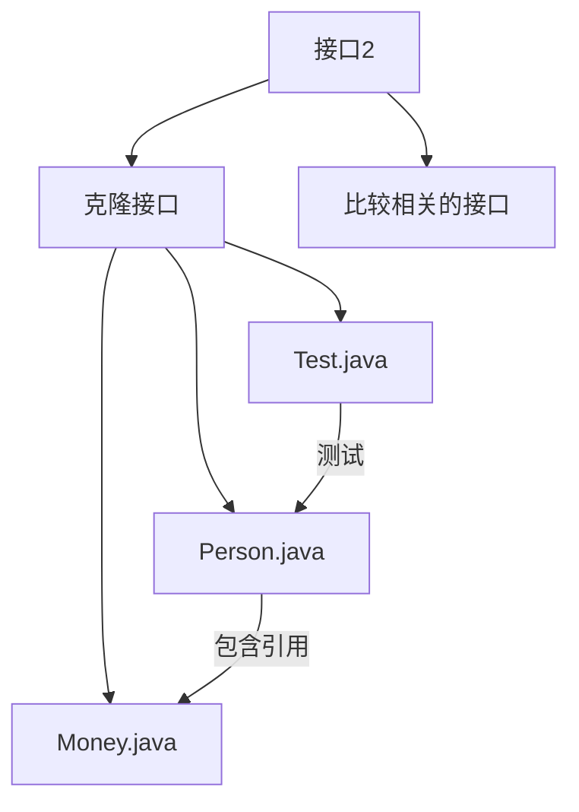
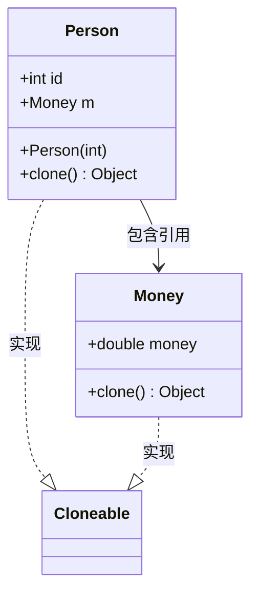

# 克隆机制详解

<cite>
**本文档引用的文件**  
- [Person.java](file://JavaSE_Level1/src/接口2/克隆接口/Person.java)
- [Money.java](file://JavaSE_Level1/src/接口2/克隆接口/Money.java)
- [Test.java](file://JavaSE_Level1/src/接口2/克隆接口/Test.java)
</cite>

## 目录
1. [引言](#引言)  
2. [项目结构](#项目结构)  
3. [核心组件分析](#核心组件分析)  
4. [克隆机制深度解析](#克隆机制深度解析)  
5. [浅拷贝与深拷贝对比](#浅拷贝与深拷贝对比)  
6. [内存模型与对象复制](#内存模型与对象复制)  
7. [克隆过程中的关键问题](#克隆过程中的关键问题)  
8. [最佳实践与替代方案](#最佳实践与替代方案)  
9. [结论](#结论)

## 引言
本文档旨在深入解析Java中的对象克隆机制，重点围绕`Cloneable`接口和`clone()`方法的使用规范。通过分析`Person`类与`Money`类的具体实现，详细阐述浅拷贝带来的引用共享问题，并展示如何通过深拷贝解决该问题。同时，结合测试用例说明克隆行为的实际效果，帮助开发者理解克隆过程中的内存分配、异常处理及设计权衡。

## 项目结构
本项目位于``目录下，涉及克隆机制的核心代码位于`JavaSE_Level1\src\接口2\克隆接口`路径中。该模块包含三个关键Java文件：`Person.java`、`Money.java`和`Test.java`，分别代表可克隆的实体类、嵌套引用类以及测试驱动类。



**图示来源**  
- [Person.java](file://JavaSE_Level1/src/接口2/克隆接口/Person.java#L2)
- [Money.java](file://JavaSE_Level1/src/接口2/克隆接口/Money.java#L2)
- [Test.java](file://JavaSE_Level1/src/接口2/克隆接口/Test.java#L3)

## 核心组件分析

### Person类分析
`Person`类实现了`Cloneable`接口，并重写了`clone()`方法。其包含两个字段：基本类型`id`和引用类型`m`（指向`Money`对象）。该类是演示深拷贝逻辑的核心。

```java
public class Person implements Cloneable {
    public int id;
    public Money m = new Money();

    public Person(int id) {
        this.id = id;
    }

    @Override
    protected Object clone() throws CloneNotSupportedException {
        Person tmp = (Person) super.clone();
        tmp.m = (Money) this.m.clone();
        return tmp;
    }
}
```

**代码来源**  
- [Person.java](file://JavaSE_Level1/src/接口2/克隆接口/Person.java#L2-L26)

### Money类分析
`Money`类同样实现`Cloneable`接口，其`clone()`方法直接调用`super.clone()`，实现浅拷贝。由于`Money`仅包含基本类型字段`money`，因此其浅拷贝等价于值复制。

```java
public class Money implements Cloneable {
    public double money = 9.9;

    @Override
    protected Object clone() throws CloneNotSupportedException {
        return super.clone();
    }
}
```

**代码来源**  
- [Money.java](file://JavaSE_Level1/src/接口2/克隆接口/Money.java#L2-L9)

### Test类分析
`Test`类包含主方法，用于创建`Person`实例并执行克隆操作，随后修改克隆对象的`Money`字段，验证原始对象是否受影响，从而判断拷贝类型。

```java
public class Test {
    public static void main(String[] args) throws Exception {
        Person person1 = new Person(12);
        Person person2 = (Person) person1.clone();
        System.out.println(person1.m.money); // 输出: 9.9
        System.out.println(person2.m.money); // 输出: 9.9
        System.out.println("===========");

        person2.m.money = 99.99;

        System.out.println(person1.m.money); // 若为深拷贝，输出: 9.9
        System.out.println(person2.m.money); // 输出: 99.99
        System.out.println("===========");
    }
}
```

**代码来源**  
- [Test.java](file://JavaSE_Level1/src/接口2/克隆接口/Test.java#L3-L19)

## 克隆机制深度解析

### Cloneable接口的作用
`Cloneable`是一个标记接口（marker interface），不包含任何方法。当一个类实现该接口时，表明其允许通过`Object.clone()`方法进行克隆。若未实现此接口而调用`clone()`，将抛出`CloneNotSupportedException`。

### clone()方法的重写规范
- 必须声明为`protected`或`public`，通常重写为`public`以方便外部调用。
- 必须声明抛出`CloneNotSupportedException`。
- 应调用`super.clone()`作为起点，以确保父类字段被正确复制。
- 对于引用类型字段，需递归调用其`clone()`方法以实现深拷贝。



**图示来源**  
- [Person.java](file://JavaSE_Level1/src/接口2/克隆接口/Person.java#L2-L26)
- [Money.java](file://JavaSE_Level1/src/接口2/克隆接口/Money.java#L2-L9)

## 浅拷贝与深拷贝对比

### 浅拷贝问题演示
若`Person`的`clone()`方法仅返回`super.clone()`，则`person1`和`person2`将共享同一个`Money`对象。此时修改`person2.m.money`会影响`person1.m.money`。

### 深拷贝解决方案
当前实现通过以下方式实现深拷贝：
```java
Person tmp = (Person) super.clone();
tmp.m = (Money) this.m.clone(); // 显式克隆引用对象
```
此方式确保`person1.m`与`person2.m`指向堆中不同的`Money`实例，互不影响。

## 内存模型与对象复制

```mermaid
graph TD
subgraph "堆内存"
P1[Person@1001] --> M1[Money@2001]
P2[Person@1002] --> M2[Money@2002]
end
subgraph "栈内存"
L1[person1] --> P1
L2[person2] --> P2
end
style P1 fill:#f9f,stroke:#333
style P2 fill:#f9f,stroke:#333
style M1 fill:#bbf,stroke:#333
style M2 fill:#bbf,stroke:#333
style L1 fill:#9f9,stroke:#333
style L2 fill:#9f9,stroke:#333
```

**图示说明**  
- 浅拷贝时，`P1`和`P2`会共享`M1`。
- 深拷贝时，`P1`指向`M1`，`P2`指向独立的`M2`。

**图示来源**  
- [Person.java](file://JavaSE_Level1/src/接口2/克隆接口/Person.java#L19-L22)
- [Money.java](file://JavaSE_Level1/src/接口2/克隆接口/Money.java#L7)

## 克隆过程中的关键问题

### 构造器绕过问题
`clone()`方法不调用构造函数，可能导致对象初始化逻辑被跳过。因此，应在克隆后手动确保对象状态一致性。

### 访问控制处理
`clone()`在`Object`中为`protected`，子类需重写为`public`才能被外部访问。

### 异常声明要求
必须声明`throws CloneNotSupportedException`，即使内部已处理，因`super.clone()`可能抛出该异常。

## 最佳实践与替代方案

### 克隆设计最佳实践
1. 优先考虑是否真正需要克隆，避免过度设计。
2. 实现深拷贝时，确保所有嵌套引用对象也支持克隆。
3. 考虑使用`final`字段时的限制（`clone()`无法修改`final`字段）。
4. 文档化克隆行为（浅/深拷贝）。

### 替代方案
- **拷贝构造函数**：`public Person(Person other)`，更直观且可控。
- **Builder模式**：适用于复杂对象构建。
- **序列化反序列化**：可实现自动深拷贝，但性能较低。

## 结论
Java的克隆机制提供了对象复制的基础能力，但其正确使用需要深入理解浅拷贝与深拷贝的区别。通过`Person`和`Money`类的实例分析，我们验证了深拷贝在避免引用共享问题上的有效性。尽管克隆功能强大，但在现代Java开发中，拷贝构造函数或Builder模式往往更安全、更清晰。开发者应根据具体场景权衡选择最合适的对象复制策略。