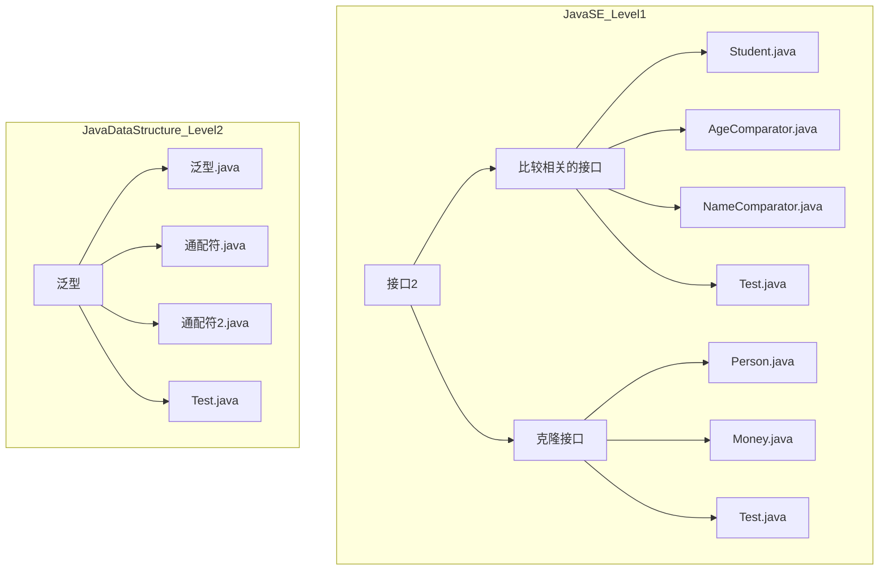
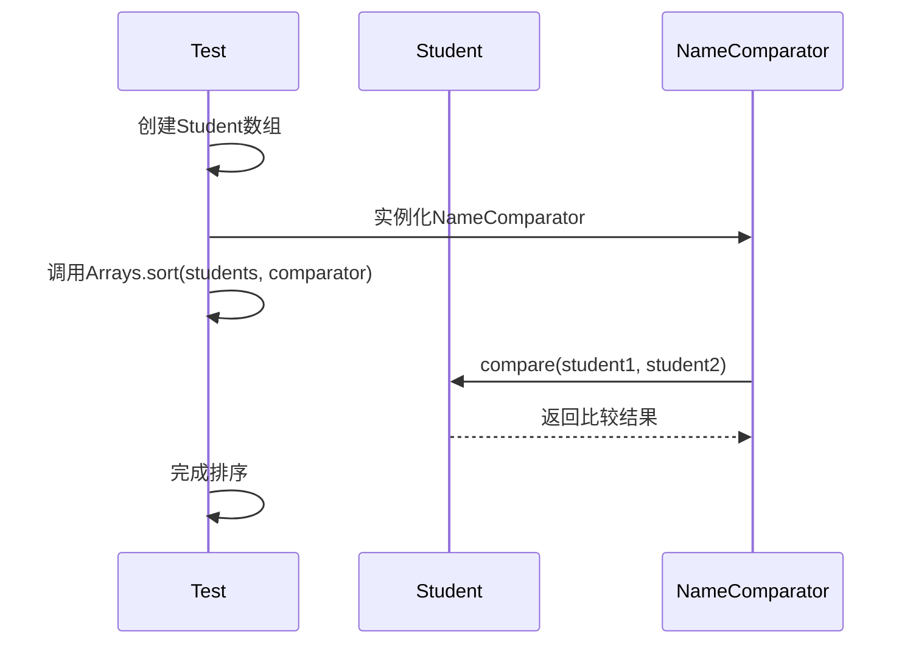

# 泛型与克隆

<cite>
**本文档引用的文件**  
- [Student.java](file://JavaSE_Level1/src/接口2/比较相关的接口/Student.java)
- [AgeComparator.java](file://JavaSE_Level1/src/接口2/比较相关的接口/AgeComparator.java)
- [NameComparator.java](file://JavaSE_Level1/src/接口2/比较相关的接口/NameComparator.java)
- [Test.java](file://JavaSE_Level1/src/接口2/比较相关的接口/Test.java)
- [Person.java](file://JavaSE_Level1/src/接口2/克隆接口/Person.java)
- [Money.java](file://JavaSE_Level1/src/接口2/克隆接口/Money.java)
- [Test.java](file://JavaSE_Level1/src/接口2/克隆接口/Test.java)
- [泛型.java](file://JavaDataStructure_Level2/src/泛型/泛型.java)
- [通配符.java](file://JavaDataStructure_Level2/src/泛型/通配符.java)
- [通配符2.java](file://JavaDataStructure_Level2/src/泛型/通配符2.java)
- [Test.java](file://JavaDataStructure_Level2/src/泛型/Test.java)
</cite>

## 目录
1. [引言](#引言)
2. [项目结构](#项目结构)
3. [核心组件](#核心组件)
4. [泛型基础与类型擦除](#泛型基础与类型擦除)
5. [泛型在排序中的应用](#泛型在排序中的应用)
6. [克隆机制详解](#克隆机制详解)
7. [泛型通配符的使用场景](#泛型通配符的使用场景)
8. [结论](#结论)

## 引言
本文档深入讲解Java中的泛型和克隆机制，结合具体代码示例分析其语法、实现原理及应用场景。重点涵盖泛型的基础语法与类型擦除机制、比较器接口中泛型的排序应用、Cloneable接口的使用、浅拷贝与深拷贝的区别，并通过内存布局图和序列化对比帮助理解。文档旨在为初学者和中级开发者提供清晰、系统的知识体系。

## 项目结构
项目主要分为两个层级：`JavaSE_Level1` 和 `JavaDataStructure_Level2`，分别对应Java基础语法和数据结构进阶内容。本文档重点关注 `JavaSE_Level1/src/接口2` 下的“比较相关的接口”和“克隆接口”模块，以及 `JavaDataStructure_Level2/src/泛型` 模块。



**图示来源**
- [Student.java](file://JavaSE_Level1/src/接口2/比较相关的接口/Student.java)
- [Person.java](file://JavaSE_Level1/src/接口2/克隆接口/Person.java)
- [泛型.java](file://JavaDataStructure_Level2/src/泛型/泛型.java)

## 核心组件
本文档的核心组件包括：
- **Student类**：用于演示Comparable接口和Comparator接口的排序逻辑。
- **Person与Money类**：用于展示对象克隆，特别是深拷贝的实现。
- **泛型类（如Alg、Message、Plate）**：用于说明泛型的定义、约束和通配符的使用。

**本节来源**
- [Student.java](file://JavaSE_Level1/src/接口2/比较相关的接口/Student.java)
- [Person.java](file://JavaSE_Level1/src/接口2/克隆接口/Person.java)
- [泛型.java](file://JavaDataStructure_Level2/src/泛型/泛型.java)

## 泛型基础与类型擦除
泛型是Java中实现类型安全的重要机制，允许在定义类、接口和方法时使用类型参数。

### 泛型语法
在 `Test.java` 中，`MyArray<T>` 类展示了泛型的基本用法：
```java
class MyArray<T> {
    public Object[] array = new Object[10];
    public void setVal(int pos, T val) { this.array[pos] = val; }
    public T getPos(int pos) { return (T)this.array[pos]; }
}
```
该类可以安全地存储和获取任意类型的对象，避免了强制类型转换的错误。

### 类型擦除
Java的泛型在编译后会被“类型擦除”，即所有泛型信息被替换为它们的边界类型（如 `Object` 或指定的上界）。例如，在 `泛型.java` 中：
```java
class Alg<T extends Comparable<T>> {
    public T findMax(T[] array) { ... }
}
```
编译后，`T` 被擦除为 `Comparable`，这意味着运行时无法获取 `T` 的具体类型信息。

```mermaid
classDiagram
class Alg<T> {
+T findMax(T[] array)
}
class Alg_Erased {
+Comparable findMax(Comparable[] array)
}
note right of Alg<T> : 编译前的泛型类
note right of Alg_Erased : 编译后的实际类类型擦除
```

**图示来源**
- [泛型.java](file://JavaDataStructure_Level2/src/泛型/泛型.java)
- [Test.java](file://JavaDataStructure_Level2/src/泛型/Test.java)

**本节来源**
- [泛型.java](file://JavaDataStructure_Level2/src/泛型/泛型.java)
- [Test.java](file://JavaDataStructure_Level2/src/泛型/Test.java)

## 泛型在排序中的应用
泛型在排序中通过 `Comparable` 和 `Comparator` 接口实现灵活的比较逻辑。

### Comparable接口
`Student` 类实现了 `Comparable<Student>` 接口，定义了默认的比较规则（按年龄排序）：
```java
public class Student implements Comparable<Student> {
    public int age;
    @Override
    public int compareTo(Student o) {
        return this.age - o.age; // 年龄升序
    }
}
```

### Comparator接口
`AgeComparator` 和 `NameComparator` 是独立的比较器类，实现了 `Comparator<Student>` 接口，允许按不同字段排序：
```java
public class AgeComparator implements Comparator<Student> {
    @Override
    public int compare(Student o1, Student o2) {
        return o1.age - o2.age;
    }
}

public class NameComparator implements Comparator<Student> {
    @Override
    public int compare(Student o1, Student o2) {
        return o1.name.compareTo(o2.name);
    }
}
```

### 排序测试
在 `Test.java` 中，通过自定义冒泡排序或 `Arrays.sort()` 方法应用这些比较器：
```java
// 使用Comparable排序
bubbleSort(students); // 按年龄排序

// 使用Comparator排序
Arrays.sort(students, new NameComparator()); // 按姓名排序
```



**图示来源**
- [Student.java](file://JavaSE_Level1/src/接口2/比较相关的接口/Student.java)
- [NameComparator.java](file://JavaSE_Level1/src/接口2/比较相关的接口/NameComparator.java)
- [Test.java](file://JavaSE_Level1/src/接口2/比较相关的接口/Test.java)

**本节来源**
- [Student.java](file://JavaSE_Level1/src/接口2/比较相关的接口/Student.java)
- [AgeComparator.java](file://JavaSE_Level1/src/接口2/比较相关的接口/AgeComparator.java)
- [NameComparator.java](file://JavaSE_Level1/src/接口2/比较相关的接口/NameComparator.java)
- [Test.java](file://JavaSE_Level1/src/接口2/比较相关的接口/Test.java)

## 克隆机制详解
Java中的克隆机制通过 `Cloneable` 接口和 `clone()` 方法实现。

### Cloneable接口
`Cloneable` 是一个标记接口，实现它表示该类支持克隆。`Person` 类实现了 `Cloneable`：
```java
public class Person implements Cloneable {
    public int id;
    public Money m = new Money();
}
```

### 浅拷贝与深拷贝
- **浅拷贝**：直接调用 `super.clone()`，只复制对象本身，其引用类型的字段仍指向原对象。
- **深拷贝**：在浅拷贝的基础上，递归地克隆所有引用类型的字段。

在 `Person.java` 中，`clone()` 方法实现了深拷贝：
```java
@Override
protected Object clone() throws CloneNotSupportedException {
    Person tmp = (Person)super.clone(); // 浅拷贝
    tmp.m = (Money)this.m.clone(); // 深拷贝：克隆Money对象
    return tmp;
}
```

### 内存布局与测试
在 `Test.java` 中，通过修改克隆对象的 `money` 字段来验证深拷贝：
```java
Person person1 = new Person(12);
Person person2 = (Person) person1.clone();
person2.m.money = 99.99; // 修改克隆对象
// 输出：person1.m.money 仍为 9.9，证明是深拷贝
```

```mermaid
graph TD
subgraph "克隆前"
P1[Person1] --> M1[Money1: money=9.9]
end
subgraph "浅拷贝后"
P2[Person2] --> M1
end
subgraph "深拷贝后"
P3[Person3] --> M2[Money2: money=9.9]
end
note right of P1 : 原始对象
note right of P2 : 浅拷贝：共享Money对象
note right of P3 : 深拷贝：独立的Money对象
```

**图示来源**
- [Person.java](file://JavaSE_Level1/src/接口2/克隆接口/Person.java)
- [Money.java](file://JavaSE_Level1/src/接口2/克隆接口/Money.java)
- [Test.java](file://JavaSE_Level1/src/接口2/克隆接口/Test.java)

**本节来源**
- [Person.java](file://JavaSE_Level1/src/接口2/克隆接口/Person.java)
- [Money.java](file://JavaSE_Level1/src/接口2/克隆接口/Money.java)
- [Test.java](file://JavaSE_Level1/src/接口2/克隆接口/Test.java)

## 泛型通配符的使用场景
泛型通配符（`?`）用于处理不确定的类型，提高代码的灵活性。

### 无界通配符
`通配符.java` 中的 `fun(Message<?>)` 方法可以接受任何类型的 `Message`：
```java
public static void fun(Message<?> temp){
    System.out.println(temp.getMessage());
}
```

### 上界通配符
`<? extends T>` 表示类型是 `T` 或其子类。在 `通配符2.java` 中：
```java
public static void fun1(Plate<? extends Fruit> temp) {
    System.out.println(temp.getData()); // 可以读取
    // temp.setData(new Banana()); // 编译错误！不能写入
}
```
这保证了类型安全，但限制了写入操作。

### 下界通配符
`<? super T>` 表示类型是 `T` 或其父类。在 `通配符2.java` 中：
```java
public static void fun2(Plate<? super Fruit> pa) {
    pa.setData(new Banana()); // 可以写入Fruit的子类
    Object o = pa.getData(); // 读取时只能作为Object
}
```
这允许写入，但读取时类型信息丢失。

```mermaid
classDiagram
class Food
class Fruit
class Apple
class Banana
class Plate~T~
Fruit --|> Food
Apple --|> Fruit
Banana --|> Fruit
Plate~T~ : +T getData()
Plate~T~ : +void setData(T)
class PlateExtends
PlateExtends : Plate<? extends Fruit>
PlateExtends ..> Fruit : 上界
note right of PlateExtends : 可读不可写
class PlateSuper
PlateSuper : Plate<? super Fruit>
PlateSuper ..> Fruit : 下界
note right of PlateSuper : 可写不可读类型安全
```

**图示来源**
- [通配符.java](file://JavaDataStructure_Level2/src/泛型/通配符.java)
- [通配符2.java](file://JavaDataStructure_Level2/src/泛型/通配符2.java)

**本节来源**
- [通配符.java](file://JavaDataStructure_Level2/src/泛型/通配符.java)
- [通配符2.java](file://JavaDataStructure_Level2/src/泛型/通配符2.java)

## 结论
本文档系统地讲解了Java泛型和克隆机制的核心概念。泛型通过类型参数和类型擦除提供了编译时的类型安全，广泛应用于集合和算法中。通过 `Comparable` 和 `Comparator` 接口，泛型实现了灵活的排序功能。克隆机制则通过 `Cloneable` 接口区分了浅拷贝和深拷贝，深拷贝需要递归克隆所有引用对象以避免共享状态。泛型通配符（`?`、`? extends T`、`? super T`）进一步增强了代码的灵活性和类型安全性。这些机制共同构成了Java面向对象编程的坚实基础。