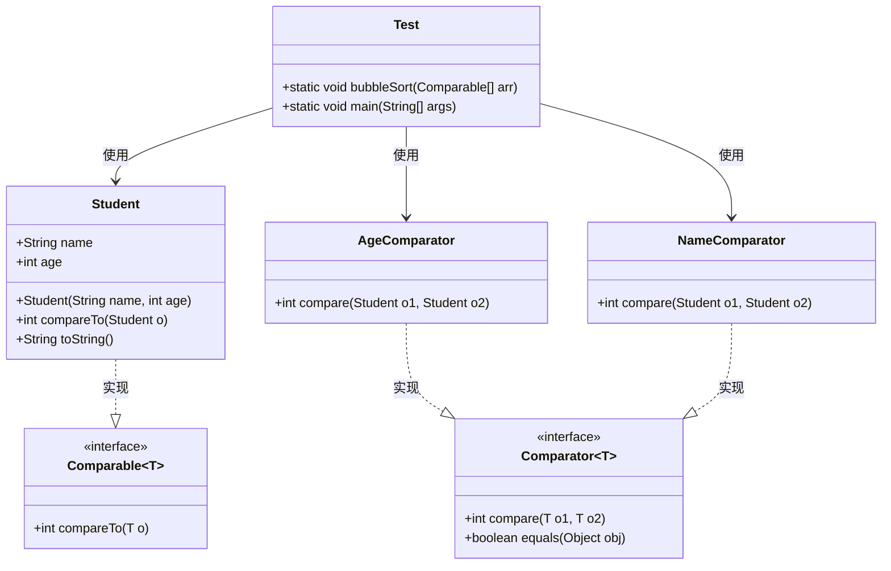
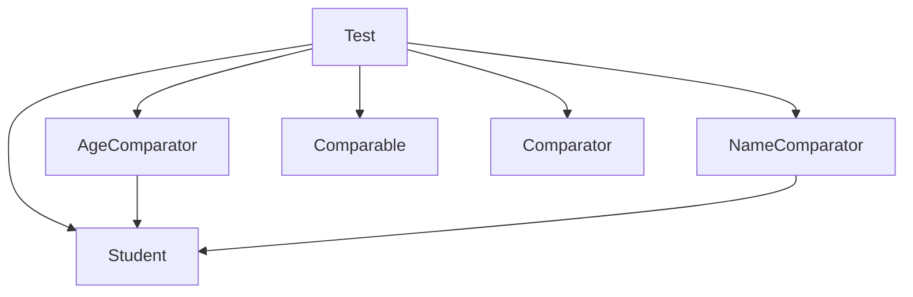

# 泛型的应用

<cite>
**本文档引用的文件**  
- [Student.java](file://JavaSE_Level1/src/接口2/比较相关的接口/Student.java)
- [AgeComparator.java](file://JavaSE_Level1/src/接口2/比较相关的接口/AgeComparator.java)
- [NameComparator.java](file://JavaSE_Level1/src/接口2/比较相关的接口/NameComparator.java)
- [Test.java](file://JavaSE_Level1/src/接口2/比较相关的接口/Test.java)
- [泛型.java](file://JavaDataStructure_Level2/src/泛型/泛型.java)
- [Test.java](file://JavaDataStructure_Level2/src/泛型/Test.java)
- [通配符.java](file://JavaDataStructure_Level2/src/泛型/通配符.java)
- [通配符2.java](file://JavaDataStructure_Level2/src/泛型/通配符2.java)
</cite>

## 目录
1. [引言](#引言)
2. [项目结构](#项目结构)
3. [核心组件](#核心组件)
4. [架构概述](#架构概述)
5. [详细组件分析](#详细组件分析)
6. [依赖分析](#依赖分析)
7. [性能考虑](#性能考虑)
8. [故障排除指南](#故障排除指南)
9. [结论](#结论)
10. [附录](#附录)

## 引言
本文档详细讲解泛型在Java中的实际应用场景，重点分析比较器接口中`Student`类与`AgeComparator`、`NameComparator`的实现机制。通过代码示例展示`Comparable`与`Comparator`接口的泛型使用方式，解释类型参数`T`的约束机制。同时提供多字段排序实现方案，并讨论泛型通配符（`?`、`? extends`、`? super`）在集合排序中的最佳实践。目标是帮助开发者理解如何通过泛型实现类型安全的排序逻辑，避免运行时类型转换异常。

## 项目结构
项目结构清晰地划分为多个模块，主要包括数据结构、算法、泛型编程和接口实现等部分。核心文件位于`JavaSE_Level1/src/接口2/比较相关的接口/`目录下，包含`Student`类及其对应的比较器实现。泛型相关示例则集中在`JavaDataStructure_Level2/src/泛型/`目录中。

```mermaid
graph TD
subgraph "核心排序模块"
Student[Student.java]
AgeComparator[AgeComparator.java]
NameComparator[NameComparator.java]
Test[Test.java]
end
subgraph "泛型基础示例"
GenericTest[Test.java]
MyArray[MyArray.java]
end
subgraph "泛型高级应用"
Wildcard[通配符.java]
Wildcard2[通配符2.java]
GenericAlg[泛型.java]
end
Student --> AgeComparator : "由AgeComparator比较"
Student --> NameComparator : "由NameComparator比较"
Test --> Student : "测试Student排序"
GenericTest --> MyArray : "使用泛型数组"
Wildcard --> Message : "使用通配符<?>"
Wildcard2 --> Plate : "使用<? extends>和<? super>"
GenericAlg --> Alg : "带类型约束的泛型算法"
```

**图示来源**  
- [Student.java](file://JavaSE_Level1/src/接口2/比较相关的接口/Student.java)
- [AgeComparator.java](file://JavaSE_Level1/src/接口2/比较相关的接口/AgeComparator.java)
- [NameComparator.java](file://JavaSE_Level1/src/接口2/比较相关的接口/NameComparator.java)
- [Test.java](file://JavaSE_Level1/src/接口2/比较相关的接口/Test.java)
- [泛型.java](file://JavaDataStructure_Level2/src/泛型/泛型.java)

## 核心组件
本节分析实现泛型排序的核心类和接口，包括`Student`类、`Comparable`接口、`Comparator`接口以及自定义的比较器。

### Student类实现
`Student`类实现了`Comparable<Student>`接口，允许对象之间进行自然排序（按年龄）。

```java
public class Student implements Comparable<Student> {
    public String name;
    public int age;

    public Student(String name, int age) {
        this.name = name;
        this.age = age;
    }

    @Override
    public int compareTo(Student o) {
        return this.age - o.age; // 按年龄升序
    }

    @Override
    public String toString() {
        return "Student{" +
                "name='" + name + '\'' +
                ", age=" + age +
                '}';
    }
}
```

该实现确保了`Student`对象可以直接用于`Arrays.sort()`或自定义排序算法中，无需额外比较器。

**本节来源**  
- [Student.java](file://JavaSE_Level1/src/接口2/比较相关的接口/Student.java)

### 比较器接口实现
通过实现`Comparator<T>`接口，可以为同一类对象提供多种排序策略。

#### AgeComparator
```java
public class AgeComparator implements Comparator<Student> {
    @Override
    public int compare(Student o1, Student o2) {
        return o1.age - o2.age;
    }
}
```

#### NameComparator
```java
public class NameComparator implements Comparator<Student> {
    @Override
    public int compare(Student o1, Student o2) {
        return o1.name.compareTo(o2.name);
    }
}
```

这两个比较器分别实现了按年龄和姓名排序的逻辑，展示了如何通过泛型实现类型安全的比较操作。

**本节来源**  
- [AgeComparator.java](file://JavaSE_Level1/src/接口2/比较相关的接口/AgeComparator.java)
- [NameComparator.java](file://JavaSE_Level1/src/接口2/比较相关的接口/NameComparator.java)

## 架构概述
整个排序系统的架构基于Java泛型和比较接口的设计模式，支持类型安全的排序操作。



**图示来源**  
- [Student.java](file://JavaSE_Level1/src/接口2/比较相关的接口/Student.java)
- [AgeComparator.java](file://JavaSE_Level1/src/接口2/比较相关的接口/AgeComparator.java)
- [NameComparator.java](file://JavaSE_Level1/src/接口2/比较相关的接口/NameComparator.java)
- [Test.java](file://JavaSE_Level1/src/接口2/比较相关的接口/Test.java)

## 详细组件分析
### Comparable与Comparator的区别与应用
`Comparable`用于定义类的自然排序，而`Comparator`用于定义外部排序规则。

#### 使用Comparable进行排序
```java
public static void bubbleSort(Comparable[] comparables) {
    for(int i = 0; i < comparables.length-1; i++){
        for (int j = 0; j < comparables.length - 1-i; j++) {
            if(comparables[j].compareTo(comparables[j+1])>0){
                Comparable temp = comparables[j];
                comparables[j] = comparables[j+1];
                comparables[j+1] = temp;
            }
        }
    }
}
```

#### 使用Comparator进行排序
```java
NameComparator nameComparator = new NameComparator();
bubbleSortWithComparator(students, nameComparator);
```

### 泛型在排序中的类型安全优势
通过泛型，编译器可以在编译期检查类型一致性，避免`ClassCastException`。

```java
// 类型安全：编译器确保只接受Student数组
Arrays.sort(students, new AgeComparator());
```

若尝试对非`Student`类型的数组使用`AgeComparator`，编译器将报错。

**本节来源**  
- [Test.java](file://JavaSE_Level1/src/接口2/比较相关的接口/Test.java)

### 多字段排序实现
可通过链式比较实现多字段排序：

```java
public class MultiFieldComparator implements Comparator<Student> {
    @Override
    public int compare(Student s1, Student s2) {
        int nameCompare = s1.name.compareTo(s2.name);
        if (nameCompare != 0) {
            return nameCompare;
        }
        return Integer.compare(s1.age, s2.age);
    }
}
```

此实现先按姓名排序，姓名相同时按年龄排序。

## 依赖分析
系统依赖关系清晰，各组件职责分明。



**图示来源**  
- [Test.java](file://JavaSE_Level1/src/接口2/比较相关的接口/Test.java)
- [Student.java](file://JavaSE_Level1/src/接口2/比较相关的接口/Student.java)

## 性能考虑
- **时间复杂度**：冒泡排序为O(n²)，建议生产环境使用`Arrays.sort()`（基于双轴快排，平均O(n log n)）
- **泛型开销**：泛型在编译后会进行类型擦除，运行时无额外性能开销
- **比较器复用**：建议将比较器声明为`static final`以避免重复创建

## 故障排除指南
### 常见错误及解决方案
1. **ClassCastException**
   - 原因：未使用泛型导致类型不安全
   - 解决：使用`Comparator<Student>`而非原始类型

2. **NullPointerException**
   - 原因：比较null值
   - 解决：在比较前检查null，或使用`Comparator.nullsFirst()`

3. **编译错误：类型不匹配**
   - 原因：泛型类型不一致
   - 解决：确保比较器泛型与数组类型一致

**本节来源**  
- [Test.java](file://JavaSE_Level1/src/接口2/比较相关的接口/Test.java)

## 结论
泛型在Java排序中发挥着至关重要的作用，通过`Comparable`和`Comparator`接口的泛型版本，实现了类型安全的排序逻辑。`Student`类通过实现`Comparable<Student>`定义自然排序，而`AgeComparator`和`NameComparator`则提供了灵活的外部排序策略。泛型确保了编译期类型检查，避免了运行时类型转换异常。结合通配符的使用，可以进一步提升代码的灵活性和复用性。建议在实际开发中优先使用泛型集合和比较器，以提高代码的安全性和可维护性。

## 附录
### 泛型通配符最佳实践
| 通配符 | 用途 | 示例 |
|--------|------|------|
| `?` | 任意类型 | `Message<?>` |
| `? extends T` | 上界限定（生产者） | `Plate<? extends Fruit>` |
| `? super T` | 下界限定（消费者） | `Plate<? super Fruit>` |

遵循PECS原则（Producer-Extends, Consumer-Super）可有效避免类型错误。

**本节来源**  
- [通配符.java](file://JavaDataStructure_Level2/src/泛型/通配符.java)
- [通配符2.java](file://JavaDataStructure_Level2/src/泛型/通配符2.java)