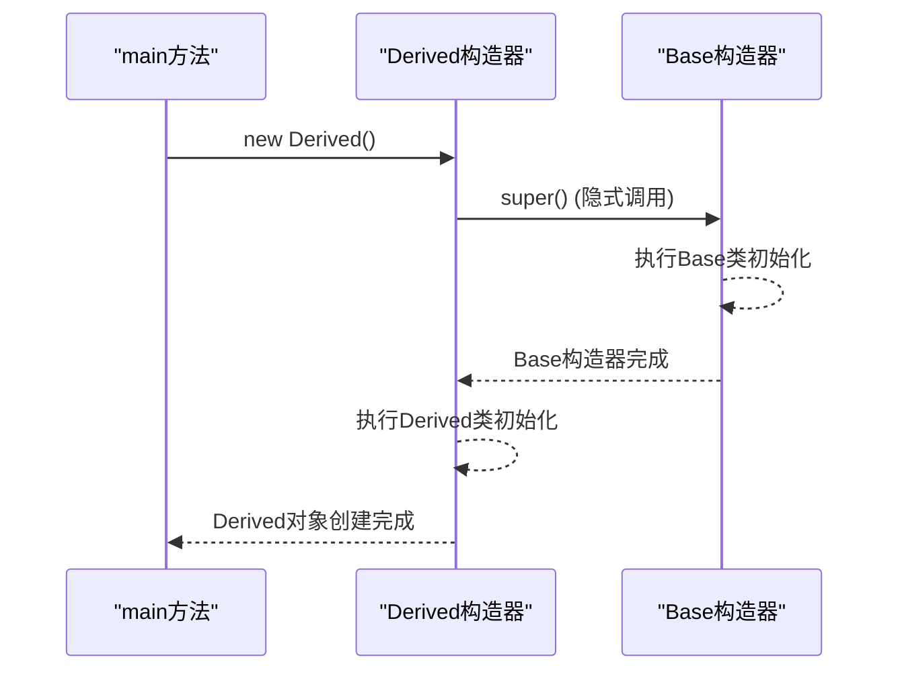
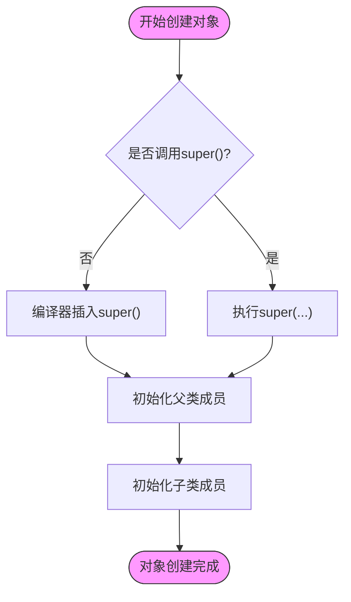

# 构造器与继承链

<cite>
**本文档引用的文件**   
- [Base.java](file://JavaSE_Level1/src/继承/demo2/Base.java)
- [Derived.java](file://JavaSE_Level1/src/继承/demo2/Derived.java)
- [Test.java](file://JavaSE_Level1/src/继承/demo2/Test.java)
- [Cat.java](file://JavaSE_Level1/src/继承/demo1/Cat.java)
- [Animal.java](file://JavaSE_Level1/src/继承/demo1/Animal.java)
- [MyDate.java](file://JavaSE_Level1/src/类与对象/第一节/MyDate.java)
- [Test.java](file://JavaSE_Level1/src/多态/demo3/Test.java)
</cite>

## 目录
1. [引言](#引言)
2. [构造器调用顺序基础](#构造器调用顺序基础)
3. [隐式与显式调用父类构造器](#隐式与显式调用父类构造器)
4. [构造器链执行流程分析](#构造器链执行流程分析)
5. [this()与super()调用限制](#this与super调用限制)
6. [常见错误与解决方案](#常见错误与解决方案)
7. [总结](#总结)

## 引言
在Java面向对象编程中，继承是核心概念之一。当子类继承父类时，构造器的调用顺序成为理解对象初始化过程的关键。本文将深入分析构造器在继承体系中的调用顺序，解释子类如何通过`super()`调用父类构造器，并通过具体代码示例展示构造链的执行流程。同时，我们将探讨`this()`和`super()`调用的语法限制，以及常见的编译错误“Constructor call must be the first statement”的成因与解决方法。

**构造器调用顺序**不仅影响对象的状态初始化，还可能引发潜在的运行时问题，尤其是在涉及虚方法调用时。通过本指南，读者将全面掌握Java中构造器在继承链中的行为规则，为编写安全、可靠的面向对象代码打下坚实基础。

## 构造器调用顺序基础

在Java中，每当创建一个子类对象时，JVM会自动确保其父类部分被正确初始化。这一过程遵循严格的顺序规则：**先初始化父类，再初始化子类**。这种机制保证了继承层次结构中所有组件的状态都能按预期建立。

构造器调用顺序的核心原则如下：
1. **父类优先**：子类构造器执行前，必须先完成父类构造器的执行。
2. **链式调用**：如果父类还有自己的父类，则调用会继续向上追溯，直到`Object`类为止。
3. **自动插入**：如果子类构造器中没有显式使用`super()`，编译器会自动在第一行插入对父类无参构造器的调用`super()`。

为了验证这些原则，我们分析位于`JavaSE_Level1/src/继承/demo2/`目录下的`Base`和`Derived`类。

**Section sources**
- [Base.java](file://JavaSE_Level1/src/继承/demo2/Base.java)
- [Derived.java](file://JavaSE_Level1/src/继承/demo2/Derived.java)

## 隐式与显式调用父类构造器

### 隐式调用示例分析

在`demo2`示例中，`Base`类和`Derived`类均未显式定义构造器。根据Java语言规范，编译器会为没有显式构造器的类自动添加一个**默认的无参构造器**。

```java
// Base.java
package 继承.demo2;

public class Base {
    public int a;

    public void method(){
        System.out.println("Base :: method()");
    }
}
```

```java
// Derived.java
package 继承.demo2;

public class Derived extends Base {
    public int a = 2;
    public int b;
    public int c;

    // ... 其他方法
}
```

当执行`new Derived()`时，实际的构造流程如下：
1. `Derived`类的构造器被调用。
2. 由于`Derived`构造器中没有`super()`语句，编译器**隐式插入**`super()`调用。
3. `Base`类的默认无参构造器被执行。
4. `Derived`类自身的初始化代码（如字段赋值）被执行。

这个过程体现了**隐式调用**的机制。即使代码中看不到`super()`，它依然存在并被执行。

### 显式调用示例分析

相比之下，在`demo1`示例中，`Cat`类和`Animal`类都显式定义了带参数的构造器，这要求子类必须显式调用父类构造器。

```java
// Animal.java
package 继承.demo1;

public class Animal {
    public String name;
    public int age;

    public Animal(String name, int age) {
        this.name = name;
        this.age = age;
        System.out.println("执行了父类的构造方法---3");
    }
    // ... 其他方法
}
```

```java
// Cat.java
package 继承.demo1;

public class Cat extends Animal {
    public Cat(String name, int age) {
        super(name, age); // 显式调用父类构造器
        System.out.println("执行了子类的构造方法---6");
    }
    // ... 其他方法
}
```

这里的关键是`super(name, age)`语句。由于`Animal`类没有无参构造器（因为定义了带参构造器，编译器不再提供默认无参构造器），`Cat`类**必须**使用`super()`显式调用父类的带参构造器，否则代码无法通过编译。

**Section sources**
- [Animal.java](file://JavaSE_Level1/src/继承/demo1/Animal.java)
- [Cat.java](file://JavaSE_Level1/src/继承/demo1/Cat.java)

## 构造器链执行流程分析

### 执行时序图



**Diagram sources**
- [Base.java](file://JavaSE_Level1/src/继承/demo2/Base.java)
- [Derived.java](file://JavaSE_Level1/src/继承/demo2/Derived.java)
- [Test.java](file://JavaSE_Level1/src/继承/demo2/Test.java)

### 代码执行流程

我们通过`Test.java`中的`main`方法来观察整个流程：

```java
// Test.java
package 继承.demo2;

public class Test {
    public static void main(String[] args) {
        Derived derived = new Derived(); // 触发构造链
        derived.test();
    }
}
```

1. **触发点**：`new Derived()`语句启动对象创建过程。
2. **隐式super()**：`Derived`构造器的第一行（由编译器插入）调用`Base()`。
3. **父类初始化**：`Base`类的字段`a`被分配内存并初始化为默认值0。
4. **子类初始化**：控制权返回`Derived`，其字段`a`、`b`、`c`被初始化（`a`被赋值为2）。
5. **对象就绪**：`Derived`对象完全构造完毕，引用赋值给`derived`变量。

此流程清晰地展示了构造器链的“自上而下”执行特性。

**Section sources**
- [Test.java](file://JavaSE_Level1/src/继承/demo2/Test.java)

## this()与super()调用限制

### 语法限制规则

Java语言对`this()`和`super()`的调用施加了严格的限制，其中最重要的一条是：**构造器调用（this()或super()）必须是构造器中的第一条语句**。

这一规则的根本原因在于对象的初始化顺序：
- `super()`必须在最前，以确保父类部分在子类使用前已被正确初始化。
- `this()`用于构造器重载，它会委托给同一个类的另一个构造器，因此也必须在初始化当前构造器的代码之前完成。

### 构造器重载与this()示例

`MyDate`类提供了一个使用`this()`的完美示例：

```java
// MyDate.java
package 类与对象.第一节;

public class MyDate {
    public int year;
    public int month;
    public int day;

    public MyDate(){
        this(1900,1,1); // 调用带参构造器，必须是第一行
        System.out.println("不带参数的构造方法");
    }

    public MyDate(int year, int month, int day) {
        this.year = year;
        this.month = month;
        this.day = day;
    }
    // ... 其他方法
}
```

在此例中，无参构造器通过`this(1900,1,1)`将对象的创建委托给带参构造器。这确保了字段的初始化逻辑集中在一个地方，避免了代码重复。如果将`this(1900,1,1);`放在`System.out.println(...)`之后，编译器将报错。

**Section sources**
- [MyDate.java](file://JavaSE_Level1/src/类与对象/第一节/MyDate.java)

## 常见错误与解决方案

### 错误成因：'Constructor call must be the first statement'

此编译错误最常见的原因是违反了“构造器调用必须是第一条语句”的规则。例如：

```java
// 错误代码示例
public Cat(String name, int age) {
    System.out.println("Creating a cat..."); // 这是第一条语句，非法！
    super(name, age); // 编译错误！
}
```

在此代码中，`System.out.println`语句出现在`super()`之前，导致编译失败。JVM要求在执行任何代码前，必须先确保父类已被初始化。

### 潜在运行时风险：父类构造器调用虚方法

更隐蔽的风险出现在父类构造器中调用被子类重写的虚方法。`多态/demo3/Test.java`中的示例揭示了这一陷阱：

```java
// Test.java (多态/demo3)
class B {
    public B() {
        func(); // 调用虚方法
    }
    public void func() { /* ... */ }
}

class D extends B {
    private int num = 1;
    @Override
    public void func() {
        System.out.println("D.func()" + num); // num尚未初始化！
    }
}
```

当`new D()`时：
1. `D`的构造器隐式调用`B()`。
2. `B`的构造器执行`func()`。
3. 由于动态绑定，实际执行的是`D`类的`func()`方法。
4. 此时`D`类的字段`num`**尚未被初始化**（仍为0），但`func()`方法却试图使用它。

这会导致程序行为不符合预期（打印`D.func()0`而非`D.func()1`），甚至可能引发`NullPointerException`。

### 解决方案

1. **遵守语法规则**：始终将`this()`或`super()`放在构造器的第一行。
2. **避免在构造器中调用可被重写的方法**：这是最佳实践。应将此类调用移至专门的初始化方法中。
3. **提供无参构造器**：如果希望子类能隐式调用`super()`，父类应显式定义一个无参构造器。



**Diagram sources**
- [MyDate.java](file://JavaSE_Level1/src/类与对象/第一节/MyDate.java)
- [Test.java](file://JavaSE_Level1/src/多态/demo3/Test.java)

## 总结
本文深入探讨了Java继承体系中构造器的调用机制。我们了解到，子类构造器总是通过`super()`（显式或隐式）调用父类构造器，形成一条自顶向下的构造链。`this()`和`super()`调用必须作为构造器的第一条语句，这是由对象初始化的内在逻辑决定的。通过分析`Base-Derived`和`Animal-Cat`等示例，我们掌握了构造流程的执行细节，并通过`MyDate`类理解了构造器重载的用法。最后，我们揭示了“Constructor call must be the first statement”错误的根源，并警示了在构造器中调用虚方法的潜在风险。遵循这些原则，开发者可以编写出更加健壮和可预测的面向对象代码。