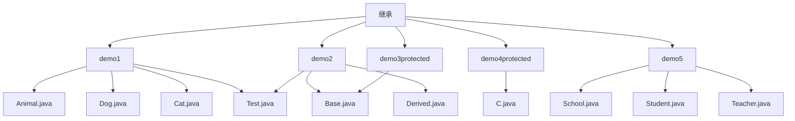
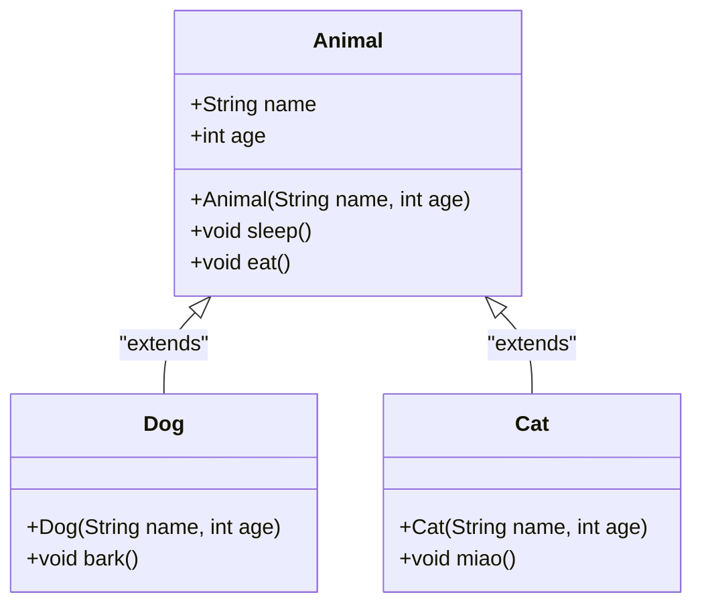
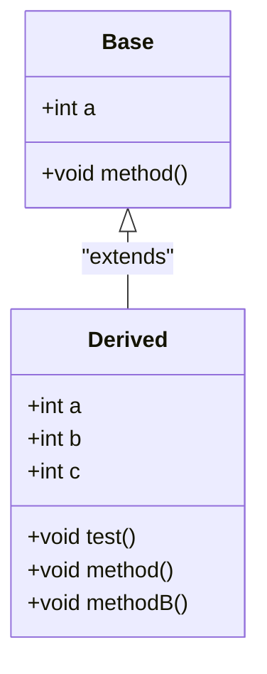
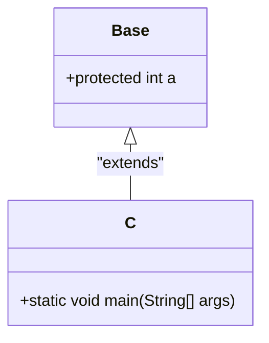
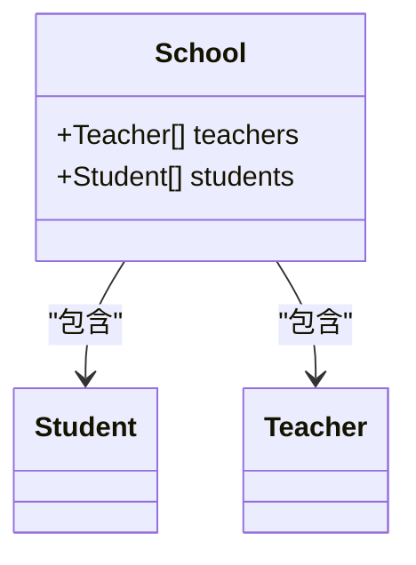

# 继承

<cite>
**本文档中引用的文件**   
- [Animal.java](file://JavaSE_Level1\src\继承\demo1\Animal.java)
- [Dog.java](file://JavaSE_Level1\src\继承\demo1\Dog.java)
- [Cat.java](file://JavaSE_Level1\src\继承\demo1\Cat.java)
- [Test.java](file://JavaSE_Level1\src\继承\demo1\Test.java)
- [Base.java](file://JavaSE_Level1\src\继承\demo2\Base.java)
- [Derived.java](file://JavaSE_Level1\src\继承\demo2\Derived.java)
- [Base.java](file://JavaSE_Level1\src\继承\demo3protected\Base.java)
- [C.java](file://JavaSE_Level1\src\继承\demo4protected\C.java)
- [School.java](file://JavaSE_Level1\src\继承\demo5\School.java)
- [Student.java](file://JavaSE_Level1\src\继承\demo5\Student.java)
- [Teacher.java](file://JavaSE_Level1\src\继承\demo5\Teacher.java)
</cite>

## 目录
1. [引言](#引言)
2. [项目结构](#项目结构)
3. [核心继承机制分析](#核心继承机制分析)
4. [Animal-Dog-Cat继承体系详解](#animal-dog-cat继承体系详解)
5. [Base-Derived继承链与可见性规则](#base-derived继承链与可见性规则)
6. [protected访问修饰符深入解析](#protected访问修饰符深入解析)
7. [School-Student-Teacher实际应用示例](#school-student-teacher实际应用示例)
8. [继承的优缺点及使用场景](#继承的优缺点及使用场景)
9. [结论](#结论)

## 引言
继承是Java面向对象编程的核心特性之一，它允许一个类（子类）基于另一个类（父类）来构建，从而实现代码的重用和扩展。通过继承，子类可以继承父类的属性和方法，并可以添加新的功能或修改现有行为。本文将深入探讨Java中的继承机制，涵盖`extends`关键字的使用、父类与子类的关系、方法重写（@Override）、`super`关键字的调用、`protected`访问修饰符的作用以及多态性的基础。我们将通过多个代码示例，包括Animal-Dog-Cat、Base-Derived和School-Student-Teacher等继承体系，全面解析继承的各个方面。

## 项目结构
本项目位于`JavaSE_Level1\src\继承`目录下，包含多个用于演示继承概念的子目录。每个子目录代表一个独立的继承示例，结构清晰，便于学习和理解。

**图示来源**
- [Animal.java](file://JavaSE_Level1\src\继承\demo1\Animal.java)
- [Dog.java](file://JavaSE_Level1\src\继承\demo1\Dog.java)
- [Cat.java](file://JavaSE_Level1\src\继承\demo1\Cat.java)
- [Base.java](file://JavaSE_Level1\src\继承\demo2\Base.java)
- [Derived.java](file://JavaSE_Level1\src\继承\demo2\Derived.java)
- [School.java](file://JavaSE_Level1\src\继承\demo5\School.java)

## 核心继承机制分析
Java中的继承通过`extends`关键字实现，子类可以继承父类的非私有成员（字段和方法）。继承的核心优势在于代码复用和层次化设计。以下是对继承机制关键要素的详细分析。

### extends关键字与继承关系
在Java中，使用`extends`关键字声明一个类继承另一个类。例如，在`Dog`类中，`public class Dog extends Animal`表示`Dog`是`Animal`的子类，`Animal`是`Dog`的父类。子类自动获得父类的所有`public`和`protected`成员，以及同一包内的默认访问成员。

### 方法重写（Override）
方法重写是指子类提供一个与父类中某个方法具有相同签名（名称、参数列表）的新实现。在`Cat`类中，虽然没有显式重写`eat`方法，但`Dog`类中的`bark`方法是新增的，而`Cat`类中的`miao`方法也是新增的。如果子类需要改变父类方法的行为，可以使用`@Override`注解来明确表示重写意图，这有助于编译器检查。

### super关键字的使用
`super`关键字用于从子类中调用父类的构造方法、字段或方法。在`Dog`和`Cat`的构造函数中，`super(name, age)`调用了父类`Animal`的构造函数，确保父类的初始化逻辑被执行。在`Derived`类的`test`方法中，`super.method()`显式调用父类的`method`方法，而`super.a`访问父类的字段`a`。

## Animal-Dog-Cat继承体系详解
该示例展示了经典的动物继承模型，其中`Animal`作为基类，`Dog`和`Cat`作为其子类。

### 类图表示

**图示来源**
- [Animal.java](file://JavaSE_Level1\src\继承\demo1\Animal.java#L1-L28)
- [Dog.java](file://JavaSE_Level1\src\继承\demo1\Dog.java#L1-L12)
- [Cat.java](file://JavaSE_Level1\src\继承\demo1\Cat.java#L1-L21)

### 构造流程与代码块执行顺序
当创建`Cat`对象时，执行顺序如下：
1. 父类`Animal`的静态代码块（仅在类加载时执行一次）
2. 子类`Cat`的静态代码块（仅在类加载时执行一次）
3. 父类`Animal`的实例代码块
4. 父类`Animal`的构造方法
5. 子类`Cat`的实例代码块
6. 子类`Cat`的构造方法

此顺序确保了父类的初始化先于子类，符合继承的初始化原则。

### 多态性基础
多态性允许使用父类引用指向子类对象。例如，`Animal a = new Dog("旺财", 3);`是合法的。此时，调用`a.sleep()`会执行`Animal`类的`sleep`方法，体现了“编译时类型”和“运行时类型”的区别。若`Dog`类重写了`sleep`方法，则会执行`Dog`类的版本，这是动态绑定的体现。

## Base-Derived继承链与可见性规则
该示例演示了字段隐藏、方法重写以及`this`和`super`关键字的使用。

### 类图与成员关系

**图示来源**
- [Base.java](file://JavaSE_Level1\src\继承\demo2\Base.java#L1-L9)
- [Derived.java](file://JavaSE_Level1\src\继承\demo2\Derived.java#L1-L23)

### this与super的对比
在`Derived`类的`test`方法中：
- `this.a` 访问的是子类`Derived`中定义的字段`a`（值为2）
- `super.a` 访问的是父类`Base`中定义的字段`a`（值为0，因为未显式初始化）
- `super.method()` 调用父类`Base`的`method`方法
- `method()` 调用当前类（`Derived`）的`method`方法，因为存在重写

这清晰地展示了如何在子类中区分访问自身成员和父类成员。

## protected访问修饰符深入解析
`protected`是Java中一种特殊的访问修饰符，它允许子类访问父类的成员，即使子类位于不同的包中。

### 跨包继承示例
在`demo3protected`包中的`Base`类定义了一个`protected int a = 10;`。在`demo4protected`包中的`C`类继承`Base`，并能直接访问`c.a`。这证明了`protected`成员可以被不同包中的子类访问。

**图示来源**
- [Base.java](file://JavaSE_Level1\src\继承\demo3protected\Base.java#L1-L5)
- [C.java](file://JavaSE_Level1\src\继承\demo4protected\C.java#L1-L10)

### 可见性规则总结
- `private`: 仅在同一类中可见
- `default` (包私有): 在同一包内可见
- `protected`: 在同一包内可见，且对所有子类可见（即使子类在不同包中）
- `public`: 在任何地方都可见

`protected`是实现“受保护的继承”的关键，它允许子类扩展父类功能，同时防止外部无关类的直接访问。

## School-Student-Teacher实际应用示例
该示例展示了继承在实际场景中的应用，尽管`Student`和`Teacher`类目前为空，但它们的设计意图是作为`School`类的组成部分。

### 类关系图

**图示来源**
- [School.java](file://JavaSE_Level1\src\继承\demo5\School.java#L1-L6)
- [Student.java](file://JavaSE_Level1\src\继承\demo5\Student.java#L1-L4)
- [Teacher.java](file://JavaSE_Level1\src\继承\demo5\Teacher.java#L1-L4)

### 应用场景分析
`School`类通过聚合`Student`和`Teacher`对象数组来管理学校信息。未来可以扩展`Student`和`Teacher`类，添加姓名、年龄、学号、工号等属性，以及学习、教学等方法。这种设计体现了“是一个”（is-a）和“有一个”（has-a）关系的结合：`Student`和`Teacher`是`Person`（假设存在）的子类（is-a），而`School`有一个`Student`列表和一个`Teacher`列表（has-a）。

## 继承的优缺点及使用场景
### 优点
1. **代码复用**: 子类可以复用父类的代码，减少重复。
2. **可扩展性**: 易于添加新功能，只需创建新的子类。
3. **多态性**: 支持接口统一，提高程序的灵活性和可维护性。
4. **层次化设计**: 有助于构建清晰的对象层次结构。

### 缺点
1. **紧耦合**: 子类与父类高度耦合，父类的修改可能影响所有子类。
2. **继承层次过深**: 过深的继承链会增加理解和维护的难度。
3. **灵活性降低**: 继承是静态的，在编译时确定，不如组合灵活。

### 使用场景
- 当多个类共享相同属性和行为时。
- 当需要实现多态，通过父类引用操作不同子类对象时。
- 当遵循“是一个”（is-a）关系时，如`Dog`是`Animal`的一种。

### 替代方案
在某些情况下，组合（Composition）比继承更优。例如，一个类“有一个”另一个类的实例，而不是“是一个”另一个类的实例时，应优先使用组合。

## 结论
继承是Java编程中强大的工具，它通过`extends`关键字、方法重写、`super`关键字和`protected`访问修饰符等机制，实现了代码的复用和扩展。通过Animal-Dog-Cat、Base-Derived和School-Student-Teacher等示例，我们深入理解了继承的语法、行为和实际应用。尽管继承有其优势，但也需谨慎使用，避免过度设计和紧耦合问题。在实际开发中，应根据具体需求权衡继承与组合的使用，以构建灵活、可维护的软件系统。