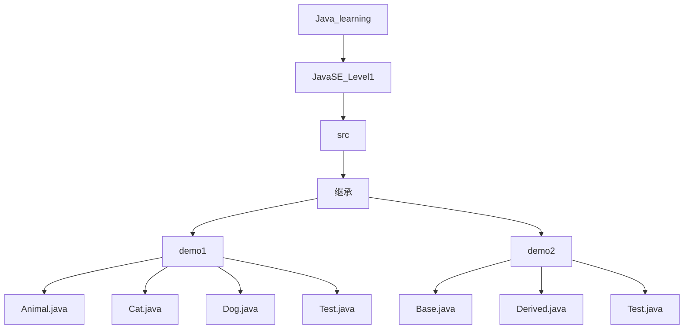
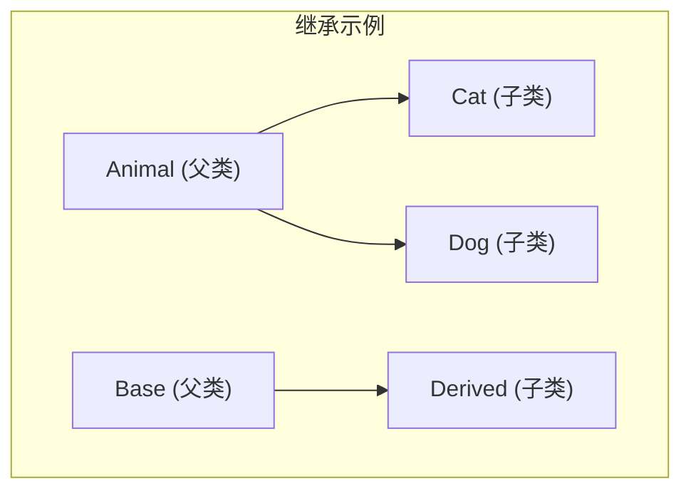
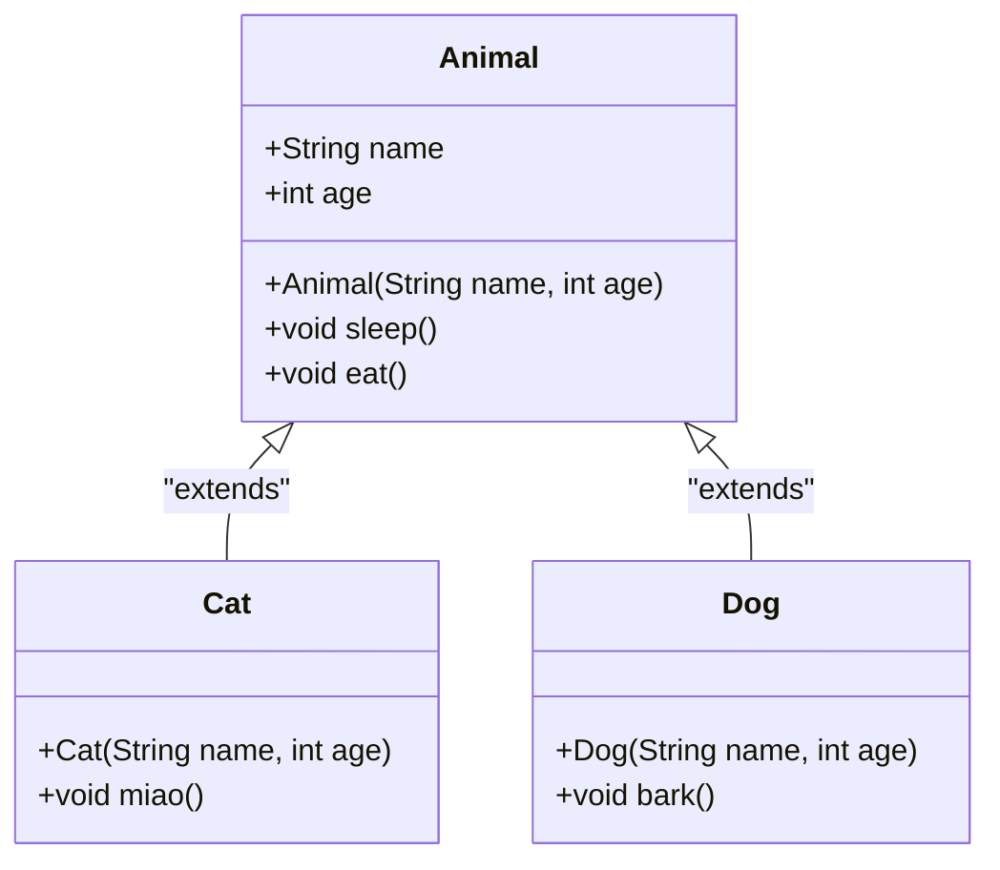
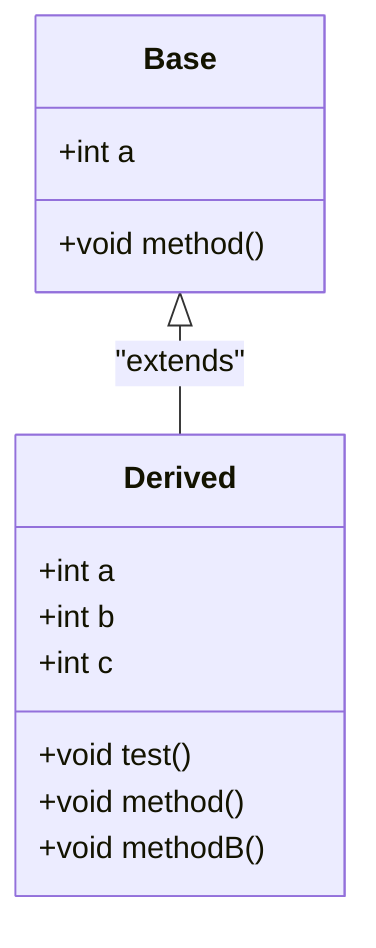
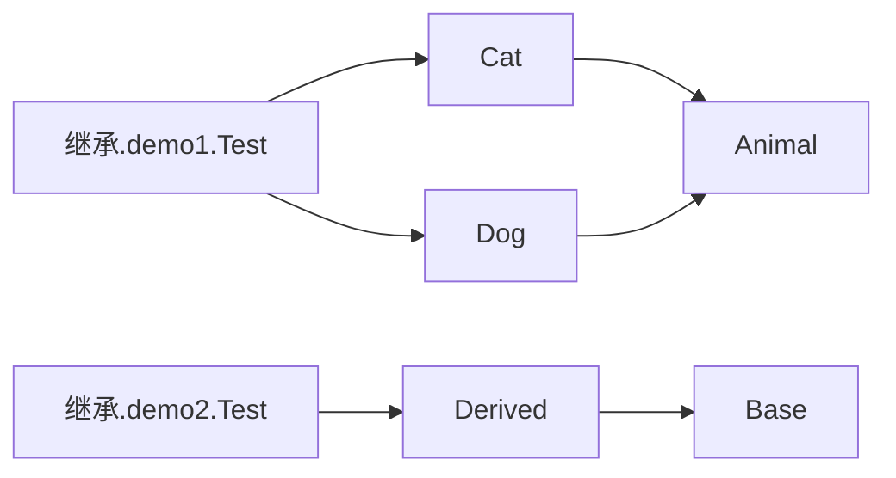

# 继承基础概念

<cite>
**本文档引用的文件**   
- [Animal.java](file://JavaSE_Level1/src/继承/demo1/Animal.java)
- [Cat.java](file://JavaSE_Level1/src/继承/demo1/Cat.java)
- [Dog.java](file://JavaSE_Level1/src/继承/demo1/Dog.java)
- [Test.java](file://JavaSE_Level1/src/继承/demo1/Test.java)
- [Base.java](file://JavaSE_Level1/src/继承/demo2/Base.java)
- [Derived.java](file://JavaSE_Level1/src/继承/demo2/Derived.java)
- [Test.java](file://JavaSE_Level1/src/继承/demo2/Test.java)
- [Test.java](file://JavaSE_Level1/src/多态/demo3/Test.java)
</cite>

## 目录
1. [引言](#引言)
2. [项目结构](#项目结构)
3. [核心组件](#核心组件)
4. [架构概览](#架构概览)
5. [详细组件分析](#详细组件分析)
6. [依赖分析](#依赖分析)
7. [性能考量](#性能考量)
8. [故障排除指南](#故障排除指南)
9. [结论](#结论)

## 引言
本文档旨在深入讲解Java中继承的基本语法和核心机制。通过分析`Animal-Dog-Cat`示例，详细阐述`extends`关键字的使用、父类成员的继承规则、子类对象的创建过程、方法重写（`@Override`）以及运行时多态的触发机制。文档结合UML类图和内存布局图，帮助初学者从代码实现和底层原理两个层面理解面向对象继承的本质。

## 项目结构
本项目`Java_learning`是一个Java学习代码库，其结构清晰地按照知识点进行组织。与本文档主题“继承”直接相关的代码位于`JavaSE_Level1/src/继承/`目录下。该目录包含多个示例（demo1, demo2等），每个示例都通过具体的Java类文件来演示继承的不同方面。



**图表来源**
- [Animal.java](file://JavaSE_Level1/src/继承/demo1/Animal.java)
- [Cat.java](file://JavaSE_Level1/src/继承/demo1/Cat.java)
- [Dog.java](file://JavaSE_Level1/src/继承/demo1/Dog.java)
- [Base.java](file://JavaSE_Level1/src/继承/demo2/Base.java)
- [Derived.java](file://JavaSE_Level1/src/继承/demo2/Derived.java)

## 核心组件
本文档的核心组件是`Animal`、`Cat`、`Dog`、`Base`和`Derived`这几个Java类。它们共同构成了演示Java继承机制的基石。`Animal`类作为父类，定义了动物的通用属性和行为。`Cat`和`Dog`类通过`extends`关键字继承`Animal`，展示了子类如何复用和扩展父类的功能。`Base`和`Derived`类则更侧重于展示字段隐藏和方法重写的具体规则。

**章节来源**
- [Animal.java](file://JavaSE_Level1/src/继承/demo1/Animal.java#L1-L28)
- [Cat.java](file://JavaSE_Level1/src/继承/demo1/Cat.java#L1-L21)
- [Dog.java](file://JavaSE_Level1/src/继承/demo1/Dog.java#L1-L12)
- [Base.java](file://JavaSE_Level1/src/继承/demo2/Base.java#L1-L9)
- [Derived.java](file://JavaSE_Level1/src/继承/demo2/Derived.java#L1-L23)

## 架构概览
整个继承示例的架构是一个典型的层次化结构。`Animal`类位于顶层，是所有动物的抽象。`Cat`和`Dog`类位于第二层，是`Animal`的具体实现。`Base`和`Derived`类则构成了另一个独立的继承对，用于演示特定的继承规则。`Test`类作为客户端，负责创建这些类的实例并调用其方法，从而验证继承行为。



**图表来源**
- [Animal.java](file://JavaSE_Level1/src/继承/demo1/Animal.java)
- [Cat.java](file://JavaSE_Level1/src/继承/demo1/Cat.java)
- [Dog.java](file://JavaSE_Level1/src/继承/demo1/Dog.java)
- [Base.java](file://JavaSE_Level1/src/继承/demo2/Base.java)
- [Derived.java](file://JavaSE_Level1/src/继承/demo2/Derived.java)

## 详细组件分析
本节将对`Animal-Dog-Cat`和`Base-Derived`这两个继承对进行深入分析，揭示Java继承的底层细节。

### Animal-Dog-Cat 继承层次分析
`Animal`类是所有动物的基类，它定义了`name`和`age`两个公共字段，以及`sleep()`和`eat()`两个公共方法。`Cat`和`Dog`类通过`extends Animal`声明继承自`Animal`类。

#### 类图


**图表来源**
- [Animal.java](file://JavaSE_Level1/src/继承/demo1/Animal.java#L1-L28)
- [Cat.java](file://JavaSE_Level1/src/继承/demo1/Cat.java#L1-L21)
- [Dog.java](file://JavaSE_Level1/src/继承/demo1/Dog.java#L1-L12)

**章节来源**
- [Animal.java](file://JavaSE_Level1/src/继承/demo1/Animal.java#L1-L28)
- [Cat.java](file://JavaSE_Level1/src/继承/demo1/Cat.java#L1-L21)
- [Dog.java](file://JavaSE_Level1/src/继承/demo1/Dog.java#L1-L12)

#### 字段和方法的继承
子类`Cat`和`Dog`自动继承了父类`Animal`的所有非私有成员。这意味着`Cat`和`Dog`的对象都拥有`name`和`age`字段，以及`sleep()`和`eat()`方法。子类可以像使用自己的成员一样使用这些继承来的成员。

#### 子类对象的创建过程
当通过`new Cat("小猫", 2)`创建一个`Cat`对象时，JVM会执行以下步骤：
1.  **加载类**：如果`Cat`和`Animal`类尚未加载，则先加载它们。
2.  **执行静态代码块**：首先执行父类`Animal`的静态代码块，然后执行子类`Cat`的静态代码块。
3.  **分配内存**：为`Cat`对象在堆上分配内存空间，这个空间包含了`Animal`部分和`Cat`部分。
4.  **执行实例代码块和构造函数**：
    *   调用`Cat`的构造函数。
    *   `Cat`的构造函数第一行必须是`super(name, age)`，这会调用`Animal`的构造函数。
    *   `Animal`的构造函数执行，初始化`name`和`age`，并执行其构造函数体和实例代码块。
    *   `Animal`的构造函数返回后，`Cat`的构造函数继续执行其构造函数体。
5.  **返回引用**：`new`表达式返回指向新创建的`Cat`对象的引用。

这个过程确保了父类在子类之前被完全初始化。

### Base-Derived 继承对分析
`Base-Derived`示例更清晰地展示了字段隐藏和方法重写的区别。

#### 类图


**图表来源**
- [Base.java](file://JavaSE_Level1/src/继承/demo2/Base.java#L1-L9)
- [Derived.java](file://JavaSE_Level1/src/继承/demo2/Derived.java#L1-L23)

**章节来源**
- [Base.java](file://JavaSE_Level1/src/继承/demo2/Base.java#L1-L9)
- [Derived.java](file://JavaSE_Level1/src/继承/demo2/Derived.java#L1-L23)

#### 字段隐藏
`Derived`类中定义了一个与父类同名的字段`a`。这并不会重写父类的字段，而是**隐藏**了它。`Derived`类同时拥有两个`a`字段：一个继承自`Base`，另一个是自己的。在`test()`方法中，`this.a`访问的是`Derived`自己的`a`（值为2），而`super.a`访问的是`Base`的`a`（默认值为0）。

#### 方法重写（@Override）
`Derived`类中的`method()`方法与`Base`类中的`method()`方法具有相同的签名（方法名、参数列表）。通过`@Override`注解（虽然在此例中未显式写出，但语义上是重写），`Derived`的`method()`**重写**了`Base`的`method()`。这意味着当通过`Derived`类型的引用调用`method()`时，即使该引用指向一个`Derived`对象，也会执行`Derived`类中的版本。

#### 运行时多态的触发机制
在`Derived`类的`test()`方法中，`super.method()`明确调用父类的`method()`，输出`Base :: method()`。而`method()`的调用则体现了多态：尽管`test()`方法在`Derived`类中，但`method()`的调用会动态绑定到`Derived`类中重写的版本，因此输出`Derived :: method()2`。这种在运行时根据对象的实际类型来决定调用哪个方法的机制，就是**运行时多态**。

### 方法重写（@Override）深入分析
`@Override`注解是一个编译时检查工具，它告诉编译器，该方法意在重写其父类或实现的接口中的一个方法。如果父类中没有匹配的方法，编译器将报错，这有助于防止因拼写错误而导致的意外方法重载。

在`多态.demo3.Test`文件中，有一个经典的多态陷阱示例：
```java
class B {
    public B() {
        func(); // 在构造函数中调用虚方法
    }
    public void func() { ... }
}
class D extends B {
    private int num = 1;
    @Override
    public void func() {
        System.out.println("D.func()" + num); // num尚未被初始化
    }
}
```
当`new D()`时，会先调用`B`的构造函数，而`B`的构造函数中调用了`func()`。由于`D`重写了`func()`，此时会执行`D`中的`func()`。然而，此时`D`的实例字段`num`还没有被初始化（初始化发生在`B`的构造函数返回之后），所以输出的是`D.func()0`（`num`的默认值）。这说明在父类构造函数中调用可被重写的方法是危险的。

## 依赖分析
本示例中的依赖关系非常简单直接。`Cat`和`Dog`类依赖于`Animal`类，`Derived`类依赖于`Base`类。`Test`类作为客户端，依赖于所有被测试的类。这种依赖关系是单向的，从子类指向父类，符合继承的设计原则。



**图表来源**
- [Test.java](file://JavaSE_Level1/src/继承/demo1/Test.java)
- [Cat.java](file://JavaSE_Level1/src/继承/demo1/Cat.java)
- [Dog.java](file://JavaSE_Level1/src/继承/demo1/Dog.java)
- [Animal.java](file://JavaSE_Level1/src/继承/demo1/Animal.java)
- [Test.java](file://JavaSE_Level1/src/继承/demo2/Test.java)
- [Derived.java](file://JavaSE_Level1/src/继承/demo2/Derived.java)
- [Base.java](file://JavaSE_Level1/src/继承/demo2/Base.java)

## 性能考量
继承本身在Java中是一个轻量级的机制。字段的继承和方法的重写在编译时和运行时都有很好的优化。然而，过度的继承层次（过深的继承树）可能会增加代码的复杂性和理解难度。方法调用的动态绑定（多态）虽然有极小的性能开销（查找虚方法表），但在现代JVM中，这种开销通常可以被JIT编译器优化掉，因此不应成为避免使用多态的理由。

## 故障排除指南
*   **编译错误 "cannot find symbol"**：检查子类是否正确使用了`extends`关键字，并且父类的字段或方法是否为`private`。子类无法访问父类的`private`成员。
*   **意外的字段值**：如果在子类中定义了与父类同名的字段，请确认你访问的是`this.a`（子类字段）还是`super.a`（父类字段）。
*   **方法调用未按预期执行**：确保方法签名（名称、参数类型）完全一致，才能构成重写。使用`@Override`注解可以帮助编译器检查。
*   **构造函数调用问题**：子类构造函数的第一条语句必须是`super(...)`或`this(...)`。如果未显式写出，编译器会自动插入`super()`，这要求父类必须有一个无参构造函数。

## 结论
Java的继承机制通过`extends`关键字实现，是代码复用和多态性的基础。子类继承父类的非私有成员，并可以通过`super`关键字访问父类的成员。子类对象的创建遵循先父类后子类的初始化顺序。方法重写允许子类提供特定的实现，而`@Override`注解是保证重写正确性的重要工具。运行时多态使得程序可以在运行时根据对象的实际类型来调用相应的方法，极大地提高了代码的灵活性和可扩展性。通过`Animal-Dog-Cat`和`Base-Derived`等示例，我们可以清晰地看到这些概念在代码中的具体体现。