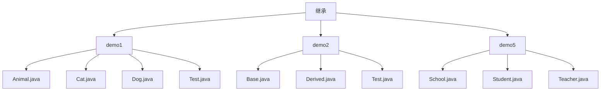
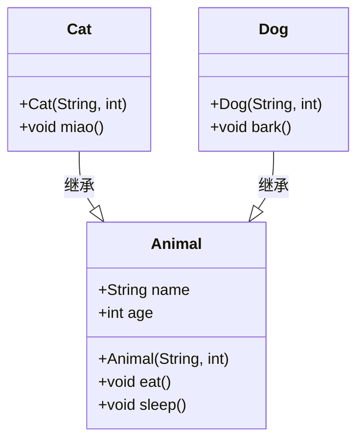
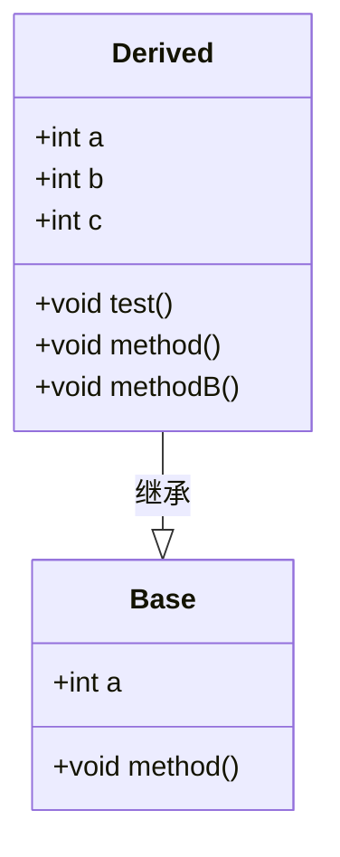
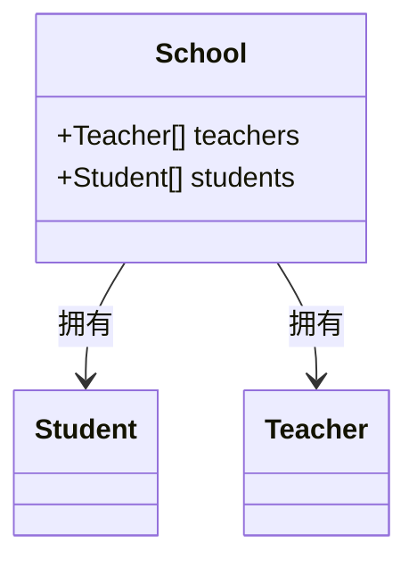

# 继承的实际应用

<cite>
**本文档中引用的文件**  
- [Animal.java](file://JavaSE_Level1/src/继承/demo1/Animal.java)
- [Cat.java](file://JavaSE_Level1/src/继承/demo1/Cat.java)
- [Dog.java](file://JavaSE_Level1/src/继承/demo1/Dog.java)
- [Test.java](file://JavaSE_Level1/src/继承/demo1/Test.java)
- [Base.java](file://JavaSE_Level1/src/继承/demo2/Base.java)
- [Derived.java](file://JavaSE_Level1/src/继承/demo2/Derived.java)
- [Test.java](file://JavaSE_Level1/src/继承/demo2/Test.java)
- [School.java](file://JavaSE_Level1/src/继承/demo5/School.java)
- [Student.java](file://JavaSE_Level1/src/继承/demo5/Student.java)
- [Teacher.java](file://JavaSE_Level1/src/继承/demo5/Teacher.java)
</cite>

## 目录
1. [引言](#引言)
2. [项目结构](#项目结构)
3. [核心组件分析](#核心组件分析)
4. [继承在动物类体系中的应用](#继承在动物类体系中的应用)
5. [继承在基类与派生类中的实现](#继承在基类与派生类中的实现)
6. [学校-学生-教师场景中的类关系分析](#学校-学生-教师场景中的类关系分析)
7. [继承与组合的对比分析](#继承与组合的对比分析)
8. [继承设计原则与最佳实践](#继承设计原则与最佳实践)
9. [结论](#结论)

## 引言

继承是面向对象编程中的核心机制之一，它允许子类复用父类的属性和方法，并在此基础上进行扩展或修改。通过继承，可以建立清晰的“is-a”关系模型，提升代码的可维护性和可扩展性。本文以`Animal-Cat-Dog`、`Base-Derived`以及`School-Student-Teacher`三个真实场景为例，深入分析继承在实际项目中的应用模式、设计合理性及潜在问题。

**本节不涉及具体源码分析，因此无须列出源文件引用。**

## 项目结构

该项目包含多个Java学习模块，涵盖数据结构、泛型、异常处理、多态、抽象类与接口等主题。其中，`JavaSE_Level1/src/继承`目录下包含了多个继承示例，分别用于演示不同层次的继承机制。

主要继承相关子目录如下：
- `demo1`：展示动物类的继承结构（Animal → Cat/Dog）
- `demo2`：展示基类与派生类的字段与方法覆盖
- `demo5`：展示学校、学生、教师之间的聚合关系（非继承）



**图示来源**  
- [Animal.java](file://JavaSE_Level1/src/继承/demo1/Animal.java)
- [Base.java](file://JavaSE_Level1/src/继承/demo2/Base.java)
- [School.java](file://JavaSE_Level1/src/继承/demo5/School.java)

## 核心组件分析

本项目中与继承直接相关的类主要包括：
- `Animal`：作为所有动物的基类，定义了通用属性（name, age）和行为（eat, sleep）
- `Cat` 和 `Dog`：继承自`Animal`，分别扩展了特有的行为（miao, bark）
- `Base` 和 `Derived`：演示字段隐藏、方法重写与`super`关键字的使用
- `School`、`Student`、`Teacher`：虽未使用继承，但体现了组合关系的应用

这些组件共同构成了理解继承机制的完整教学体系。

**本节为概述性内容，未深入分析具体文件，因此无须列出源文件引用。**

## 继承在动物类体系中的应用

### 类层次结构分析

在`demo1`中，`Animal`作为父类，被`Cat`和`Dog`继承，体现了典型的“is-a”关系：猫是一种动物，狗也是一种动物。

```java
public class Animal {
    public String name;
    public int age;

    public Animal(String name, int age) {
        this.name = name;
        this.age = age;
    }

    public void eat() {
        System.out.println(name + "正在吃饭");
    }

    public void sleep() {
        System.out.println(name + "正在睡觉");
    }
}

public class Cat extends Animal {
    public Cat(String name, int age) {
        super(name, age);
    }

    public void miao() {
        System.out.println(name + "正在猫叫");
    }
}
```

`Cat`类通过`extends`关键字继承`Animal`，自动获得`name`、`age`、`eat()`和`sleep()`成员，无需重复定义，实现了代码复用。

#### 构造流程与代码块执行顺序

当创建`Cat`对象时，执行顺序如下：
1. 父类静态代码块（仅首次加载类时执行）
2. 子类静态代码块
3. 父类实例代码块
4. 父类构造方法
5. 子类实例代码块
6. 子类构造方法

这保证了父类的初始化先于子类完成。



**图示来源**  
- [Animal.java](file://JavaSE_Level1/src/继承/demo1/Animal.java#L1-L28)
- [Cat.java](file://JavaSE_Level1/src/继承/demo1/Cat.java#L1-L21)
- [Dog.java](file://JavaSE_Level1/src/继承/demo1/Dog.java#L1-L12)

**本节来源**  
- [Animal.java](file://JavaSE_Level1/src/继承/demo1/Animal.java#L1-L28)
- [Cat.java](file://JavaSE_Level1/src/继承/demo1/Cat.java#L1-L21)
- [Dog.java](file://JavaSE_Level1/src/继承/demo1/Dog.java#L1-L12)
- [Test.java](file://JavaSE_Level1/src/继承/demo1/Test.java#L1-L18)

## 继承在基类与派生类中的实现

### 字段隐藏与方法重写

在`demo2`中，`Derived`类继承自`Base`类，并展示了字段隐藏和方法重写的概念。

```java
public class Base {
    public int a;

    public void method() {
        System.out.println("Base :: method()");
    }
}

public class Derived extends Base {
    public int a = 2; // 字段隐藏
    public int b, c;

    public void method() {
        System.out.println("Derived :: method()" + a);
    }

    public void test() {
        System.out.println(this.a);     // 输出 2（子类字段）
        System.out.println(super.a);    // 输出 0（父类字段）
        super.method();                 // 调用父类方法
        method();                       // 调用子类方法
    }
}
```

- `this.a`访问的是子类中定义的`a`（值为2）
- `super.a`访问的是父类中继承的`a`（默认值为0）
- `super.method()`显式调用父类方法
- `method()`调用的是被重写的子类方法

这说明Java支持字段隐藏（field hiding）和方法重写（method overriding），但需谨慎使用以避免混淆。



**图示来源**  
- [Base.java](file://JavaSE_Level1/src/继承/demo2/Base.java#L1-L9)
- [Derived.java](file://JavaSE_Level1/src/继承/demo2/Derived.java#L1-L23)

**本节来源**  
- [Base.java](file://JavaSE_Level1/src/继承/demo2/Base.java#L1-L9)
- [Derived.java](file://JavaSE_Level1/src/继承/demo2/Derived.java#L1-L23)
- [Test.java](file://JavaSE_Level1/src/继承/demo2/Test.java#L1-L8)

## 学校-学生-教师场景中的类关系分析

### 类设计与关系建模

在`demo5`中，`School`类包含`Student[]`和`Teacher[]`数组，表示学校拥有多个学生和教师。然而，`Student`和`Teacher`类并未继承自`School`，而是作为独立的类存在。

```java
public class School {
    public Teacher[] teachers;
    public Student[] students;
}

public class Student {
}

public class Teacher {
}
```

这种设计体现了“has-a”关系（组合），而非“is-a”关系（继承）。即：
- 学校**拥有**学生和教师（组合）
- 学生**不是**学校，教师**不是**学校（不应使用继承）

若错误地使用继承（如`Student extends School`），将违反语义逻辑，导致设计混乱。



**图示来源**  
- [School.java](file://JavaSE_Level1/src/继承/demo5/School.java#L1-L5)
- [Student.java](file://JavaSE_Level1/src/继承/demo5/Student.java#L1-L3)
- [Teacher.java](file://JavaSE_Level1/src/继承/demo5/Teacher.java#L1-L3)

**本节来源**  
- [School.java](file://JavaSE_Level1/src/继承/demo5/School.java#L1-L5)
- [Student.java](file://JavaSE_Level1/src/继承/demo5/Student.java#L1-L3)
- [Teacher.java](file://JavaSE_Level1/src/继承/demo5/Teacher.java#L1-L3)

## 继承与组合的对比分析

| 特性 | 继承（Inheritance） | 组合（Composition） |
|------|---------------------|----------------------|
| 关系类型 | is-a | has-a |
| 代码复用方式 | 通过扩展父类 | 通过持有其他对象引用 |
| 灵活性 | 较低（编译时确定） | 较高（运行时可变） |
| 耦合度 | 高（子类依赖父类实现） | 低（依赖接口或抽象） |
| 示例 | Cat **is a** Animal | School **has a** Student |

**设计建议**：
- 优先使用组合而非继承，除非存在明确的“is-a”语义
- 继承应基于行为一致性，而非仅仅为了复用代码
- 避免深层继承层次，防止“继承爆炸”

## 继承设计原则与最佳实践

### “is-a”关系建模原则

继承应严格遵循“is-a”语义。例如：
- ✅ `Cat is an Animal` → 合理继承
- ❌ `Student is a School` → 不合理，应使用组合

### 代码复用与行为扩展

继承的主要优势在于：
- **代码复用**：子类自动获得父类的公共成员
- **行为扩展**：子类可添加新方法（如`bark()`）
- **多态支持**：父类引用可指向子类对象

### 过度继承的风险

- **紧耦合**：子类依赖父类的具体实现
- **脆弱基类问题**：父类修改可能破坏子类
- **继承层次过深**：难以维护和理解

**最佳实践**：
1. 使用`final`类防止不必要继承
2. 优先使用接口和抽象类定义契约
3. 避免继承具体类，尽量继承抽象基类
4. 使用`super`关键字明确调用父类逻辑

## 结论

本文通过`Animal-Cat-Dog`、`Base-Derived`和`School-Student-Teacher`三个示例，系统分析了继承在实际项目中的应用模式。继承是实现代码复用和多态的重要手段，但必须基于合理的“is-a”语义。对于“has-a”关系，应优先使用组合而非继承。良好的类层次设计应遵循高内聚、低耦合原则，避免过度继承带来的维护难题。

**本节为总结性内容，未分析具体源码，因此无须列出源文件引用。**