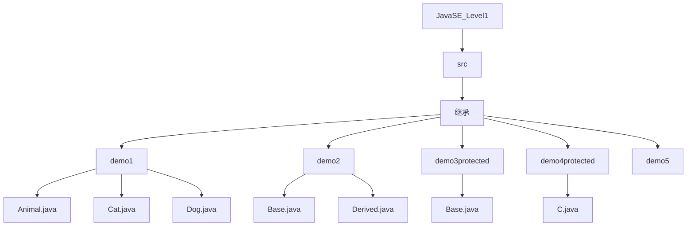
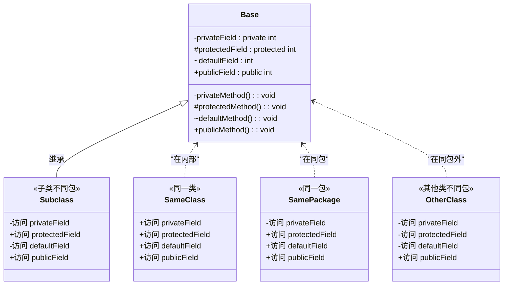

# 访问控制与protected

<cite>
**本文档引用的文件**  
- [Base.java](file://JavaSE_Level1/src/继承/demo3protected/Base.java)
- [C.java](file://JavaSE_Level1/src/继承/demo4protected/C.java)
- [Base.java](file://JavaSE_Level1/src/继承/demo2/Base.java)
- [Derived.java](file://JavaSE_Level1/src/继承/demo2/Derived.java)
- [Animal.java](file://JavaSE_Level1/src/继承/demo1/Animal.java)
- [Cat.java](file://JavaSE_Level1/src/继承/demo1/Cat.java)
</cite>

## 目录
1. [引言](#引言)  
2. [项目结构](#项目结构)  
3. [核心概念分析](#核心概念分析)  
4. [访问修饰符对比](#访问修饰符对比)  
5. [protected在继承中的特殊作用](#protected在继承中的特殊作用)  
6. [跨包继承访问规则](#跨包继承访问规则)  
7. [访问权限矩阵表](#访问权限矩阵表)  
8. [结论](#结论)

## 引言

本文档旨在系统阐述Java中`protected`访问修饰符在类继承机制中的独特作用。通过分析`demo3protected`和`demo4protected`两个示例，深入探讨子类对父类成员的访问权限边界，特别是在跨包继承场景下的行为。同时，本文将对比`private`、`default`（包私有）、`protected`和`public`四种访问修饰符的可见性范围，帮助开发者准确理解封装与继承之间的平衡。

**本节不涉及具体源码分析，因此无须列出源文件。**

## 项目结构

项目`Java_learning`包含多个模块，其中与本文档直接相关的部分位于`JavaSE_Level1/src/继承/`目录下。该目录包含多个演示继承特性的子包，如`demo1`、`demo2`、`demo3protected`和`demo4protected`。



**图示来源**  
- [demo1](file://JavaSE_Level1/src/继承/demo1)
- [demo2](file://JavaSE_Level1/src/继承/demo2)
- [demo3protected](file://JavaSE_Level1/src/继承/demo3protected)
- [demo4protected](file://JavaSE_Level1/src/继承/demo4protected)

## 核心概念分析

### 继承基础：demo1示例

`demo1`包中的`Animal`类作为父类，定义了`name`和`age`两个`public`字段以及`sleep()`和`eat()`方法。子类`Cat`通过`extends`关键字继承`Animal`，并可以自由访问父类的`public`成员。

```java
public class Animal {
    public String name;
    public int age;
    // ...
}

public class Cat extends Animal {
    public void miao() {
        System.out.println(name + "正在猫叫"); // 可直接访问父类public字段
    }
}
```

此示例展示了`public`成员在继承中的完全可见性。

**本节来源**  
- [Animal.java](file://JavaSE_Level1/src/继承/demo1/Animal.java#L1-L29)
- [Cat.java](file://JavaSE_Level1/src/继承/demo1/Cat.java#L1-L22)

### 成员覆盖与super关键字：demo2示例

`demo2`包中的`Base`类定义了一个`public int a`字段和`method()`方法。子类`Derived`不仅继承了这些成员，还定义了自己的`a`字段，形成了成员覆盖。

```java
// Base.java
public class Base {
    public int a;
    public void method() { System.out.println("Base :: method()"); }
}

// Derived.java
public class Derived extends Base {
    public int a = 2; // 覆盖父类的a

    public void test() {
        System.out.println(this.a);     // 输出子类的a (2)
        System.out.println(super.a);    // 输出父类的a (0, 默认值)
        super.method();                 // 调用父类方法
    }
}
```

此示例说明了`public`成员不仅可被继承，还可通过`super`关键字显式访问，即使被子类覆盖。

**本节来源**  
- [Base.java](file://JavaSE_Level1/src/继承/demo2/Base.java#L1-L10)
- [Derived.java](file://JavaSE_Level1/src/继承/demo2/Derived.java#L1-L24)

## 访问修饰符对比

Java提供了四种访问级别，其可见性范围如下：

| 访问修饰符 | 同一类 | 同一包 | 子类（不同包） | 其他类（不同包） |
| :--- | :--- | :--- | :--- | :--- |
| `private` | ✅ | ❌ | ❌ | ❌ |
| `default` (包私有) | ✅ | ✅ | ❌ | ❌ |
| `protected` | ✅ | ✅ | ✅ | ❌ |
| `public` | ✅ | ✅ | ✅ | ✅ |

- **`private`**: 仅在定义它的类内部可见。
- **`default`**: 在同一包内的所有类中可见。
- **`protected`**: 在同一包内可见，并且对所有子类（无论是否在同一个包中）可见。
- **`public`**: 在所有地方都可见。

## protected在继承中的特殊作用

### 同包内访问：demo3protected示例

`demo3protected`包中的`Base`类定义了一个`protected int a = 10;`成员。

```java
// Base.java
package 继承.demo3protected;

public class Base {
    protected int a = 10;
}
```

在同一个包`demo3protected`内的任何其他类，即使不是`Base`的子类，也可以访问`a`字段。这体现了`protected`比`private`更宽松，但比`public`更严格的封装性。

**本节来源**  
- [Base.java](file://JavaSE_Level1/src/继承/demo3protected/Base.java#L1-L5)

## 跨包继承访问规则

### 跨包子类访问：demo4protected示例

`demo4protected`包中的`C`类继承自`demo3protected`包中的`Base`类。

```java
// C.java
package 继承.demo4protected;

import 继承.demo3protected.Base;

public class C extends Base {
    public static void main(String[] args) {
        C c = new C();
        System.out.println(c.a); // ✅ 成功访问父类的protected成员
    }
}
```

尽管`C`类与`Base`类位于不同的包中，但由于`C`是`Base`的直接子类，它仍然可以访问`Base`的`protected`成员`a`。这是`protected`修饰符的核心特性：允许子类突破包的边界进行访问。

**本节来源**  
- [C.java](file://JavaSE_Level1/src/继承/demo4protected/C.java#L1-L11)
- [Base.java](file://JavaSE_Level1/src/继承/demo3protected/Base.java#L1-L5)

## 访问权限矩阵表

下表总结了四种访问修饰符在不同上下文中的可见性，特别强调了继承场景。



**图示来源**  
- [Base.java](file://JavaSE_Level1/src/继承/demo3protected/Base.java#L1-L5)
- [C.java](file://JavaSE_Level1/src/继承/demo4protected/C.java#L1-L11)

## 结论

`protected`访问修饰符是Java封装机制中的关键一环，它在`private`的严格封装和`public`的完全开放之间提供了一个平衡点。其核心价值在于：

1.  **支持继承**：允许子类访问父类的关键实现细节，这是实现代码复用和多态的基础。
2.  **控制封装边界**：防止包外的非子类直接访问父类的受保护成员，维护了类的封装性。
3.  **跨包继承**：使得类库的设计者可以将某些成员设计为对子类开放，但对普通用户隐藏，提高了API的安全性和健壮性。

通过`demo3protected`和`demo4protected`的对比，我们清晰地看到，`protected`成员在同包内对所有类可见，在跨包时则仅对子类可见。开发者应根据设计意图谨慎选择访问修饰符，以构建既灵活又安全的面向对象系统。

**本节为总结性内容，不涉及具体源码分析，因此无须列出源文件。**