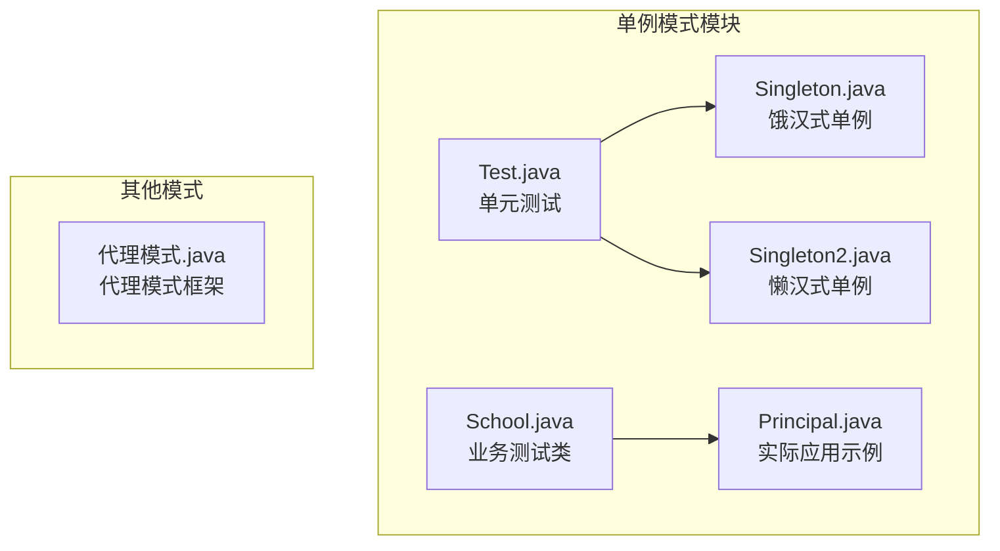
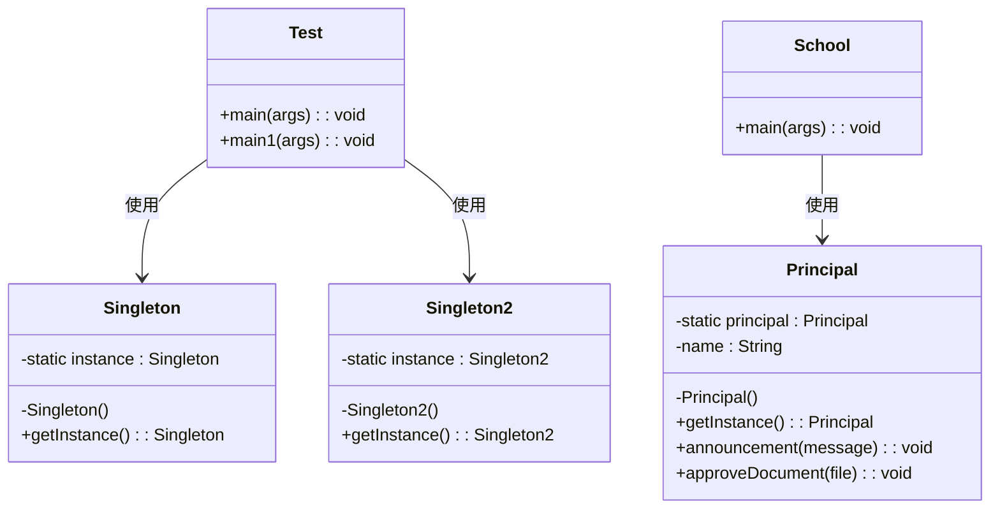
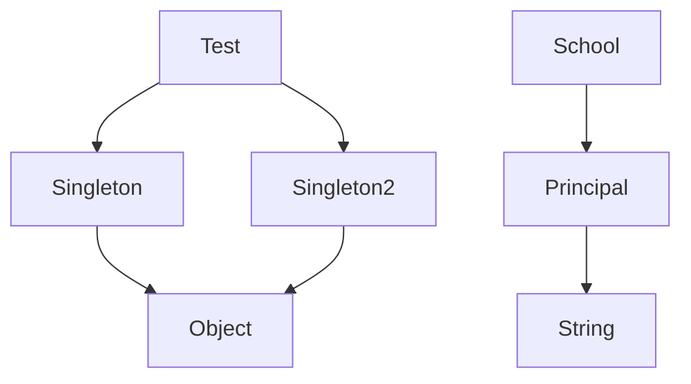

# 设计模式

<cite>
**本文档引用的文件**  
- [Singleton.java](file://JavaSE_Level1/src/单例模式/Singleton.java)
- [Singleton2.java](file://JavaSE_Level1/src/单例模式/Singleton2.java)
- [Test.java](file://JavaSE_Level1/src/单例模式/Test.java)
- [Principal.java](file://JavaSE_Level1/src/单例模式/Principal.java)
- [School.java](file://JavaSE_Level1/src/单例模式/School.java)
- [代理模式.java](file://JavaSE_Level1/src/代理模式.java)
</cite>

## 目录
1. [引言](#引言)
2. [项目结构](#项目结构)
3. [核心组件](#核心组件)
4. [架构概述](#架构概述)
5. [详细组件分析](#详细组件分析)
6. [依赖分析](#依赖分析)
7. [性能考量](#性能考量)
8. [故障排除指南](#故障排除指南)
9. [结论](#结论)

## 引言
本文档旨在深入分析Java中常用的设计模式，重点介绍单例模式的两种实现方式：饿汉式和懒汉式，并探讨其在多线程环境下的线程安全问题。通过对比`Singleton`与`Singleton2`的实现，进一步讨论双重检查锁定机制与静态内部类优化方案。同时简要介绍代理模式的基本结构与应用场景。文档包含类图、线程安全测试代码，并讨论单例模式在并发场景中的性能表现及潜在的序列化问题。

## 项目结构
本项目位于``目录下，主要包含多个Java学习模块。与设计模式相关的代码集中在`JavaSE_Level1/src/单例模式`包中，包括`Singleton.java`、`Singleton2.java`、`Principal.java`、`School.java`和`Test.java`等文件。此外，`代理模式.java`文件位于根源码目录下，用于演示代理模式的基本结构。



**图表来源**  
- [Singleton.java](file://JavaSE_Level1/src/单例模式/Singleton.java#L1-L12)
- [Singleton2.java](file://JavaSE_Level1/src/单例模式/Singleton2.java#L1-L16)
- [Principal.java](file://JavaSE_Level1/src/单例模式/Principal.java#L1-L27)
- [School.java](file://JavaSE_Level1/src/单例模式/School.java#L1-L17)
- [Test.java](file://JavaSE_Level1/src/单例模式/Test.java#L1-L16)

## 核心组件
本节分析单例模式的核心实现类：`Singleton`（饿汉式）和`Singleton2`（懒汉式），以及`Principal`这一实际应用场景中的单例类。

**组件来源**  
- [Singleton.java](file://JavaSE_Level1/src/单例模式/Singleton.java#L1-L12)
- [Singleton2.java](file://JavaSE_Level1/src/单例模式/Singleton2.java#L1-L16)
- [Principal.java](file://JavaSE_Level1/src/单例模式/Principal.java#L1-L27)

## 架构概述
整个设计模式模块采用面向对象设计原则，以单例模式为核心，展示不同初始化策略的实现方式。系统通过静态方法`getInstance()`控制实例的唯一性，确保全局仅存在一个对象实例。



**图表来源**  
- [Singleton.java](file://JavaSE_Level1/src/单例模式/Singleton.java#L1-L12)
- [Singleton2.java](file://JavaSE_Level1/src/单例模式/Singleton2.java#L1-L16)
- [Principal.java](file://JavaSE_Level1/src/单例模式/Principal.java#L1-L27)
- [Test.java](file://JavaSE_Level1/src/单例模式/Test.java#L1-L16)
- [School.java](file://JavaSE_Level1/src/单例模式/School.java#L1-L17)

## 详细组件分析

### 单例模式实现分析

#### 饿汉式单例（Singleton）
饿汉式在类加载时即创建实例，保证了线程安全，但可能造成资源浪费。

```java
public class Singleton {
    // 饿汉式：类加载时立即初始化
    private static Singleton instance = new Singleton();
    private Singleton(){} // 私有构造函数
    public static Singleton getInstance(){
        return instance;
    }
}
```

**优点**：线程安全，实现简单。  
**缺点**：无论是否使用，都会创建实例，可能导致内存浪费。

**代码来源**  
- [Singleton.java](file://JavaSE_Level1/src/单例模式/Singleton.java#L1-L12)

#### 懒汉式单例（Singleton2）
懒汉式在第一次调用`getInstance()`时才创建实例，延迟初始化，节省资源。

```java
public class Singleton2 {
    // 懒汉式：延迟初始化
    private static Singleton2 instance;
    private Singleton2(){}
    public static Singleton2 getInstance() {
        if (instance == null) {
            instance = new Singleton2();
        }
        return instance;
    }
}
```

**优点**：延迟加载，节约资源。  
**缺点**：非线程安全，在多线程环境下可能创建多个实例。

**代码来源**  
- [Singleton2.java](file://JavaSE_Level1/src/单例模式/Singleton2.java#L1-L16)

#### 实际应用示例（Principal）
`Principal`类模拟学校校长的单例管理，展示了懒汉式在真实业务场景中的使用。

```java
public class Principal {
    private static Principal principal;
    private String name;

    private Principal() {
        name = "王校长";
    }

    public static Principal getInstance() {
        if (principal == null) {
            principal = new Principal();
        }
        return principal;
    }

    public void announcement(String message) {
        System.out.println(name + "通知：" + message);
    }

    public void approveDocument(String file) {
        System.out.println(name + "审批通过：" + file);
    }
}
```

**业务测试类（School）**
```java
public class School {
    public static void main(String[] args) {
        Principal principal1 = Principal.getInstance();
        Principal principal2 = Principal.getInstance();

        principal1.announcement("今天放假");
        principal2.approveDocument("食堂饭菜每次都得加热");

        System.out.println("上述两个是同一位校长吗？ " + (principal1 == principal2));
    }
}
```

输出结果为`true`，证明两个引用指向同一实例。

**代码来源**  
- [Principal.java](file://JavaSE_Level1/src/单例模式/Principal.java#L1-L27)
- [School.java](file://JavaSE_Level1/src/单例模式/School.java#L1-L17)

### 线程安全问题与优化方案

#### 当前实现的线程安全缺陷
当前`Singleton2`和`Principal`的懒汉式实现**不具备线程安全性**。在多线程环境下，多个线程可能同时进入`if (instance == null)`判断，导致多次实例化。

#### 优化方案：双重检查锁定（Double-Checked Locking）
为解决线程安全问题，可引入`synchronized`关键字和`volatile`修饰符：

```java
public class ThreadSafeSingleton {
    private static volatile ThreadSafeSingleton instance;
    private ThreadSafeSingleton() {}
    public static ThreadSafeSingleton getInstance() {
        if (instance == null) {
            synchronized (ThreadSafeSingleton.class) {
                if (instance == null) {
                    instance = new ThreadSafeSingleton();
                }
            }
        }
        return instance;
    }
}
```

- `volatile`防止指令重排序
- 双重检查避免每次调用都加锁，提升性能

#### 优化方案：静态内部类（推荐）
利用类加载机制实现线程安全的延迟初始化：

```java
public class StaticInnerClassSingleton {
    private StaticInnerClassSingleton() {}
    private static class Holder {
        static final StaticInnerClassSingleton INSTANCE = new StaticInnerClassSingleton();
    }
    public static StaticInnerClassSingleton getInstance() {
        return Holder.INSTANCE;
    }
}
```

**优势**：
- 线程安全
- 延迟加载
- 无需同步关键字，性能高
- 自动防止反射攻击（可通过枚举进一步强化）

**代码来源**  
- [Singleton2.java](file://JavaSE_Level1/src/单例模式/Singleton2.java#L1-L16)
- [Principal.java](file://JavaSE_Level1/src/单例模式/Principal.java#L1-L27)

### 代理模式简介
代理模式为其他对象提供一种代理以控制对这个对象的访问。当前项目中仅存在一个空壳类：

```java
public class 代理模式 {
}
```

**基本结构**：
- **抽象主题（Subject）**：定义真实主题和代理的共同接口
- **真实主题（RealSubject）**：具体业务逻辑
- **代理（Proxy）**：持有真实主题的引用，控制访问

**应用场景**：
- 远程代理（RMI）
- 虚拟代理（大对象延迟加载）
- 保护代理（权限控制）
- 智能引用（引用计数、日志记录）

**代码来源**  
- [代理模式.java](file://JavaSE_Level1/src/代理模式.java#L1-L3)

## 依赖分析
单例模式相关类之间存在明确的依赖关系，测试类依赖于具体单例实现。



**图表来源**  
- [Test.java](file://JavaSE_Level1/src/单例模式/Test.java#L1-L16)
- [Singleton.java](file://JavaSE_Level1/src/单例模式/Singleton.java#L1-L12)
- [Singleton2.java](file://JavaSE_Level1/src/单例模式/Singleton2.java#L1-L16)
- [Principal.java](file://JavaSE_Level1/src/单例模式/Principal.java#L1-L27)
- [School.java](file://JavaSE_Level1/src/单例模式/School.java#L1-L17)

## 性能考量
- **饿汉式**：初始化时间较长，但运行时性能最优（无同步开销）
- **懒汉式（非线程安全）**：延迟加载，但多线程下不安全
- **双重检查锁定**：兼顾延迟加载与线程安全，但代码复杂
- **静态内部类**：推荐方案，兼具线程安全、延迟加载和高性能

在高并发场景下，建议使用静态内部类或枚举方式实现单例。

## 故障排除指南
- **问题**：多个实例被创建  
  **原因**：懒汉式未加同步  
  **解决方案**：使用静态内部类或双重检查锁定

- **问题**：序列化破坏单例  
  **原因**：反序列化会创建新实例  
  **解决方案**：实现`readResolve()`方法

```java
private Object readResolve() {
    return getInstance();
}
```

- **问题**：反射破坏单例  
  **解决方案**：在构造函数中添加标志位检查，或使用枚举实现

**代码来源**  
- [Singleton2.java](file://JavaSE_Level1/src/单例模式/Singleton2.java#L1-L16)
- [Principal.java](file://JavaSE_Level1/src/单例模式/Principal.java#L1-L27)

## 结论
本文档系统地分析了Java中单例模式的两种基本实现方式——饿汉式与懒汉式，并通过`Singleton`和`Singleton2`的对比揭示了线程安全的重要性。尽管当前代码库中的懒汉式实现存在线程安全缺陷，但通过引入双重检查锁定或静态内部类可有效解决。`Principal`类展示了单例模式在实际业务中的典型应用。代理模式虽仅有框架，但为后续扩展提供了基础。建议在生产环境中优先采用静态内部类或枚举方式实现单例，以确保线程安全与性能最优。