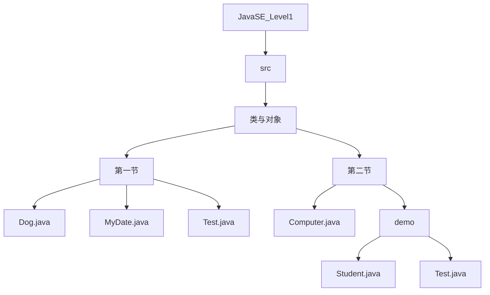
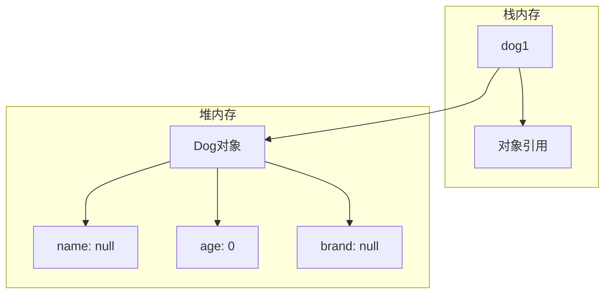
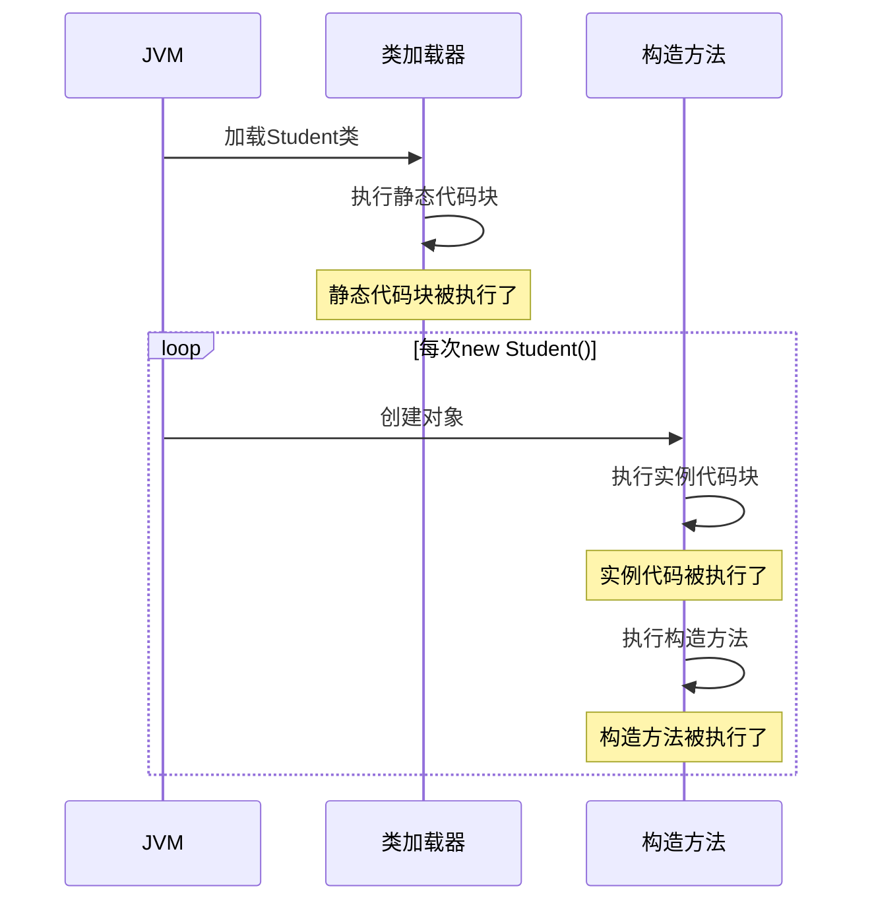

# 面向对象基础

<cite>
**本文档引用的文件**  
- [Dog.java](file://JavaSE_Level1/src/类与对象/第一节/Dog.java)
- [MyDate.java](file://JavaSE_Level1/src/类与对象/第一节/MyDate.java)
- [Test.java](file://JavaSE_Level1/src/类与对象/第一节/Test.java)
- [Computer.java](file://JavaSE_Level1/src/类与对象/第二节/Computer.java)
- [Student.java](file://JavaSE_Level1/src/类与对象/第二节/demo/Student.java)
- [Test.java](file://JavaSE_Level1/src/类与对象/第二节/demo/Test.java)
- [异常/Test.java](file://JavaSE_Level1/src/异常/Test.java)
</cite>

## 目录
1. [引言](#引言)
2. [项目结构](#项目结构)
3. [核心组件分析](#核心组件分析)
4. [类与对象的创建与实例化](#类与对象的创建与实例化)
5. [构造方法与this关键字](#构造方法与this关键字)
6. [封装性与访问控制](#封装性与访问控制)
7. [对象组合与代码复用](#对象组合与代码复用)
8. [常见错误分析：空指针异常](#常见错误分析：空指针异常)
9. [测试与调试技巧](#测试与调试技巧)
10. [总结](#总结)

## 引言

本文档旨在深入讲解Java面向对象编程（OOP）的基础概念，包括类与对象的定义、构造方法、`this`关键字、封装性、对象组合等核心内容。通过分析`Dog`、`MyDate`、`Student`和`Computer`等教学示例，结合`Test.java`中的测试用例，帮助初学者建立清晰的面向对象思维模型。同时，文档将解析内存模型、常见错误（如空指针异常）及调试技巧，确保学习者能够正确理解和应用这些概念。

## 项目结构

本项目位于``目录下，主要教学内容集中在`JavaSE_Level1\src\类与对象`文件夹中。该目录分为“第一节”和“第二节”，分别对应面向对象基础的不同教学阶段。



**图示来源**  
- [Dog.java](file://JavaSE_Level1/src/类与对象/第一节/Dog.java)
- [MyDate.java](file://JavaSE_Level1/src/类与对象/第一节/MyDate.java)
- [Computer.java](file://JavaSE_Level1/src/类与对象/第二节/Computer.java)
- [Student.java](file://JavaSE_Level1/src/类与对象/第二节/demo/Student.java)

## 核心组件分析

本节将分析构成面向对象编程基础的核心组件，包括`Dog`类（基础属性与方法）、`MyDate`类（构造方法与this）、`Student`类（封装与静态成员）和`Computer`类（组合结构）。

**本节来源**  
- [Dog.java](file://JavaSE_Level1/src/类与对象/第一节/Dog.java#L1-L21)
- [MyDate.java](file://JavaSE_Level1/src/类与对象/第一节/MyDate.java#L1-L45)
- [Student.java](file://JavaSE_Level1/src/类与对象/第二节/demo/Student.java#L1-L44)
- [Computer.java](file://JavaSE_Level1/src/类与对象/第二节/Computer.java#L1-L10)

### Dog类：基础类定义

`Dog`类是面向对象最基础的示例，展示了如何定义一个类，包含成员变量和成员方法。

```java
public class Dog {
    public String name;
    public int age;
    public String brand;

    public void eat() {
        System.out.println(name + "在吃饭");
    }

    public void sleep() {
        System.out.println(name + "在睡觉");
    }

    public void bark() {
        System.out.println(name + "在狗叫");
    }
}
```

- **成员变量**：`name`、`age`、`brand`用于描述狗的特征。
- **成员方法**：`eat()`、`sleep()`、`bark()`表示狗的行为。
- **访问修饰符**：`public`表示这些成员可以在任何地方被访问。

### MyDate类：构造方法与this

`MyDate`类用于表示日期，重点展示了构造方法和`this`关键字的使用。

```java
public class MyDate {
    public int year;
    public int month;
    public int day;

    public MyDate(){
        this(1900,1,1); // 调用带参构造方法
        System.out.println("不带参数的构造方法");
    }

    public MyDate(int year, int month, int day) {
        this.year = year;
        this.month = month;
        this.day = day;
    }

    public void printDate() {
        System.out.println("year: "+year+" month: "+month+" day: "+day);
        this.test(); // 调用本类的test方法
    }

    public void test() {
        System.out.println("test()");
    }
}
```

- **构造方法**：`MyDate()`和`MyDate(int, int, int)`用于在创建对象时初始化成员变量。
- **this关键字**：
  - `this(1900,1,1)`：在无参构造中调用有参构造，必须放在第一行。
  - `this.year = year`：区分成员变量和局部变量。
  - `this.test()`：调用本类的其他方法。

### Student类：封装性与代码块

`Student`类展示了封装性、getter/setter方法、静态成员和代码块。

```java
public class Student {
    private String name; // 私有成员，外部不可直接访问
    private int age;
    public static String classroom; // 静态成员，属于类，不依赖于对象

    public Student(String name, int age) {
        this.name = name;
        this.age = age;
        System.out.println("构造方法被执行了");
    }

    { // 实例代码块，每次创建对象时执行
        System.out.println("实例代码被执行了");
    }

    static { // 静态代码块，类加载时执行一次
        System.out.println("静态代码块被执行了");
    }

    // Getter和Setter方法实现封装
    public String getName() { return name; }
    public void setName(String name) { this.name = name; }
    public int getAge() { return age; }
    public void setAge(int age) { this.age = age; }
}
```

### Computer类：对象组合

`Computer`类展示了如何通过组合其他对象来构建复杂对象。

```java
public class Computer {
    private String cpu; // cpu
    private String memory="123"; // 内存
    public String screen; // 屏幕
    String brand; // 品牌
}
```

- **组合**：一个`Computer`对象由`cpu`、`memory`、`screen`、`brand`等部件组成。
- **访问修饰符**：`private`、`public`、默认（包访问）。

## 类与对象的创建与实例化

### 类的定义

类是创建对象的模板，定义了对象的属性和行为。`Dog`类就是一个典型的类定义。

### 对象的实例化

对象是类的实例。使用`new`关键字来创建对象。

```java
Dog dog1 = new Dog(); // 创建Dog类的一个实例
```

- `new Dog()`：在堆内存中分配空间，创建一个新的`Dog`对象。
- `Dog dog1`：在栈内存中创建一个引用变量`dog1`。
- `=`：将`dog1`指向新创建的对象。

### 内存模型图解



**图示来源**  
- [Dog.java](file://JavaSE_Level1/src/类与对象/第一节/Dog.java#L1-L21)
- [Test.java](file://JavaSE_Level1/src/类与对象/第一节/Test.java#L1-L21)

### 成员变量的初始化

- **基本类型**：`int`初始化为`0`，`boolean`为`false`。
- **引用类型**：`String`等初始化为`null`。
- **显式初始化**：`private String memory="123";`。

## 构造方法与this关键字

### 构造方法

构造方法是一种特殊的方法，用于在创建对象时初始化对象。

- **特点**：
  - 名称与类名完全相同。
  - 没有返回类型（连`void`都没有）。
  - 在`new`时自动调用。
- **类型**：
  - **无参构造**：`public MyDate()`
  - **有参构造**：`public MyDate(int year, int month, int day)`

### this关键字详解

`this`是Java中的一个关键字，代表当前对象的引用。

- **区分成员变量与局部变量**：
  ```java
  public MyDate(int year, int month, int day) {
      this.year = year; // this.year 指成员变量，year 指参数
      this.month = month;
      this.day = day;
  }
  ```
- **在一个构造方法中调用另一个构造方法**：
  ```java
  public MyDate(){
      this(1900,1,1); // 必须是第一行
      System.out.println("不带参数的构造方法");
  }
  ```
- **调用本类的其他方法**：
  ```java
  public void printDate() {
      this.test(); // 调用本类的test方法
  }
  ```

### 执行顺序示例

在`Student`类中，代码块的执行顺序如下：



**图示来源**  
- [Student.java](file://JavaSE_Level1/src/类与对象/第二节/demo/Student.java#L1-L44)
- [Test.java](file://JavaSE_Level1/src/类与对象/第二节/demo/Test.java#L1-L25)

## 封装性与访问控制

### 封装性的概念

封装是面向对象的三大特性之一，指将对象的内部状态（成员变量）隐藏起来，只通过公共方法（getter/setter）来访问和修改。

### 访问修饰符

| 修饰符 | 同一类 | 同一包 | 子类 | 不同包 |
| :--- | :--- | :--- | :--- | :--- |
| `private` | ✓ | ✗ | ✗ | ✗ |
| `default` (无) | ✓ | ✓ | ✗ | ✗ |
| `protected` | ✓ | ✓ | ✓ | ✗ |
| `public` | ✓ | ✓ | ✓ | ✓ |

### getter和setter方法

```java
// 在Student类中
public String getName() {
    return name;
}

public void setName(String name) {
    this.name = name;
}
```

- **优点**：
  - 可以在`setName`中添加数据验证逻辑。
  - 可以控制成员变量的只读或只写。
- **使用**：
  ```java
  Student student = new Student("张三", 18);
  student.setName("lisi"); // 正确
  // student.name = "lisi"; // 错误，name是private的
  System.out.println(student.getName());
  ```

**本节来源**  
- [Student.java](file://JavaSE_Level1/src/类与对象/第二节/demo/Student.java#L1-L44)
- [Test.java](file://JavaSE_Level1/src/类与对象/第二节/demo/Test.java#L1-L25)

## 对象组合与代码复用

### 对象组合的概念

对象组合是指一个类的成员变量是另一个类的对象。这是实现代码复用的重要方式之一。

### 示例分析

虽然`Computer.java`中只定义了基本类型的成员，但在实际应用中，它应该由`CPU`、`Memory`、`Screen`等对象组成。

```java
// 理想的Computer类结构
public class Computer {
    private CPU cpu;
    private Memory memory;
    private Screen screen;
    private String brand;

    public Computer(CPU cpu, Memory memory, Screen screen, String brand) {
        this.cpu = cpu;
        this.memory = memory;
        this.screen = screen;
        this.brand = brand;
    }
}
```

- **优点**：
  - 提高代码的模块化和可维护性。
  - 可以复用`CPU`、`Memory`等类的代码。
  - 更符合现实世界的模型。

### 与继承的区别

- **组合**：A对象**拥有**B对象（has-a关系）。
- **继承**：A类**是**B类的一种（is-a关系）。

**本节来源**  
- [Computer.java](file://JavaSE_Level1/src/类与对象/第二节/Computer.java#L1-L10)

## 常见错误分析：空指针异常

### 什么是空指针异常

`NullPointerException`（空指针异常）是Java中最常见的运行时异常之一。当程序试图在`null`引用上调用方法或访问成员变量时，就会抛出此异常。

### 产生原因

```java
String str = null;
int len = str.length(); // 抛出NullPointerException
```

- `str`是一个引用，但它指向`null`（空）。
- `str.length()`试图调用`null`上的方法，导致错误。

### 如何预防

1. **初始化对象**：
   ```java
   String str = ""; // 而不是 null
   ```

2. **空值检查**：
   ```java
   if (str != null) {
       int len = str.length();
   }
   ```

3.  **在方法中检查参数**：
   ```java
   public static int getElement(int[] array, int index) {
       if (array == null) { // 或 null == array
           throw new NullPointerException("传递的数组为null");
       }
       // ...
   }
   ```

### 调试技巧

- 查看异常堆栈信息，找到出错的行号。
- 使用IDE的调试器，在可疑代码处设置断点，检查变量的值。

**本节来源**  
- [异常/Test.java](file://JavaSE_Level1/src/异常/Test.java#L14-L15)

## 测试与调试技巧

### 使用Test.java验证类的正确性

`Test.java`文件中的`main`方法是程序的入口点，用于测试和验证类的功能。

```java
public class Test {
    public static void main(String[] args) {
        // 测试Dog类
        Dog dog1 = new Dog();
        dog1.name = "安治昊";
        dog1.age = 10;
        dog1.brand = "金毛";
        dog1.eat(); // 输出: 安治昊在吃饭

        // 测试MyDate类
        MyDate myDate = new MyDate(); // 调用无参构造
        myDate.printDate(); // 输出: year: 1900 month: 1 day: 1
    }
}
```

### 基本调试技巧

1.  **打印日志**：使用`System.out.println()`输出关键变量的值。
2.  **使用IDE调试器**：
    - 设置断点（Breakpoint）。
    - 逐行执行（Step Over/Into）。
    - 查看变量（Variables）窗口。
3.  **阅读异常信息**：异常堆栈会告诉你错误发生的位置和原因。

**本节来源**  
- [Test.java](file://JavaSE_Level1/src/类与对象/第一节/Test.java#L1-L21)

## 总结

本文档系统地讲解了Java面向对象编程的基础知识。我们学习了：
- 如何定义**类**并创建**对象**。
- **构造方法**的使用和`this`关键字的三种用法。
- 通过**封装性**（private成员和getter/setter）保护数据。
- 通过**对象组合**实现代码复用。
- 如何避免和处理**空指针异常**。
- 如何编写**测试代码**并进行基本**调试**。

掌握这些基础概念是学习更高级面向对象特性的前提。建议读者动手实践文档中的每一个示例，加深理解。