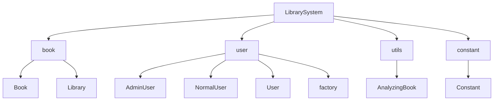
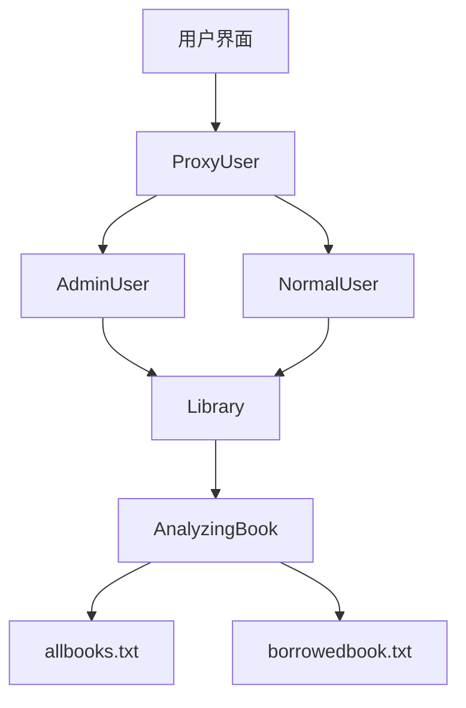
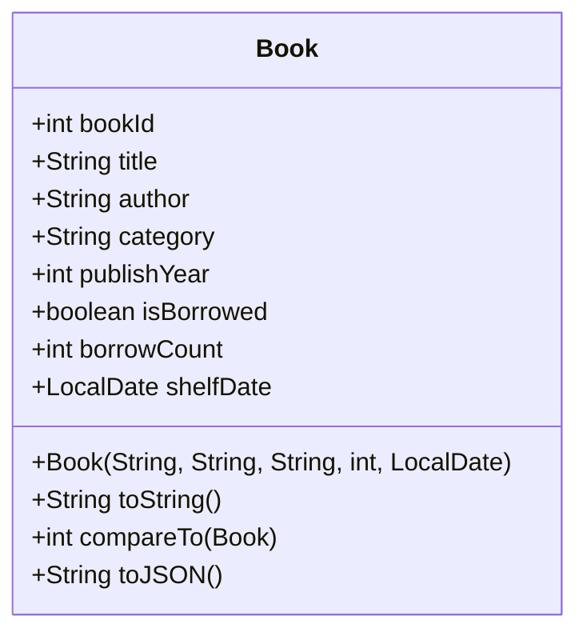
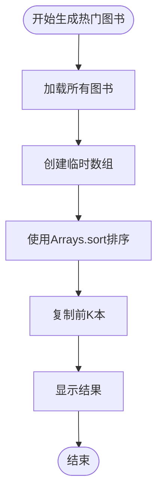
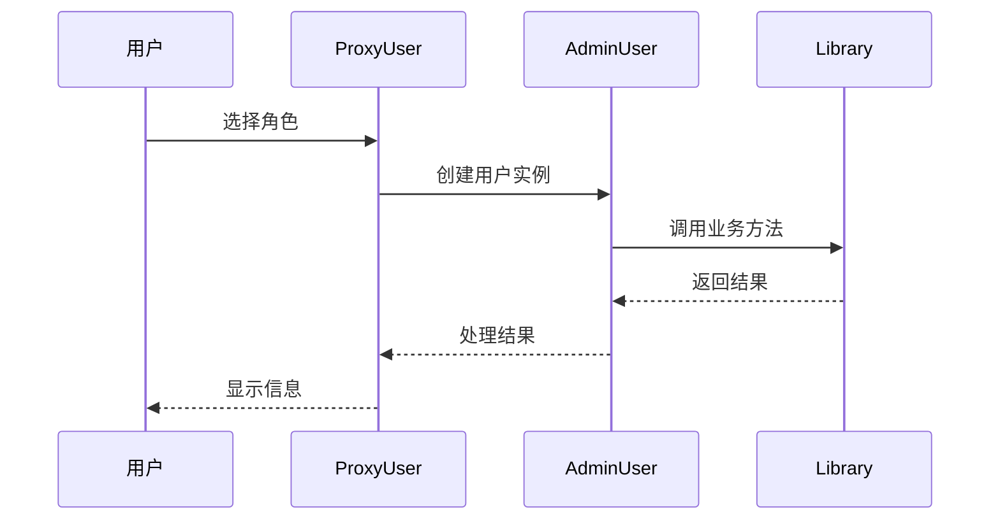
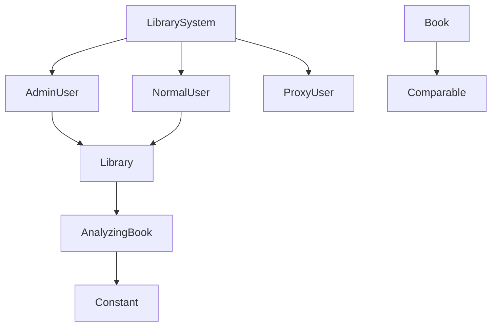
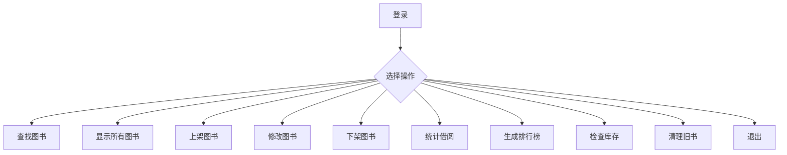
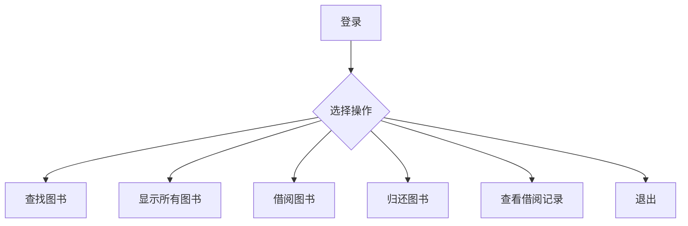

# 图书管理系统

<cite>
**本文档中引用的文件**  
- [LibrarySystem.java](file://java-118/J20250714-tushu/src/LibrarySystem.java)
- [Book.java](file://java-118/J20250714-tushu/src/book/Book.java)
- [Library.java](file://java-118/J20250714-tushu/src/Library.java)
- [AdminUser.java](file://java-118/J20250714-tushu/src/user/AdminUser.java)
- [NormalUser.java](file://java-118/J20250714-tushu/src/user/NormalUser.java)
- [AnalyzingBook.java](file://java-118/J20250714-tushu/src/utils/AnalyzingBook.java)
- [Constant.java](file://java-118/J20250714-tushu/src/constant/Constant.java)
- [PairOfUidAndBookId.java](file://java-118/J20250714-tushu/src/book/PairOfUidAndBookId.java)
</cite>

## 目录
1. [简介](#简介)
2. [项目结构](#项目结构)
3. [核心组件](#核心组件)
4. [系统架构概述](#系统架构概述)
5. [详细组件分析](#详细组件分析)
6. [依赖关系分析](#依赖关系分析)
7. [数据持久化机制](#数据持久化机制)
8. [用户交互流程](#用户交互流程)
9. [使用示例](#使用示例)
10. [扩展方向](#扩展方向)

## 简介
本系统是一个基于Java的图书管理系统，支持管理员和普通用户两种角色。系统实现了图书的增删改查、借阅归还、统计分析等功能，并通过文件进行数据持久化。系统采用工厂模式创建用户，使用代理模式控制权限，具备良好的可扩展性和可维护性。

## 项目结构
系统采用分层包结构组织代码，主要分为以下几个模块：
- `book`：图书相关类，包括图书实体和图书管理
- `user`：用户相关类，包括用户基类、管理员、普通用户及用户工厂
- `utils`：工具类，负责数据的序列化与反序列化
- `constant`：常量类，定义系统常量和操作码
- 根目录：系统启动类

**图示来源**  
- [LibrarySystem.java](file://java-118/J20250714-tushu/src/LibrarySystem.java)
- [Book.java](file://java-118/J20250714-tushu/src/book/Book.java)
- [AdminUser.java](file://java-118/J20250714-tushu/src/user/AdminUser.java)
- [AnalyzingBook.java](file://java-118/J20250714-tushu/src/utils/AnalyzingBook.java)
- [Constant.java](file://java-118/J20250714-tushu/src/constant/Constant.java)

**本节来源**  
- [LibrarySystem.java](file://java-118/J20250714-tushu/src/LibrarySystem.java)
- [Book.java](file://java-118/J20250714-tushu/src/book/Book.java)
- [AdminUser.java](file://java-118/J20250714-tushu/src/user/AdminUser.java)
- [AnalyzingBook.java](file://java-118/J20250714-tushu/src/utils/AnalyzingBook.java)
- [Constant.java](file://java-118/J20250714-tushu/src/constant/Constant.java)

## 核心组件

### Library 类
`Library` 类是系统的核心管理类，负责图书的存储、检索和业务逻辑处理。它采用单例模式确保全局唯一实例，通过数组存储图书对象，并提供增删改查、排序统计等方法。

### Book 类
`Book` 类表示图书实体，包含图书的基本信息如书名、作者、类别、出版年份等。该类实现了 `Comparable` 接口，支持按借阅次数进行排序，便于生成热门图书排行榜。

**本节来源**  
- [Library.java](file://java-118/J20250714-tushu/src/Library.java#L1-L50)
- [Book.java](file://java-118/J20250714-tushu/src/book/Book.java#L1-L30)

## 系统架构概述
系统采用经典的三层架构：
1. **表现层**：用户通过命令行界面与系统交互
2. **业务逻辑层**：`Library` 类和用户类处理核心业务逻辑
3. **数据访问层**：`AnalyzingBook` 类负责文件的读写操作

系统通过 `ProxyUser` 实现权限代理，根据用户角色动态调用相应操作。

**图示来源**  
- [LibrarySystem.java](file://java-118/J20250714-tushu/src/LibrarySystem.java)
- [Library.java](file://java-118/J20250714-tushu/src/Library.java)
- [AnalyzingBook.java](file://java-118/J20250714-tushu/src/utils/AnalyzingBook.java)

## 详细组件分析

### Book 类分析
`Book` 类封装了图书的所有属性和行为，关键特性包括：
- 借阅状态管理（`isBorrowed`）
- 借阅次数统计（`borrowCount`）
- 上架时间记录（`shelfDate`）
- JSON序列化支持（`toJSON`方法）

**图示来源**  
- [Book.java](file://java-118/J20250714-tushu/src/book/Book.java#L1-L150)

### Library 类分析
`Library` 类是系统的核心，管理图书的全生命周期。

#### 排序功能实现
`generateBook` 方法使用 `Arrays.sort` 对图书按借阅次数进行排序：

**图示来源**  
- [Library.java](file://java-118/J20250714-tushu/src/Library.java#L200-L250)

#### 用户操作流程

**图示来源**  
- [LibrarySystem.java](file://java-118/J20250714-tushu/src/LibrarySystem.java)
- [AdminUser.java](file://java-118/J20250714-tushu/src/user/AdminUser.java)
- [Library.java](file://java-118/J20250714-tushu/src/Library.java)

**本节来源**  
- [Book.java](file://java-118/J20250714-tushu/src/book/Book.java)
- [Library.java](file://java-118/J20250714-tushu/src/Library.java)
- [AdminUser.java](file://java-118/J20250714-tushu/src/user/AdminUser.java)
- [NormalUser.java](file://java-118/J20250714-tushu/src/user/NormalUser.java)

## 依赖关系分析
系统各组件间存在清晰的依赖关系：

**图示来源**  
- [LibrarySystem.java](file://java-118/J20250714-tushu/src/LibrarySystem.java)
- [AdminUser.java](file://java-118/J20250714-tushu/src/user/AdminUser.java)
- [Library.java](file://java-118/J20250714-tushu/src/Library.java)
- [AnalyzingBook.java](file://java-118/J20250714-tushu/src/utils/AnalyzingBook.java)

**本节来源**  
- [LibrarySystem.java](file://java-118/J20250714-tushu/src/LibrarySystem.java)
- [AdminUser.java](file://java-118/J20250714-tushu/src/user/AdminUser.java)
- [Library.java](file://java-118/J20250714-tushu/src/Library.java)
- [AnalyzingBook.java](file://java-118/J20250714-tushu/src/utils/AnalyzingBook.java)

## 数据持久化机制
系统通过文件系统实现数据持久化，主要机制如下：

### 文件存储格式
- `allbooks.txt`：存储所有图书信息，每行一个JSON格式的图书记录
- `borrowedbook.txt`：存储借阅记录，记录用户ID和图书ID的对应关系

### 序列化流程

### 反序列化流程

**图示来源**  
- [AnalyzingBook.java](file://java-118/J20250714-tushu/src/utils/AnalyzingBook.java)
- [Constant.java](file://java-118/J20250714-tushu/src/constant/Constant.java)

**本节来源**  
- [AnalyzingBook.java](file://java-118/J20250714-tushu/src/utils/AnalyzingBook.java)
- [Constant.java](file://java-118/J20250714-tushu/src/constant/Constant.java)

## 用户交互流程
系统提供清晰的用户交互界面，支持两种角色：

### 管理员操作流程

### 普通用户操作流程

**本节来源**  
- [AdminUser.java](file://java-118/J20250714-tushu/src/user/AdminUser.java#L30-L150)
- [NormalUser.java](file://java-118/J20250714-tushu/src/user/NormalUser.java#L90-L210)

## 使用示例
### 启动系统
运行 `LibrarySystem.main` 方法，系统将提示选择用户角色。

### 管理员添加图书
1. 选择管理员角色
2. 选择"上架图书"操作
3. 输入图书信息（书名、作者、类别、出版年份）
4. 系统自动生成图书ID并保存

### 普通用户借阅图书
1. 选择普通用户角色
2. 选择"借阅图书"操作
3. 输入要借阅的图书ID
4. 系统检查借阅资格并更新状态

**本节来源**  
- [LibrarySystem.java](file://java-118/J20250714-tushu/src/LibrarySystem.java)
- [AdminUser.java](file://java-118/J20250714-tushu/src/user/AdminUser.java#L50-L80)
- [NormalUser.java](file://java-118/J20250714-tushu/src/user/NormalUser.java#L100-L130)

## 扩展方向
1. **数据库迁移**：将文件存储改为数据库存储，提高数据安全性和查询效率
2. **Web界面**：开发Web前端，提供更友好的用户界面
3. **用户认证**：增加密码验证机制，提高系统安全性
4. **搜索优化**：实现全文搜索和多条件筛选
5. **报表功能**：生成借阅统计报表和趋势分析
6. **消息通知**：添加借阅到期提醒功能
7. **REST API**：提供API接口，支持移动端访问

**本节来源**  
- [LibrarySystem.java](file://java-118/J20250714-tushu/src/LibrarySystem.java)
- [Library.java](file://java-118/J20250714-tushu/src/Library.java)
- [AnalyzingBook.java](file://java-118/J20250714-tushu/src/utils/AnalyzingBook.java)