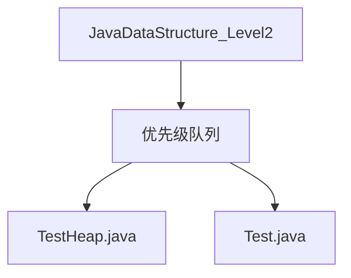
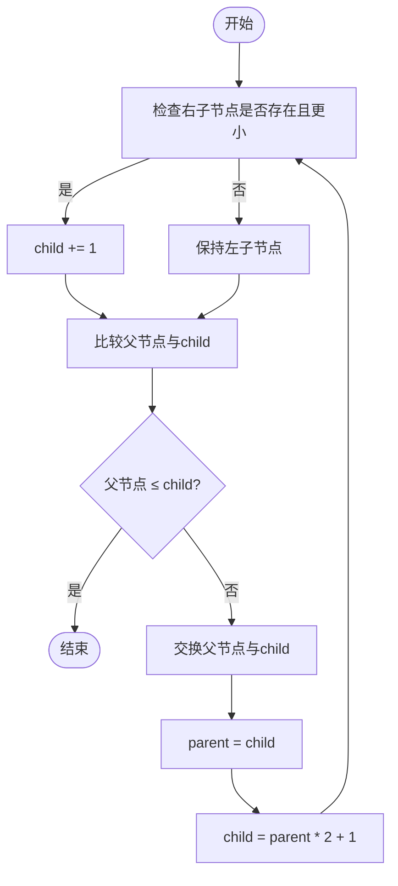
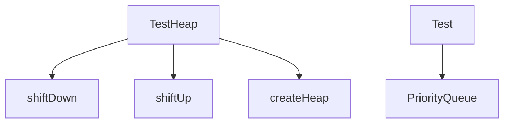

# 优先级队列与堆

<cite>
**本文档引用的文件**  
- [TestHeap.java](file://JavaDataStructure_Level2/src/优先级队列/TestHeap.java)
- [Test.java](file://JavaDataStructure_Level2/src/优先级队列/Test.java)
</cite>

## 目录
1. [引言](#引言)
2. [项目结构](#项目结构)
3. [核心组件](#核心组件)
4. [架构概述](#架构概述)
5. [详细组件分析](#详细组件分析)
6. [依赖分析](#依赖分析)
7. [性能考量](#性能考量)
8. [故障排除指南](#故障排除指南)
9. [结论](#结论)

## 引言
本文档深入讲解优先级队列的概念及其基于堆（Heap）结构的实现原理。通过分析`TestHeap.java`中的代码，详细阐述大根堆与小根堆的数组表示法、父子节点索引关系、上浮（shiftUp）与下沉（shiftDown）操作的实现逻辑。同时，结合`Test.java`中的测试用例，展示优先级队列在任务调度、Top-K问题中的实际应用，并分析其O(log n)的时间复杂度优势。

## 项目结构
项目`JavaDataStructure_Level2`包含多个数据结构模块，如链表、栈、队列、二叉树和排序等。其中，“优先级队列”目录专门用于实现和测试堆结构。该模块包含两个核心文件：`TestHeap.java`（堆的实现）和`Test.java`（测试用例）。



**图示来源**
- [TestHeap.java](file://JavaDataStructure_Level2/src/优先级队列/TestHeap.java)
- [Test.java](file://JavaDataStructure_Level2/src/优先级队列/Test.java)

## 核心组件
`TestHeap`类是堆结构的核心实现，包含以下关键成员：
- **array**: 存储堆元素的数组。
- **uesdSize**: 记录当前堆中已使用的空间大小。
- **createHeap(int[] array)**: 静态方法，用于将一个普通数组构建成堆。
- **shiftDown(int[] array, int parent)**: 私有静态方法，实现堆的“下沉”调整，确保子树满足堆性质。
- **shiftUp(int child)**: 公共方法，实现堆的“上浮”调整，通常用于插入新元素后维护堆结构。

**组件来源**
- [TestHeap.java](file://JavaDataStructure_Level2/src/优先级队列/TestHeap.java#L2-L69)

## 架构概述
堆是一种特殊的完全二叉树，通常用数组实现。在`TestHeap`中，采用小根堆（最小堆）的设计，即父节点的值小于或等于其子节点的值。堆的根节点始终是整个结构中的最小元素，这使得优先级队列能够高效地获取最高优先级的任务。

```mermaid
graph TD
A[堆结构] --> B[数组表示]
A --> C[完全二叉树]
B --> D[父子索引关系: parent = (child-1)/2, leftChild = 2*parent+1, rightChild = 2*parent+2]
C --> E[小根堆性质: 父节点 ≤ 子节点]
```

**图示来源**
- [TestHeap.java](file://JavaDataStructure_Level2/src/优先级队列/TestHeap.java#L2-L69)

## 详细组件分析

### 堆的构建（Heapify）
堆的构建过程从倒数第一个非叶子节点开始，自底向上对每个节点执行`shiftDown`操作。该算法的时间复杂度为O(n)，优于逐个插入的O(n log n)。

```java
public static void createHeap(int[] array) {
    int root = ((array.length - 2) >> 1); // 计算倒数第一个非叶子节点的索引
    for (; root >= 0; root--) {
        shiftDown(array, root);
    }
}
```

**代码来源**
- [TestHeap.java](file://JavaDataStructure_Level2/src/优先级队列/TestHeap.java#L15-L21)

### 上浮（ShiftUp）与下沉（ShiftDown）操作
- **上浮操作**：当新元素插入到数组末尾时，通过`shiftUp`将其与父节点比较并交换，直到满足堆性质。
- **下沉操作**：当堆顶元素被移除后，将最后一个元素移到根位置，通过`shiftDown`与其较小的子节点交换，向下调整以恢复堆结构。



**图示来源**
- [TestHeap.java](file://JavaDataStructure_Level2/src/优先级队列/TestHeap.java#L40-L68)

### 插入与删除操作
尽管`TestHeap`类未显式实现`insert`和`delete`方法，但可通过`shiftUp`和`shiftDown`组合实现：
- **插入**：将新元素添加到数组末尾，然后调用`shiftUp`。
- **删除堆顶**：将堆顶元素与末尾元素交换，移除末尾元素，然后对新的根节点调用`shiftDown`。

### 堆排序
堆排序利用堆的性质进行排序。首先调用`createHeap`构建堆，然后重复“取出堆顶（最小值）并下沉调整”直到堆为空。虽然`TestHeap`未实现完整排序方法，但其核心操作已具备实现堆排序的基础。

## 依赖分析
`TestHeap`类独立实现堆的核心逻辑，不依赖其他自定义类。测试文件`Test.java`使用了Java标准库中的`PriorityQueue`来验证概念。



**图示来源**
- [TestHeap.java](file://JavaDataStructure_Level2/src/优先级队列/TestHeap.java)
- [Test.java](file://JavaDataStructure_Level2/src/优先级队列/Test.java#L4-L28)

## 性能考量
- **时间复杂度**：
  - 插入（Insert）：O(log n)
  - 删除堆顶（Extract Min）：O(log n)
  - 构建堆（Heapify）：O(n)
  - 堆排序（Heap Sort）：O(n log n)
- **空间复杂度**：O(1)（原地排序，不包括输入数组）

堆的O(log n)操作效率使其在处理动态数据集（如任务调度、实时数据流）时具有显著优势。

## 故障排除指南
- **数组越界**：确保在访问`array[child + 1]`前检查`child + 1 < size`。
- **堆性质破坏**：若`shiftDown`或`shiftUp`逻辑错误，可能导致堆结构失效。应确保在交换后继续调整子树。
- **初始化问题**：`TestHeap`构造函数仅分配4个元素的空间，实际使用中应根据需求动态扩容。

**组件来源**
- [TestHeap.java](file://JavaDataStructure_Level2/src/优先级队列/TestHeap.java#L40-L68)

## 结论
`TestHeap`类提供了一个简洁而有效的堆结构实现，清晰地展示了优先级队列的核心原理。通过`shiftUp`和`shiftDown`操作，实现了高效的元素插入与删除。尽管缺少完整的插入/删除接口和堆排序实现，但其基础代码为扩展功能提供了坚实的基础。堆结构因其O(log n)的高效操作，在解决Top-K、任务调度等问题中具有不可替代的价值。