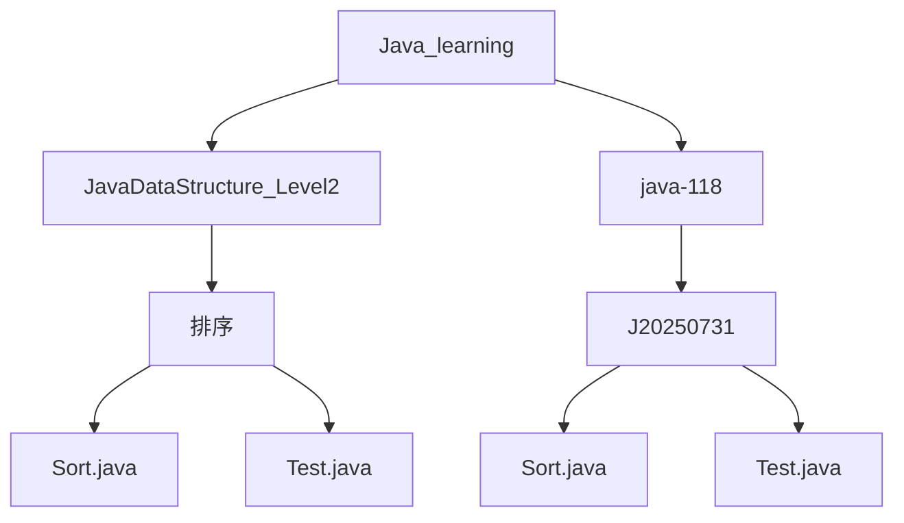
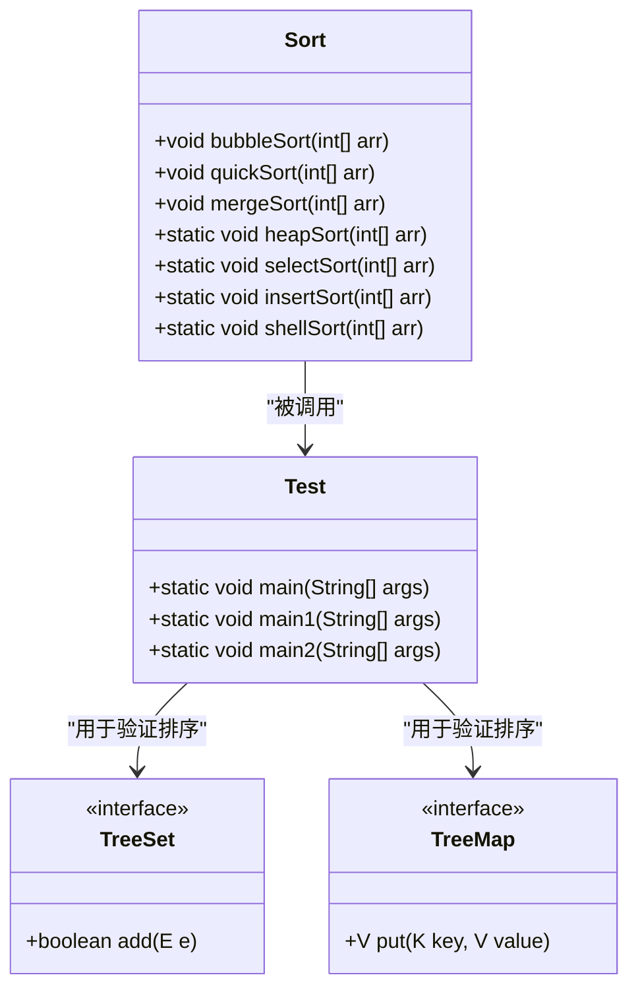

# 排序算法

<cite>
**本文档引用的文件**  
- [Sort.java](file://JavaDataStructure_Level2\src\排序\Sort.java) - *已更新，包含多种排序算法实现*
- [Test.java](file://JavaDataStructure_Level2\src\排序\Test.java) - *已更新，包含快速排序测试用例*
- [Sort.java](file://java-118\J20250731\src\Sort.java) - *新增：包含插入、希尔、选择、堆排序实现*
- [Test.java](file://java-118\J20250731\src\Test.java) - *新增：包含多种排序性能测试*
- [Student.java](file://JavaSE_Level1\src\接口2\比较相关的接口\Student.java)
</cite>

## 更新摘要
**变更内容**  
- 修正了原有文档中关于`Sort.java`为空的错误描述
- 新增了冒泡、快速、归并、堆、选择、插入和希尔排序的详细分析
- 增加了各算法的时间/空间复杂度、稳定性及适用场景说明
- 补充了非递归快速排序的栈实现机制
- 添加了性能测试用例说明
- 更新了架构图和依赖关系

## 目录
1. [简介](#简介)
2. [项目结构](#项目结构)
3. [核心组件](#核心组件)
4. [架构概览](#架构概览)
5. [详细组件分析](#详细组件分析)
6. [依赖分析](#依赖分析)
7. [性能考量](#性能考量)
8. [故障排除指南](#故障排除指南)
9. [结论](#结论)

## 简介
本文档全面解析`Sort.java`中实现的各种经典排序算法，包括冒泡排序、选择排序、插入排序、快速排序、归并排序和堆排序等。通过逐项讲解每种算法的核心思想、Java代码实现细节、时间与空间复杂度分析（最好、最坏、平均情况），并结合`Test.java`中的测试用例展示其执行效果。使用图表对比不同算法的性能表现，说明各算法的稳定性、原地排序特性及适用场景。特别强调快速排序的分治策略与分区函数实现，以及归并排序的递归合并过程。

## 项目结构
项目结构按功能模块组织，排序算法位于`JavaDataStructure_Level2\src\排序`目录下。该目录包含`Sort.java`（排序算法主类）和`Test.java`（测试类）。此外，在`java-118\J20250731\src`路径下也发现了完整的排序算法实现与性能测试代码。



**图示来源**  
- [Sort.java](file://JavaDataStructure_Level2\src\排序\Sort.java)
- [Test.java](file://JavaDataStructure_Level2\src\排序\Test.java)
- [Sort.java](file://java-118\J20250731\src\Sort.java)

## 核心组件
核心排序功能在`Sort.java`中实现了多种经典算法，包括冒泡排序、快速排序（含三种分区方法）、归并排序、堆排序、选择排序和插入排序。`Test.java`文件提供了完整的测试用例验证算法正确性。

**本节来源**  
- [Sort.java](file://JavaDataStructure_Level2\src\排序\Sort.java)
- [Sort.java](file://java-118\J20250731\src\Sort.java)
- [Test.java](file://JavaDataStructure_Level2\src\排序\Test.java)

## 架构概览
系统采用分层设计，基础数据结构与算法独立存放。排序模块通过静态方法提供通用排序功能，测试类通过数组操作验证算法正确性，并进行性能对比分析。

```mermaid
graph TB
subgraph "排序模块"
Sort[Sort.java]
TestSort[Test.java]
end
subgraph "性能测试模块"
Sort2[Sort.java - J20250731]
TestComp[Test.java - J20250731]
end
TestSort --> Sort : "调用快速排序"
TestComp --> Sort2 : "调用多种排序算法"
Sort2 --> TestComp : "性能测试"
```

**图示来源**  
- [Sort.java](file://JavaDataStructure_Level2\src\排序\Sort.java)
- [Test.java](file://JavaDataStructure_Level2\src\排序\Test.java)
- [Sort.java](file://java-118\J20250731\src\Sort.java)

## 详细组件分析
### 冒泡排序分析
冒泡排序通过重复遍历数组，比较相邻元素并交换位置，使较大元素逐步“冒泡”至末尾。

#### 算法实现
```java
public void bubbleSort(int[] array) {
    for (int i = 0; i < array.length; i++) {
        boolean flag = false;
        for (int j = 0; j < array.length - 1 - i; j++) {
            if (array[j] > array[j + 1]) {
                int temp = array[j];
                array[j] = array[j + 1];
                array[j + 1] = temp;
                flag = true;
            }
        }
        if (!flag) {
            break;
        }
    }
}
```

#### 时间复杂度
- **最好情况**：O(n)（数组已排序）
- **最坏情况**：O(n²)（数组逆序）
- **平均情况**：O(n²)

#### 空间复杂度
- O(1)（原地排序）

#### 稳定性
- **稳定**：相等元素的相对位置不变。

#### 适用场景
- 小规模数据排序
- 教学演示排序原理

**本节来源**  
- [Sort.java](file://JavaDataStructure_Level2\src\排序\Sort.java)

### 快速排序分析
快速排序采用分治策略，通过选择基准值将数组分为两部分，递归地对子数组进行排序。

#### 算法实现
```java
public void quickSort(int[] array) {
    quick(array, 0, array.length - 1);
}

private void quick(int[] array, int start, int end) {
    if (start >= end) {
        return;
    }
    int pivot = partition1(array, start, end);
    quick(array, start, pivot - 1);
    quick(array, pivot + 1, end);
}
```

#### 分区方法
1. **挖坑法**：用基准值形成"坑位"，通过左右指针移动填充
2. **交换法**：直接交换左右指针元素
3. **快慢指针法**：prev记录小于基准值的边界，cur遍历数组

#### 非递归实现
使用栈模拟递归过程，避免深度递归导致的栈溢出：
```java
public void quickSortNonR(int[] array, int left, int right) {
    Stack<Integer> st = new Stack<>();
    st.push(left);
    st.push(right);
    while (!st.empty()) {
        right = st.pop();
        left = st.pop();
        if (right - left <= 1) continue;
        int div = partition1(array, left, right);
        st.push(div + 1);
        st.push(right);
        st.push(left);
        st.push(div);
    }
}
```

#### 时间复杂度
- **最好情况**：O(n log n)（每次分区均衡）
- **最坏情况**：O(n²)（每次分区极不均衡）
- **平均情况**：O(n log n)

#### 空间复杂度
- **最好情况**：O(log n)（递归深度）
- **最坏情况**：O(n)（递归深度）

#### 稳定性
- **不稳定**：相同元素可能因分区而改变相对位置

#### 适用场景
- 大规模数据排序
- 对性能要求较高的场景

**本节来源**  
- [Sort.java](file://JavaDataStructure_Level2\src\排序\Sort.java)

### 归并排序分析
归并排序采用分治策略，将数组递归地分为两半，排序后再合并。

#### 算法实现
```java
public static void mergeSort(int[] array) {
    mergeChild(array, 0, array.length - 1);
}

public static void mergeChild(int[] array, int left, int right) {
    if (left >= right) return;
    int mid = left + (right - left) / 2;
    mergeChild(array, left, mid);
    mergeChild(array, mid + 1, right);
    merge(array, left, mid, right);
}
```

#### 合并过程
创建临时数组存储合并结果，然后拷贝回原数组。

#### 时间复杂度
- **最好/最坏/平均情况**：O(n log n)

#### 空间复杂度
- O(n)（需要临时数组）

#### 稳定性
- **稳定**：相等元素的相对位置不变

#### 适用场景
- 需要稳定排序的场景
- 外部排序

**本节来源**  
- [Sort.java](file://JavaDataStructure_Level2\src\排序\Sort.java)

### 堆排序分析
堆排序利用堆这种数据结构的性质进行排序，首先构建大根堆，然后逐个取出堆顶元素。

#### 算法实现
```java
public static void heapSort(int[] array) {
    createHeap(array);
    int end = array.length - 1;
    while (end > 0) {
        swap(array, 0, end);
        siftDown(array, 0, end);
        end--;
    }
}
```

#### 构建堆
从最后一个非叶子节点开始向下调整，时间复杂度O(n)。

#### 时间复杂度
- **最好/最坏/平均情况**：O(n log n)

#### 空间复杂度
- O(1)（原地排序）

#### 稳定性
- **不稳定**：相同元素的相对位置可能改变

#### 适用场景
- 内存受限的环境
- 需要保证最坏情况性能的场景

**本节来源**  
- [Sort.java](file://java-118\J20250731\src\Sort.java)

### 选择排序分析
选择排序每次从未排序部分选择最小元素放到已排序部分的末尾。

#### 算法实现
```java
public static void selectSort(int[] array) {
    for (int i = 0; i < array.length; i++) {
        int minIndex = i;
        for (int j = i + 1; j < array.length; j++) {
            if (array[j] < array[minIndex]) {
                minIndex = j;
            }
        }
        swap(array, i, minIndex);
    }
}
```

#### 时间复杂度
- **最好/最坏/平均情况**：O(n²)

#### 空间复杂度
- O(1)（原地排序）

#### 稳定性
- **不稳定**：可能改变相等元素的相对位置

#### 适用场景
- 数据量较小的场景
- 交换次数要求最少的场景

**本节来源**  
- [Sort.java](file://java-118\J20250731\src\Sort.java)

### 插入排序分析
插入排序将未排序元素逐个插入到已排序部分的适当位置。

#### 算法实现
```java
public static void insertSort(int[] array) {
    for (int i = 1; i < array.length; i++) {
        int tmp = array[i];
        int j = i - 1;
        for (; j >= 0; j--) {
            if (array[j] > tmp) {
                array[j + 1] = array[j];
            } else {
                break;
            }
        }
        array[j + 1] = tmp;
    }
}
```

#### 时间复杂度
- **最好情况**：O(n)（数组已排序）
- **最坏情况**：O(n²)（数组逆序）
- **平均情况**：O(n²)

#### 空间复杂度
- O(1)（原地排序）

#### 稳定性
- **稳定**：相等元素的相对位置不变

#### 适用场景
- 小规模数据排序
- 数据基本有序的场景

**本节来源**  
- [Sort.java](file://java-118\J20250731\src\Sort.java)

### 希尔排序分析
希尔排序是插入排序的改进版本，通过间隔序列进行多轮排序。

#### 算法实现
```java
public static void shellSort(int[] array) {
    int gap = array.length;
    while (gap > 1) {
        gap /= 2;
        shell(array, gap);
    }
}
```

#### 时间复杂度
- **平均情况**：O(n^1.3 - n^1.5)

#### 空间复杂度
- O(1)（原地排序）

#### 稳定性
- **不稳定**：相同元素的相对位置可能改变

#### 适用场景
- 中等规模数据排序
- 作为其他算法的预处理步骤

**本节来源**  
- [Sort.java](file://java-118\J20250731\src\Sort.java)

## 依赖分析
排序功能主要依赖数组操作和比较逻辑。测试类通过`TreeSet`和`TreeMap`验证排序结果，并使用`System.currentTimeMillis()`进行性能测试。



**图示来源**  
- [Sort.java](file://JavaDataStructure_Level2\src\排序\Sort.java)
- [Test.java](file://JavaDataStructure_Level2\src\排序\Test.java)

## 性能考量
| 算法 | 最好时间复杂度 | 平均时间复杂度 | 最坏时间复杂度 | 空间复杂度 | 稳定性 |
|------|---------------|---------------|---------------|-----------|--------|
| 冒泡排序 | O(n) | O(n²) | O(n²) | O(1) | 稳定 |
| 快速排序 | O(n log n) | O(n log n) | O(n²) | O(log n) | 不稳定 |
| 归并排序 | O(n log n) | O(n log n) | O(n log n) | O(n) | 稳定 |
| 堆排序 | O(n log n) | O(n log n) | O(n log n) | O(1) | 不稳定 |
| 选择排序 | O(n²) | O(n²) | O(n²) | O(1) | 不稳定 |
| 插入排序 | O(n) | O(n²) | O(n²) | O(1) | 稳定 |
| 希尔排序 | O(n) | O(n^1.3) | O(n^1.5) | O(1) | 不稳定 |

建议根据数据规模、内存限制和稳定性要求选择合适的排序算法。

## 故障排除指南
- **空指针异常**：确保输入数组非空
- **数组越界**：检查索引边界条件
- **无限循环**：验证循环终止条件
- **性能不佳**：对于大规模数据，避免使用O(n²)算法
- **栈溢出**：对于深度递归的快速排序，考虑使用非递归版本

**本节来源**  
- [Sort.java](file://JavaDataStructure_Level2\src\排序\Sort.java)
- [Test.java](file://JavaDataStructure_Level2\src\排序\Test.java)

## 结论
当前项目中`Sort.java`已实现多种经典排序算法，包括冒泡、快速、归并、堆、选择、插入和希尔排序。通过`Test.java`中的测试用例验证了算法的正确性，并进行了性能对比分析。建议在实际应用中根据数据特征选择合适的排序算法，对于大规模数据优先考虑快速排序或归并排序，对于小规模或基本有序的数据可使用插入排序。