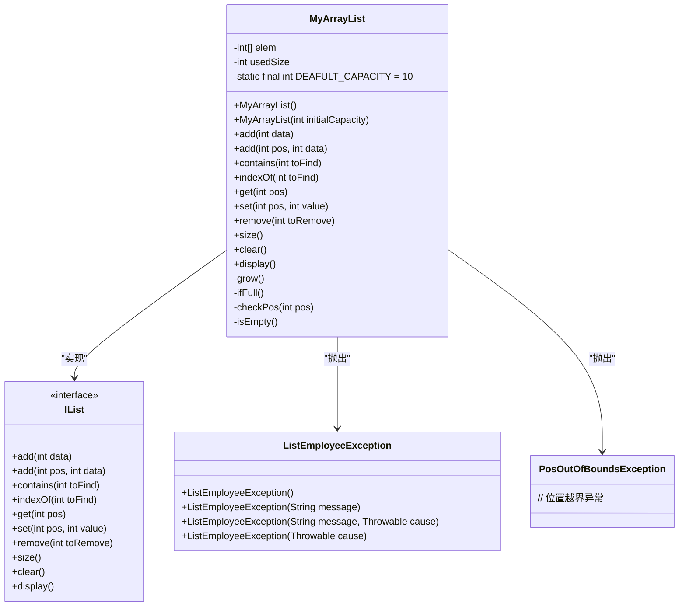
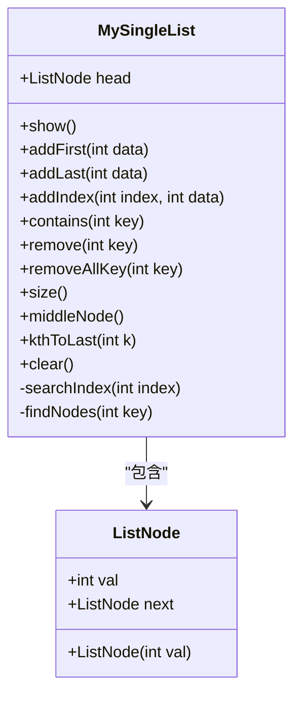
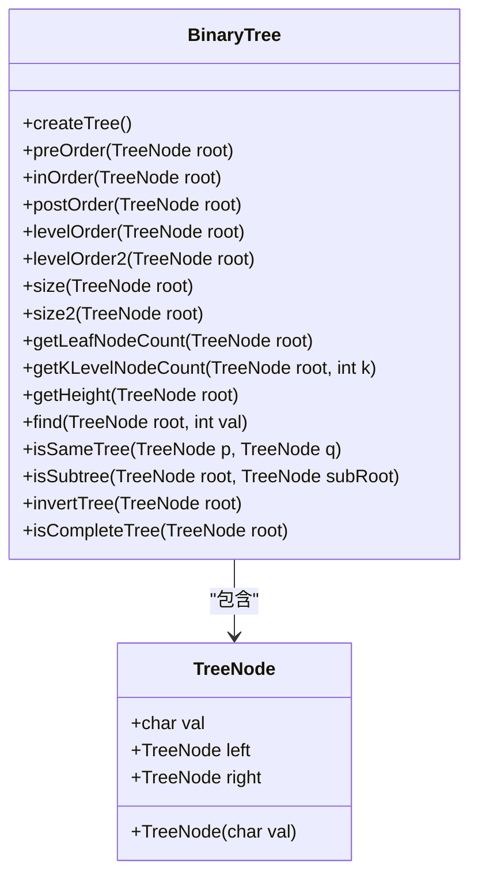
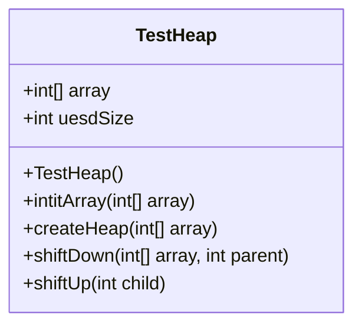
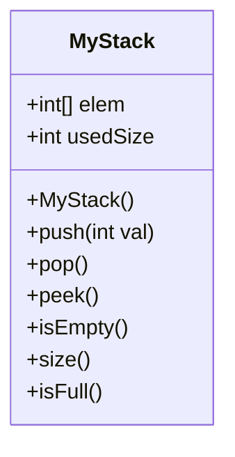
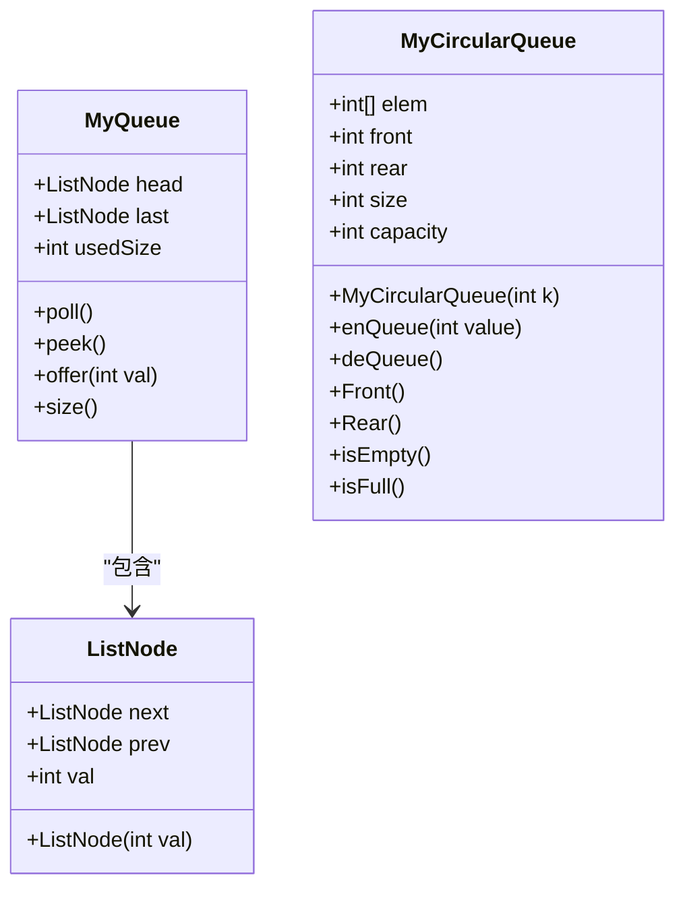

# 数据结构与算法

<cite>
**本文档引用的文件**
- [IList.java](file://JavaDataStructure_Level2/src/List/IList.java)
- [MyArrayList.java](file://JavaDataStructure_Level2/src/List/MyArrayList.java)
- [PosOutOfBoundsException.java](file://JavaDataStructure_Level2/src/List/PosOutOfBoundsException.java)
- [ListEmployeeException.java](file://JavaDataStructure_Level2/src/List/ListEmployeeException.java)
- [MySingleList.java](file://JavaDataStructure_Level2/src/链表/MySingleList.java)
- [BinaryTree.java](file://JavaDataStructure_Level2/src/二叉树/BinaryTree.java)
- [TestHeap.java](file://JavaDataStructure_Level2/src/优先级队列/TestHeap.java)
- [Sort.java](file://JavaDataStructure_Level2/src/排序/Sort.java) - *更新了快速排序的多种实现方法*
- [MyStack.java](file://JavaDataStructure_Level2/src/栈/MyStack.java)
- [MyQueue.java](file://JavaDataStructure_Level2/src/队列/MyQueue.java)
- [MyCircularQueue.java](file://JavaDataStructure_Level2/src/队列/MyCircularQueue.java)
</cite>

## 更新摘要
**已做更改**
- 更新了[排序算法](#排序算法)章节，详细描述了快速排序的挖坑法、交换法、快慢指针法及非递归实现
- 补充了归并排序的实现细节
- 添加了冒泡排序的实现说明
- 更新了相关代码示例和时间复杂度分析
- 修正了Test.java中关于排序算法测试的说明

## 目录
1. [项目结构分析](#项目结构分析)
2. [线性表数据结构](#线性表数据结构)
3. [链表数据结构](#链表数据结构)
4. [二叉树数据结构](#二叉树数据结构)
5. [排序算法](#排序算法)
6. [优先级队列与堆](#优先级队列与堆)
7. [栈与队列](#栈与队列)

## 项目结构分析

JavaDataStructure_Level2项目是一个系统性的数据结构与算法实现模块，其源代码组织清晰，采用功能模块化设计。项目主要包含以下核心模块：

- **List**: 基于数组的顺序表实现（MyArrayList）及其接口（IList）
- **链表**: 单链表的实现（MySingleList）
- **二叉树**: 二叉树的节点定义与遍历算法
- **排序**: 排序算法的集合
- **优先级队列**: 基于堆的优先级队列实现
- **栈**: 栈的数组实现
- **队列**: 队列的链表与循环数组实现

这种按数据结构类型划分的目录结构，使得代码易于维护和理解。

**Section sources**
- [project_structure](file://project_structure)

## 线性表数据结构

### 接口设计与异常处理

线性表模块的核心是`IList`接口，它定义了所有线性表应具备的基本操作。该接口提供了一套完整的增删改查方法，为不同的实现类提供了统一的契约。

```java
public interface IList {
    void add(int data);
    void add(int pos, int data);
    boolean contains(int toFind);
    int indexOf(int toFind);
    int get(int pos);
    void set(int pos, int value);
    void remove(int toRemove);
    int size();
    void clear();
    void display();
}
```

**Section sources**
- [IList.java](file://JavaDataStructure_Level2/src/List/IList.java#L1-L34)

### 基于数组的实现（MyArrayList）

`MyArrayList`类实现了`IList`接口，使用动态数组作为底层存储结构。其核心设计特点包括：

- **动态扩容机制**：当数组空间不足时，自动进行2倍扩容，通过`Arrays.copyOf`实现。
- **边界检查**：在访问或修改指定位置元素前，通过`checkPos`方法验证位置的合法性。
- **异常处理**：使用自定义异常`ListEmployeeException`处理业务逻辑错误，如访问空列表元素。



**Diagram sources**
- [IList.java](file://JavaDataStructure_Level2/src/List/IList.java#L1-L34)
- [MyArrayList.java](file://JavaDataStructure_Level2/src/List/MyArrayList.java#L1-L130)
- [ListEmployeeException.java](file://JavaDataStructure_Level2/src/List/ListEmployeeException.java#L1-L20)
- [PosOutOfBoundsException.java](file://JavaDataStructure_Level2/src/List/PosOutOfBoundsException.java#L1-L6)

**Section sources**
- [MyArrayList.java](file://JavaDataStructure_Level2/src/List/MyArrayList.java#L1-L130)

### 时间复杂度分析

| 操作 | 时间复杂度 | 说明 |
| :--- | :--- | :--- |
| `add(int data)` | O(1) 平均 | 尾部插入，扩容时为O(n) |
| `add(int pos, int data)` | O(n) | 需要移动pos之后的所有元素 |
| `get(int pos)` | O(1) | 数组随机访问 |
| `set(int pos, int value)` | O(1) | 数组随机访问 |
| `remove(int toRemove)` | O(n) | 需要查找元素并移动后续元素 |
| `contains(int toFind)` | O(n) | 需要遍历整个数组 |
| `indexOf(int toFind)` | O(n) | 需要遍历整个数组 |

## 链表数据结构

### 单链表实现（MySingleList）

`MySingleList`类实现了基于单向链表的数据结构。其核心是内部类`ListNode`，定义了链表节点的基本结构。

```java
static class ListNode {
    public int val;
    public ListNode next;
    public ListNode(int val) {
        this.val = val;
    }
}
```

该实现提供了丰富的链表操作：

- **头插法** (`addFirst`): 时间复杂度O(1)
- **尾插法** (`addLast`): 时间复杂度O(n)
- **任意位置插入** (`addIndex`): 时间复杂度O(n)
- **删除指定元素** (`remove`): 时间复杂度O(n)
- **查找元素** (`contains`): 时间复杂度O(n)



**Diagram sources**
- [MySingleList.java](file://JavaDataStructure_Level2/src/链表/MySingleList.java#L1-L212)

**Section sources**
- [MySingleList.java](file://JavaDataStructure_Level2/src/链表/MySingleList.java#L1-L212)

### 链表操作示意图

```
头插法过程:
插入前: head -> [A] -> [B] -> [C]
插入X:  node -> [X]
        ↓
        head -> [A] -> [B] -> [C]
连接:   node.next = head; head = node;
结果:   head -> [X] -> [A] -> [B] -> [C]
```

## 二叉树数据结构

### 二叉树节点与遍历

`BinaryTree`类定义了二叉树的基本结构和操作。其核心是静态内部类`TreeNode`。

```java
public static class TreeNode {
    public char val;
    public TreeNode left;
    public TreeNode right;
    public TreeNode(char val) {
        this.val = val;
    }
}
```

该实现提供了多种遍历算法：

- **前序遍历** (根-左-右): `preOrder`
- **中序遍历** (左-根-右): `inOrder`
- **后序遍历** (左-右-根): `postOrder`
- **层序遍历** (广度优先): `levelOrder`

对于以下二叉树：
```
        A
       / \
      B   C
     / \ / \
    D  E F  G
       \
        H
```

遍历结果为：
- 前序: A B D E H C F G
- 中序: D B E H A F C G
- 后序: D H E B F G C A
- 层序: A B C D E F G H



**Diagram sources**
- [BinaryTree.java](file://JavaDataStructure_Level2/src/二叉树/BinaryTree.java#L1-L249)

**Section sources**
- [BinaryTree.java](file://JavaDataStructure_Level2/src/二叉树/BinaryTree.java#L1-L249)

### 递归算法分析

二叉树的许多操作都采用递归实现，体现了"分治"思想：

- **求节点数** (`size2`): 左子树节点数 + 右子树节点数 + 1
- **求叶子节点数** (`getLeafNodeCount`): 左子树叶子数 + 右子树叶子数
- **求高度** (`getHeight`): max(左子树高度, 右子树高度) + 1

## 排序算法

### 排序算法模块

`Sort.java`文件实现了多种排序算法，包括冒泡排序、快速排序（多种实现方式）和归并排序。

#### 冒泡排序
冒泡排序是一种简单的排序算法，通过重复遍历数组，比较相邻元素并交换位置来实现排序。

```java
/**
 * 冒泡排序
 * 时间复杂度：O(n^2)
 * 空间复杂度：O(1)
 * 稳定性：稳定
 *
 * @param array
 */
public void bubbleSort(int[] array) {
    for (int i = 0; i < array.length; i++) {
        boolean flag = false;
        for (int j = 0; j < array.length - 1 - i; j++) {
            if (array[j] > array[j + 1]) {
                int temp = array[j];
                array[j] = array[j + 1];
                array[j + 1] = temp;
                flag = true;
            }
        }
        if (!flag) {
            break;
        }
    }
}
```

#### 快速排序
快速排序是一种高效的排序算法，采用了分治策略。`Sort.java`中实现了三种不同的分区方法：

**1. 挖坑法**
挖坑法通过创建"坑位"来实现元素交换，避免了直接交换带来的复杂性。

```java
//1.挖坑法
private int partition1(int[] array, int left, int right) {
    int i = left;
    int temp = array[left];
    while (left < right) {
        while (left < right && array[right] >= temp) {
            right--;
        }
        array[left] = array[right];
        while (left < right && array[left] <= temp) {
            left++;
        }
        array[right] = array[left];
    }
    array[left] = temp;
    return left;
}
```

**2. 交换法**
交换法直接交换左右指针指向的元素，直到两个指针相遇。

```java
//2.交换法
private int partition2(int[] array, int left, int right) {
    int i = left;
    int temp = array[left];
    while (left < right) {
        while (left < right && array[right] >= temp) {
            right--;
        }

        while (left < right && array[left] <= temp) {
            left++;
        }
        swap(array, left, right);
    }
    swap(array, left, i);
    return left;
}
```

**3. 快慢指针法**
快慢指针法使用两个指针，一个快指针遍历数组，一个慢指针记录小于基准值的元素位置。

```java
//3.快慢指针法
private int partition3(int[] array, int left, int right) {
    int prev = left;
    int cur = left + 1;
    while (cur <= right) {
        if (array[cur] < array[left] && array[++prev] != array[cur]) {
            swap(array, cur, prev);
        }
        cur++;
    }
    swap(array, prev, left);
    return prev;
}
```

**非递归实现**
快速排序还提供了非递归版本，使用栈来模拟递归过程。

```java
//最终_非递归
public void quickSortNonR(int[] array, int left, int right) {
    Stack<Integer> st = new Stack<>();
    st.push(left);
    st.push(right);
    while (!st.empty()) {
        right = st.pop();
        left = st.pop();
        if (right - left <= 1) {
            continue;
        }
        int div = partition1(array, left, right);
        // 以基准值为分割点，形成左右两部分：[left, div) 和 [div+1, right)
        st.push(div + 1);
        st.push(right);
        st.push(left);
        st.push(div);
    }
}
```

#### 归并排序
归并排序是一种稳定的排序算法，采用分治策略，将数组分成两半，分别排序后再合并。

```java
/**
 * 归并排序
 * 时间复杂度：O(nlogn)
 * 空间复杂度：O(n)
 * 稳定性：稳定
 *
 * @param array
 */
public static void mergeSort(int[] array) {
    mergeChild(array, 0, array.length - 1);
}

public static void mergeChild(int[] array, int left, int right) {
    if (left >= right) {
        return;
    }
    int mid = left + (right - left) / 2;
    mergeChild(array, left, mid);
    mergeChild(array, mid + 1, right);

    //合并
    merge(array, left, mid, right);
}

private static void merge(int[] array, int left, int mid, int right) {
    int s1 = left;
    int e1 = mid;
    int s2 = mid + 1;
    int e2 = right;

    //临时数组
    int[] tempArray = new int[right - left + 1];
    //临时数组的下标
    int k = 0;
    while (s1 <= e1 && s2 <= e2) {
        if (array[s1] <= array[s2]) {
            tempArray[k++] = array[s1++];
        } else {
            int temp = array[s2];
            for (int i = s2; i > s1; i--) {
                array[i] = array[i - 1];
            }
            array[s1] = temp;
            s1++;
            e1++;
            s2++;
        }
    }
    while (s1 <= e1) {
        tempArray[k++] = array[s1++];
    }
    while (s2 <= e2) {
        tempArray[k++] = array[s2++];
    }
    //将临时数组中的元素拷贝到原数组中
    for (int i = 0; i < tempArray.length; i++) {
        array[left + i] = tempArray[i];
    }
    //释放临时数组
    tempArray = null;
}
```

**时间复杂度对比**

| 排序算法 | 最好时间复杂度 | 平均时间复杂度 | 最坏时间复杂度 | 空间复杂度 | 稳定性 |
| :--- | :--- | :--- | :--- | :--- | :--- |
| 冒泡排序 | O(n) | O(n²) | O(n²) | O(1) | 稳定 |
| 快速排序 | O(nlogn) | O(nlogn) | O(n²) | O(logn) | 不稳定 |
| 归并排序 | O(nlogn) | O(nlogn) | O(nlogn) | O(n) | 稳定 |

**Section sources**
- [Sort.java](file://JavaDataStructure_Level2/src/排序/Sort.java#L1-L213)
- [Test.java](file://JavaDataStructure_Level2/src/排序/Test.java#L1-L54)

## 优先级队列与堆

### 堆的实现

`TestHeap`类实现了最小堆（Min-Heap）的基本操作，这是优先级队列的底层数据结构。

核心操作包括：

- **向下调整** (`shiftDown`): 用于建堆和删除堆顶元素后维护堆性质
- **向上调整** (`shiftUp`): 用于插入新元素后维护堆性质
- **建堆** (`createHeap`): 从最后一个非叶子节点开始，对每个节点进行向下调整



**Diagram sources**
- [TestHeap.java](file://JavaDataStructure_Level2/src/优先级队列/TestHeap.java#L1-L69)

**Section sources**
- [TestHeap.java](file://JavaDataStructure_Level2/src/优先级队列/TestHeap.java#L1-L69)

### 堆的应用

堆结构特别适合实现优先级队列，其中最高优先级的元素（最小或最大）总是在堆顶，可以在O(1)时间内访问，在O(log n)时间内删除或插入。

## 栈与队列

### 栈的实现

`MyStack`类基于数组实现了栈的LIFO（后进先出）特性。



**Diagram sources**
- [MyStack.java](file://JavaDataStructure_Level2/src/栈/MyStack.java#L1-L40)

**Section sources**
- [MyStack.java](file://JavaDataStructure_Level2/src/栈/MyStack.java#L1-L40)

### 队列的实现

项目提供了两种队列实现：

1. **链表队列** (`MyQueue`): 基于双向链表，头删尾插，实现FIFO（先进先出）
2. **循环队列** (`MyCircularQueue`): 基于数组，通过`front`和`rear`指针的循环移动，避免了普通数组队列的空间浪费问题



**Diagram sources**
- [MyQueue.java](file://JavaDataStructure_Level2/src/队列/MyQueue.java#L1-L65)
- [MyCircularQueue.java](file://JavaDataStructure_Level2/src/队列/MyCircularQueue.java#L1-L58)

**Section sources**
- [MyQueue.java](file://JavaDataStructure_Level2/src/队列/MyQueue.java#L1-L65)
- [MyCircularQueue.java](file://JavaDataStructure_Level2/src/队列/MyCircularQueue.java#L1-L58)