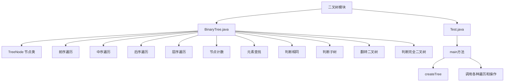

# 树形结构

<cite>
**本文档中引用的文件**  
- [BinaryTree.java](file://JavaDataStructure_Level2\src\二叉树\BinaryTree.java)
- [Test.java](file://JavaDataStructure_Level2\src\二叉树\Test.java)
</cite>

## 目录
1. [项目结构](#项目结构)  
2. [核心组件分析](#核心组件分析)  
3. [二叉树节点结构与递归定义](#二叉树节点结构与递归定义)  
4. [遍历算法详解](#遍历算法详解)  
   4.1 [前序、中序、后序遍历（递归实现）](#前序中序后序遍历递归实现)  
   4.2 [层序遍历（广度优先）](#层序遍历广度优先)  
5. [非递归遍历的实现思路](#非递归遍历的实现思路)  
6. [核心操作与算法](#核心操作与算法)  
   6.1 [节点计数：计数器与子问题思路](#节点计数计数器与子问题思路)  
   6.2 [获取叶子节点与第K层节点数量](#获取叶子节点与第K层节点数量)  
   6.3 [二叉树高度计算](#二叉树高度计算)  
   6.4 [元素查找](#元素查找)  
   6.5 [判断两棵树是否相同](#判断两棵树是否相同)  
   6.6 [判断子树关系](#判断子树关系)  
   6.7 [翻转二叉树](#翻转二叉树)  
   6.8 [判断完全二叉树](#判断完全二叉树)  
7. [测试用例分析](#测试用例分析)  
8. [应用场景](#应用场景)  

## 项目结构
项目 `JavaDataStructure_Level2` 包含多个数据结构的实现，其中 `二叉树` 模块是本文档的核心。该模块位于 `JavaDataStructure_Level2\src\二叉树` 目录下，包含两个关键文件：
- `BinaryTree.java`：定义了二叉树的节点结构、遍历方法及多种核心操作。
- `Test.java`：提供了构建和测试二叉树功能的主程序。



**图示来源**  
- [BinaryTree.java](file://JavaDataStructure_Level2\src\二叉树\BinaryTree.java)
- [Test.java](file://JavaDataStructure_Level2\src\二叉树\Test.java)

## 核心组件分析
`BinaryTree` 类是二叉树功能的核心实现，其内部静态类 `TreeNode` 定义了树的基本节点。`Test` 类作为客户端，负责创建实例、构建树并调用各种方法进行测试。

**组件来源**  
- [BinaryTree.java](file://JavaDataStructure_Level2\src\二叉树\BinaryTree.java#L1-L250)
- [Test.java](file://JavaDataStructure_Level2\src\二叉树\Test.java#L1-L23)

## 二叉树节点结构与递归定义
二叉树是一种递归定义的数据结构，每个节点最多有两个子节点（左子树和右子树），且子树本身也是二叉树。

### 节点结构设计
在 `BinaryTree.java` 中，`TreeNode` 类定义了节点的三个关键属性：
- `val`：存储节点的数据，类型为 `char`。
- `left`：指向左子节点的引用。
- `right`：指向右子节点的引用。

```java
public static class TreeNode {
    public char val;
    public TreeNode left;
    public TreeNode right;

    public TreeNode(char val) {
        this.val = val;
    }
}
```

这种设计体现了二叉树的递归本质：一个 `TreeNode` 对象既可以是叶子节点（`left` 和 `right` 均为 `null`），也可以是内部节点，其 `left` 和 `right` 又分别指向新的 `TreeNode` 实例，从而构成一棵完整的树。

**代码来源**  
- [BinaryTree.java](file://JavaDataStructure_Level2\src\二叉树\BinaryTree.java#L8-L15)

## 遍历算法详解
遍历是访问二叉树所有节点的基本操作。根据访问根节点的顺序，可分为深度优先遍历（前、中、后序）和广度优先遍历（层序）。

### 前序、中序、后序遍历（递归实现）
这三种遍历方式均采用递归思想，其核心是“分治”：先处理当前节点，再递归处理左子树和右子树。

#### 前序遍历 (Pre-order)
访问顺序：**根 -> 左 -> 右**
```java
public void preOrder(TreeNode root) {
    if (root == null) return;
    System.out.print(root.val + " "); // 访问根
    preOrder(root.left);              // 遍历左子树
    preOrder(root.right);             // 遍历右子树
}
```
对于测试用例中的树，输出为：`A B D E H C F G`

#### 中序遍历 (In-order)
访问顺序：**左 -> 根 -> 右**
```java
public void inOrder(TreeNode root) {
    if (root == null) return;
    inOrder(root.left);               // 遍历左子树
    System.out.print(root.val + " "); // 访问根
    inOrder(root.right);              // 遍历右子树
}
```
输出为：`D B E H A F C G`

#### 后序遍历 (Post-order)
访问顺序：**左 -> 右 -> 根**
```java
public void postOrder(TreeNode root) {
    if (root == null) return;
    postOrder(root.left);             // 遍历左子树
    postOrder(root.right);            // 遍历右子树
    System.out.print(root.val + " "); // 访问根
}
```
输出为：`D H E B F G C A`

**递归调用栈图解**
以 `preOrder(A)` 为例，其调用栈的展开过程如下：
```
preOrder(A)
├── print(A)
├── preOrder(B)
│   ├── print(B)
│   ├── preOrder(D)
│   │   ├── print(D)
│   │   ├── preOrder(null) -> return
│   │   └── preOrder(null) -> return
│   ├── preOrder(E)
│   │   ├── print(E)
│   │   ├── preOrder(null) -> return
│   │   └── preOrder(H)
│   │       ├── print(H)
│   │       ├── preOrder(null) -> return
│   │       └── preOrder(null) -> return
│   └── return
└── preOrder(C)
    ├── print(C)
    ├── preOrder(F)
    │   ├── print(F)
    │   ├── ... -> return
    ├── preOrder(G)
    │   ├── print(G)
    │   ├── ... -> return
    └── return
```
**代码来源**  
- [BinaryTree.java](file://JavaDataStructure_Level2\src\二叉树\BinaryTree.java#L20-L55)

### 层序遍历（广度优先）
层序遍历按树的层级从上到下、从左到右访问节点，其实现依赖于**队列**（FIFO）数据结构。

#### 实现方法 `levelOrder`
```java
public void levelOrder(TreeNode root) {
    if (root == null) return;
    Queue<TreeNode> queue = new LinkedList<>();
    queue.offer(root);
    while (!queue.isEmpty()) {
        TreeNode node = queue.poll();
        System.out.print(node.val + " ");
        if (node.left != null) queue.offer(node.left);
        if (node.right != null) queue.offer(node.right);
    }
}
```
输出为：`A B C D E F G H`

#### 实现方法 `levelOrder2`（分层返回）
此方法将每层的节点值存储在独立的列表中，最终返回一个二维列表。虽然代码中 `level.add(node.val)` 被注释，但其逻辑清晰。
```java
public List<List<Integer>> levelOrder2(TreeNode root) {
    List<List<Integer>> ret = new ArrayList<>();
    if (root == null) return ret;
    Queue<TreeNode> queue = new LinkedList<>();
    queue.offer(root);
    while (!queue.isEmpty()) {
        List<Integer> level = new ArrayList<>();
        int size = queue.size(); // 记录当前层的节点数
        for (int i = 0; i < size; i++) {
            TreeNode node = queue.poll();
            // level.add(node.val); // 将节点值加入当前层
            if (node.left != null) queue.offer(node.left);
            if (node.right != null) queue.offer(node.right);
        }
        // ret.add(level); // 将当前层加入结果
    }
    return ret;
}
```
**代码来源**  
- [BinaryTree.java](file://JavaDataStructure_Level2\src\二叉树\BinaryTree.java#L57-L100)

## 非递归遍历的实现思路
虽然代码中未直接实现非递归版本，但可以推断其思路：
- **前/中/后序遍历**：使用**栈**（LIFO）模拟递归调用栈。例如，非递归前序遍历会先将根节点入栈，然后循环弹出并访问，再将右、左子节点（注意顺序）压入栈。
- **层序遍历**：代码中的 `levelOrder` 已是非递归实现，使用队列完美解决了按层访问的问题。

## 核心操作与算法
`BinaryTree` 类实现了多种实用的二叉树操作。

### 节点计数：计数器与子问题思路
提供了两种计算节点总数的方法。

#### 计数器写法 (`size`)
使用类成员变量 `nodeSize` 作为全局计数器，在递归遍历过程中累加。
```java
public int nodeSize = 0;
public void size(TreeNode root) {
    if (root == null) return;
    nodeSize++;
    size(root.left);
    size(root.right);
}
```
**缺点**：需要在调用前手动将 `nodeSize` 置零，否则结果会累加。

#### 子问题思路 (`size2`)
更优雅的递归解法。树的总节点数 = 左子树节点数 + 右子树节点数 + 1（根节点）。
```java
public int size2(TreeNode root) {
    if (root == null) return 0;
    return size2(root.left) + size2(root.right) + 1;
}
```
**优点**：无副作用，结果直接返回。

**代码来源**  
- [BinaryTree.java](file://JavaDataStructure_Level2\src\二叉树\BinaryTree.java#L105-L120)

### 获取叶子节点与第K层节点数量
- **`getLeafNodeCount`**：递归计算。若节点为叶子（左右子节点均为空），则返回1；否则返回左右子树叶子节点数之和。
- **`getKLevelNodeCount`**：递归计算第K层节点数。若 `k == 1`，则当前层只有一个节点（根），返回1；否则返回左右子树第 `k-1` 层节点数之和。

**代码来源**  
- [BinaryTree.java](file://JavaDataStructure_Level2\src\二叉树\BinaryTree.java#L122-L140)

### 二叉树高度计算
树的高度定义为从根到最远叶子节点的最长路径上的边数（或节点数，此处代码为节点数）。递归公式：`height(root) = max(height(left), height(right)) + 1`。
```java
public int getHeight(TreeNode root) {
    if (root == null) return 0;
    return Math.max(getHeight(root.left), getHeight(root.right)) + 1;
}
```
**代码来源**  
- [BinaryTree.java](file://JavaDataStructure_Level2\src\二叉树\BinaryTree.java#L142-L147)

### 元素查找
`find` 方法在树中搜索值为 `val` 的节点。它采用先序遍历的逻辑：先检查根节点，再递归搜索左子树，若未找到则搜索右子树。
```java
TreeNode find(TreeNode root, int val) {
    if (root == null || root.val == val) return root;
    TreeNode ret = find(root.left, val);
    if (ret != null) return ret;
    return find(root.right, val);
}
```
**注意**：`val` 是 `char` 类型，而参数 `val` 是 `int`，存在类型不匹配的风险，实际使用中应保持一致。

**代码来源**  
- [BinaryTree.java](file://JavaDataStructure_Level2\src\二叉树\BinaryTree.java#L149-L165)

### 判断两棵树是否相同
`isSameTree` 方法递归比较两棵树的结构和节点值。
1. 若两节点同为空，则相同。
2. 若一空一非空，则不同。
3. 若均非空，则需值相等，且左右子树也分别相同。
```java
public boolean isSameTree(TreeNode p, TreeNode q) {
    if (p == null && q == null) return true;
    if (p == null || q == null) return false;
    return p.val == q.val && isSameTree(p.left, q.left) && isSameTree(p.right, q.right);
}
```
**代码来源**  
- [BinaryTree.java](file://JavaDataStructure_Level2\src\二叉树\BinaryTree.java#L167-L185)

### 判断子树关系
`isSubtree` 方法判断 `subRoot` 是否是 `root` 的子树。它首先检查以 `root` 为根的树是否与 `subRoot` 相同，若不是，则递归检查 `root` 的左子树或右子树是否包含 `subRoot`。
```java
public boolean isSubtree(TreeNode root, TreeNode subRoot) {
    if (root == null) return false;
    return isSameTree(root, subRoot) || isSubtree(root.left, subRoot) || isSubtree(root.right, subRoot);
}
```
**代码来源**  
- [BinaryTree.java](file://JavaDataStructure_Level2\src\二叉树\BinaryTree.java#L187-L192)

### 翻转二叉树
`invertTree` 方法将二叉树的左右子树互换，形成镜像。
```java
public TreeNode invertTree(TreeNode root) {
    if (root == null) return null;
    TreeNode temp = root.left;
    root.left = root.right;
    root.right = temp;
    invertTree(root.left);
    invertTree(root.right);
    return root;
}
```
**代码来源**  
- [BinaryTree.java](file://JavaDataStructure_Level2\src\二叉树\BinaryTree.java#L194-L202)

### 判断完全二叉树
完全二叉树要求除了最后一层，其他层都被完全填满，且最后一层的节点都靠左排列。`isCompleteTree` 方法利用层序遍历的队列来判断：
1. 层序遍历，将所有节点（包括 `null`）入队。
2. 当遇到第一个 `null` 节点时停止。
3. 检查队列中剩余的节点是否全为 `null`。若是，则为完全二叉树。
```java
public boolean isCompleteTree(TreeNode root) {
    if (root == null) return true;
    Queue<TreeNode> queue = new LinkedList<>();
    queue.offer(root);
    while (!queue.isEmpty()) {
        TreeNode node = queue.poll();
        if (node == null) break;
        queue.offer(node.left);
        queue.offer(node.right);
    }
    while (!queue.isEmpty()) {
        if (queue.poll() != null) return false;
    }
    return true;
}
```
**代码来源**  
- [BinaryTree.java](file://JavaDataStructure_Level2\src\二叉树\BinaryTree.java#L204-L225)

## 测试用例分析
`Test.java` 中的 `main` 方法完整展示了二叉树的构建和操作流程。

```java
public static void main(String[] args) {
    BinaryTree binaryTree = new BinaryTree();
    BinaryTree.TreeNode root = binaryTree.createTree(); // 构建测试树

    // 执行三种深度优先遍历
    binaryTree.preOrder(root);
    System.out.println();
    binaryTree.inOrder(root);
    System.out.println();
    binaryTree.postOrder(root);
    System.out.println();

    // 执行各种核心操作
    binaryTree.size(root); // 使用计数器方法
    System.out.println(binaryTree.nodeSize); // 输出: 8
    System.out.println(binaryTree.size2(root)); // 输出: 8
    System.out.println(binaryTree.getLeafNodeCount(root)); // 输出: 4
    System.out.println(binaryTree.getKLevelNodeCount(root, 2)); // 输出: 2
    System.out.println(binaryTree.getHeight(root)); // 输出: 4
}
```

**构建的树结构**
```
        A
      /   \
     B     C
    / \   / \
   D   E F   G
        \
         H
```
**测试来源**  
- [Test.java](file://JavaDataStructure_Level2\src\二叉树\Test.java#L3-L23)

## 应用场景
二叉树作为一种基础数据结构，应用广泛：
- **表达式求值**：将算术表达式（如 `(A+B)*C`）构建成二叉表达式树，通过后序遍历可生成逆波兰表达式，便于计算机求值。
- **文件系统**：目录结构天然地形成一棵树，根目录为根节点，子目录和文件为子节点，可以使用树的遍历算法来列出所有文件。
- **数据库索引**：B树和B+树是二叉搜索树的变种，用于高效地存储和检索数据。
- **决策树**：在机器学习中，决策树模型通过一系列是/否问题对数据进行分类，其结构就是一棵二叉树。