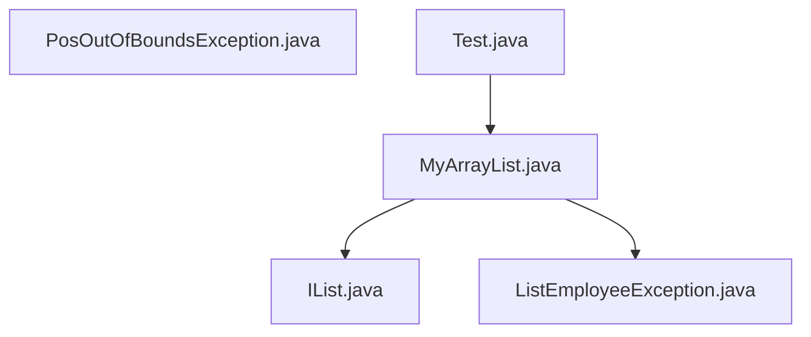
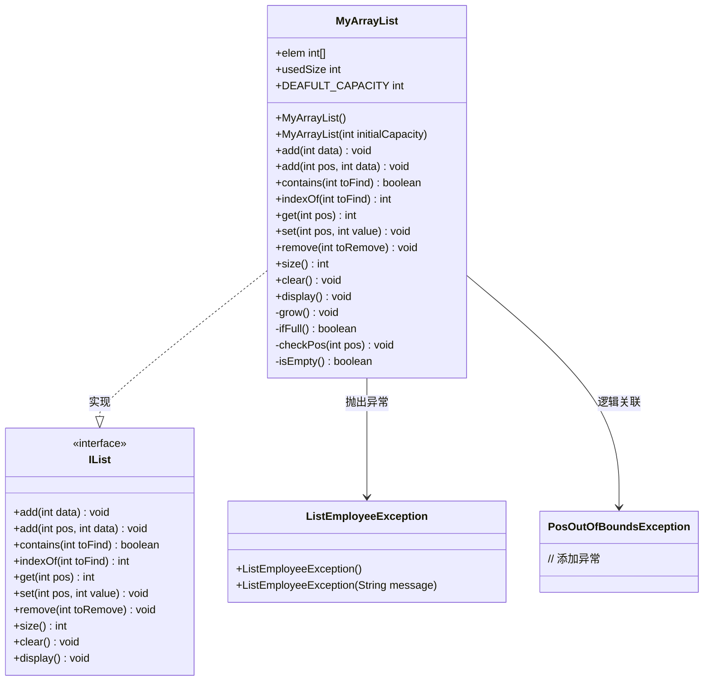

# 动态数组实现

<cite>
**本文档引用的文件**  
- [MyArrayList.java](file://JavaDataStructure_Level2\src\List\MyArrayList.java)
- [IList.java](file://JavaDataStructure_Level2\src\List\IList.java)
- [Test.java](file://JavaDataStructure_Level2\src\List\Test.java)
- [ListEmployeeException.java](file://JavaDataStructure_Level2\src\List\ListEmployeeException.java)
- [PosOutOfBoundsException.java](file://JavaDataStructure_Level2\src\List\PosOutOfBoundsException.java)
</cite>

## 目录
1. [引言](#引言)  
2. [项目结构](#项目结构)  
3. [核心组件](#核心组件)  
4. [架构概览](#架构概览)  
5. [详细组件分析](#详细组件分析)  
6. [依赖分析](#依赖分析)  
7. [性能考量](#性能考量)  
8. [故障排除指南](#故障排除指南)  
9. [结论](#结论)

## 引言
本文档深入分析 `MyArrayList` 类如何实现 `IList` 接口，重点讲解其基于数组的动态扩容机制、核心方法（如 `add`、`remove`、`get`）的实现逻辑与时间复杂度。同时，解释 `PosOutOfBoundsException` 和 `ListEmployeeException` 在越界访问和空表操作时的异常处理机制。通过 UML 类图和内存布局图，直观展示类关系与扩容过程，并结合测试用例说明使用方式与性能瓶颈。

## 项目结构
`MyArrayList` 项目位于 `JavaDataStructure_Level2/src/List/` 目录下，是一个典型的线性表数据结构实现。其核心文件包括接口定义、具体实现、异常类和测试用例。



**图示来源**  
- [MyArrayList.java](file://JavaDataStructure_Level2\src\List\MyArrayList.java)
- [IList.java](file://JavaDataStructure_Level2\src\List\IList.java)
- [Test.java](file://JavaDataStructure_Level2\src\List\Test.java)

## 核心组件
`MyArrayList` 的核心是使用一个固定大小的数组 `elem` 来存储数据，并通过 `usedSize` 字段跟踪当前有效元素的数量。当数组空间不足时，通过 `grow()` 方法进行动态扩容。`IList` 接口定义了所有线性表应具备的标准操作。

**组件来源**  
- [MyArrayList.java](file://JavaDataStructure_Level2\src\List\MyArrayList.java#L6-L10)
- [IList.java](file://JavaDataStructure_Level2\src\List\IList.java#L2-L33)

## 架构概览
`MyArrayList` 遵循接口与实现分离的设计原则。`IList` 接口规定了行为契约，`MyArrayList` 类提供具体实现。`ListEmployeeException` 用于处理业务逻辑异常（如删除不存在的元素），而 `PosOutOfBoundsException` 类（尽管当前未被实际使用）旨在处理位置越界异常。



**图示来源**  
- [MyArrayList.java](file://JavaDataStructure_Level2\src\List\MyArrayList.java)
- [IList.java](file://JavaDataStructure_Level2\src\List\IList.java)
- [ListEmployeeException.java](file://JavaDataStructure_Level2\src\List\ListEmployeeException.java)
- [PosOutOfBoundsException.java](file://JavaDataStructure_Level2\src\List\PosOutOfBoundsException.java)

## 详细组件分析
### MyArrayList 类实现分析
`MyArrayList` 是 `IList` 接口的具体实现，它使用一个整型数组 `elem` 作为底层存储，并通过 `usedSize` 记录当前存储的元素个数。

#### 动态扩容机制
`MyArrayList` 的核心特性是其动态扩容能力。当添加元素时，会先检查数组是否已满（`ifFull()` 方法）。
- **扩容因子**: 采用 **2倍扩容** 策略。`grow()` 方法调用 `Arrays.copyOf(elem, 2 * elem.length)` 创建一个新数组，其长度是原数组的两倍，并将原数组的所有元素复制到新数组中。
- **复制策略**: 使用 `Arrays.copyOf` 方法进行复制，该方法是高效的底层数组复制操作。
- **初始容量**: 默认构造函数使用 `DEAFULT_CAPACITY = 10` 作为初始容量，避免了频繁的小规模扩容。

**时间复杂度**: 扩容操作本身是 O(n)，但由于扩容是摊还发生的（并非每次添加都触发），因此 `add` 操作的摊还时间复杂度为 O(1)。

```mermaid
flowchart TD
A[尝试添加元素] --> B{数组已满?}
B --> |是| C[创建新数组 (2倍长度)]
C --> D[复制原数组所有元素]
D --> E[更新elem引用]
E --> F[继续添加]
B --> |否| F
F --> G[在指定位置插入数据]
G --> H[usedSize++]
```

**图示来源**  
- [MyArrayList.java](file://JavaDataStructure_Level2\src\List\MyArrayList.java#L23-L37)

#### 内存布局图
以下图示展示了 `MyArrayList` 在扩容前后的内存变化。

```mermaid
graph TD
subgraph "扩容前 (容量=6, 已用=6)"
A[elem[0]: 1]
B[elem[1]: 2]
C[elem[2]: 3]
D[elem[3]: 4]
E[elem[4]: 5]
F[elem[5]: 99]
G[usedSize = 6]
end
H["触发 add(1, 199)"] --> I["数组已满, 执行grow()"]
subgraph "扩容后 (容量=12, 已用=6)"
J[elem[0]: 1]
K[elem[1]: 2]
L[elem[2]: 3]
M[elem[3]: 4]
N[elem[4]: 5]
O[elem[5]: 99]
P[elem[6]: 0]
Q[elem[7]: 0]
R[elem[8]: 0]
S[elem[9]: 0]
T[elem[10]: 0]
U[elem[11]: 0]
V[usedSize = 6]
end
I --> J
```

**图示来源**  
- [MyArrayList.java](file://JavaDataStructure_Level2\src\List\MyArrayList.java#L30-L37)
- [Test.java](file://JavaDataStructure_Level2\src\List\Test.java#L45-L47)

#### 核心方法实现逻辑与时间复杂度
- **`add(int data)`**: 在数组末尾添加元素。
  1. 检查是否满 (`ifFull`)。
  2. 若满则扩容 (`grow`)。
  3. 将数据放入 `elem[usedSize]`。
  4. `usedSize` 自增。
  **时间复杂度**: 摊还 O(1)。

- **`add(int pos, int data)`**: 在指定位置 `pos` 插入元素。
  1. 检查 `pos` 合法性 (`checkPos`)。
  2. 检查并扩容。
  3. **关键步骤**: 从 `usedSize-1` 开始，将 `[pos, usedSize-1]` 范围内的所有元素向后移动一位。
  4. 将 `data` 放入 `elem[pos]`。
  5. `usedSize` 自增。
  **时间复杂度**: O(n)，因为移动元素需要线性时间。

- **`get(int pos)`**: 获取指定位置的元素。
  1. 检查列表是否为空 (`isEmpty`)，若空则抛出 `ListEmployeeException`。
  2. 检查 `pos` 合法性 (`checkPos`)。
  3. 返回 `elem[pos]`。
  **时间复杂度**: O(1)。

- **`remove(int toRemove)`**: 删除第一次出现的指定元素。
  1. 调用 `indexOf(toRemove)` 查找元素位置。
  2. 若未找到 (`index == -1`)，抛出 `ListEmployeeException`。
  3. 从 `index` 开始，将 `[index+1, usedSize-1]` 范围内的所有元素向前移动一位。
  4. `usedSize` 自减。
  **注意**: 代码中 `usedSize--` 的位置有误，应在循环外部执行一次，而非在循环内部每次执行。
  **时间复杂度**: O(n)，因为查找和移动元素都需要线性时间。

- **`size()`**: 返回当前元素个数。
  **注意**: 当前实现有 **严重错误**，`return 0;` 应为 `return usedSize;`。
  **时间复杂度**: O(1)。

**方法来源**  
- [MyArrayList.java](file://JavaDataStructure_Level2\src\List\MyArrayList.java)

#### 异常处理机制
- **`PosOutOfBoundsException`**: 该类被定义，但 **并未被实际使用**。代码中与位置相关的检查（`checkPos` 方法）直接抛出了 `RuntimeException`。
- **`ListEmployeeException`**: 被正确使用。
  - **抛出条件**:
    - 在 `get(int pos)` 方法中，当列表为空时。
    - 在 `remove(int toRemove)` 方法中，当要删除的元素不存在时。
  - **处理方式**: 这些异常是运行时异常，程序若不捕获将导致终止。开发者应在调用这些方法前进行预检查，或在上层代码中捕获并处理。

**异常来源**  
- [MyArrayList.java](file://JavaDataStructure_Level2\src\List\MyArrayList.java#L54-L55)
- [ListEmployeeException.java](file://JavaDataStructure_Level2\src\List\ListEmployeeException.java)

### 测试用例演示
`Test.java` 文件中的 `main1` 方法演示了 `MyArrayList` 的常见操作：
1.  创建一个 `MyArrayList` 实例。
2.  连续添加元素 `1, 2, 3, 4, 5, 99`。
3.  在位置 `1` 插入 `199`（触发扩容）。
4.  调用 `display()` 打印列表。
5.  将位置 `6` 的元素修改为 `88`。
6.  再次调用 `display()` 打印修改后的列表。

**使用来源**  
- [Test.java](file://JavaDataStructure_Level2\src\List\Test.java#L40-L60)

## 依赖分析
`MyArrayList` 的依赖关系清晰：
- **实现依赖**: 必须实现 `IList` 接口的所有方法。
- **异常依赖**: 依赖 `ListEmployeeException` 来抛出业务逻辑异常。
- **工具依赖**: 依赖 `java.util.Arrays` 类的 `copyOf` 方法进行数组复制。

```mermaid
graph TD
MyArrayList --> IList : 实现接口
MyArrayList --> ListEmployeeException : 抛出异常
MyArrayList --> Arrays : 使用copyOf
```

**图示来源**  
- [MyArrayList.java](file://JavaDataStructure_Level2\src\List\MyArrayList.java#L1-L4)
- [ListEmployeeException.java](file://JavaDataStructure_Level2\src\List\ListEmployeeException.java)

## 性能考量
- **性能瓶颈**:
  1. **频繁的中间插入/删除**: `add(int pos, int data)` 和 `remove(int toRemove)` 方法都需要移动大量元素，时间复杂度为 O(n)，在频繁进行此类操作的场景下性能较差。
  2. **扩容开销**: 虽然摊还成本低，但单次扩容操作是 O(n)，可能导致短暂的性能卡顿。
  3. **`size()` 方法错误**: 当前返回 `0` 的实现是致命错误，会导致所有依赖 `size()` 的逻辑失效。
- **优化建议**:
  1. **修复 `size()` 方法**: 立即将 `return 0;` 修改为 `return usedSize;`。
  2. **修复 `remove` 方法**: 将 `usedSize--` 移到循环外部，只执行一次。
  3. **考虑替代数据结构**: 如果应用需要频繁在中间进行插入和删除，应考虑使用链表（如 `LinkedList`）。
  4. **预估容量**: 如果能预估数据量，使用带初始容量的构造函数 `MyArrayList(int initialCapacity)` 可以减少扩容次数。

## 故障排除指南
- **问题**: 调用 `get()` 或 `remove()` 时程序崩溃。
  - **原因**: 可能是 `get()` 时列表为空，或 `remove()` 时元素不存在。
  - **解决**: 检查 `usedSize` 是否为 0，或先用 `contains()` 方法确认元素存在。
- **问题**: 列表长度始终为 0。
  - **原因**: `size()` 方法实现错误。
  - **解决**: 修复 `size()` 方法的返回值。
- **问题**: 插入元素后，后续元素丢失或错位。
  - **原因**: `remove()` 方法中 `usedSize--` 在循环内执行，导致 `usedSize` 被过度减小。
  - **解决**: 修正 `remove()` 方法的逻辑。

**指南来源**  
- [MyArrayList.java](file://JavaDataStructure_Level2\src\List\MyArrayList.java#L95-L105)
- [MyArrayList.java](file://JavaDataStructure_Level2\src\List\MyArrayList.java#L110-L112)

## 结论
`MyArrayList` 类实现了一个基本的动态数组，通过 2 倍扩容策略实现了容量的自动增长。其 `add`、`get`、`set` 等方法在末尾操作时效率较高，但中间插入和删除操作由于需要移动元素，性能较差。代码中存在两个关键缺陷：`size()` 方法返回错误值和 `remove()` 方法中 `usedSize` 的递减逻辑错误。此外，`PosOutOfBoundsException` 类未被使用，而位置检查直接抛出 `RuntimeException`。在实际使用中，应优先修复这些缺陷，并根据具体应用场景评估其性能是否满足需求。