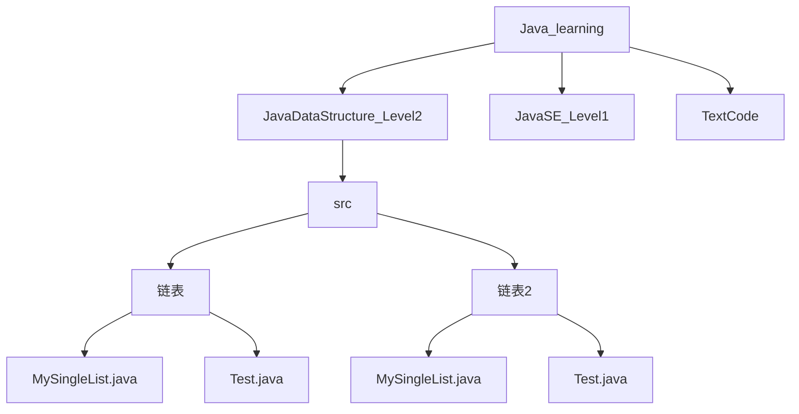
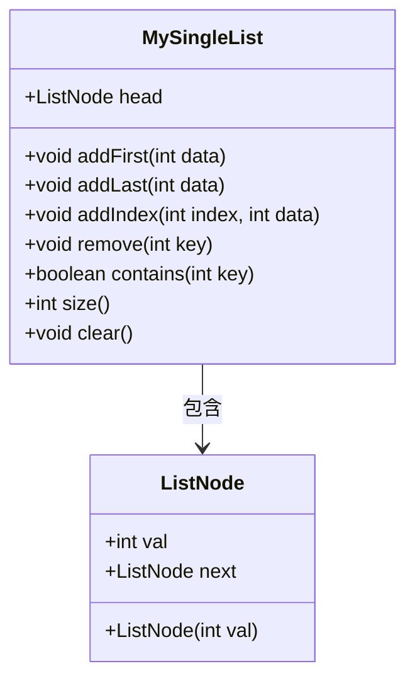
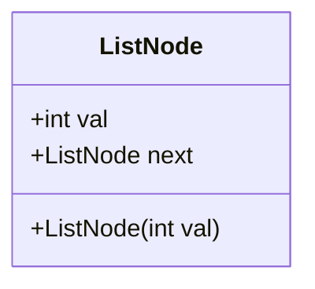
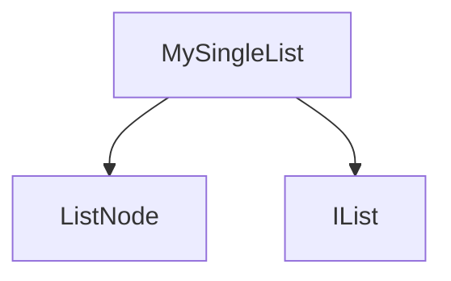

# 单链表实现

<cite>
**本文档引用的文件**   
- [MySingleList.java](file://JavaDataStructure_Level2\src\链表\MySingleList.java)
- [MySingleList.java](file://JavaDataStructure_Level2\src\链表2\MySingleList.java)
- [Test.java](file://JavaDataStructure_Level2\src\链表\Test.java)
- [Test.java](file://JavaDataStructure_Level2\src\链表2\Test.java)
- [IList.java](file://JavaDataStructure_Level2\src\List\IList.java)
</cite>

## 目录
1. [引言](#引言)
2. [项目结构](#项目结构)
3. [核心组件](#核心组件)
4. [架构概述](#架构概述)
5. [详细组件分析](#详细组件分析)
6. [依赖分析](#依赖分析)
7. [性能考量](#性能考量)
8. [故障排除指南](#故障排除指南)
9. [结论](#结论)

## 引言
本文档系统阐述了`MySingleList`类中单链表的实现细节，包括节点定义、头插法与尾插法的实现差异、链表遍历、查找、插入和删除操作的具体编码实现。通过对比“链表”与“链表2”目录下的代码异同，分析不同实现方式对性能和可读性的影响。结合`Test.java`中的测试案例，说明如何处理空链表、头节点删除等边界情况，并讨论链表相对于数组在插入删除效率上的优势与随机访问劣势。

## 项目结构
项目结构清晰地展示了Java学习路径下的多个数据结构实现，包括链表、栈、队列、二叉树等。其中，`链表`和`链表2`目录分别存放了两种不同实现的单链表代码，用于对比分析。



**图示来源**
- [项目结构](file://)

**本节来源**
- [项目结构](file://)

## 核心组件
`MySingleList`类是本文档的核心，它实现了单链表的基本操作。该类包含一个静态内部类`ListNode`作为链表节点，以及一个指向头节点的引用`head`。主要方法包括`addFirst`、`addLast`、`addIndex`、`remove`、`contains`、`size`等。

**本节来源**
- [MySingleList.java](file://JavaDataStructure_Level2\src\链表\MySingleList.java#L2-L212)

## 架构概述
`MySingleList`类的架构基于单向链表的数据结构，每个节点包含一个整数值`val`和一个指向下一个节点的引用`next`。链表的操作通过移动`head`指针和遍历节点来实现。



**图示来源**
- [MySingleList.java](file://JavaDataStructure_Level2\src\链表\MySingleList.java#L2-L212)

## 详细组件分析

### 节点定义分析
`ListNode`类是链表的基本构建单元，包含一个整数值`val`和一个指向下一个节点的引用`next`。构造函数用于初始化节点的值。



**图示来源**
- [MySingleList.java](file://JavaDataStructure_Level2\src\链表\MySingleList.java#L3-L10)

**本节来源**
- [MySingleList.java](file://JavaDataStructure_Level2\src\链表\MySingleList.java#L3-L10)

### 头插法与尾插法实现分析
头插法将新节点插入到链表的头部，时间复杂度为O(1)。尾插法将新节点插入到链表的尾部，需要遍历链表找到最后一个节点，时间复杂度为O(n)。

#### 头插法
```java
public void addFirst(int data){
    ListNode node=new ListNode(data);
    node.next=head;
    head=node;
}
```

#### 尾插法
```java
public void addLast(int data){
    ListNode node=new ListNode(data);
    if(head==null){
        head=node;
        return;
    }
    ListNode cur=head;
    while(cur.next!=null){
        cur=cur.next;
    }
    cur.next=node;
}
```

**本节来源**
- [MySingleList.java](file://JavaDataStructure_Level2\src\链表\MySingleList.java#L40-L58)

### 链表遍历、查找、插入和删除操作分析
链表的遍历通过`show`方法实现，查找通过`contains`方法实现，插入通过`addIndex`方法实现，删除通过`remove`方法实现。

#### 链表遍历
```java
public void show(){
    ListNode cur=head;
    while(cur!=null){
        System.out.print(cur.val+" ");
        cur=cur.next;
    }
}
```

#### 查找操作
```java
public boolean contains(int key){
    ListNode cur=head;
    while(cur!=null){
        if(cur.val==key){
            return true;
        }
        cur=cur.next;
    }
    return false;
}
```

#### 插入操作
```java
public void addIndex(int index,int data){
    int len=size();
    if(index<0||index>len){
        System.out.println("位置不合法");
        return;
    }
    if(index==0){
        addFirst(data);
        return;
    }
    if(index==len){
        addLast(data);
        return;
    }
    ListNode node=new ListNode(data);
    ListNode cur=searchIndex(index-1);
    node.next=cur.next;
    cur.next=node;
    return;
}
```

#### 删除操作
```java
public void remove(int key){
    if(head==null){
        return;
    }
    if(head.val==key){
        head=head.next;
        return;
    }
    ListNode prev=findNodes(key);
    if(prev == null){
        return;
    }
    ListNode del=prev.next;
    prev.next = del.next;
}
```

**本节来源**
- [MySingleList.java](file://JavaDataStructure_Level2\src\链表\MySingleList.java#L79-L122)

### 链表1与链表2实现差异分析
“链表”目录下的`MySingleList`实现为单向链表，而“链表2”目录下的`MySingleList`实现为双向链表，包含`prev`和`next`两个指针。双向链表在删除节点时更加高效，但占用更多内存。

**本节来源**
- [MySingleList.java](file://JavaDataStructure_Level2\src\链表\MySingleList.java#L2-L212)
- [MySingleList.java](file://JavaDataStructure_Level2\src\链表2\MySingleList.java#L2-L142)

### 边界情况处理分析
通过`Test.java`中的测试案例，可以观察到对空链表、头节点删除等边界情况的处理。

#### 空链表处理
```java
if(head==null){
    head=node;
    return;
}
```

#### 头节点删除
```java
if(head.val==key){
    head=head.next;
    return;
}
```

**本节来源**
- [Test.java](file://JavaDataStructure_Level2\src\链表\Test.java#L0-L82)
- [Test.java](file://JavaDataStructure_Level2\src\链表2\Test.java#L0-L26)

## 依赖分析
`MySingleList`类依赖于`ListNode`类作为其节点类型，并通过`IList`接口定义了链表的基本操作。



**图示来源**
- [MySingleList.java](file://JavaDataStructure_Level2\src\链表\MySingleList.java#L2-L212)
- [IList.java](file://JavaDataStructure_Level2\src\List\IList.java#L0-L34)

**本节来源**
- [MySingleList.java](file://JavaDataStructure_Level2\src\链表\MySingleList.java#L2-L212)
- [IList.java](file://JavaDataStructure_Level2\src\List\IList.java#L0-L34)

## 性能考量
单链表在插入和删除操作上具有O(1)的时间复杂度（头插法）或O(n)的时间复杂度（尾插法和任意位置插入），但在随机访问上具有O(n)的时间复杂度，不如数组高效。

## 故障排除指南
常见问题包括空指针异常、链表遍历错误等。确保在操作链表前检查`head`是否为`null`，并在遍历时正确更新指针。

**本节来源**
- [MySingleList.java](file://JavaDataStructure_Level2\src\链表\MySingleList.java#L2-L212)

## 结论
`MySingleList`类实现了单链表的基本操作，通过对比不同实现方式，可以更好地理解链表的特性和应用场景。链表在插入和删除操作上具有优势，但在随机访问上不如数组高效。