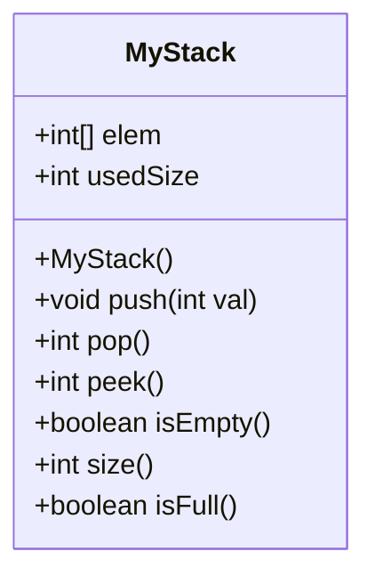
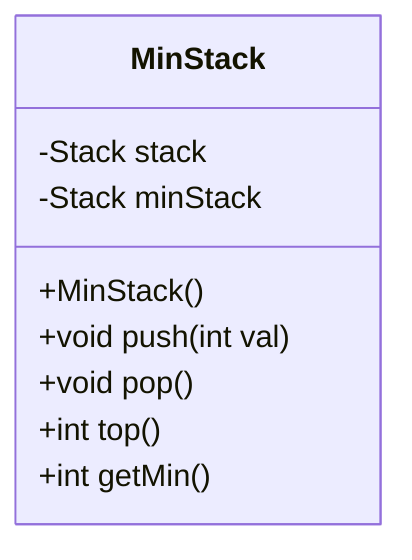
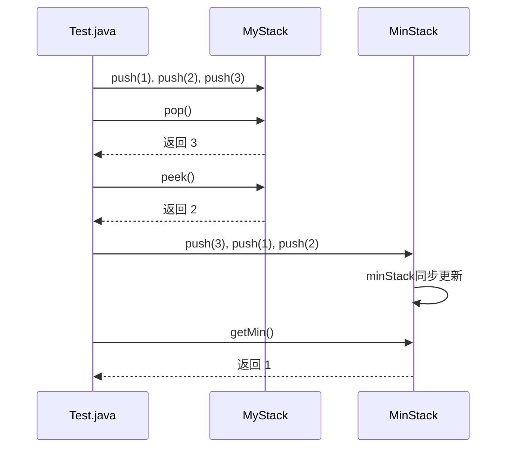
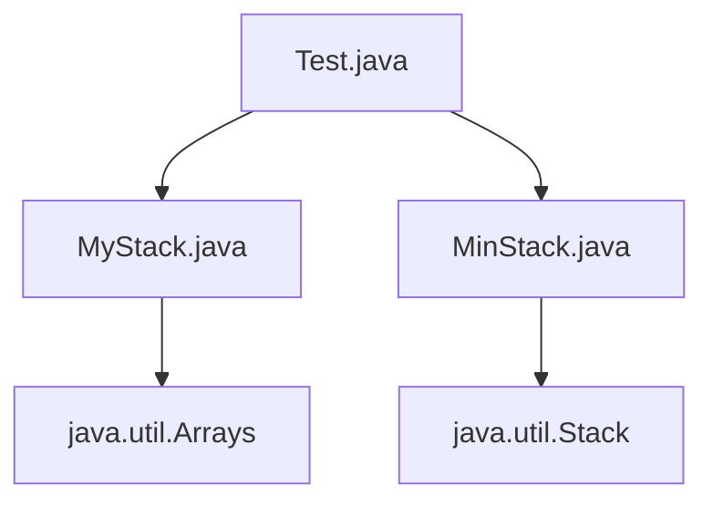

# 栈的实现

<cite>
**本文档引用的文件**   
- [MyStack.java](file://JavaDataStructure_Level2\src\栈\MyStack.java)
- [MinStack.java](file://JavaDataStructure_Level2\src\栈\MinStack.java)
- [Test.java](file://JavaDataStructure_Level2\src\栈\Test.java)
</cite>

## 目录
1. [简介](#简介)
2. [项目结构](#项目结构)
3. [核心组件](#核心组件)
4. [架构概述](#架构概述)
5. [详细组件分析](#详细组件分析)
6. [依赖分析](#依赖分析)
7. [性能考量](#性能考量)
8. [故障排除指南](#故障排除指南)
9. [结论](#结论)

## 简介
本文档详细介绍了在 `JavaDataStructure_Level2` 项目中，`栈` 模块下基于数组实现的后进先出（LIFO）栈结构。重点分析了 `MyStack` 类的基本操作（如 `push`、`pop`、`peek`）的编码实现与异常处理机制，并深入解析了 `MinStack` 类如何通过辅助栈的方式，在 O(1) 时间复杂度内获取栈中的最小元素。通过 `Test.java` 中的测试用例验证了栈操作的正确性，并对两种实现方案进行了对比。

## 项目结构
`栈` 模块位于项目的 `JavaDataStructure_Level2\src\栈` 目录下，包含三个核心 Java 源文件：
- **MyStack.java**: 定义了一个基于动态数组的普通栈实现。
- **MinStack.java**: 定义了一个支持在常数时间内获取最小值的特殊栈。
- **Test.java**: 包含了对上述两个栈类的测试方法和一个独立的算法题（验证出栈序列）。

该模块的结构清晰，职责分明，将数据结构的实现与测试逻辑分离。

```mermaid
graph TD
subgraph "栈模块"
A[MyStack.java<br/>普通栈实现]
B[MinStack.java<br/>最小栈实现]
C[Test.java<br/>测试与验证]
end
A --> C : 被测试
B --> C : 被测试
```

**图示来源**
- [MyStack.java](file://JavaDataStructure_Level2\src\栈\MyStack.java)
- [MinStack.java](file://JavaDataStructure_Level2\src\栈\MinStack.java)
- [Test.java](file://JavaDataStructure_Level2\src\栈\Test.java)

## 核心组件

### MyStack 类分析
`MyStack` 类是栈数据结构的基础实现，使用一个 `int` 类型的数组 `elem` 来存储元素，并通过 `usedSize` 变量追踪栈中元素的数量。

**关键字段**:
- **elem**: 存储栈元素的整型数组，初始容量为10。
- **usedSize**: 记录当前栈中已使用的空间大小，即栈顶指针。

**关键方法**:
- **push(int val)**: 将元素压入栈顶。在插入前会调用 `isFull()` 检查容量，若已满则使用 `Arrays.copyOf` 将数组容量扩大一倍，实现了动态扩容。
- **pop()**: 弹出并返回栈顶元素。在弹出前会调用 `isEmpty()` 检查栈是否为空。若为空，返回 -1 作为错误码，此处应抛出异常以更好地处理错误。
- **peek()**: 返回栈顶元素但不弹出。直接返回 `elem[usedSize-1]`。
- **isEmpty()**: 检查栈是否为空。**注意**：当前实现 `return 0==elem.length;` 是错误的，它检查的是数组长度而非实际元素数量，正确实现应为 `return usedSize == 0;`。
- **isFull()**: 检查栈是否已满，通过比较 `usedSize` 和 `elem.length` 实现。



**代码来源**
- [MyStack.java](file://JavaDataStructure_Level2\src\栈\MyStack.java#L1-L41)

### MinStack 类分析
`MinStack` 类解决了在 O(1) 时间内获取栈中最小元素的问题，其核心思想是使用一个辅助栈 `minStack` 来同步记录每个状态下的最小值。

**关键字段**:
- **stack**: 主栈，用于存储所有压入的元素。
- **minStack**: 辅助栈，其栈顶元素始终是当前 `stack` 中所有元素的最小值。

**关键方法**:
- **push(int val)**: 将元素压入主栈 `stack`。同时，如果 `minStack` 为空，或者新元素 `val` 小于或等于 `minStack` 的栈顶元素，则也将 `val` 压入 `minStack`。这保证了 `minStack` 的单调递减（非严格）性质。
- **pop()**: 从主栈 `stack` 弹出元素。如果弹出的元素值等于 `minStack` 的栈顶元素，则同时从 `minStack` 中弹出栈顶元素。这确保了 `minStack` 始终与 `stack` 的最小值状态保持同步。
- **getMin()**: 直接返回 `minStack.peek()`，时间复杂度为 O(1)。
- **top()**: 返回主栈的栈顶元素。

该实现以 O(n) 的额外空间复杂度为代价，换取了 O(1) 的最小值查询时间。



**代码来源**
- [MinStack.java](file://JavaDataStructure_Level2\src\栈\MinStack.java#L1-L42)

## 详细组件分析

### MyStack 与 MinStack 实现方案对比
| 特性 | MyStack (数组实现) | MinStack (双栈实现) |
| :--- | :--- | :--- |
| **核心数据结构** | 单个动态数组 | 两个栈 (主栈 + 辅助栈) |
| **时间复杂度 (push/pop/peek)** | 均摊 O(1) | O(1) |
| **时间复杂度 (getMin)** | O(n) | O(1) |
| **空间复杂度** | O(n) | O(n) |
| **优点** | 空间利用率高，实现简单 | 最小值查询极快 |
| **缺点** | 查询最小值效率低 | 需要额外的栈空间存储最小值历史 |

### Test.java 测试用例分析
`Test.java` 文件包含两个 `main` 方法和一个算法题方法 `IsPopOrder`。

- **main(String[] args)**: 测试 `MyStack` 类。依次压入 1, 2, 3，然后弹出一个元素（输出3），查看栈顶（输出2），检查栈是否为空（输出false），并输出栈的大小（输出2）。此测试验证了基本的栈操作。
- **main1(String[] args)**: 测试 Java 内置的 `Stack` 类，逻辑与 `main` 方法类似。
- **IsPopOrder(int[] pushV, int[] popV)**: 一个经典的算法题，用于验证给定的出栈序列 `popV` 是否可能由入栈序列 `pushV` 通过合法的栈操作得到。其实现使用了一个辅助栈来模拟整个入栈和出栈过程。



**图示来源**
- [Test.java](file://JavaDataStructure_Level2\src\栈\Test.java#L1-L40)
- [MyStack.java](file://JavaDataStructure_Level2\src\栈\MyStack.java)
- [MinStack.java](file://JavaDataStructure_Level2\src\栈\MinStack.java)

## 依赖分析
`栈` 模块内部的依赖关系清晰。`Test` 类依赖于 `MyStack` 和 `MinStack` 类进行功能测试。`MinStack` 类内部依赖于 Java 标准库的 `Stack` 类作为其底层实现。`MyStack` 类则完全使用原生数组实现，不依赖外部数据结构。



**图示来源**
- [Test.java](file://JavaDataStructure_Level2\src\栈\Test.java)
- [MyStack.java](file://JavaDataStructure_Level2\src\栈\MyStack.java)
- [MinStack.java](file://JavaDataStructure_Level2\src\栈\MinStack.java)

## 性能考量
- **MyStack**: 动态扩容机制保证了 `push` 操作的均摊时间复杂度为 O(1)，但单次扩容操作是 O(n)。`pop` 和 `peek` 为真正的 O(1)。查询最小值需要遍历整个数组，为 O(n)。
- **MinStack**: 所有操作（包括 `getMin`）均为 O(1)。空间开销是主要考量，最坏情况下（元素递减入栈），`minStack` 的大小与 `stack` 相同，空间复杂度为 O(n)。

## 故障排除指南
1.  **MyStack.isEmpty() 方法错误**: 当前实现有严重 bug。应将 `return 0==elem.length;` 修改为 `return usedSize == 0;`，否则栈永远不会被判定为空。
2.  **MyStack.pop() 错误处理**: 返回 -1 无法区分栈空和实际值为 -1 的元素。建议修改为抛出 `EmptyStackException` 异常。
3.  **MinStack 的相等处理**: `push` 方法中使用 `<=` 而不是 `<`，是为了处理重复的最小值。如果使用 `<`，当有多个相同的最小值时，`pop` 操作可能会错误地移除 `minStack` 中的最小值。

**代码来源**
- [MyStack.java](file://JavaDataStructure_Level2\src\栈\MyStack.java#L25-L27)
- [MinStack.java](file://JavaDataStructure_Level2\src\栈\MinStack.java#L14-L18)

## 结论
本项目中的 `MyStack` 和 `MinStack` 类展示了栈数据结构的两种典型实现。`MyStack` 作为基础实现，演示了动态数组的管理。`MinStack` 则巧妙地运用了“空间换时间”的思想，通过辅助栈实现了高效的最小值查询。尽管 `MyStack` 存在一个关键的逻辑错误（`isEmpty` 方法），但整体设计思路清晰。通过 `Test.java` 的验证，可以确认 `MinStack` 的设计是正确且高效的。栈作为一种基础数据结构，在括号匹配、函数调用堆栈、表达式求值等场景中有着广泛的应用。