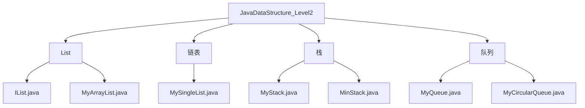
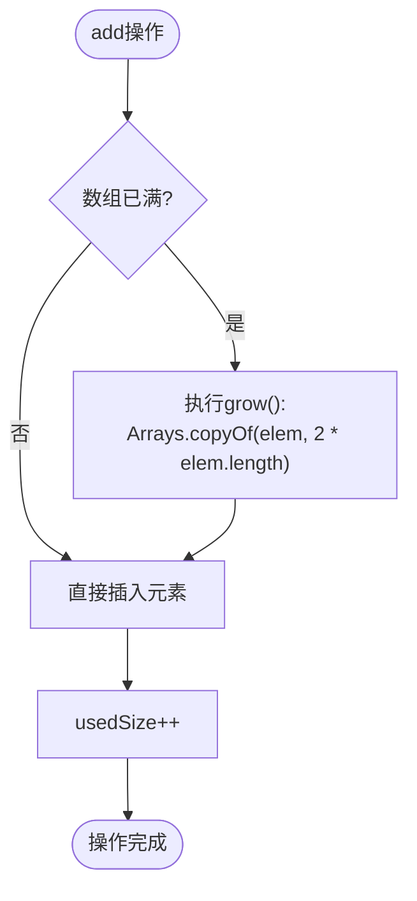
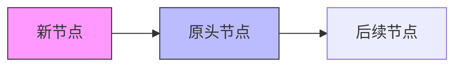
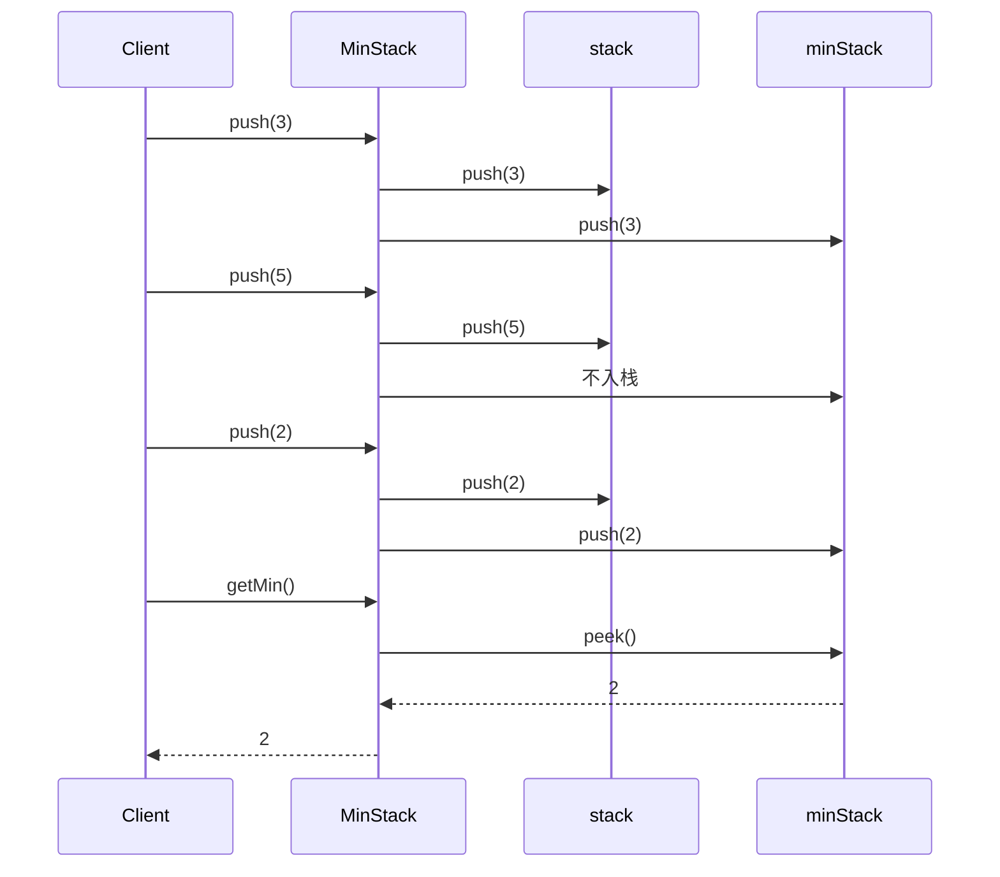
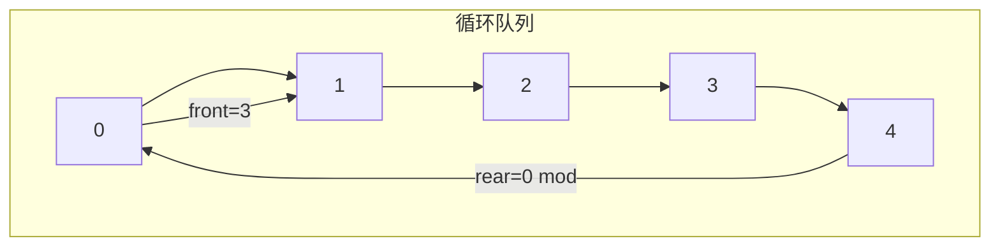

# 线性数据结构

<cite>
**本文档引用文件**  
- [IList.java](file://JavaDataStructure_Level2/src/List/IList.java)
- [MyArrayList.java](file://JavaDataStructure_Level2/src/List/MyArrayList.java)
- [PosOutOfBoundsException.java](file://JavaDataStructure_Level2/src/List/PosOutOfBoundsException.java)
- [MySingleList.java](file://TextCode/src/MySingleList.java)
- [MinStack.java](file://JavaDataStructure_Level2/src/栈/MinStack.java)
- [MyStack.java](file://JavaDataStructure_Level2/src/栈/MyStack.java)
- [MyCircularQueue.java](file://JavaDataStructure_Level2/src/队列/MyCircularQueue.java)
- [MyQueue.java](file://JavaDataStructure_Level2/src/队列/MyQueue.java)
</cite>

## 目录
1. [引言](#引言)
2. [项目结构](#项目结构)
3. [核心组件](#核心组件)
4. [架构概览](#架构概览)
5. [详细组件分析](#详细组件分析)
6. [依赖分析](#依赖分析)
7. [性能考量](#性能考量)
8. [故障排除指南](#故障排除指南)
9. [结论](#结论)

## 引言
本文档系统性地介绍Java中实现的各类线性数据结构，包括动态数组（MyArrayList）、单链表（MySingleList）、栈（MyStack、MinStack）和队列（MyQueue、MyCircularQueue）。通过UML类图、内存布局示意图和代码示例，深入解析其设计原理与实现机制，帮助开发者理解不同数据结构的适用场景与性能特征。

## 项目结构
JavaDataStructure_Level2项目采用功能模块化组织方式，将不同的数据结构分别置于独立的包目录下。线性数据结构主要分布在`List`、`链表`、`栈`和`队列`四个包中，每个包包含对应的实现类与测试文件。



**图示来源**
- [IList.java](file://JavaDataStructure_Level2/src/List/IList.java)
- [MyArrayList.java](file://JavaDataStructure_Level2/src/List/MyArrayList.java)
- [MySingleList.java](file://TextCode/src/MySingleList.java)
- [MinStack.java](file://JavaDataStructure_Level2/src/栈/MinStack.java)
- [MyCircularQueue.java](file://JavaDataStructure_Level2/src/队列/MyCircularQueue.java)

## 核心组件
本项目实现了多种基础线性数据结构，涵盖顺序存储与链式存储两种模式。核心组件包括：
- **MyArrayList**：基于动态数组的顺序表，支持自动扩容
- **MySingleList**：双向链表实现，支持头插、尾插与任意位置插入
- **MinStack**：支持O(1)时间获取最小值的特殊栈
- **MyCircularQueue**：循环队列，优化空间利用率

**组件来源**
- [MyArrayList.java](file://JavaDataStructure_Level2/src/List/MyArrayList.java)
- [MySingleList.java](file://TextCode/src/MySingleList.java)
- [MinStack.java](file://JavaDataStructure_Level2/src/栈/MinStack.java)
- [MyCircularQueue.java](file://JavaDataStructure_Level2/src/队列/MyCircularQueue.java)

## 架构概览
系统采用接口驱动设计，通过`IList`接口规范线性表的基本操作。各具体实现类遵循单一职责原则，分别处理数组、链表、栈、队列等不同数据结构的逻辑。

```mermaid
classDiagram
class IList {
<<interface>>
+add(int data)
+add(int pos, int data)
+contains(int toFind)
+indexOf(int toFind)
+get(int pos)
+set(int pos, int value)
+remove(int toRemove)
+size()
+clear()
+display()
}
class MyArrayList {
+int[] elem
+int usedSize
+DEAFULT_CAPACITY
+add(int data)
+add(int pos, int data)
+grow()
+checkPos(int pos)
}
class MySingleList {
+ListNode head
+addFirst(int data)
+addLast(int data)
+addIndex(int index, int data)
+removeAllKeys(int key)
}
class MinStack {
+Stack<Integer> stack
+Stack<Integer> minStack
+push(int val)
+pop()
+getMin()
}
class MyCircularQueue {
+int[] elem
+int front
+int rear
+size
+capacity
+enQueue(int value)
+deQueue()
+isFull()
+isEmpty()
}
IList <|-- MyArrayList
MySingleList : ListNode inner class
MinStack --> Stack : uses
MyCircularQueue --> "取模运算" : uses
```

**图示来源**
- [IList.java](file://JavaDataStructure_Level2/src/List/IList.java)
- [MyArrayList.java](file://JavaDataStructure_Level2/src/List/MyArrayList.java)
- [MySingleList.java](file://TextCode/src/MySingleList.java)
- [MinStack.java](file://JavaDataStructure_Level2/src/栈/MinStack.java)
- [MyCircularQueue.java](file://JavaDataStructure_Level2/src/队列/MyCircularQueue.java)

## 详细组件分析

### 动态数组（MyArrayList）
`MyArrayList`实现了`IList`接口，使用固定大小的数组存储元素，并在容量不足时进行2倍扩容。

#### 内部结构
```java
public class MyArrayList implements IList {
    public int[] elem;
    public int usedSize;
    public static final int DEAFULT_CAPACITY = 10;
}
```

#### 扩容机制
当数组满时，调用`grow()`方法创建新数组，长度为原数组的两倍，并复制所有元素。



**时间复杂度分析**
- 尾部插入：平均O(1)，扩容时O(n)
- 任意位置插入：O(n)，需移动后续元素
- 查找元素：O(n)
- 随机访问：O(1)

**边界异常处理**
通过`checkPos(pos)`方法验证位置合法性，抛出`RuntimeException`而非自定义的`PosOutOfBoundsException`。

**组件来源**
- [MyArrayList.java](file://JavaDataStructure_Level2/src/List/MyArrayList.java)
- [IList.java](file://JavaDataStructure_Level2/src/List/IList.java)

### 单链表（MySingleList）
`MySingleList`采用双向链表结构，每个节点包含前驱和后继指针。

#### 节点结构
```java
static class ListNode{
    int val;
    ListNode next;
    ListNode prev;
    public ListNode(int val) {
        this.val = val;
    }
}
```

#### 插入操作
- **头插法**：新节点指向原头节点，更新头指针
- **尾插法**：遍历至末尾，将最后一个节点的next指向新节点
- **任意位置插入**：通过`searchIndex(index)`定位，调整前后指针



**内存布局示意图**
```
head -> [val:3|prev:null|next:→] <-> [val:2|prev:←|next:→] <-> [val:1|prev:←|next:null]
```

**组件来源**
- [MySingleList.java](file://TextCode/src/MySingleList.java)

### 栈结构（MyStack与MinStack）

#### 普通栈（MyStack）
后进先出（LIFO）结构，基于数组实现，支持push、pop、peek等基本操作。

#### 最小栈（MinStack）
使用双栈法实现O(1)时间获取最小值：
- `stack`：存储所有元素
- `minStack`：仅存储递减序列的元素

```java
public void push(int val) {
    stack.push(val);
    if(minStack.empty() || val <= minStack.peek()) {
        minStack.push(val);
    }
}
```



**组件来源**
- [MinStack.java](file://JavaDataStructure_Level2/src/栈/MinStack.java)

### 队列结构（MyQueue与MyCircularQueue）

#### 普通队列（MyQueue）
先进先出（FIFO）结构，基于数组实现，存在假溢出问题。

#### 循环队列（MyCircularQueue）
通过取模运算解决假溢出，提高空间利用率。

```java
public boolean enQueue(int value) {
    if (isFull()) return false;
    this.elem[this.rear] = value;
    this.rear = (this.rear + 1) % this.capacity;
    this.size++;
    return true;
}
```

**循环队列状态判断**
- 空：`size == 0`
- 满：`size == capacity`
- 队头：`elem[front]`
- 队尾：`elem[(rear == 0) ? capacity - 1 : rear - 1]`



**组件来源**
- [MyCircularQueue.java](file://JavaDataStructure_Level2/src/队列/MyCircularQueue.java)

## 依赖分析
各组件之间低耦合，通过接口或标准库进行交互。`MinStack`依赖Java内置的`Stack`类，`MyArrayList`依赖`Arrays.copyOf`进行扩容。

```mermaid
graph LR
MyArrayList --> Arrays : 使用copyOf
MinStack --> Stack : 内置栈
MyCircularQueue --> "取模运算" : 数学运算
MySingleList --> ListNode : 内部类
```

**图示来源**
- [MyArrayList.java](file://JavaDataStructure_Level2/src/List/MyArrayList.java)
- [MinStack.java](file://JavaDataStructure_Level2/src/栈/MinStack.java)
- [MyCircularQueue.java](file://JavaDataStructure_Level2/src/队列/MyCircularQueue.java)

## 性能考量
| 数据结构 | 插入(头) | 插入(尾) | 删除 | 查找 | 空间 |
|--------|--------|--------|-----|-----|-----|
| 动态数组 | O(n) | O(1)* | O(n) | O(1) | O(n) |
| 链表 | O(1) | O(1) | O(1) | O(n) | O(n) |
| 栈 | O(1) | O(1) | O(1) | O(1) | O(n) |
| 循环队列 | - | O(1) | O(1) | O(1) | O(k) |

*注：动态数组尾部插入均摊O(1)，扩容时O(n)*

## 故障排除指南
常见问题及解决方案：

1. **数组越界异常**
   - 原因：`pos`参数超出`[0, usedSize]`范围
   - 解决：调用`checkPos(pos)`进行预检查

2. **循环队列判空/判满错误**
   - 原因：未正确使用`size`字段或取模逻辑错误
   - 解决：统一通过`size`判断，避免使用`front == rear`作为唯一判据

3. **链表插入指针错乱**
   - 原因：未正确处理`prev`和`next`指针
   - 解决：分步调试，确保四个指针连接正确

4. **最小栈同步失败**
   - 原因：`pop`时未同步`minStack`
   - 解决：当`stack.pop()`等于`minStack.peek()`时，同步`minStack.pop()`

**组件来源**
- [MyArrayList.java](file://JavaDataStructure_Level2/src/List/MyArrayList.java)
- [MyCircularQueue.java](file://JavaDataStructure_Level2/src/队列/MyCircularQueue.java)
- [MinStack.java](file://JavaDataStructure_Level2/src/栈/MinStack.java)

## 结论
本文档全面分析了Java中实现的线性数据结构。`MyArrayList`适合频繁随机访问场景，`MySingleList`适合频繁插入删除场景，`MinStack`在需要快速获取最小值时具有优势，`MyCircularQueue`有效解决了普通队列的空间浪费问题。开发者应根据具体应用场景选择合适的数据结构。