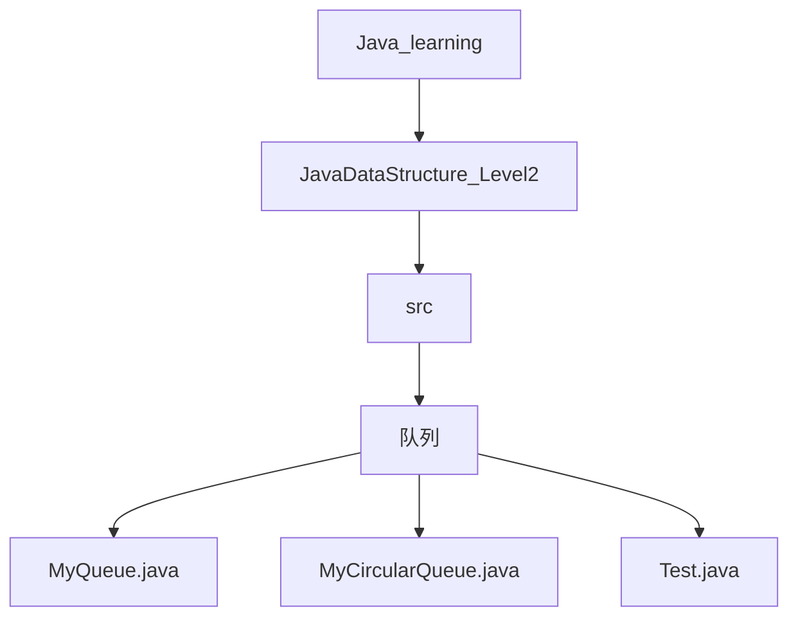
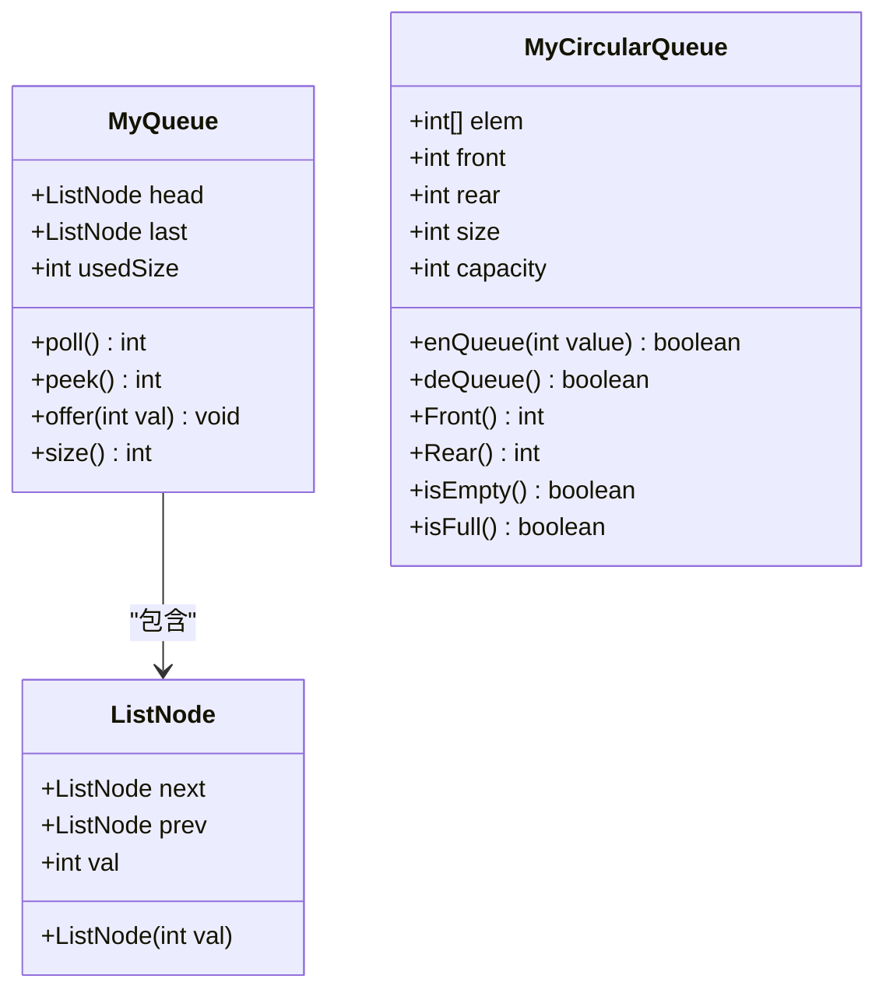
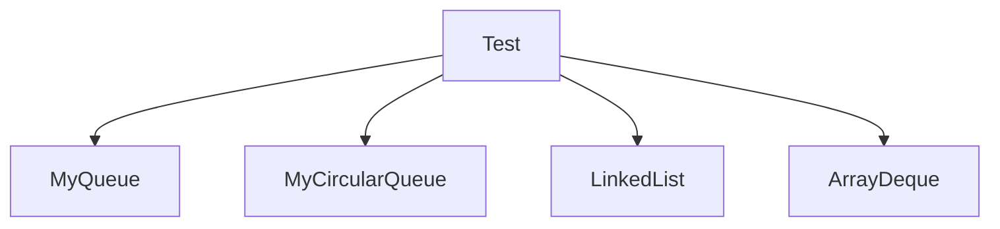

# 队列的实现

<cite>
**本文档引用的文件**  
- [MyQueue.java](file://JavaDataStructure_Level2\src\队列\MyQueue.java)
- [MyCircularQueue.java](file://JavaDataStructure_Level2\src\队列\MyCircularQueue.java)
- [Test.java](file://JavaDataStructure_Level2\src\队列\Test.java)
</cite>

## 目录
1. [简介](#简介)
2. [项目结构](#项目结构)
3. [核心组件](#核心组件)
4. [架构概览](#架构概览)
5. [详细组件分析](#详细组件分析)
6. [依赖分析](#依赖分析)
7. [性能考量](#性能考量)
8. [故障排除指南](#故障排除指南)
9. [结论](#结论)

## 简介
本文档全面介绍 `MyQueue` 类实现的普通队列（FIFO）的基本操作，包括入队、出队和判空等。重点分析 `MyCircularQueue` 循环队列的设计原理，解释其如何通过取模运算将队列首尾相连，有效避免普通队列的“假溢出”问题并提升空间利用率。对比两种队列在空间复杂度和边界处理上的差异。通过内存示意图展示循环队列中 `front` 和 `rear` 指针的移动规律，并结合 `Test.java` 中的测试代码验证其正确性，讨论其在缓冲区管理等场景中的适用性。

## 项目结构
本项目位于 `` 目录下，主要数据结构实现位于 `JavaDataStructure_Level2\src` 路径中。与队列相关的代码集中于 `队列` 子目录，包含以下核心文件：
- **MyQueue.java**：基于双向链表实现的普通队列。
- **MyCircularQueue.java**：基于固定大小数组实现的循环队列。
- **Test.java**：包含多个 `main` 方法的测试类，用于验证数据结构的正确性。



**图示来源**
- [MyQueue.java](file://JavaDataStructure_Level2\src\队列\MyQueue.java)
- [MyCircularQueue.java](file://JavaDataStructure_Level2\src\队列\MyCircularQueue.java)
- [Test.java](file://JavaDataStructure_Level2\src\队列\Test.java)

## 核心组件
本节分析 `MyQueue` 和 `MyCircularQueue` 两个核心类的实现细节。

**本节来源**
- [MyQueue.java](file://JavaDataStructure_Level2\src\队列\MyQueue.java#L1-L65)
- [MyCircularQueue.java](file://JavaDataStructure_Level2\src\队列\MyCircularQueue.java#L1-L58)

## 架构概览
系统采用面向对象设计，`MyQueue` 和 `MyCircularQueue` 均为独立的队列实现，遵循 FIFO（先进先出）原则。`MyQueue` 使用动态链表结构，而 `MyCircularQueue` 使用静态数组结构，通过指针和取模运算模拟循环。



**图示来源**
- [MyQueue.java](file://JavaDataStructure_Level2\src\队列\MyQueue.java#L1-L65)
- [MyCircularQueue.java](file://JavaDataStructure_Level2\src\队列\MyCircularQueue.java#L1-L58)

## 详细组件分析
### 普通队列 (MyQueue) 分析
`MyQueue` 类使用双向链表来实现队列。它定义了一个内部静态类 `ListNode` 作为链表节点，包含 `val`（存储数据）、`next`（指向后继节点）和 `prev`（指向前驱节点）三个字段。

- **入队 (offer)**：在队尾插入新元素。如果队列为空，则新节点既是头节点也是尾节点；否则，将新节点链接到当前尾节点之后，并更新 `last` 指针。
- **出队 (poll)**：移除并返回队头元素。如果队列为空，返回 -1；如果队列只有一个元素，则移除后将 `head` 和 `last` 都置为 `null`；否则，移动 `head` 指针到下一个节点，并断开原头节点的前向链接。
- **判空 (peek)**：检查 `head` 是否为 `null`，若为 `null` 则队列为空。
- **空间复杂度**：O(n)，其中 n 为队列中元素的个数。每个元素需要额外的指针开销。

```mermaid
flowchart TD
A[调用 offer(val)] --> B{head == null?}
B --> |是| C[head = last = 新节点]
B --> |否| D[last.next = 新节点]
D --> E[新节点.prev = last]
E --> F[last = last.next]
```

**图示来源**
- [MyQueue.java](file://JavaDataStructure_Level2\src\队列\MyQueue.java#L45-L57)

**本节来源**
- [MyQueue.java](file://JavaDataStructure_Level2\src\队列\MyQueue.java#L1-L65)

### 循环队列 (MyCircularQueue) 分析
`MyCircularQueue` 类使用固定大小的数组来实现循环队列，通过 `front` 和 `rear` 两个指针以及 `size` 变量来管理队列状态。

- **初始化**：构造函数接收一个整数 `k` 作为队列容量，初始化大小为 `k` 的数组 `elem`，并将 `front`、`rear` 和 `size` 初始化为 0。
- **入队 (enQueue)**：首先检查队列是否已满（`isFull()`）。若不满，则将新元素放入 `elem[rear]` 位置，然后通过 `rear = (rear + 1) % capacity` 更新 `rear` 指针，实现循环。`size` 加 1。
- **出队 (deQueue)**：首先检查队列是否为空（`isEmpty()`）。若不为空，则通过 `front = (front + 1) % capacity` 移动 `front` 指针，`size` 减 1。
- **获取队头/队尾 (Front/Rear)**：`Front()` 直接返回 `elem[front]`。`Rear()` 需要特殊处理，因为 `rear` 指向的是下一个可插入位置，所以队尾元素的实际索引是 `(rear == 0) ? capacity - 1 : rear - 1`。
- **判空与判满**：`isEmpty()` 判断 `size == 0`；`isFull()` 判断 `size == capacity`。这种设计避免了使用 `front` 和 `rear` 的复杂关系来判断满状态，简化了逻辑。
- **空间复杂度**：O(k)，其中 k 为预设的固定容量。空间利用率高，无额外指针开销。
- **避免假溢出**：普通队列在数组实现中，即使数组前端有空位，当 `rear` 指针到达数组末尾时也无法继续入队，造成“假溢出”。循环队列通过取模运算，使得 `rear` 和 `front` 指针可以“绕回”数组起始位置，只要 `size < capacity`，就能利用数组中的任何空位。

```mermaid
flowchart TD
A[调用 enQueue(val)] --> B{isFull()?}
B --> |是| C[返回 false]
B --> |否| D[elem[rear] = val]
D --> E[rear = (rear + 1) % capacity]
E --> F[size++]
F --> G[返回 true]
```

**图示来源**
- [MyCircularQueue.java](file://JavaDataStructure_Level2\src\队列\MyCircularQueue.java#L17-L25)

**本节来源**
- [MyCircularQueue.java](file://JavaDataStructure_Level2\src\队列\MyCircularQueue.java#L1-L58)

### 内存示意图
以下示意图展示了一个容量为 3 的循环队列在一系列操作后的状态。

```
初始状态: front=0, rear=0, size=0
[ ][ ][ ]
 ^  ^
 f  r

执行 enQueue(1): rear=(0+1)%3=1, size=1
[1][ ][ ]
 ^  ^
 f  r

执行 enQueue(2): rear=(1+1)%3=2, size=2
[1][2][ ]
 ^     ^
 f     r

执行 enQueue(3): rear=(2+1)%3=0, size=3 (已满)
[1][2][3]
 ^     ^
 r     f

执行 deQueue(): front=(0+1)%3=1, size=2
[1][2][3]
    ^  ^
    f  r

执行 enQueue(4): rear=(0+1)%3=1, size=3 (已满)
[1][4][3]
    ^  ^
    f  r
```

**本节来源**
- [MyCircularQueue.java](file://JavaDataStructure_Level2\src\队列\MyCircularQueue.java#L17-L35)

## 依赖分析
`MyQueue` 和 `MyCircularQueue` 是独立的数据结构实现，不依赖于项目中的其他模块。`Test.java` 文件依赖于这两个类进行测试，并导入了 Java 标准库中的 `LinkedList` 和 `ArrayDeque` 作为参考。



**图示来源**
- [Test.java](file://JavaDataStructure_Level2\src\队列\Test.java#L1-L39)

**本节来源**
- [Test.java](file://JavaDataStructure_Level2\src\队列\Test.java#L1-L39)

## 性能考量
- **时间复杂度**：两种队列的 `offer`、`poll`、`peek`/`Front`/`Rear` 操作的时间复杂度均为 O(1)。
- **空间复杂度**：
  - `MyQueue`：O(n)，动态增长，但每个节点有额外的指针开销。
  - `MyCircularQueue`：O(k)，空间固定，无额外开销，空间利用率高。
- **适用场景**：
  - `MyQueue` 适用于元素数量不确定、需要动态扩展的场景。
  - `MyCircularQueue` 适用于有明确容量限制、追求高效内存利用的场景，如操作系统中的缓冲区、网络数据包队列等。

## 故障排除指南
- **MyQueue 返回 -1**：`poll()` 或 `peek()` 方法在队列为空时返回 -1。确保在调用这些方法前使用 `size()` 检查队列是否非空。
- **MyCircularQueue 入队失败**：`enQueue()` 返回 `false` 表示队列已满。应先检查 `isFull()` 状态或增加队列容量。
- **数组索引越界**：`MyCircularQueue` 通过取模运算和 `size` 变量严格控制访问范围，正常情况下不会发生。若手动修改 `front` 或 `rear`，可能导致越界。

**本节来源**
- [MyQueue.java](file://JavaDataStructure_Level2\src\队列\MyQueue.java#L21-L37)
- [MyCircularQueue.java](file://JavaDataStructure_Level2\src\队列\MyCircularQueue.java#L17-L27)

## 结论
`MyQueue` 和 `MyCircularQueue` 提供了两种不同设计哲学的队列实现。`MyQueue` 基于链表，实现简单，能动态扩展，但有指针开销。`MyCircularQueue` 基于数组，通过巧妙的取模运算和 `size` 计数，实现了高效的循环利用，解决了“假溢出”问题，特别适合有固定容量要求的高性能场景。开发者应根据具体的应用需求（如数据量、内存限制）选择合适的实现。