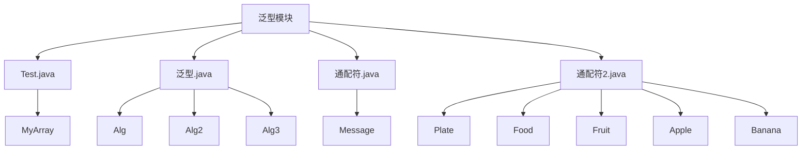
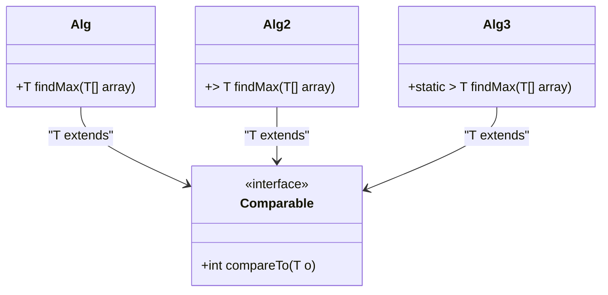
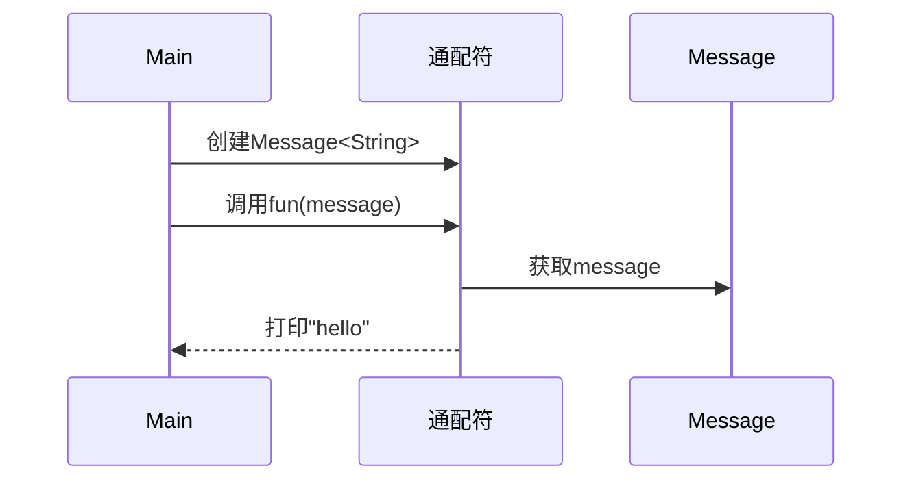
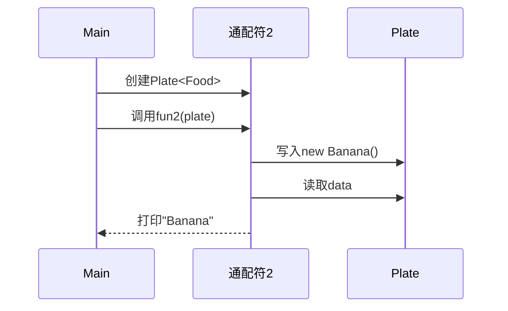
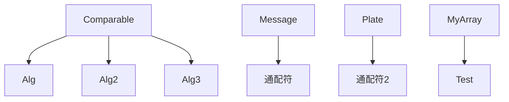

# 泛型编程

<cite>
**本文档引用的文件**  
- [泛型.java](file://JavaDataStructure_Level2/src/泛型/泛型.java)
- [通配符.java](file://JavaDataStructure_Level2/src/泛型/通配符.java)
- [通配符2.java](file://JavaDataStructure_Level2/src/泛型/通配符2.java)
- [Test.java](file://JavaDataStructure_Level2/src/泛型/Test.java)
</cite>

## 目录
1. [简介](#简介)
2. [项目结构](#项目结构)
3. [核心组件](#核心组件)
4. [架构概述](#架构概述)
5. [详细组件分析](#详细组件分析)
6. [依赖分析](#依赖分析)
7. [性能考虑](#性能考虑)
8. [故障排除指南](#故障排除指南)
9. [结论](#结论)

## 简介
本文档旨在深入探讨Java泛型机制在实际代码中的应用。通过分析`泛型.java`、`通配符.java`、`通配符2.java`和`Test.java`四个示例文件，系统性地讲解泛型类与泛型方法的定义与使用，解析类型参数的声明与约束机制。重点阐述通配符（?）、上界限定（extends）和下界限定（super）的语义差异与典型使用场景，并结合代码实例进行对比演示。同时，解释泛型擦除原理及其对运行时类型检查的影响，提供泛型在集合类设计中的最佳实践，帮助开发者提升代码的安全性与可重用性，并分析常见的编译错误及其解决方案。

## 项目结构
泛型编程示例位于项目的`JavaDataStructure_Level2/src/泛型`目录下，该目录包含四个核心Java源文件，分别用于演示不同层面的泛型特性。`Test.java`展示了泛型类的基本定义与使用；`泛型.java`集中体现了泛型方法、类型参数约束及静态泛型方法的调用；`通配符.java`和`通配符2.java`则通过对比，深入讲解了通配符在不同类型限定下的行为差异。



**图示来源**
- [Test.java](file://JavaDataStructure_Level2/src/泛型/Test.java)
- [泛型.java](file://JavaDataStructure_Level2/src/泛型/泛型.java)
- [通配符.java](file://JavaDataStructure_Level2/src/泛型/通配符.java)
- [通配符2.java](file://JavaDataStructure_Level2/src/泛型/通配符2.java)

**本节来源**
- [泛型.java](file://JavaDataStructure_Level2/src/泛型/泛型.java)
- [通配符.java](file://JavaDataStructure_Level2/src/泛型/通配符.java)
- [通配符2.java](file://JavaDataStructure_Level2/src/泛型/通配符2.java)
- [Test.java](file://JavaDataStructure_Level2/src/泛型/Test.java)

## 核心组件
本模块的核心组件围绕泛型的三大应用展开：泛型类、泛型方法和通配符。`MyArray<T>`类展示了如何创建一个类型安全的容器；`Alg`系列类则演示了如何编写可重用的算法，通过`T extends Comparable<T>`约束确保类型具备比较能力；`Message<T>`和`Plate<T>`类作为通配符的载体，分别用于演示无界通配符和有界通配符的使用。这些组件共同构成了Java泛型编程的基础实践。

**本节来源**
- [Test.java](file://JavaDataStructure_Level2/src/泛型/Test.java#L2-L13)
- [泛型.java](file://JavaDataStructure_Level2/src/泛型/泛型.java#L6-L36)
- [通配符.java](file://JavaDataStructure_Level2/src/泛型/通配符.java#L2-L7)
- [通配符2.java](file://JavaDataStructure_Level2/src/泛型/通配符2.java#L30-L35)

## 架构概述
该泛型模块的架构设计遵循了从基础到高级的原则。底层是具体的泛型类（如`MyArray<T>`），它们封装了数据和基本操作。中层是通用算法类（如`Alg<T>`），它们依赖于类型的特定行为（如`Comparable`接口）来实现跨类型的逻辑。顶层是利用通配符的灵活接口（如`fun`和`fun1`方法），它们通过放宽类型约束来提高API的灵活性。这种分层设计使得代码既保证了类型安全，又实现了高度的可重用性。

```mermaid
graph TB
subgraph "顶层: 灵活接口"
A[fun(Message<?>) ]
B[fun1(Plate<? extends Fruit>) ]
C[fun2(Plate<? super Fruit>) ]
end
subgraph "中层: 通用算法"
D[Alg<T extends Comparable<T>>]
E[Alg2]
F[Alg3]
end
subgraph "底层: 泛型容器"
G[MyArray<T>]
H[Message<T>]
I[Plate<T>]
end
A --> H
B --> I
C --> I
D --> G
E --> G
F --> G
```

**图示来源**
- [Test.java](file://JavaDataStructure_Level2/src/泛型/Test.java)
- [泛型.java](file://JavaDataStructure_Level2/src/泛型/泛型.java)
- [通配符.java](file://JavaDataStructure_Level2/src/泛型/通配符.java)
- [通配符2.java](file://JavaDataStructure_Level2/src/泛型/通配符2.java)

## 详细组件分析

### 泛型类与方法分析
`Test.java`中的`MyArray<T>`类是泛型类的典型示例。它使用类型参数`T`来声明一个可以存储任何引用类型的数组。`setVal`方法接受一个`T`类型的值，而`getPos`方法返回一个`T`类型的值，编译器会自动进行类型检查和转换，避免了手动强制转换的错误。在`main`方法中，可以分别创建`MyArray<Integer>`和`MyArray<String>`实例，编译器会确保只能向`Integer`数组中添加整数，向`String`数组中添加字符串，从而在编译期就捕获类型错误。

#### 泛型方法与类型约束


**图示来源**
- [泛型.java](file://JavaDataStructure_Level2/src/泛型/泛型.java#L6-L36)

**本节来源**
- [泛型.java](file://JavaDataStructure_Level2/src/泛型/泛型.java#L6-L69)

`泛型.java`文件展示了泛型方法的三种实现方式。`Alg`类是一个泛型类，其`findMax`方法只能用于`Comparable`类型的数组。`Alg2`类展示了实例泛型方法，其类型参数`T`在方法调用时被推断。`Alg3`类则展示了静态泛型方法，这是最常用的形式，因为它无需创建类实例即可调用。`T extends Comparable<T>`这一约束确保了数组中的元素可以相互比较，这是实现`findMax`算法的必要条件。在`main`方法中，`Alg3.findMax(array)`可以直接被调用，编译器会根据传入的`Integer[]`数组自动推断出`T`为`Integer`。

### 通配符语义分析
通配符是Java泛型中用于处理类型不确定性的关键机制。`通配符.java`和`通配符2.java`通过对比，清晰地揭示了`? extends`和`? super`的“**PECS**”（Producer Extends, Consumer Super）原则。

#### 无界与上界通配符


**图示来源**
- [通配符.java](file://JavaDataStructure_Level2/src/泛型/通配符.java#L12-L24)

`通配符.java`中的`fun(Message<?> temp)`方法使用了无界通配符`?`，表示它可以接受任何类型的`Message`对象。这使得方法非常灵活，但同时也限制了操作：你只能调用与类型`T`无关的方法（如`getMessage()`），而不能调用`setMessage()`，因为编译器不知道`?`具体是什么类型，无法保证类型安全。

`通配符2.java`中的`fun1(Plate<? extends Fruit> temp)`使用了上界通配符。`Plate<? extends Fruit>`可以接受`Plate<Fruit>`、`Plate<Apple>`或`Plate<Banana>`。这表示`temp`是一个“水果盘子”的生产者（Producer），你可以安全地从中读取一个`Fruit`对象（因为`Apple`和`Banana`都是`Fruit`的子类）。然而，你不能向其中写入任何`Fruit`的子类（如`new Apple()`），因为编译器不知道这个盘子具体是装苹果的还是装香蕉的，写入操作可能会破坏类型一致性。

#### 下界通配符


**图示来源**
- [通配符2.java](file://JavaDataStructure_Level2/src/泛型/通配符2.java#L50-L78)

`通配符2.java`中的`fun2(Plate<? super Fruit> pa)`使用了下界通配符。`Plate<? super Fruit>`可以接受`Plate<Fruit>`或`Plate<Food>`。这表示`pa`是一个“水果盘子”的消费者（Consumer），你可以安全地向其中写入任何`Fruit`的子类（如`Apple`或`Banana`），因为它们都是`Fruit`，而`Fruit`是`Food`的子类。然而，当你从中读取数据时，你只能得到一个`Object`类型的引用，因为编译器只知道这个盘子能装`Fruit`或其父类，具体类型未知。

## 依赖分析
该模块内部的依赖关系清晰。`Alg`、`Alg2`和`Alg3`类都依赖于`Comparable`接口来实现比较逻辑。`通配符`和`通配符2`类中的方法依赖于`Message<T>`和`Plate<T>`这两个泛型容器类。`Test`类独立地展示了`MyArray<T>`的使用。这些组件之间没有循环依赖，每个文件都专注于演示一个特定的泛型概念，模块化程度高。



**图示来源**
- [泛型.java](file://JavaDataStructure_Level2/src/泛型/泛型.java)
- [通配符.java](file://JavaDataStructure_Level2/src/泛型/通配符.java)
- [通配符2.java](file://JavaDataStructure_Level2/src/泛型/通配符2.java)
- [Test.java](file://JavaDataStructure_Level2/src/泛型/Test.java)

**本节来源**
- [泛型.java](file://JavaDataStructure_Level2/src/泛型/泛型.java)
- [通配符.java](file://JavaDataStructure_Level2/src/泛型/通配符.java)
- [通配符2.java](file://JavaDataStructure_Level2/src/泛型/通配符2.java)
- [Test.java](file://JavaDataStructure_Level2/src/泛型/Test.java)

## 性能考虑
泛型在运行时的性能与非泛型代码基本相同。这是因为Java泛型采用了“类型擦除”机制。在编译期间，所有的类型参数（如`T`）都会被其限定类型（如`Comparable`）或`Object`（如果没有限定）所替代，泛型信息不会保留在生成的字节码中。这意味着泛型不会产生额外的运行时开销，避免了为每个具体类型生成重复的类。然而，这也意味着在运行时无法获取泛型的实际类型信息（例如，无法通过`instanceof`检查一个`List<String>`），并且在涉及基本类型时需要进行装箱/拆箱操作，这可能会带来轻微的性能损耗。

## 故障排除指南
在使用泛型时，常见的编译错误包括：
1.  **类型不匹配**：尝试将错误类型的对象放入泛型容器。解决方案：确保传入的对象类型与泛型参数声明一致。
2.  **无法实例化类型参数**：在泛型类中直接使用`new T()`。解决方案：由于类型擦除，编译器无法知道`T`的具体类型，应通过传递`Class<T>`对象或使用工厂模式来创建实例。
3.  **通配符写入限制**：尝试向`<? extends T>`类型的变量写入数据。解决方案：记住PECS原则，如果需要写入，应使用`<? super T>`。
4.  **泛型数组创建**：直接创建泛型数组，如`new T[10]`。解决方案：这是被禁止的，应使用`Object[]`数组并在获取时进行强制转换，或使用`ArrayList<T>`等集合类。

**本节来源**
- [泛型.java](file://JavaDataStructure_Level2/src/泛型/泛型.java#L52-L69)
- [通配符2.java](file://JavaDataStructure_Level2/src/泛型/通配符2.java#L65-L66)

## 结论
通过对`泛型`目录下四个示例文件的分析，我们可以看到Java泛型是一个强大而复杂的特性。它通过在编译期进行类型检查，极大地提高了代码的安全性和可读性，同时通过类型擦除保证了运行时的效率。掌握泛型类、泛型方法的定义，理解`extends`和`super`在通配符中的语义差异（PECS原则），是编写高质量、可重用Java代码的关键。开发者应充分利用泛型来构建类型安全的API，并避免常见的编译错误，从而编写出更加健壮和易于维护的程序。