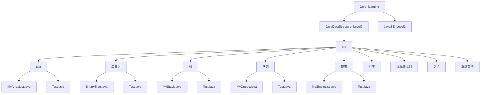
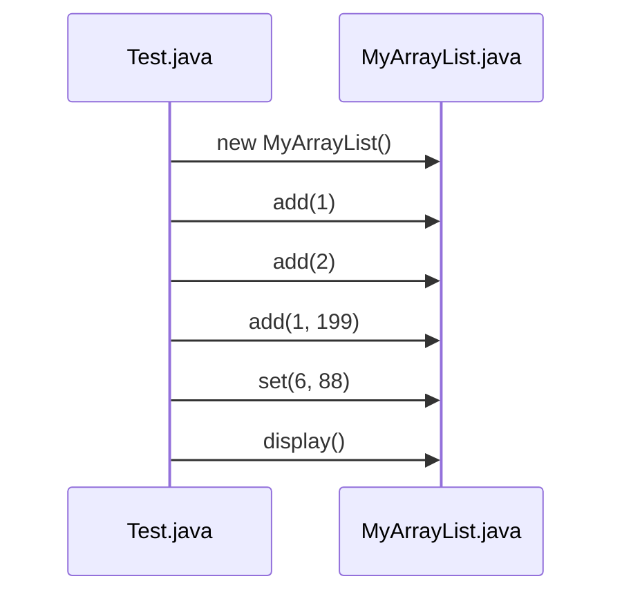
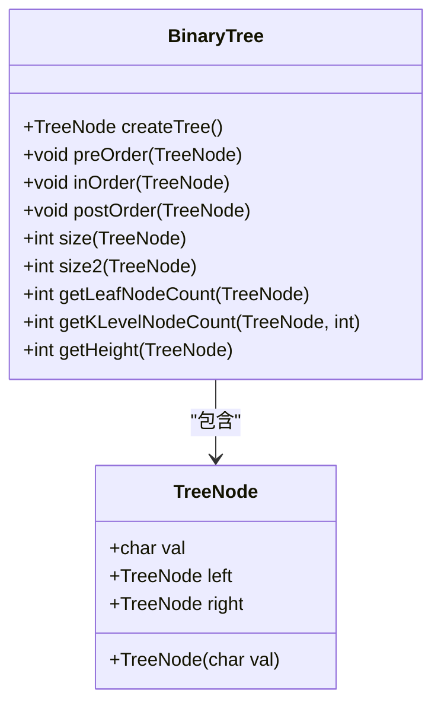
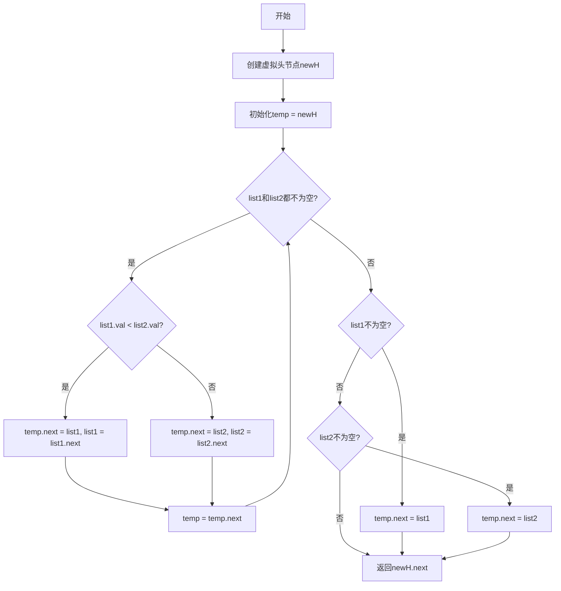

# 测试与示例代码

<cite>
**本文档引用文件**  
- [Test.java](file://JavaDataStructure_Level2\src\List\Test.java)
- [MyArrayList.java](file://JavaDataStructure_Level2\src\List\MyArrayList.java)
- [BinaryTree.java](file://JavaDataStructure_Level2\src\二叉树\BinaryTree.java)
- [Test.java](file://JavaDataStructure_Level2\src\二叉树\Test.java)
- [MySingleList.java](file://JavaDataStructure_Level2\src\链表\MySingleList.java)
- [Test.java](file://JavaDataStructure_Level2\src\链表\Test.java)
- [MyStack.java](file://JavaDataStructure_Level2\src\栈\MyStack.java)
- [Test.java](file://JavaDataStructure_Level2\src\栈\Test.java)
- [MyQueue.java](file://JavaDataStructure_Level2\src\队列\MyQueue.java)
- [Test.java](file://JavaDataStructure_Level2\src\队列\Test.java)
</cite>

## 目录
1. [引言](#引言)
2. [项目结构概览](#项目结构概览)
3. [核心测试用例分析](#核心测试用例分析)
4. [数据结构实现与测试详解](#数据结构实现与测试详解)
5. [测试驱动学习方法](#测试驱动学习方法)
6. [调试与扩展建议](#调试与扩展建议)
7. [总结](#总结)

## 引言

本指南旨在系统介绍项目中广泛分布的 `Test.java` 文件的作用与使用方法。这些测试文件不仅用于验证代码功能的正确性，更是学习数据结构与算法实现的宝贵资源。通过阅读和理解这些测试用例，开发者可以快速掌握 API 的调用方式、预期行为以及底层实现逻辑。本文将深入分析多个模块的测试代码，揭示其设计模式，并指导如何利用这些测试进行学习、调试和代码扩展。

## 项目结构概览

项目 `Java_learning` 包含多个模块，主要分为 `JavaSE_Level1` 和 `JavaDataStructure_Level2` 两个层级。前者涵盖 Java 基础语法、面向对象特性（如继承、多态、接口）等内容，后者则专注于数据结构与算法的实现。

在 `JavaDataStructure_Level2` 的 `src` 目录下，存在多个以数据结构命名的子包，如 `List`（列表）、`二叉树`（二叉树）、`栈`、`队列`、`链表` 等。每个子包中通常包含一个或多个实现类（如 `MyArrayList.java`, `BinaryTree.java`）和一个 `Test.java` 文件。这种结构清晰地将功能实现与功能验证分离，是典型的测试驱动开发（TDD）实践。

**图示来源**
- [项目结构](file://)

## 核心测试用例分析

### 列表模块测试分析

`List` 模块的 `Test.java` 文件通过多个 `main` 方法（`main`, `main1`, `main2`）展示了不同的测试场景。

**Section sources**
- [Test.java](file://JavaDataStructure_Level2\src\List\Test.java#L0-L61)

#### 功能验证
- **`main` 方法**：使用 Java 内置的 `ArrayList` 和 `Iterator` 演示了正向和反向遍历，验证了迭代器的正确性。
- **`main2` 方法**：演示了 `subList` 操作，展示了子列表与原列表的引用关系，修改子列表会直接影响原列表。
- **`main1` 方法**：这是对自定义 `MyArrayList` 类的核心测试。它通过 `add`、`add(int, int)` 添加元素，调用 `display` 打印整个列表，并测试 `set` 方法修改指定位置的值。

**图示来源**
- [Test.java](file://JavaDataStructure_Level2\src\List\Test.java#L50-L61)
- [MyArrayList.java](file://JavaDataStructure_Level2\src\List\MyArrayList.java#L0-L130)

### 二叉树模块测试分析

`二叉树` 模块的 `Test.java` 文件集中测试了 `BinaryTree` 类的各种方法。

**Section sources**
- [Test.java](file://JavaDataStructure_Level2\src\二叉树\Test.java#L0-L22)
- [BinaryTree.java](file://JavaDataStructure_Level2\src\二叉树\BinaryTree.java#L0-L199)

#### 遍历与属性计算
- **`main` 方法**：首先调用 `createTree()` 构建一个预设的二叉树，然后依次执行前序、中序、后序遍历，验证遍历算法的正确性。
- 接着，它测试了多种树的属性计算方法：
  - `size()` 和 `size2()`：分别使用全局计数器和子问题递归计算节点总数。
  - `getLeafNodeCount()`：计算叶子节点数量。
  - `getKLevelNodeCount()`：计算第 K 层的节点数。
  - `getHeight()`：计算树的高度。

**图示来源**
- [BinaryTree.java](file://JavaDataStructure_Level2\src\二叉树\BinaryTree.java#L0-L50)

### 链表模块测试分析

`链表` 模块的 `Test.java` 文件不仅测试了 `MySingleList` 的基本操作，还实现了一个经典的算法题。

**Section sources**
- [Test.java](file://JavaDataStructure_Level2\src\链表\Test.java#L0-L82)
- [MySingleList.java](file://JavaDataStructure_Level2\src\链表\MySingleList.java#L0-L199)

#### 基本操作与算法实现
- **`main1` 方法**：测试了 `addFirst`, `addLast`, `remove`, `size`, `contains` 等基本操作，并通过 `middleNode()` 方法演示了快慢指针找中间节点的技巧。
- **`main` 方法**：创建了两个链表，并调用 `mergeTwoLists` 方法将它们合并。
- **`mergeTwoLists` 方法**：这是一个独立的静态方法，实现了“合并两个有序链表”的经典算法。它使用一个虚拟头节点（`newH`）和一个移动指针（`temp`）来构建新链表，逻辑清晰，是学习链表操作的绝佳范例。

**图示来源**
- [Test.java](file://JavaDataStructure_Level2\src\链表\Test.java#L0-L30)

## 数据结构实现与测试详解

### 自定义 ArrayList 实现

`MyArrayList` 类模拟了 Java 的 `ArrayList`，使用一个固定大小的数组 `elem` 和一个 `usedSize` 变量来跟踪当前元素数量。

- **动态扩容**：当数组满时（`ifFull()`），`grow()` 方法会创建一个两倍原长度的新数组，并使用 `Arrays.copyOf` 复制元素。
- **插入操作**：`add(int pos, int data)` 方法需要先检查位置合法性，然后从后往前移动 `pos` 之后的所有元素，为新元素腾出空间。
- **接口实现**：该类实现了 `IList` 接口，强制实现了 `add`, `remove`, `contains` 等方法，体现了良好的面向接口编程思想。

**Section sources**
- [MyArrayList.java](file://JavaDataStructure_Level2\src\List\MyArrayList.java#L0-L130)

### 栈与队列的实现

- **`MyStack`**：基于数组实现，提供了 `push`, `pop`, `peek`, `isEmpty` 等基本操作。其 `isFull()` 和动态扩容机制与 `MyArrayList` 类似。
- **`MyQueue`**：基于双向链表实现。`offer` 方法在链表尾部插入，`poll` 方法从头部删除，完美符合队列的 FIFO（先进先出）原则。`head` 和 `last` 指针确保了操作的高效性。

**Section sources**
- [MyStack.java](file://JavaDataStructure_Level2\src\栈\MyStack.java#L0-L40)
- [MyQueue.java](file://JavaDataStructure_Level2\src\队列\MyQueue.java#L0-L65)

## 测试驱动学习方法

测试文件是学习代码的最佳入口。以下是推荐的学习路径：

1.  **阅读测试用例**：首先打开 `Test.java`，观察 `main` 方法中是如何创建对象、调用方法的。这直接告诉你 API 的使用方式。
2.  **理解预期输出**：注意 `System.out.println` 的输出，理解每个方法调用后的预期结果。
3.  **探究实现细节**：带着问题去阅读实现类（如 `MyArrayList.java`），查看 `add` 或 `remove` 方法内部是如何工作的。
4.  **修改与实验**：修改测试数据，例如在 `MyArrayList` 中插入不同的数字，观察 `display` 的输出。尝试添加新的测试场景，如测试在空列表上 `get` 一个元素会发生什么（这会触发异常）。
5.  **学习设计模式**：观察 `MySingleList` 中的 `findNodes` 私有方法，它是 `remove` 方法的辅助函数，体现了代码复用和封装的思想。

## 调试与扩展建议

### 调试技巧
- **使用 IDE 断点**：在 `Test.java` 的 `main` 方法第一行设置断点，然后逐步执行（Step Over/Into）。观察变量（如 `usedSize`, `head`）的值如何随着方法调用而变化，这是理解代码执行流程最有效的方法。
- **打印调试信息**：在实现类的关键位置（如 `add` 方法内部）添加 `System.out.println` 语句，输出数组或链表的状态。

### 扩展与验证
- **添加新测试**：在理解现有代码后，尝试为 `MyArrayList` 添加 `removeAt(int pos)` 方法，并编写相应的测试用例来验证其正确性。
- **性能测试**：可以编写一个循环，向 `MyArrayList` 添加大量元素，观察其扩容行为对性能的影响。
- **边界条件测试**：测试在空列表上调用 `remove` 或 `get`，在位置0或最大位置插入元素等边界情况，确保代码的健壮性。

**Section sources**
- [Test.java](file://JavaDataStructure_Level2\src\List\Test.java#L50-L61)
- [MyArrayList.java](file://JavaDataStructure_Level2\src\List\MyArrayList.java#L0-L130)

## 总结

项目中的 `Test.java` 文件远不止是简单的功能验证工具，它们是理解数据结构实现原理的“活文档”。通过系统地分析这些测试用例，我们可以：
- 快速掌握 API 的使用方法。
- 深入理解底层数据结构（如数组、链表）的操作逻辑。
- 学习经典的算法思想（如快慢指针、递归遍历）。
- 掌握测试驱动开发（TDD）的基本流程。

鼓励读者积极利用这些测试文件进行学习和实验。在修改或扩展任何代码后，务必编写新的测试用例进行验证，这不仅能确保代码的正确性，也是巩固学习成果的最佳实践。