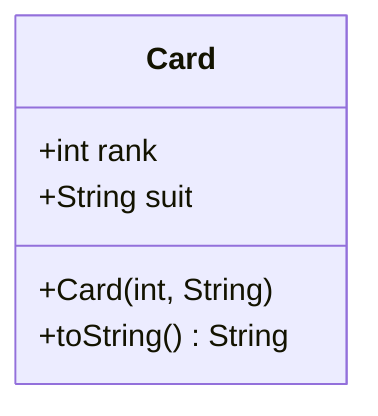
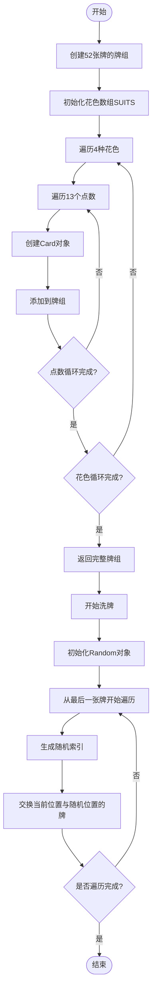
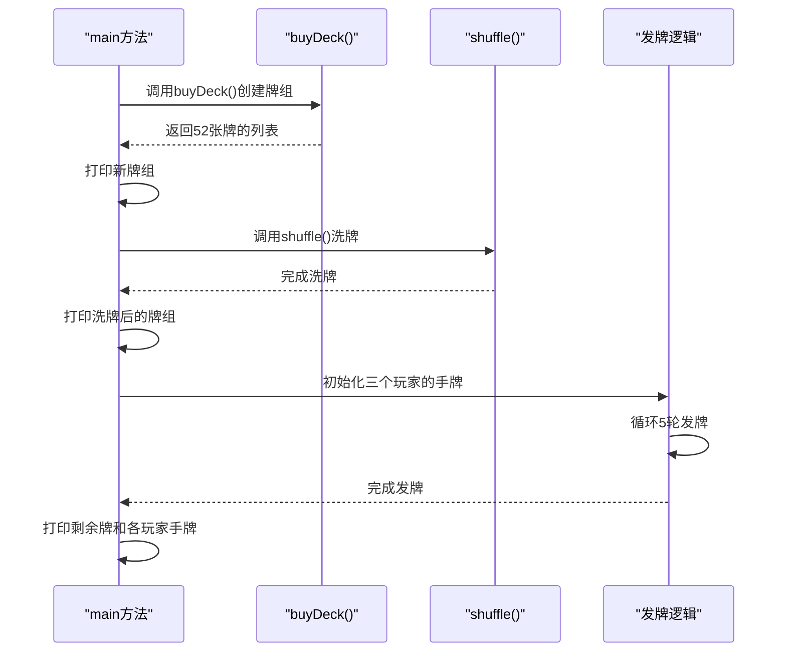

# 综合应用案例

<cite>
**本文档引用的文件**   
- [Card.java](file://JavaDataStructure_Level2/src/洗牌算法/Card.java)
- [CardDemo.java](file://JavaDataStructure_Level2/src/洗牌算法/CardDemo.java)
- [Test.java](file://JavaDataStructure_Level2/src/洗牌算法/Test.java)
</cite>

## 目录
1. [项目结构](#项目结构)
2. [核心组件分析](#核心组件分析)
3. [Card类设计详解](#card类设计详解)
4. [洗牌算法实现流程](#洗牌算法实现流程)
5. [程序执行流程与测试](#程序执行流程与测试)
6. [关键技术点总结](#关键技术点总结)
7. [扩展与改进方向](#扩展与改进方向)

## 项目结构

洗牌算法模块位于 `JavaDataStructure_Level2/src/洗牌算法` 目录下，包含三个核心Java文件：
- **Card.java**：定义扑克牌的基本数据结构
- **CardDemo.java**：实现牌组创建和洗牌逻辑
- **Test.java**：程序入口和测试用例

该模块通过面向对象设计，将扑克牌游戏的核心功能模块化，体现了基础语法、数据结构和算法的综合应用。

**Section sources**
- [Card.java](file://JavaDataStructure_Level2/src/洗牌算法/Card.java)
- [CardDemo.java](file://JavaDataStructure_Level2/src/洗牌算法/CardDemo.java)
- [Test.java](file://JavaDataStructure_Level2/src/洗牌算法/Test.java)

## 核心组件分析

本案例的核心组件包括：
- **Card类**：封装单张扑克牌的花色和点数
- **CardDemo类**：提供创建牌组和洗牌的功能
- **Test类**：作为程序入口，演示完整的游戏流程

这些组件共同构成了一个完整的扑克牌模拟系统，展示了如何将基础编程概念应用于实际问题。

**Section sources**
- [Card.java](file://JavaDataStructure_Level2/src/洗牌算法/Card.java#L1-L15)
- [CardDemo.java](file://JavaDataStructure_Level2/src/洗牌算法/CardDemo.java#L1-L38)
- [Test.java](file://JavaDataStructure_Level2/src/洗牌算法/Test.java#L1-L43)

## Card类设计详解

Card类是整个系统的基础数据结构，其设计体现了面向对象的封装思想。



**Diagram sources**
- [Card.java](file://JavaDataStructure_Level2/src/洗牌算法/Card.java#L1-L15)

### 字段说明
- **rank**: 表示牌面值（1-13），对应A到K
- **suit**: 表示花色（♠, ♥, ♣, ♦）

### 方法说明
- **构造方法**: 接收牌面值和花色，初始化Card对象
- **toString()**: 重写Object类的方法，提供友好的字符串表示

该类的设计虽然简单，但完整地封装了扑克牌的核心属性，为上层逻辑提供了可靠的数据基础。

**Section sources**
- [Card.java](file://JavaDataStructure_Level2/src/洗牌算法/Card.java#L1-L15)

## 洗牌算法实现流程

CardDemo类实现了扑克牌游戏的核心逻辑，主要包括牌组创建和洗牌两个功能。



**Diagram sources**
- [CardDemo.java](file://JavaDataStructure_Level2/src/洗牌算法/CardDemo.java#L11-L35)

### 牌组创建 (buyDeck方法)
使用嵌套循环生成标准的52张扑克牌：
- 外层循环：遍历4种花色
- 内层循环：遍历13个点数（1-13）
- 每次循环创建一个Card对象并添加到ArrayList中

### 洗牌算法 (shuffle方法)
采用经典的Fisher-Yates洗牌算法：
1. 从牌组的最后一张牌开始向前遍历
2. 对于每张牌，生成一个随机索引（范围：0到当前索引）
3. 将当前牌与随机索引位置的牌进行交换
4. 重复此过程直到遍历完整个牌组

该算法保证了每张牌出现在任何位置的概率相等，实现了真正的随机洗牌。

### 交换方法 (swap)
自定义的swap方法实现了两个位置牌的交换，使用临时变量完成三步交换操作。

**Section sources**
- [CardDemo.java](file://JavaDataStructure_Level2/src/洗牌算法/CardDemo.java#L11-L35)

## 程序执行流程与测试

Test类作为程序的入口，演示了完整的扑克牌游戏流程。



**Diagram sources**
- [Test.java](file://JavaDataStructure_Level2/src/洗牌算法/Test.java#L10-L43)

### 执行步骤
1. **创建牌组**：调用CardDemo.buyDeck()方法获取全新的52张牌
2. **打印原始状态**：输出未洗牌前的牌组顺序
3. **执行洗牌**：调用Collections.shuffle()方法随机打乱牌序
4. **发牌**：三个玩家轮流抓取5张牌，共发出15张
5. **输出结果**：显示剩余牌堆和每个玩家的手牌

### 执行结果示例
```
刚买回来的牌:
[♠ 1][♠ 2][♠ 3]...[♦ 13]
洗过的牌:
[♥ 7][♦ 3][♠ 10]...[♣ 2]
剩余的牌:
[♦ 8][♠ 4]...[♥ 1]
A 手中的牌:
[♥ 7][♦ 3][♠ 10][♣ 5][♥ 13]
B 手中的牌:
[♦ 9][♠ 2][♣ 8][♥ 4][♠ 7]
C 手中的牌:
[♣ 3][♥ 9][♦ 6][♠ 1][♣ 10]
```

**Section sources**
- [Test.java](file://JavaDataStructure_Level2/src/洗牌算法/Test.java#L10-L43)

## 关键技术点总结

本案例涉及多个重要的编程技术和概念：

### 面向对象设计
- **封装**：Card类将数据和行为封装在一起
- **类与对象**：通过类定义模板，创建具体对象实例

### 数据结构应用
- **ArrayList**：使用动态数组存储牌组，支持高效的随机访问
- **List接口**：利用接口编程，提高代码的灵活性和可扩展性

### 算法实现
- **Fisher-Yates洗牌算法**：时间复杂度O(n)，空间复杂度O(1)
- **随机数生成**：使用Random类生成均匀分布的随机数

### 集合操作
- **集合管理**：创建、添加、删除、遍历等操作
- **静态导入**：使用static import简化方法调用

### 程序流程控制
- **嵌套循环**：用于生成完整的牌组
- **条件判断**：控制程序执行流程

这些技术点的综合应用，展示了如何将理论知识转化为实际解决方案。

**Section sources**
- [Card.java](file://JavaDataStructure_Level2/src/洗牌算法/Card.java)
- [CardDemo.java](file://JavaDataStructure_Level2/src/洗牌算法/CardDemo.java)
- [Test.java](file://JavaDataStructure_Level2/src/洗牌算法/Test.java)

## 扩展与改进方向

本基础案例可以向多个方向进行扩展和改进：

### 支持不同游戏规则
- **德州扑克**：添加公共牌和玩家手牌组合判断
- **21点**：实现牌面值计算和爆牌判断
- **斗地主**：支持大小王和特殊牌型

### 添加图形界面
- **Swing/AWT**：创建桌面应用程序界面
- **JavaFX**：实现更现代化的用户界面
- **Web界面**：使用Spring Boot构建在线扑克游戏

### 增强功能特性
- **玩家管理**：添加玩家信息和积分系统
- **网络对战**：实现多人在线游戏功能
- **AI对手**：开发智能的计算机玩家

### 代码优化
- **枚举类型**：将花色改为枚举类型，提高类型安全性
- **设计模式**：应用工厂模式创建不同类型的牌组
- **异常处理**：添加完善的错误处理机制

这些改进方向不仅能够提升系统的功能性和用户体验，还能帮助学习者深入理解更高级的编程概念和技术。

**Section sources**
- [Card.java](file://JavaDataStructure_Level2/src/洗牌算法/Card.java)
- [CardDemo.java](file://JavaDataStructure_Level2/src/洗牌算法/CardDemo.java)
- [Test.java](file://JavaDataStructure_Level2/src/洗牌算法/Test.java)