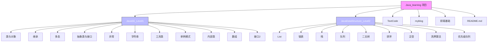
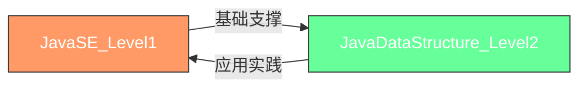
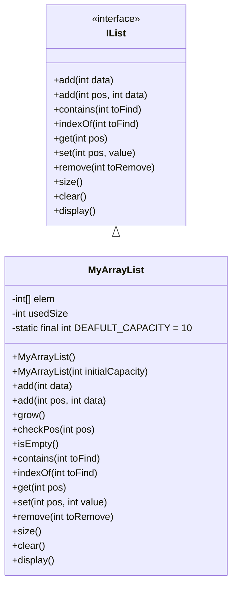

# 项目概述

<cite>
**本文档引用的文件**  
- [README.md](file://README.md)
- [JavaSE_Level1/src/Main.java](file://JavaSE_Level1/src/Main.java)
- [JavaSE_Level1/src/类与对象/第一节/Test.java](file://JavaSE_Level1/src/类与对象/第一节/Test.java)
- [JavaSE_Level1/src/继承/demo1/Test.java](file://JavaSE_Level1/src/继承/demo1/Test.java)
- [JavaSE_Level1/src/多态/demo1/Test.java](file://JavaSE_Level1/src/多态/demo1/Test.java)
- [JavaSE_Level1/src/异常/Test.java](file://JavaSE_Level1/src/异常/Test.java)
- [JavaDataStructure_Level2/src/List/MyArrayList.java](file://JavaDataStructure_Level2/src/List/MyArrayList.java)
- [JavaDataStructure_Level2/src/List/IList.java](file://JavaDataStructure_Level2/src/List/IList.java)
- [JavaDataStructure_Level2/src/List/Test.java](file://JavaDataStructure_Level2/src/List/Test.java)
- [JavaDataStructure_Level2/src/链表/MySingleList.java](file://JavaDataStructure_Level2/src/链表/MySingleList.java)
- [JavaDataStructure_Level2/src/链表/Test.java](file://JavaDataStructure_Level2/src/链表/Test.java)
- [JavaDataStructure_Level2/src/栈/MyStack.java](file://JavaDataStructure_Level2/src/栈/MyStack.java)
</cite>

## 目录
1. [项目概述](#项目概述)
2. [项目结构](#项目结构)
3. [核心模块分析](#核心模块分析)
4. [JavaSE_Level1 模块详解](#javase_level1-模块详解)
5. [JavaDataStructure_Level2 模块详解](#javadatastructure_level2-模块详解)
6. [学习路径与使用建议](#学习路径与使用建议)
7. [测试与验证方法](#测试与验证方法)
8. [总结](#总结)

## 项目结构

Java_learning 项目是一个系统化的 Java 学习仓库，旨在帮助开发者从基础语法逐步过渡到高级数据结构与算法。项目采用分层结构，按学习阶段组织代码，便于循序渐进地掌握 Java 编程技能。



**图示来源**  
- [README.md](file://README.md)
- 项目目录结构

## 核心模块分析

本项目主要由两个核心学习模块构成：**JavaSE_Level1** 和 **JavaDataStructure_Level2**。前者专注于 Java 基础语法与面向对象编程（OOP）的实践，后者则深入探讨数据结构与算法的实现。

### 模块关系



**图示来源**  
- [README.md](file://README.md)
- 项目整体结构分析

## JavaSE_Level1 模块详解

该模块是 Java 学习的起点，涵盖了从基础语法到面向对象核心概念的完整知识体系。

### 学习内容概览

| 主题 | 关键知识点 | 示例文件 |
|------|-----------|---------|
| 类与对象 | 类定义、对象创建、属性与方法 | `类与对象/第一节/Test.java` |
| 继承 | 父子类关系、方法重写、super 关键字 | `继承/demo1/Test.java` |
| 多态 | 方法重写、向上转型、动态绑定 | `多态/demo1/Test.java` |
| 抽象类与接口 | 抽象方法、接口实现、多继承 | `抽象类与接口/demo1/Test.java` |
| 异常处理 | try-catch、自定义异常、异常抛出 | `异常/Test.java` |

**本节来源**  
- [JavaSE_Level1/src/类与对象/第一节/Test.java](file://JavaSE_Level1/src/类与对象/第一节/Test.java)
- [JavaSE_Level1/src/继承/demo1/Test.java](file://JavaSE_Level1/src/继承/demo1/Test.java)
- [JavaSE_Level1/src/多态/demo1/Test.java](file://JavaSE_Level1/src/多态/demo1/Test.java)
- [JavaSE_Level1/src/异常/Test.java](file://JavaSE_Level1/src/异常/Test.java)

### 面向对象编程实践

以 `类与对象/第一节/Test.java` 为例，展示了如何创建和使用对象：

```java
Dog dog1 = new Dog();
dog1.name = "安治昊";
dog1.age = 10;
dog1.brand = "金毛";
dog1.eat();
dog1.sleep();
```

此代码演示了对象的实例化、属性赋值和方法调用，是面向对象编程的基础。

### 多态机制演示

在 `多态/demo1/Test.java` 中，通过函数参数传递实现了多态：

```java
public static void fuc(Animal animal) {
    animal.eat(); // 动态绑定，根据实际对象类型调用对应方法
}
```

该设计允许同一接口调用不同子类的实现，体现了多态的灵活性。

## JavaDataStructure_Level2 模块详解

该模块专注于数据结构的实现，使用纯 Java 标准库构建常见数据结构，强化算法思维。

### 自定义 ArrayList 实现

位于 `List/MyArrayList.java` 的自定义顺序表实现了 `IList` 接口，核心功能包括：

- **动态扩容**：当数组满时，自动扩容为原容量的两倍
- **元素插入**：支持在任意位置插入元素，需移动后续元素
- **元素查找**：通过遍历实现 `contains` 和 `indexOf` 方法
- **异常处理**：使用 `ListEmployeeException` 处理非法操作



**图示来源**  
- [JavaDataStructure_Level2/src/List/IList.java](file://JavaDataStructure_Level2/src/List/IList.java)
- [JavaDataStructure_Level2/src/List/MyArrayList.java](file://JavaDataStructure_Level2/src/List/MyArrayList.java)

### 单链表实现

`链表/MySingleList.java` 实现了单向链表，包含以下关键方法：

- **头插法**：`addFirst(int data)`
- **尾插法**：`addLast(int data)`
- **任意位置插入**：`addIndex(int index, int data)`
- **删除节点**：`remove(int key)` 和 `removeAllKey(int key)`
- **查找中间节点**：使用快慢指针算法 `middleNode()`

### 栈的实现

`栈/MyStack.java` 实现了基于数组的栈结构，支持基本的 `push`、`pop`、`peek` 操作，并提供了 `isFull` 和 `isEmpty` 状态检查。

**本节来源**  
- [JavaDataStructure_Level2/src/List/MyArrayList.java](file://JavaDataStructure_Level2/src/List/MyArrayList.java)
- [JavaDataStructure_Level2/src/List/IList.java](file://JavaDataStructure_Level2/src/List/IList.java)
- [JavaDataStructure_Level2/src/链表/MySingleList.java](file://JavaDataStructure_Level2/src/链表/MySingleList.java)
- [JavaDataStructure_Level2/src/栈/MyStack.java](file://JavaDataStructure_Level2/src/栈/MyStack.java)

## 学习路径与使用建议

### 推荐学习顺序

1. **基础阶段**：从 `JavaSE_Level1` 开始，依次学习：
   - 类与对象 → 继承 → 多态 → 抽象类与接口 → 异常处理
2. **进阶阶段**：进入 `JavaDataStructure_Level2`，按数据结构复杂度递进：
   - List → 链表 → 栈 → 队列 → 二叉树 → 排序算法

### 适用人群

- **初学者**：通过 `JavaSE_Level1` 掌握 Java 基础语法和面向对象思想
- **中级开发者**：通过 `JavaDataStructure_Level2` 深入理解数据结构底层实现
- **面试准备者**：练习常见算法题，如链表操作、二叉树遍历等

## 测试与验证方法

项目中的每个数据结构都配有 `Test.java` 文件，用于验证实现的正确性。

### 测试示例

以 `List/Test.java` 为例：

```java
public static void main1(String[] args) {
    MyArrayList list = new MyArrayList();
    list.add(1);
    list.add(2);
    list.add(1, 199); // 在位置1插入199
    list.display(); // 输出: 1 199 2
    list.set(2, 88); // 将位置2的值设为88
    list.display(); // 输出: 1 199 88
}
```

运行 `Test.java` 中的 `main` 方法即可查看输出结果，验证数据结构行为是否符合预期。

**本节来源**  
- [JavaDataStructure_Level2/src/List/Test.java](file://JavaDataStructure_Level2/src/List/Test.java)
- [JavaDataStructure_Level2/src/链表/Test.java](file://JavaDataStructure_Level2/src/链表/Test.java)

## 总结

Java_learning 项目是一个结构清晰、内容丰富的 Java 学习资源库。它通过分阶段、模块化的方式，系统地引导学习者从 Java 基础语法过渡到复杂的数据结构实现。项目特点包括：

- **循序渐进**：从基础到高级，学习路径设计合理
- **实践导向**：每个概念都有对应的代码实现和测试
- **代码规范**：使用标准 Java 语法，便于理解和迁移
- **易于扩展**：模块化设计，便于添加新的学习内容

建议学习者按照推荐顺序逐步深入，通过运行和修改测试代码来加深理解，最终达到熟练掌握 Java 编程的目标。